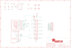

Contents
========

* [PRA2088 > Adafruit 1.44 TFT Breakout PCB](#pra2088--adafruit-144-tft-breakout-pcb)
	* [Schematic](#schematic)
	* [PCB](#pcb)
	* [Interactive BOM](#interactive-bom)
	* [OOMP Parts](#oomp-parts)
	* [Images](#images)
	* [Tags](#tags)
  
![][im]
# PRA2088 > Adafruit 1.44 TFT Breakout PCB

- ID: PROJ-ADAF-2088-STAN-01
- Hex ID: PRA2088
- Name: Adafruit
- Description: Adafruit
- Long Link: [http://oom.lt/PROJ-ADAF-2088-STAN-01](http://oom.lt/PROJ-ADAF-2088-STAN-01)
- Short Link: [http://oom.lt/PRA2088](http://oom.lt/PRA2088)

## Schematic
  

## PCB
  

## Interactive BOM

- Interactive BOM page: [ibom.html](https://htmlpreview.github.io/?https://github.com/oomlout/oomlout_OOMP_projects/blob/main/PROJ-ADAF-2088-STAN-01/kicad/bom/ibom.html)

## OOMP Parts
  

|OOMP Parts|
| :---: |
|[CAPC-0805-X-UF10-V10  SMD (0805) 10 uF Capacitor (Ceramic) 10v  C1, C2](https://github.com/oomlout/oomlout_OOMP_parts/tree/main/CAPC-0805-X-UF10-V10/)|
|CAPC-0805-X-UF1D-01 C4|
|UNMATCHED-UNMATCHED-X-UNMATCHED-01 IC1, Q2, TFT2|
|[VREG-SO235-X-KMIC5225-V33D  SMD (SOT-23-5) MIC5225 Voltage Regulator 3.3v  IC2](https://github.com/oomlout/oomlout_OOMP_parts/tree/main/VREG-SO235-X-KMIC5225-V33D/)|
|HEAD-I01-X-PI11-01 JP1|
|[MOSN-SO23-X-KBSS138-01  SMD (SOT-23) BSS138 N-Ch. MOSFET  Q3](https://github.com/oomlout/oomlout_OOMP_parts/tree/main/MOSN-SO23-X-KBSS138-01/)|
|RESE-0805-X-UNMATCHED-01 R3|

## Images
  
  

|kicadPcb3d|kicadPcb3dFront|kicadPcb3dBack|eagleImage|eagleSchemImage|
| :---: | :---: | :---: | :---: | :---: |
||||||

## Tags

- hexID: PRA2088
- oompType: PROJ
- oompSize: ADAF
- oompColor: 2088
- oompDesc: STAN
- oompIndex: 01
- oompName: Adafruit 1.44 TFT Breakout PCB
- sources: All source files from https://github.com/adafruit/Adafruit-1.44-TFT-Breakout-PCB (source licence details in srcLicense.md)
- linkBuyPage: http://www.adafruit.com/products/2088
- oompID: PROJ-ADAF-2088-STAN-01
- oompParts: C1,CAPC-0805-X-UF10-V10
- oompParts: C2,CAPC-0805-X-UF10-V10
- oompParts: C4,CAPC-0805-X-UF1D-01
- oompParts: IC1,UNMATCHED-UNMATCHED-X-UNMATCHED-01
- oompParts: IC2,VREG-SO235-X-KMIC5225-V33D
- oompParts: JP1,HEAD-I01-X-PI11-01
- oompParts: Q2,UNMATCHED-UNMATCHED-X-UNMATCHED-01
- oompParts: Q3,MOSN-SO23-X-KBSS138-01
- oompParts: R3,RESE-0805-X-UNMATCHED-01
- oompParts: TFT2,UNMATCHED-UNMATCHED-X-UNMATCHED-01
- rawParts: C1,10uF,CAP_CERAMIC0805-NOOUTLINE,0805-NO,Ceramic Capacitors,,
- rawParts: C2,10uF,CAP_CERAMIC0805-NOOUTLINE,0805-NO,Ceramic Capacitors,,
- rawParts: C4,0.1uF,CAP_CERAMIC0805-NOOUTLINE,0805-NO,Ceramic Capacitors,,
- rawParts: IC1,4050D,4050D,SO16,Hex non-inverting BUFFER,,
- rawParts: IC2,mic5225-3.3,LP298XS,SOT23-5L,,,
- rawParts: JP1,,HEADER-1X1176MIL,1X11_ROUND_76,,,
- rawParts: Q2,MICROSD,MICROSD,MICROSD,Micro-SD / Transflash card holder with SPI pinout,,
- rawParts: Q3,BSS138,MOSFET-NWIDE,SOT23-WIDE,N-Channel Mosfet,,
- rawParts: R3,~2.2K,RESISTOR0805_NOOUTLINE,0805-NO,Resistors,,
- rawParts: TFT2,DISP_LCD_FPC1441609,DISP_LCD_FPC1441609,TFT_FPC1441609,,,
- rawParts: U$3,FIDUCIAL,FIDUCIAL,FIDUCIAL_1MM,For use by pick and place machines to calibrate the vision/machine, 1mm,,
- rawParts: U$4,FIDUCIAL,FIDUCIAL,FIDUCIAL_1MM,For use by pick and place machines to calibrate the vision/machine, 1mm,,
- rawParts: U$5,FIDUCIAL,FIDUCIAL,FIDUCIAL_1MM,For use by pick and place machines to calibrate the vision/machine, 1mm,,
- rawParts: U$7,MOUNTINGHOLE2.5,MOUNTINGHOLE2.5,MOUNTINGHOLE_2.5_PLATED,Mounting Hole,EXCLUDE,
- rawParts: U$8,MOUNTINGHOLE2.5,MOUNTINGHOLE2.5,MOUNTINGHOLE_2.5_PLATED,Mounting Hole,EXCLUDE,
- rawParts: U$9,MOUNTINGHOLE2.5,MOUNTINGHOLE2.5,MOUNTINGHOLE_2.5_PLATED,Mounting Hole,EXCLUDE,
- rawParts: U$10,MOUNTINGHOLE2.5,MOUNTINGHOLE2.5,MOUNTINGHOLE_2.5_PLATED,Mounting Hole,EXCLUDE,

[im]: kicadPcb3d_450.png
