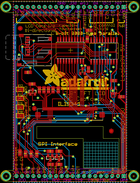
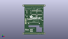
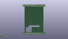
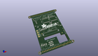

Contents
========

* [PROJ-ADAF-2090-STAN-01>Adafruit 2.8 TFT with Capacitive Touch PCB](#proj-adaf-2090-stan-01adafruit-28-tft-with-capacitive-touch-pcb)
	* [Images](#images)
	* [Interactive BOM](#interactive-bom)
	* [OOMP Parts](#oomp-parts)
	* [Tags](#tags)
  
![][im]
# PROJ-ADAF-2090-STAN-01>Adafruit 2.8 TFT with Capacitive Touch PCB

- ID: PROJ-ADAF-2090-STAN-01
- Hex ID: PRA2090
- Name: Adafruit 2.8 TFT with Capacitive Touch PCB
- Description: 

## Images
  
  

|eagleImage|kicadPcb3dFront|kicadPcb3dBack|kicadPcb3d|
| :---: | :---: | :---: | :---: |
|||||

## Interactive BOM

- Interactive BOM page: [ibom.html](kicad/bom/ibom.html)

## OOMP Parts
  

|OOMP Parts|
| :---: |
|CAPE-0805-X-UNMATCHED-01, C1, -18.796, 8.636000000000001, 180,C1, 10uF, 0805-NO, microbuilder, (-0.74, 0.34), R180|
|CAPE-0805-X-UNMATCHED-01, C3, 19.558, 4.826, 0,C3, 10uF, 0805-NO, microbuilder, (0.77, 0.19), R0|
|CAPE-0805-X-UNMATCHED-01, C4, -5.334, 0.7619999999999999, 270,C4, 10uF, 0805-NO, microbuilder, (-0.21, 0.03), R270|
|CAPE-0805-X-UNMATCHED-01, C5, 23.114, -2.2859999999999996, 0,C5, 10uF, 0805-NO, microbuilder, (0.91, -0.09), R0|
|UNMATCHED-UNMATCHED-X-UNMATCHED-01, IC1, 19.558, 0.254, 0,IC1, MIC5225-3.3, SOT23-5L, adafruit, (0.77, 0.01), R0|
|UNMATCHED-UNMATCHED-X-UNMATCHED-01, IC2, 0.254, 18.541999999999998, 180,IC2, 74LVC245, SO20W, 74xx-eu, (0.01, 0.73), R180|
|UNMATCHED-UNMATCHED-X-UNMATCHED-01, IC3, 15.239999999999998, 18.287999999999997, 180,IC3, 74LVC245, SO20W, 74xx-eu, (0.6, 0.72), R180|
|UNMATCHED-UNMATCHED-X-UNMATCHED-01, IC4, 5.588, 9.143999999999998, 0,IC4, APX803-SAG, SOT23, adafruit, (0.22, 0.36), R0|
|UNMATCHED-UNMATCHED-X-UNMATCHED-01, JP1, 0.0, 38.099999999999994, 180,JP1, 1X20_ROUND, microbuilder, (0, 1.5), R180|
|UNMATCHED-UNMATCHED-X-UNMATCHED-01, JP2, 0.0, -38.099999999999994, 180,JP2, 1X20_ROUND, microbuilder, (0, -1.5), R180|
|UNMATCHED-UNMATCHED-X-UNMATCHED-01, Q2, -8.889999999999999, -29.971999999999998, 180,Q2, BSS138, SOT23-WIDE, microbuilder, (-0.35, -1.18), R180|
|UNMATCHED-UNMATCHED-X-UNMATCHED-01, Q3, -4.953, -29.971999999999998, 180,Q3, BSS138, SOT23-WIDE, microbuilder, (-0.195, -1.18), R180|
|UNMATCHED-UNMATCHED-X-UNMATCHED-01, Q4, -16.764, -0.127, 0,Q4, BSS138, SOT23-WIDE, microbuilder, (-0.66, -0.005), R0|
|RESE-0805-X-UNMATCHED-01, R1, -13.716, 0.7619999999999999, 270,R1, 10, 0805-NO, microbuilder, (-0.54, 0.03), R270|
|RESE-0805-X-UNMATCHED-01, R2, -11.684, 0.7619999999999999, 270,R2, 10, 0805-NO, microbuilder, (-0.46, 0.03), R270|
|RESE-0805-X-UNMATCHED-01, R3, -9.652, 0.7619999999999999, 270,R3, 10, 0805-NO, microbuilder, (-0.38, 0.03), R270|
|RESE-0805-X-UNMATCHED-01, R4, -7.619999999999999, 0.7619999999999999, 270,R4, 10, 0805-NO, microbuilder, (-0.3, 0.03), R270|
|RESE-0805-X-UNMATCHED-01, R5, -17.018, 3.302, 180,R5, 2.2K, 0805-NO, microbuilder, (-0.67, 0.13), R180|
|<table><tr><td></td><td> R6</td><td>[RESE-0805-X-O103-01 SMD (0805) 10k Ohm Resistor](https://github.com/oomlout/oomlout_OOMP_parts/tree/main/RESE-0805-X-O103-01/)</td><td>[R85103](https://github.com/oomlout/oomlout_OOMP_parts/tree/main/RESE-0805-X-O103-01/)</td></tr></table>|
|RESE-0805-X-UNMATCHED-01, R7, 8.509, 27.558999999999997, 0,R7, 1K, 0805-NO, microbuilder, (0.335, 1.085), R0|
|<table><tr><td></td><td> R8</td><td>[RESE-0805-X-O103-01 SMD (0805) 10k Ohm Resistor](https://github.com/oomlout/oomlout_OOMP_parts/tree/main/RESE-0805-X-O103-01/)</td><td>[R85103](https://github.com/oomlout/oomlout_OOMP_parts/tree/main/RESE-0805-X-O103-01/)</td></tr></table>|
|<table><tr><td></td><td> R9</td><td>[RESE-0805-X-O103-01 SMD (0805) 10k Ohm Resistor](https://github.com/oomlout/oomlout_OOMP_parts/tree/main/RESE-0805-X-O103-01/)</td><td>[R85103](https://github.com/oomlout/oomlout_OOMP_parts/tree/main/RESE-0805-X-O103-01/)</td></tr></table>|
|<table><tr><td></td><td> R10</td><td>[RESE-0805-X-O103-01 SMD (0805) 10k Ohm Resistor](https://github.com/oomlout/oomlout_OOMP_parts/tree/main/RESE-0805-X-O103-01/)</td><td>[R85103](https://github.com/oomlout/oomlout_OOMP_parts/tree/main/RESE-0805-X-O103-01/)</td></tr></table>|
|<table><tr><td></td><td> R11</td><td>[RESE-0805-X-O103-01 SMD (0805) 10k Ohm Resistor](https://github.com/oomlout/oomlout_OOMP_parts/tree/main/RESE-0805-X-O103-01/)</td><td>[R85103](https://github.com/oomlout/oomlout_OOMP_parts/tree/main/RESE-0805-X-O103-01/)</td></tr></table>|
|<table><tr><td></td><td> R12</td><td>[RESE-0805-X-O103-01 SMD (0805) 10k Ohm Resistor](https://github.com/oomlout/oomlout_OOMP_parts/tree/main/RESE-0805-X-O103-01/)</td><td>[R85103](https://github.com/oomlout/oomlout_OOMP_parts/tree/main/RESE-0805-X-O103-01/)</td></tr></table>|
|<table><tr><td></td><td> R13</td><td>[RESE-0805-X-O103-01 SMD (0805) 10k Ohm Resistor](https://github.com/oomlout/oomlout_OOMP_parts/tree/main/RESE-0805-X-O103-01/)</td><td>[R85103](https://github.com/oomlout/oomlout_OOMP_parts/tree/main/RESE-0805-X-O103-01/)</td></tr></table>|
|<table><tr><td></td><td> R14</td><td>[RESE-0805-X-O103-01 SMD (0805) 10k Ohm Resistor](https://github.com/oomlout/oomlout_OOMP_parts/tree/main/RESE-0805-X-O103-01/)</td><td>[R85103](https://github.com/oomlout/oomlout_OOMP_parts/tree/main/RESE-0805-X-O103-01/)</td></tr></table>|
|<table><tr><td></td><td> R15</td><td>[RESE-0805-X-O103-01 SMD (0805) 10k Ohm Resistor](https://github.com/oomlout/oomlout_OOMP_parts/tree/main/RESE-0805-X-O103-01/)</td><td>[R85103](https://github.com/oomlout/oomlout_OOMP_parts/tree/main/RESE-0805-X-O103-01/)</td></tr></table>|
|<table><tr><td></td><td> R16</td><td>[RESE-0805-X-O103-01 SMD (0805) 10k Ohm Resistor](https://github.com/oomlout/oomlout_OOMP_parts/tree/main/RESE-0805-X-O103-01/)</td><td>[R85103](https://github.com/oomlout/oomlout_OOMP_parts/tree/main/RESE-0805-X-O103-01/)</td></tr></table>|
|UNMATCHED-UNMATCHED-X-UNMATCHED-01, SJ1, -22.352, -10.921999999999999, 180,SJ1, SOLDERJUMPER_ARROW_NOPASTE, microbuilder, (-0.88, -0.43), R180|
|UNMATCHED-UNMATCHED-X-UNMATCHED-01, SJ2, -22.352, -7.112, 180,SJ2, SOLDERJUMPER_ARROW_NOPASTE, microbuilder, (-0.88, -0.28), R180|
|UNMATCHED-UNMATCHED-X-UNMATCHED-01, SJ3, -22.352, -3.175, 0,SJ3, SOLDERJUMPER_ARROW_NOPASTE, microbuilder, (-0.88, -0.125), R0|
|UNMATCHED-UNMATCHED-X-UNMATCHED-01, SJ4, -22.352, 0.889, 0,SJ4, SOLDERJUMPER_ARROW_NOPASTE, microbuilder, (-0.88, 0.035), R0|
|ERROR, U$10 2.8 CTP, 0, 0, 0,U$10, 2.8, CTP, ILI9341, TFT_2.83IN_240X320_50PIN, microbuilder, (0, 0.1), MR0|
|UNMATCHED-UNMATCHED-X-UNMATCHED-01, X1, -8.382, 25.654, 270,X1, microSD, MICROSD, microbuilder, (-0.33, 1.01), R270|

## Tags

- hexID: PRA2090
- oompType: PROJ
- oompSize: ADAF
- oompColor: 2090
- oompDesc: STAN
- oompIndex: 01
- oompName: Adafruit 2.8 TFT with Capacitive Touch PCB
- sources: All source files from https://github.com/adafruit/Adafruit-2.8-TFT-with-Capacitive-Touch-PCB (source licence details in srcLicense.md)
- linkBuyPage: http://www.adafruit.com/products/2090
- oompPart: CAPE-0805-X-UNMATCHED-01, C1, -18.796, 8.636000000000001, 180
- oompPart: CAPE-0805-X-UNMATCHED-01, C3, 19.558, 4.826, 0
- oompPart: CAPE-0805-X-UNMATCHED-01, C4, -5.334, 0.7619999999999999, 270
- oompPart: CAPE-0805-X-UNMATCHED-01, C5, 23.114, -2.2859999999999996, 0
- oompPart: UNMATCHED-UNMATCHED-X-UNMATCHED-01, IC1, 19.558, 0.254, 0
- oompPart: UNMATCHED-UNMATCHED-X-UNMATCHED-01, IC2, 0.254, 18.541999999999998, 180
- oompPart: UNMATCHED-UNMATCHED-X-UNMATCHED-01, IC3, 15.239999999999998, 18.287999999999997, 180
- oompPart: UNMATCHED-UNMATCHED-X-UNMATCHED-01, IC4, 5.588, 9.143999999999998, 0
- oompPart: UNMATCHED-UNMATCHED-X-UNMATCHED-01, JP1, 0.0, 38.099999999999994, 180
- oompPart: UNMATCHED-UNMATCHED-X-UNMATCHED-01, JP2, 0.0, -38.099999999999994, 180
- oompPart: UNMATCHED-UNMATCHED-X-UNMATCHED-01, Q2, -8.889999999999999, -29.971999999999998, 180
- oompPart: UNMATCHED-UNMATCHED-X-UNMATCHED-01, Q3, -4.953, -29.971999999999998, 180
- oompPart: UNMATCHED-UNMATCHED-X-UNMATCHED-01, Q4, -16.764, -0.127, 0
- oompPart: RESE-0805-X-UNMATCHED-01, R1, -13.716, 0.7619999999999999, 270
- oompPart: RESE-0805-X-UNMATCHED-01, R2, -11.684, 0.7619999999999999, 270
- oompPart: RESE-0805-X-UNMATCHED-01, R3, -9.652, 0.7619999999999999, 270
- oompPart: RESE-0805-X-UNMATCHED-01, R4, -7.619999999999999, 0.7619999999999999, 270
- oompPart: RESE-0805-X-UNMATCHED-01, R5, -17.018, 3.302, 180
- oompPart: RESE-0805-X-O103-01, R6, 8.382, 9.906, 90
- oompPart: RESE-0805-X-UNMATCHED-01, R7, 8.509, 27.558999999999997, 0
- oompPart: RESE-0805-X-O103-01, R8, -22.479, -27.432, 90
- oompPart: RESE-0805-X-O103-01, R9, -20.066, -28.066999999999997, 90
- oompPart: RESE-0805-X-O103-01, R10, -14.858999999999998, -28.066999999999997, 270
- oompPart: RESE-0805-X-O103-01, R11, -17.525999999999996, -28.066999999999997, 270
- oompPart: RESE-0805-X-O103-01, R12, 7.746999999999999, 23.495, 270
- oompPart: RESE-0805-X-O103-01, R13, -8.762999999999998, -32.766, 0
- oompPart: RESE-0805-X-O103-01, R14, -4.953, -32.766, 180
- oompPart: RESE-0805-X-O103-01, R15, -4.953, -26.924, 180
- oompPart: RESE-0805-X-O103-01, R16, -8.889999999999999, -26.924, 0
- oompPart: UNMATCHED-UNMATCHED-X-UNMATCHED-01, SJ1, -22.352, -10.921999999999999, 180
- oompPart: UNMATCHED-UNMATCHED-X-UNMATCHED-01, SJ2, -22.352, -7.112, 180
- oompPart: UNMATCHED-UNMATCHED-X-UNMATCHED-01, SJ3, -22.352, -3.175, 0
- oompPart: UNMATCHED-UNMATCHED-X-UNMATCHED-01, SJ4, -22.352, 0.889, 0
- oompPart: SKIP-UNMATCHED-X-UNMATCHED-01, U$7, -28.575, -38.099999999999994, 0
- oompPart: SKIP-UNMATCHED-X-UNMATCHED-01, U$9, 18.541999999999998, -17.779999999999998, 0
- oompPart: ERROR, U$10 2.8 CTP, 0, 0, 0
- oompPart: SKIP-UNMATCHED-X-UNMATCHED-01, U$11, -22.352, 28.448, 0
- oompPart: SKIP-UNMATCHED-X-UNMATCHED-01, U$15, 28.575, -38.099999999999994, 0
- oompPart: SKIP-UNMATCHED-X-UNMATCHED-01, U$16, -28.575, 38.099999999999994, 0
- oompPart: SKIP-UNMATCHED-X-UNMATCHED-01, U$17, 28.575, 38.099999999999994, 0
- oompPart: SKIP-UNMATCHED-X-UNMATCHED-01, U$23, -16.002, -7.619999999999999, 0
- oompPart: UNMATCHED-UNMATCHED-X-UNMATCHED-01, X1, -8.382, 25.654, 270
- rawPart: C1, 10uF, 0805-NO, microbuilder, (-0.74, 0.34), R180
- rawPart: C3, 10uF, 0805-NO, microbuilder, (0.77, 0.19), R0
- rawPart: C4, 10uF, 0805-NO, microbuilder, (-0.21, 0.03), R270
- rawPart: C5, 10uF, 0805-NO, microbuilder, (0.91, -0.09), R0
- rawPart: IC1, MIC5225-3.3, SOT23-5L, adafruit, (0.77, 0.01), R0
- rawPart: IC2, 74LVC245, SO20W, 74xx-eu, (0.01, 0.73), R180
- rawPart: IC3, 74LVC245, SO20W, 74xx-eu, (0.6, 0.72), R180
- rawPart: IC4, APX803-SAG, SOT23, adafruit, (0.22, 0.36), R0
- rawPart: JP1, 1X20_ROUND, microbuilder, (0, 1.5), R180
- rawPart: JP2, 1X20_ROUND, microbuilder, (0, -1.5), R180
- rawPart: Q2, BSS138, SOT23-WIDE, microbuilder, (-0.35, -1.18), R180
- rawPart: Q3, BSS138, SOT23-WIDE, microbuilder, (-0.195, -1.18), R180
- rawPart: Q4, BSS138, SOT23-WIDE, microbuilder, (-0.66, -0.005), R0
- rawPart: R1, 10, 0805-NO, microbuilder, (-0.54, 0.03), R270
- rawPart: R2, 10, 0805-NO, microbuilder, (-0.46, 0.03), R270
- rawPart: R3, 10, 0805-NO, microbuilder, (-0.38, 0.03), R270
- rawPart: R4, 10, 0805-NO, microbuilder, (-0.3, 0.03), R270
- rawPart: R5, 2.2K, 0805-NO, microbuilder, (-0.67, 0.13), R180
- rawPart: R6, 10K, R0805, rcl, (0.33, 0.39), R90
- rawPart: R7, 1K, 0805-NO, microbuilder, (0.335, 1.085), R0
- rawPart: R8, 10K, 0805-NO, microbuilder, (-0.885, -1.08), R90
- rawPart: R9, 10K, 0805-NO, microbuilder, (-0.79, -1.105), R90
- rawPart: R10, 10K, 0805-NO, microbuilder, (-0.585, -1.105), R270
- rawPart: R11, 10K, 0805-NO, microbuilder, (-0.69, -1.105), R270
- rawPart: R12, 10K, 0805-NO, microbuilder, (0.305, 0.925), R270
- rawPart: R13, 10K, 0805-NO, microbuilder, (-0.345, -1.29), R0
- rawPart: R14, 10K, 0805-NO, microbuilder, (-0.195, -1.29), R180
- rawPart: R15, 10K, 0805-NO, microbuilder, (-0.195, -1.06), R180
- rawPart: R16, 10K, 0805-NO, microbuilder, (-0.35, -1.06), R0
- rawPart: SJ1, SOLDERJUMPER_ARROW_NOPASTE, microbuilder, (-0.88, -0.43), R180
- rawPart: SJ2, SOLDERJUMPER_ARROW_NOPASTE, microbuilder, (-0.88, -0.28), R180
- rawPart: SJ3, SOLDERJUMPER_ARROW_NOPASTE, microbuilder, (-0.88, -0.125), R0
- rawPart: SJ4, SOLDERJUMPER_ARROW_NOPASTE, microbuilder, (-0.88, 0.035), R0
- rawPart: U$7, MOUNTINGHOLE3.0THIN, MOUNTINGHOLE_3.0_PLATEDTHIN, microbuilder, (-1.125, -1.5), R0
- rawPart: U$9, FIDUCIAL, FIDUCIAL_1MM, adafruit, (0.73, -0.7), R0
- rawPart: U$10, 2.8, CTP, ILI9341, TFT_2.83IN_240X320_50PIN, microbuilder, (0, 0.1), MR0
- rawPart: U$11, FIDUCIAL, FIDUCIAL_1MM, adafruit, (-0.88, 1.12), R0
- rawPart: U$15, MOUNTINGHOLE3.0THIN, MOUNTINGHOLE_3.0_PLATEDTHIN, microbuilder, (1.125, -1.5), R0
- rawPart: U$16, MOUNTINGHOLE3.0THIN, MOUNTINGHOLE_3.0_PLATEDTHIN, microbuilder, (-1.125, 1.5), R0
- rawPart: U$17, MOUNTINGHOLE3.0THIN, MOUNTINGHOLE_3.0_PLATEDTHIN, microbuilder, (1.125, 1.5), R0
- rawPart: U$23, FIDUCIAL, FIDUCIAL_1MM, adafruit, (-0.63, -0.3), R0
- rawPart: X1, microSD, MICROSD, microbuilder, (-0.33, 1.01), R270

[im]: kicadPcb3d_450.png
