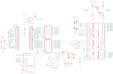

Contents
========

* [PRA2090 > Adafruit](#pra2090--adafruit)
	* [Schematic](#schematic)
	* [Interactive BOM](#interactive-bom)
	* [OOMP Parts](#oomp-parts)
	* [Images](#images)
	* [Tags](#tags)
  
![][im]
# PRA2090 > Adafruit

- ID: PROJ-ADAF-2090-STAN-01
- Hex ID: PRA2090
- Name: Adafruit
- Description: Adafruit
- Long Link: [http://oom.lt/PROJ-ADAF-2090-STAN-01](http://oom.lt/PROJ-ADAF-2090-STAN-01)
- Long Link: [http://oom.lt/PRA2090](http://oom.lt/PRA2090)

## Schematic
  
![][schem]
## Interactive BOM

- Interactive BOM page: [ibom.html](https://htmlpreview.github.io/?https://github.com/oomlout/oomlout_OOMP_projects/blob/main/PROJ-ADAF-2090-STAN-01/kicad/bom/ibom.html)

## OOMP Parts
  

|OOMP Parts|
| :---: |
|C1,UNMATCHED-UNMATCHED-UNMATCHED-UNMATCHED-UNMATCHED,C1,10uF,CAP_CERAMIC0805-NOOUTLINE,0805-NO,Ceramic Capacitors,,|
|C3,UNMATCHED-UNMATCHED-UNMATCHED-UNMATCHED-UNMATCHED,C3,10uF,CAP_CERAMIC0805-NOOUTLINE,0805-NO,Ceramic Capacitors,,|
|C4,UNMATCHED-UNMATCHED-UNMATCHED-UNMATCHED-UNMATCHED,C4,10uF,CAP_CERAMIC0805-NOOUTLINE,0805-NO,Ceramic Capacitors,,|
|C5,UNMATCHED-UNMATCHED-UNMATCHED-UNMATCHED-UNMATCHED,C5,10uF,CAP_CERAMIC0805-NOOUTLINE,0805-NO,Ceramic Capacitors,,|
|IC1,UNMATCHED-UNMATCHED-UNMATCHED-UNMATCHED-UNMATCHED,IC1,MIC5225-3.3,LP298XS,SOT23-5L,,,|
|IC2,UNMATCHED-UNMATCHED-UNMATCHED-UNMATCHED-UNMATCHED,IC2,74LVC245,74ACT245DW,SO20W,Octal BUS TRANSCEIVER, 3-state,,|
|IC3,UNMATCHED-UNMATCHED-UNMATCHED-UNMATCHED-UNMATCHED,IC3,74LVC245,74ACT245DW,SO20W,Octal BUS TRANSCEIVER, 3-state,,|
|IC4,UNMATCHED-UNMATCHED-UNMATCHED-UNMATCHED-UNMATCHED,IC4,APX803-SAG,AXP083-SAG,SOT23,,,|
|JP1,UNMATCHED-UNMATCHED-UNMATCHED-UNMATCHED-UNMATCHED,JP1,,HEADER-1X20ROUND,1X20_ROUND,,,|
|JP2,UNMATCHED-UNMATCHED-UNMATCHED-UNMATCHED-UNMATCHED,JP2,,HEADER-1X20ROUND,1X20_ROUND,,,|
|Q2,UNMATCHED-UNMATCHED-UNMATCHED-UNMATCHED-UNMATCHED,Q2,BSS138,MOSFET-NWIDE,SOT23-WIDE,N-Channel Mosfet,,|
|Q3,UNMATCHED-UNMATCHED-UNMATCHED-UNMATCHED-UNMATCHED,Q3,BSS138,MOSFET-NWIDE,SOT23-WIDE,N-Channel Mosfet,,|
|Q4,UNMATCHED-UNMATCHED-UNMATCHED-UNMATCHED-UNMATCHED,Q4,BSS138,MOSFET-NWIDE,SOT23-WIDE,N-Channel Mosfet,,|
|R1,UNMATCHED-UNMATCHED-UNMATCHED-UNMATCHED-UNMATCHED,R1,10,RESISTOR0805_NOOUTLINE,0805-NO,Resistors,,|
|R2,UNMATCHED-UNMATCHED-UNMATCHED-UNMATCHED-UNMATCHED,R2,10,RESISTOR0805_NOOUTLINE,0805-NO,Resistors,,|
|R3,UNMATCHED-UNMATCHED-UNMATCHED-UNMATCHED-UNMATCHED,R3,10,RESISTOR0805_NOOUTLINE,0805-NO,Resistors,,|
|R4,UNMATCHED-UNMATCHED-UNMATCHED-UNMATCHED-UNMATCHED,R4,10,RESISTOR0805_NOOUTLINE,0805-NO,Resistors,,|
|R5,UNMATCHED-UNMATCHED-UNMATCHED-UNMATCHED-UNMATCHED,R5,2.2K,RESISTOR0805_NOOUTLINE,0805-NO,Resistors,,|
|R6,UNMATCHED-UNMATCHED-UNMATCHED-UNMATCHED-UNMATCHED,R6,10K,R-US_R0805,R0805,RESISTOR, American symbol,,|
|R7,UNMATCHED-UNMATCHED-UNMATCHED-UNMATCHED-UNMATCHED,R7,1K,RESISTOR0805_NOOUTLINE,0805-NO,Resistors,,|
|R8,UNMATCHED-UNMATCHED-UNMATCHED-UNMATCHED-UNMATCHED,R8,10K,RESISTOR0805_NOOUTLINE,0805-NO,Resistors,,|
|R9,UNMATCHED-UNMATCHED-UNMATCHED-UNMATCHED-UNMATCHED,R9,10K,RESISTOR0805_NOOUTLINE,0805-NO,Resistors,,|
|R10,UNMATCHED-UNMATCHED-UNMATCHED-UNMATCHED-UNMATCHED,R10,10K,RESISTOR0805_NOOUTLINE,0805-NO,Resistors,,|
|R11,UNMATCHED-UNMATCHED-UNMATCHED-UNMATCHED-UNMATCHED,R11,10K,RESISTOR0805_NOOUTLINE,0805-NO,Resistors,,|
|R12,UNMATCHED-UNMATCHED-UNMATCHED-UNMATCHED-UNMATCHED,R12,10K,RESISTOR0805_NOOUTLINE,0805-NO,Resistors,,|
|R13,UNMATCHED-UNMATCHED-UNMATCHED-UNMATCHED-UNMATCHED,R13,10K,RESISTOR0805_NOOUTLINE,0805-NO,Resistors,,|
|R14,UNMATCHED-UNMATCHED-UNMATCHED-UNMATCHED-UNMATCHED,R14,10K,RESISTOR0805_NOOUTLINE,0805-NO,Resistors,,|
|R15,UNMATCHED-UNMATCHED-UNMATCHED-UNMATCHED-UNMATCHED,R15,10K,RESISTOR0805_NOOUTLINE,0805-NO,Resistors,,|
|R16,UNMATCHED-UNMATCHED-UNMATCHED-UNMATCHED-UNMATCHED,R16,10K,RESISTOR0805_NOOUTLINE,0805-NO,Resistors,,|
|U$10,UNMATCHED-UNMATCHED-UNMATCHED-UNMATCHED-UNMATCHED,SJ1,,SOLDERJUMPER,SOLDERJUMPER_ARROW_NOPASTE,SMD Solder JUMPER,EXCLUDE,|
|X1,UNMATCHED-UNMATCHED-UNMATCHED-UNMATCHED-UNMATCHED,SJ2,,SOLDERJUMPER,SOLDERJUMPER_ARROW_NOPASTE,SMD Solder JUMPER,EXCLUDE,|

## Images
  
  

|kicadPcb3d|kicadPcb3dFront|kicadPcb3dBack|eagleImage|eagleSchemImage|
| :---: | :---: | :---: | :---: | :---: |
||||||

## Tags

- hexID: PRA2090
- oompType: PROJ
- oompSize: ADAF
- oompColor: 2090
- oompDesc: STAN
- oompIndex: 01
- oompName: Adafruit 2.8 TFT with Capacitive Touch PCB
- sources: All source files from https://github.com/adafruit/Adafruit-2.8-TFT-with-Capacitive-Touch-PCB (source licence details in srcLicense.md)
- linkBuyPage: http://www.adafruit.com/products/2090
- oompID: PROJ-ADAF-2090-STAN-01
- oompParts: C1,UNMATCHED-UNMATCHED-UNMATCHED-UNMATCHED-UNMATCHED
- oompParts: C3,UNMATCHED-UNMATCHED-UNMATCHED-UNMATCHED-UNMATCHED
- oompParts: C4,UNMATCHED-UNMATCHED-UNMATCHED-UNMATCHED-UNMATCHED
- oompParts: C5,UNMATCHED-UNMATCHED-UNMATCHED-UNMATCHED-UNMATCHED
- oompParts: IC1,UNMATCHED-UNMATCHED-UNMATCHED-UNMATCHED-UNMATCHED
- oompParts: IC2,UNMATCHED-UNMATCHED-UNMATCHED-UNMATCHED-UNMATCHED
- oompParts: IC3,UNMATCHED-UNMATCHED-UNMATCHED-UNMATCHED-UNMATCHED
- oompParts: IC4,UNMATCHED-UNMATCHED-UNMATCHED-UNMATCHED-UNMATCHED
- oompParts: JP1,UNMATCHED-UNMATCHED-UNMATCHED-UNMATCHED-UNMATCHED
- oompParts: JP2,UNMATCHED-UNMATCHED-UNMATCHED-UNMATCHED-UNMATCHED
- oompParts: Q2,UNMATCHED-UNMATCHED-UNMATCHED-UNMATCHED-UNMATCHED
- oompParts: Q3,UNMATCHED-UNMATCHED-UNMATCHED-UNMATCHED-UNMATCHED
- oompParts: Q4,UNMATCHED-UNMATCHED-UNMATCHED-UNMATCHED-UNMATCHED
- oompParts: R1,UNMATCHED-UNMATCHED-UNMATCHED-UNMATCHED-UNMATCHED
- oompParts: R2,UNMATCHED-UNMATCHED-UNMATCHED-UNMATCHED-UNMATCHED
- oompParts: R3,UNMATCHED-UNMATCHED-UNMATCHED-UNMATCHED-UNMATCHED
- oompParts: R4,UNMATCHED-UNMATCHED-UNMATCHED-UNMATCHED-UNMATCHED
- oompParts: R5,UNMATCHED-UNMATCHED-UNMATCHED-UNMATCHED-UNMATCHED
- oompParts: R6,UNMATCHED-UNMATCHED-UNMATCHED-UNMATCHED-UNMATCHED
- oompParts: R7,UNMATCHED-UNMATCHED-UNMATCHED-UNMATCHED-UNMATCHED
- oompParts: R8,UNMATCHED-UNMATCHED-UNMATCHED-UNMATCHED-UNMATCHED
- oompParts: R9,UNMATCHED-UNMATCHED-UNMATCHED-UNMATCHED-UNMATCHED
- oompParts: R10,UNMATCHED-UNMATCHED-UNMATCHED-UNMATCHED-UNMATCHED
- oompParts: R11,UNMATCHED-UNMATCHED-UNMATCHED-UNMATCHED-UNMATCHED
- oompParts: R12,UNMATCHED-UNMATCHED-UNMATCHED-UNMATCHED-UNMATCHED
- oompParts: R13,UNMATCHED-UNMATCHED-UNMATCHED-UNMATCHED-UNMATCHED
- oompParts: R14,UNMATCHED-UNMATCHED-UNMATCHED-UNMATCHED-UNMATCHED
- oompParts: R15,UNMATCHED-UNMATCHED-UNMATCHED-UNMATCHED-UNMATCHED
- oompParts: R16,UNMATCHED-UNMATCHED-UNMATCHED-UNMATCHED-UNMATCHED
- oompParts: U$10,UNMATCHED-UNMATCHED-UNMATCHED-UNMATCHED-UNMATCHED
- oompParts: X1,UNMATCHED-UNMATCHED-UNMATCHED-UNMATCHED-UNMATCHED
- rawParts: C1,10uF,CAP_CERAMIC0805-NOOUTLINE,0805-NO,Ceramic Capacitors,,
- rawParts: C3,10uF,CAP_CERAMIC0805-NOOUTLINE,0805-NO,Ceramic Capacitors,,
- rawParts: C4,10uF,CAP_CERAMIC0805-NOOUTLINE,0805-NO,Ceramic Capacitors,,
- rawParts: C5,10uF,CAP_CERAMIC0805-NOOUTLINE,0805-NO,Ceramic Capacitors,,
- rawParts: IC1,MIC5225-3.3,LP298XS,SOT23-5L,,,
- rawParts: IC2,74LVC245,74ACT245DW,SO20W,Octal BUS TRANSCEIVER, 3-state,,
- rawParts: IC3,74LVC245,74ACT245DW,SO20W,Octal BUS TRANSCEIVER, 3-state,,
- rawParts: IC4,APX803-SAG,AXP083-SAG,SOT23,,,
- rawParts: JP1,,HEADER-1X20ROUND,1X20_ROUND,,,
- rawParts: JP2,,HEADER-1X20ROUND,1X20_ROUND,,,
- rawParts: Q2,BSS138,MOSFET-NWIDE,SOT23-WIDE,N-Channel Mosfet,,
- rawParts: Q3,BSS138,MOSFET-NWIDE,SOT23-WIDE,N-Channel Mosfet,,
- rawParts: Q4,BSS138,MOSFET-NWIDE,SOT23-WIDE,N-Channel Mosfet,,
- rawParts: R1,10,RESISTOR0805_NOOUTLINE,0805-NO,Resistors,,
- rawParts: R2,10,RESISTOR0805_NOOUTLINE,0805-NO,Resistors,,
- rawParts: R3,10,RESISTOR0805_NOOUTLINE,0805-NO,Resistors,,
- rawParts: R4,10,RESISTOR0805_NOOUTLINE,0805-NO,Resistors,,
- rawParts: R5,2.2K,RESISTOR0805_NOOUTLINE,0805-NO,Resistors,,
- rawParts: R6,10K,R-US_R0805,R0805,RESISTOR, American symbol,,
- rawParts: R7,1K,RESISTOR0805_NOOUTLINE,0805-NO,Resistors,,
- rawParts: R8,10K,RESISTOR0805_NOOUTLINE,0805-NO,Resistors,,
- rawParts: R9,10K,RESISTOR0805_NOOUTLINE,0805-NO,Resistors,,
- rawParts: R10,10K,RESISTOR0805_NOOUTLINE,0805-NO,Resistors,,
- rawParts: R11,10K,RESISTOR0805_NOOUTLINE,0805-NO,Resistors,,
- rawParts: R12,10K,RESISTOR0805_NOOUTLINE,0805-NO,Resistors,,
- rawParts: R13,10K,RESISTOR0805_NOOUTLINE,0805-NO,Resistors,,
- rawParts: R14,10K,RESISTOR0805_NOOUTLINE,0805-NO,Resistors,,
- rawParts: R15,10K,RESISTOR0805_NOOUTLINE,0805-NO,Resistors,,
- rawParts: R16,10K,RESISTOR0805_NOOUTLINE,0805-NO,Resistors,,
- rawParts: SJ1,,SOLDERJUMPER,SOLDERJUMPER_ARROW_NOPASTE,SMD Solder JUMPER,EXCLUDE,
- rawParts: SJ2,,SOLDERJUMPER,SOLDERJUMPER_ARROW_NOPASTE,SMD Solder JUMPER,EXCLUDE,
- rawParts: SJ3,,SOLDERJUMPER,SOLDERJUMPER_ARROW_NOPASTE,SMD Solder JUMPER,EXCLUDE,
- rawParts: SJ4,,SOLDERJUMPER,SOLDERJUMPER_ARROW_NOPASTE,SMD Solder JUMPER,EXCLUDE,
- rawParts: U$7,MOUNTINGHOLE3.0THIN,MOUNTINGHOLE3.0THIN,MOUNTINGHOLE_3.0_PLATEDTHIN,Mounting Hole,EXCLUDE,
- rawParts: U$9,FIDUCIAL,FIDUCIAL,FIDUCIAL_1MM,For use by pick and place machines to calibrate the vision/machine, 1mm,,
- rawParts: U$10,2.8 CTP ILI9341,DISP_LCD_CTP28_SAMPLE,TFT_2.83IN_240X320_50PIN,2.83 240x320 Pixel Capacitive Touch Display,,
- rawParts: U$11,FIDUCIAL,FIDUCIAL,FIDUCIAL_1MM,For use by pick and place machines to calibrate the vision/machine, 1mm,,
- rawParts: U$15,MOUNTINGHOLE3.0THIN,MOUNTINGHOLE3.0THIN,MOUNTINGHOLE_3.0_PLATEDTHIN,Mounting Hole,EXCLUDE,
- rawParts: U$16,MOUNTINGHOLE3.0THIN,MOUNTINGHOLE3.0THIN,MOUNTINGHOLE_3.0_PLATEDTHIN,Mounting Hole,EXCLUDE,
- rawParts: U$17,MOUNTINGHOLE3.0THIN,MOUNTINGHOLE3.0THIN,MOUNTINGHOLE_3.0_PLATEDTHIN,Mounting Hole,EXCLUDE,
- rawParts: U$23,FIDUCIAL,FIDUCIAL,FIDUCIAL_1MM,For use by pick and place machines to calibrate the vision/machine, 1mm,,
- rawParts: X1,microSD,MICROSD,MICROSD,MicroSD/Transflash Card Holder with SPI pinout,,

[im]: kicadPcb3d_450.png
[schem]: eagleSchemImage.png
