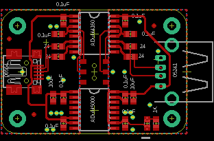
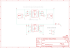

Contents
========

* [PRA2107 > Adafruit USB Isolator PCB](#pra2107--adafruit-usb-isolator-pcb)
	* [Schematic](#schematic)
	* [PCB](#pcb)
	* [Interactive BOM](#interactive-bom)
	* [OOMP Parts](#oomp-parts)
	* [Images](#images)
	* [Tags](#tags)
  
![][im]
# PRA2107 > Adafruit USB Isolator PCB

- ID: PROJ-ADAF-2107-STAN-01
- Hex ID: PRA2107
- Name: Adafruit
- Description: Adafruit
- Long Link: [http://oom.lt/PROJ-ADAF-2107-STAN-01](http://oom.lt/PROJ-ADAF-2107-STAN-01)
- Short Link: [http://oom.lt/PRA2107](http://oom.lt/PRA2107)

## Schematic
  

## PCB
  

## Interactive BOM

- Interactive BOM page: [ibom.html](https://htmlpreview.github.io/?https://github.com/oomlout/oomlout_OOMP_projects/blob/main/PROJ-ADAF-2107-STAN-01/kicad/bom/ibom.html)

## OOMP Parts
  

|OOMP Parts|
| :---: |
|C1 C1,CAPC-0805-X-UF1D-01|
|C2 C2,CAPC-0805-X-UF1D-01|
|C3 C3,CAPC-0805-X-UF1D-01|
|C4 C4,CAPC-0805-X-UF1D-01|
|C5 C5,CAPC-0805-X-UF1D-01|
|[C6 CAPC-0805-X-UF10-V10 SMD (0805) 10 uF Capacitor (Ceramic) 10v](https://github.com/oomlout/oomlout_OOMP_parts/tree/main/CAPC-0805-X-UF10-V10/)|
|C7 C7,CAPC-0805-X-UF1D-01|
|C8 C8,CAPC-0805-X-UF1D-01|
|[C9 CAPC-0805-X-UF10-V10 SMD (0805) 10 uF Capacitor (Ceramic) 10v](https://github.com/oomlout/oomlout_OOMP_parts/tree/main/CAPC-0805-X-UF10-V10/)|
|C10 C10,CAPC-0805-X-UF1D-01|
|[D1 LEDS-0805-G-STAN-01 SMD (0805) Green LED](https://github.com/oomlout/oomlout_OOMP_parts/tree/main/LEDS-0805-G-STAN-01/)|
|R1 R1,RESE-0805-X-O240-01|
|R2 R2,RESE-0805-X-O240-01|
|R3 R3,RESE-0805-X-O240-01|
|R4 R4,RESE-0805-X-O240-01|
|[R5 RESE-0805-X-O102-01 SMD (0805) 1k Ohm Resistor](https://github.com/oomlout/oomlout_OOMP_parts/tree/main/RESE-0805-X-O102-01/)|
|SW1 SW1,UNMATCHED-UNMATCHED-X-UNMATCHED-01|
|U1 U1,UNMATCHED-UNMATCHED-X-UNMATCHED-01|
|U2 U2,UNMATCHED-UNMATCHED-X-UNMATCHED-01|
|X2 X2,UNMATCHED-UNMATCHED-X-UNMATCHED-01|
|X3 X3,UNMATCHED-UNMATCHED-X-UNMATCHED-01|

## Images
  
  

|kicadPcb3d|kicadPcb3dFront|kicadPcb3dBack|eagleImage|eagleSchemImage|
| :---: | :---: | :---: | :---: | :---: |
||||||

## Tags

- hexID: PRA2107
- oompType: PROJ
- oompSize: ADAF
- oompColor: 2107
- oompDesc: STAN
- oompIndex: 01
- oompName: Adafruit USB Isolator PCB
- sources: All source files from https://github.com/adafruit/Adafruit-USB-Isolator-PCB (source licence details in srcLicense.md)
- linkBuyPage: http://www.adafruit.com/products/2107
- oompID: PROJ-ADAF-2107-STAN-01
- oompParts: C1,CAPC-0805-X-UF1D-01
- oompParts: C2,CAPC-0805-X-UF1D-01
- oompParts: C3,CAPC-0805-X-UF1D-01
- oompParts: C4,CAPC-0805-X-UF1D-01
- oompParts: C5,CAPC-0805-X-UF1D-01
- oompParts: C6,CAPC-0805-X-UF10-V10
- oompParts: C7,CAPC-0805-X-UF1D-01
- oompParts: C8,CAPC-0805-X-UF1D-01
- oompParts: C9,CAPC-0805-X-UF10-V10
- oompParts: C10,CAPC-0805-X-UF1D-01
- oompParts: D1,LEDS-0805-G-STAN-01
- oompParts: R1,RESE-0805-X-O240-01
- oompParts: R2,RESE-0805-X-O240-01
- oompParts: R3,RESE-0805-X-O240-01
- oompParts: R4,RESE-0805-X-O240-01
- oompParts: R5,RESE-0805-X-O102-01
- oompParts: SW1,UNMATCHED-UNMATCHED-X-UNMATCHED-01
- oompParts: U1,UNMATCHED-UNMATCHED-X-UNMATCHED-01
- oompParts: U2,UNMATCHED-UNMATCHED-X-UNMATCHED-01
- oompParts: X2,UNMATCHED-UNMATCHED-X-UNMATCHED-01
- oompParts: X3,UNMATCHED-UNMATCHED-X-UNMATCHED-01
- rawParts: C1,0.1uF,CAP_CERAMIC0805-NOOUTLINE,0805-NO,Ceramic Capacitors,,
- rawParts: C2,0.1uF,CAP_CERAMIC0805-NOOUTLINE,0805-NO,Ceramic Capacitors,,
- rawParts: C3,0.1uF,CAP_CERAMIC0805-NOOUTLINE,0805-NO,Ceramic Capacitors,,
- rawParts: C4,0.1uF,CAP_CERAMIC0805-NOOUTLINE,0805-NO,Ceramic Capacitors,,
- rawParts: C5,0.1uF,CAP_CERAMIC0805-NOOUTLINE,0805-NO,Ceramic Capacitors,,
- rawParts: C6,10uF,CAP_CERAMIC0805-NOOUTLINE,0805-NO,Ceramic Capacitors,,
- rawParts: C7,0.1uF,CAP_CERAMIC0805-NOOUTLINE,0805-NO,Ceramic Capacitors,,
- rawParts: C8,0.1uF,CAP_CERAMIC0805-NOOUTLINE,0805-NO,Ceramic Capacitors,,
- rawParts: C9,10uF,CAP_CERAMIC0805-NOOUTLINE,0805-NO,Ceramic Capacitors,,
- rawParts: C10,0.1uF,CAP_CERAMIC0805-NOOUTLINE,0805-NO,Ceramic Capacitors,,
- rawParts: D1,GREEN,LED0805_NOOUTLINE,CHIPLED_0805_NOOUTLINE,LED,,
- rawParts: FID1,FIDUCIAL,FIDUCIAL,FIDUCIAL_1MM,Fiducial Alignment Points,EXCLUDE,
- rawParts: FID2,FIDUCIAL,FIDUCIAL,FIDUCIAL_1MM,Fiducial Alignment Points,EXCLUDE,
- rawParts: FID3,FIDUCIAL,FIDUCIAL,FIDUCIAL_1MM,Fiducial Alignment Points,EXCLUDE,
- rawParts: R1,24,RESISTOR0805_NOOUTLINE,0805-NO,Resistors,,
- rawParts: R2,24,RESISTOR0805_NOOUTLINE,0805-NO,Resistors,,
- rawParts: R3,24,RESISTOR0805_NOOUTLINE,0805-NO,Resistors,,
- rawParts: R4,24,RESISTOR_0805MP,_0805MP,Resistors,,
- rawParts: R5,1K,RESISTOR0805_NOOUTLINE,0805-NO,Resistors,,
- rawParts: SW1,,SWITCH_DPDTEG1390,EG1390,Switch - DPDT,,
- rawParts: U$7,MOUNTINGHOLE2.5_THICK,MOUNTINGHOLE2.5_THICK,MOUNTINGHOLE_2.5_PLATED_THICK,Mounting Hole,EXCLUDE,
- rawParts: U$8,MOUNTINGHOLE2.5_THICK,MOUNTINGHOLE2.5_THICK,MOUNTINGHOLE_2.5_PLATED_THICK,Mounting Hole,EXCLUDE,
- rawParts: U$9,MOUNTINGHOLE2.5_THICK,MOUNTINGHOLE2.5_THICK,MOUNTINGHOLE_2.5_PLATED_THICK,Mounting Hole,EXCLUDE,
- rawParts: U$10,MOUNTINGHOLE2.5_THICK,MOUNTINGHOLE2.5_THICK,MOUNTINGHOLE_2.5_PLATED_THICK,Mounting Hole,EXCLUDE,
- rawParts: U1,ADuM4160,ADUM4160,SOIC16WIDE,ADuM4160 Digital USB Isolator,,
- rawParts: U2,ADuM5000,ADUM5000,SOIC16WIDE,ADuM5000 Isolate DC-to-DC Converter,,
- rawParts: X2,05241,USB_TYPEAPTHFML,USB_HOST-PTH,USB - Type A Connectors,,
- rawParts: X3,06564,USBMINIBLARGE,USB-MINIB_LARGER,USB Connectors,,

[im]: kicadPcb3d_450.png
