Contents
========

* [PRA2130 > Adafruit PAM8302 Mono Amplifier PCB](#pra2130--adafruit-pam8302-mono-amplifier-pcb)
	* [Schematic](#schematic)
	* [PCB](#pcb)
	* [Interactive BOM](#interactive-bom)
	* [OOMP Parts](#oomp-parts)
	* [Images](#images)
	* [Tags](#tags)
  
![][im]
# PRA2130 > Adafruit PAM8302 Mono Amplifier PCB

- ID: PROJ-ADAF-2130-STAN-01
- Hex ID: PRA2130
- Name: Adafruit
- Description: Adafruit
- Long Link: [http://oom.lt/PROJ-ADAF-2130-STAN-01](http://oom.lt/PROJ-ADAF-2130-STAN-01)
- Short Link: [http://oom.lt/PRA2130](http://oom.lt/PRA2130)

## Schematic
  
[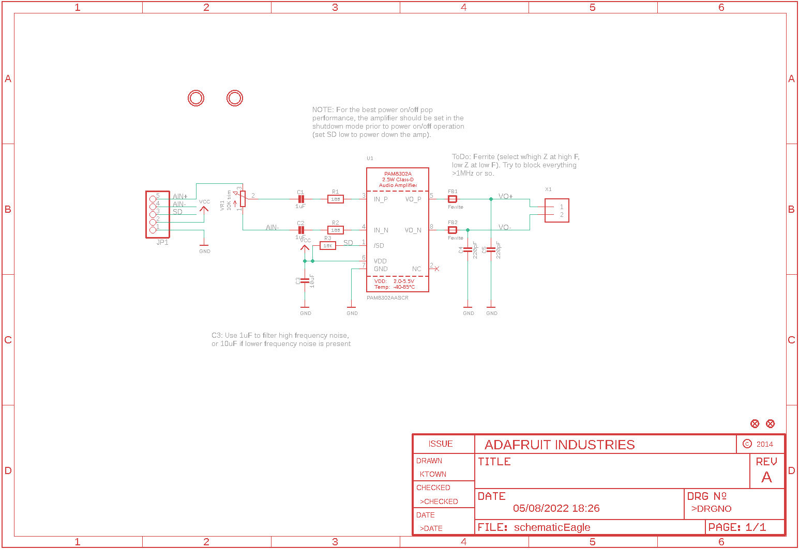](eagleSchemImage.png)
## PCB
  
[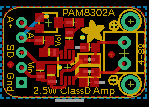](eagleImage.png)
## Interactive BOM

- Interactive BOM page: [ibom.html](https://htmlpreview.github.io/?https://github.com/oomlout/oomlout_OOMP_projects/blob/main/PROJ-ADAF-2130-STAN-01/kicad/bom/ibom.html)

## OOMP Parts
  

|OOMP ID|Name|Identifier|
| :---: | :---: | :---: |
|[CAPC-0805-X-UF1-V25](https://github.com/oomlout/oomlout_OOMP_parts/tree/main/CAPC-0805-X-UF1-V25/)|[SMD (0805) 1 uF Capacitor (Ceramic) 25v](https://github.com/oomlout/oomlout_OOMP_parts/tree/main/CAPC-0805-X-UF1-V25/)|[C1, C2](https://github.com/oomlout/oomlout_OOMP_parts/tree/main/CAPC-0805-X-UF1-V25/)|
|[CAPC-0805-X-UF10-V10](https://github.com/oomlout/oomlout_OOMP_parts/tree/main/CAPC-0805-X-UF10-V10/)|[SMD (0805) 10 uF Capacitor (Ceramic) 10v](https://github.com/oomlout/oomlout_OOMP_parts/tree/main/CAPC-0805-X-UF10-V10/)|[C3](https://github.com/oomlout/oomlout_OOMP_parts/tree/main/CAPC-0805-X-UF10-V10/)|
|CAPC-0805-X-PF220-01||C4, C5|
|FERB-0805-X-UNMATCHED-01||FB1, FB2|
|[HEAD-I01-X-PI05-01](https://github.com/oomlout/oomlout_OOMP_parts/tree/main/HEAD-I01-X-PI05-01/)|[2.54 mm 5 Pin Header](https://github.com/oomlout/oomlout_OOMP_parts/tree/main/HEAD-I01-X-PI05-01/)|[JP1](https://github.com/oomlout/oomlout_OOMP_parts/tree/main/HEAD-I01-X-PI05-01/)|
|[RESE-0805-X-O101-01](https://github.com/oomlout/oomlout_OOMP_parts/tree/main/RESE-0805-X-O101-01/)|[SMD (0805) 100 Ohm Resistor](https://github.com/oomlout/oomlout_OOMP_parts/tree/main/RESE-0805-X-O101-01/)|[R1, R2](https://github.com/oomlout/oomlout_OOMP_parts/tree/main/RESE-0805-X-O101-01/)|
|[RESE-0805-X-O103-01](https://github.com/oomlout/oomlout_OOMP_parts/tree/main/RESE-0805-X-O103-01/)|[SMD (0805) 10k Ohm Resistor](https://github.com/oomlout/oomlout_OOMP_parts/tree/main/RESE-0805-X-O103-01/)|[R3](https://github.com/oomlout/oomlout_OOMP_parts/tree/main/RESE-0805-X-O103-01/)|
|UNMATCHED-UNMATCHED-X-UNMATCHED-01||U1, VR1|
|[TERS-35D-L-PI02-01](https://github.com/oomlout/oomlout_OOMP_parts/tree/main/TERS-35D-L-PI02-01/)|[3.5 mm 2 Pin Blue Screw Terminal](https://github.com/oomlout/oomlout_OOMP_parts/tree/main/TERS-35D-L-PI02-01/)|[X1](https://github.com/oomlout/oomlout_OOMP_parts/tree/main/TERS-35D-L-PI02-01/)|

## Images
  
  

|bominteractivefront|bominteractiveback|kicadPcb3d|kicadPcb3dFront|kicadPcb3dBack|eagleImage|eagleSchemImage|pcbdraw|pcbdrawback|
| :---: | :---: | :---: | :---: | :---: | :---: | :---: | :---: | :---: |
|[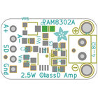](bomFront.png)|[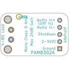](bomBack.png)|[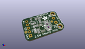](kicadPcb3d.png)|[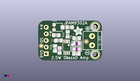](kicadPcb3dFront.png)|[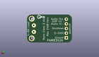](kicadPcb3dBack.png)|[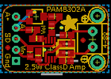](eagleImage.png)|[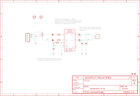](eagleSchemImage.png)|[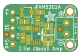](pcbdraw.png)|[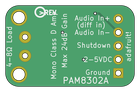](pcbdrawBack.png)|

## Tags

- hexID: PRA2130
- oompType: PROJ
- oompSize: ADAF
- oompColor: 2130
- oompDesc: STAN
- oompIndex: 01
- oompName: Adafruit PAM8302 Mono Amplifier PCB
- sources: All source files from https://github.com/adafruit/Adafruit-PAM8302-Mono-Amplifier-PCB (source licence details in srcLicense.md)
- linkBuyPage: http://www.adafruit.com/products/2130
- oompID: PROJ-ADAF-2130-STAN-01
- oompParts: C1,CAPC-0805-X-UF1-V25
- oompParts: C2,CAPC-0805-X-UF1-V25
- oompParts: C3,CAPC-0805-X-UF10-V10
- oompParts: C4,CAPC-0805-X-PF220-01
- oompParts: C5,CAPC-0805-X-PF220-01
- oompParts: FB1,FERB-0805-X-UNMATCHED-01
- oompParts: FB2,FERB-0805-X-UNMATCHED-01
- oompParts: JP1,HEAD-I01-X-PI05-01
- oompParts: R1,RESE-0805-X-O101-01
- oompParts: R2,RESE-0805-X-O101-01
- oompParts: R3,RESE-0805-X-O103-01
- oompParts: U1,UNMATCHED-UNMATCHED-X-UNMATCHED-01
- oompParts: VR1,UNMATCHED-UNMATCHED-X-UNMATCHED-01
- oompParts: X1,TERS-35D-L-PI02-01
- rawParts: C1,1uF,CAP_CERAMIC0805-NOOUTLINE,0805-NO,Ceramic Capacitors,,
- rawParts: C2,1uF,CAP_CERAMIC0805-NOOUTLINE,0805-NO,Ceramic Capacitors,,
- rawParts: C3,10uF,CAP_CERAMIC0805-NOOUTLINE,0805-NO,Ceramic Capacitors,,
- rawParts: C4,220pF,CAP_CERAMIC0805-NOOUTLINE,0805-NO,Ceramic Capacitors,,
- rawParts: C5,220pF,CAP_CERAMIC0805-NOOUTLINE,0805-NO,Ceramic Capacitors,,
- rawParts: FB1,Ferrite,FERRITE_0805,_0805,Ferrite Bead,,
- rawParts: FB2,Ferrite,FERRITE_0805,_0805,Ferrite Bead,,
- rawParts: FID1,FIDUCIAL,FIDUCIAL,FIDUCIAL_1MM,Fiducial Alignment Points,EXCLUDE,
- rawParts: FID2,FIDUCIAL,FIDUCIAL,FIDUCIAL_1MM,Fiducial Alignment Points,EXCLUDE,
- rawParts: JP1,,HEADER-1X570MIL,1X05_ROUND_70,PIN HEADER,,
- rawParts: R1,100,RESISTOR0805_NOOUTLINE,0805-NO,Resistors,,
- rawParts: R2,100,RESISTOR0805_NOOUTLINE,0805-NO,Resistors,,
- rawParts: R3,10K,RESISTOR0805_NOOUTLINE,0805-NO,Resistors,,
- rawParts: U$10,MOUNTINGHOLE2.0,MOUNTINGHOLE2.0,MOUNTINGHOLE_2.0_PLATED,Mounting Hole,EXCLUDE,
- rawParts: U$11,MOUNTINGHOLE2.0,MOUNTINGHOLE2.0,MOUNTINGHOLE_2.0_PLATED,Mounting Hole,EXCLUDE,
- rawParts: U1,PAM8302AASCR,AUDIOAMP_PAM8302A,MSOP8_0.65MM,PAM8302A - 2.5W Class-D Mono Audio Amplifier,,
- rawParts: VR1,10K trim,TRIMPOT3303W/X,TRIMPOT_BOURNS_3303W,3-Pin SMT Trimpots,,
- rawParts: X1,,TERMBLOCK_1X2,TERMBLOCK_1X2-3.5MM,3.5mm Terminal block,,

[im]: kicadPcb3d_450.png
