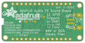

Contents
========

* [PRA2133 > Adafruit Audio FX Sound Board PCBs](#pra2133--adafruit-audio-fx-sound-board-pcbs)
	* [Schematic](#schematic)
	* [PCB](#pcb)
	* [Interactive BOM](#interactive-bom)
	* [OOMP Parts](#oomp-parts)
	* [Images](#images)
	* [Tags](#tags)
  
![][im]
# PRA2133 > Adafruit Audio FX Sound Board PCBs

- ID: PROJ-ADAF-2133-STAN-01
- Hex ID: PRA2133
- Name: Adafruit 2133
- Description: Adafruit 2133
- Long Link: [http://oom.lt/PROJ-ADAF-2133-STAN-01](http://oom.lt/PROJ-ADAF-2133-STAN-01)
- Short Link: [http://oom.lt/PRA2133](http://oom.lt/PRA2133)

## Schematic
  

## PCB
  

## Interactive BOM

- Interactive BOM page: [ibom.html](https://htmlpreview.github.io/?https://github.com/oomlout/oomlout_OOMP_projects/blob/main/PROJ-ADAF-2133-STAN-01/kicad/bom/ibom.html)

## OOMP Parts
  

|OOMP ID|Name|Identifier|
| :---: | :---: | :---: |
|[CAPC-0805-X-UF10-V10](https://github.com/oomlout/oomlout_OOMP_parts/tree/main/CAPC-0805-X-UF10-V10/)|[SMD (0805) 10 uF Capacitor (Ceramic) 10v](https://github.com/oomlout/oomlout_OOMP_parts/tree/main/CAPC-0805-X-UF10-V10/)|[C1, C2, C8, C9](https://github.com/oomlout/oomlout_OOMP_parts/tree/main/CAPC-0805-X-UF10-V10/)|
|[CAPC-0805-X-UF1-V25](https://github.com/oomlout/oomlout_OOMP_parts/tree/main/CAPC-0805-X-UF1-V25/)|[SMD (0805) 1 uF Capacitor (Ceramic) 25v](https://github.com/oomlout/oomlout_OOMP_parts/tree/main/CAPC-0805-X-UF1-V25/)|[C3, C10](https://github.com/oomlout/oomlout_OOMP_parts/tree/main/CAPC-0805-X-UF1-V25/)|
|CAPC-UNMATCHED-X-UF10-01||C6, C7|
|CAPC-0805-X-PF47D-01||C11, C12|
|[HEAD-I01-X-PI14-01](https://github.com/oomlout/oomlout_OOMP_parts/tree/main/HEAD-I01-X-PI14-01/)|[2.54 mm 14 Pin Header](https://github.com/oomlout/oomlout_OOMP_parts/tree/main/HEAD-I01-X-PI14-01/)|[CONTROL, GPIO1](https://github.com/oomlout/oomlout_OOMP_parts/tree/main/HEAD-I01-X-PI14-01/)|
|[DIOD-S323-X-K4148-01](https://github.com/oomlout/oomlout_OOMP_parts/tree/main/DIOD-S323-X-K4148-01/)|[SMD (SOD-323) Diode](https://github.com/oomlout/oomlout_OOMP_parts/tree/main/DIOD-S323-X-K4148-01/)|[D2](https://github.com/oomlout/oomlout_OOMP_parts/tree/main/DIOD-S323-X-K4148-01/)|
|[DIOD-S123-X-KMBR120-01](https://github.com/oomlout/oomlout_OOMP_parts/tree/main/DIOD-S123-X-KMBR120-01/)|[SMD (SOD-123) MBR120 Diode](https://github.com/oomlout/oomlout_OOMP_parts/tree/main/DIOD-S123-X-KMBR120-01/)|[D3, D4](https://github.com/oomlout/oomlout_OOMP_parts/tree/main/DIOD-S123-X-KMBR120-01/)|
|[LEDS-0805-R-STAN-01](https://github.com/oomlout/oomlout_OOMP_parts/tree/main/LEDS-0805-R-STAN-01/)|[SMD (0805) Red LED](https://github.com/oomlout/oomlout_OOMP_parts/tree/main/LEDS-0805-R-STAN-01/)|[GREEN](https://github.com/oomlout/oomlout_OOMP_parts/tree/main/LEDS-0805-R-STAN-01/)|
|[LEDS-0805-G-STAN-01](https://github.com/oomlout/oomlout_OOMP_parts/tree/main/LEDS-0805-G-STAN-01/)|[SMD (0805) Green LED](https://github.com/oomlout/oomlout_OOMP_parts/tree/main/LEDS-0805-G-STAN-01/)|[LED4](https://github.com/oomlout/oomlout_OOMP_parts/tree/main/LEDS-0805-G-STAN-01/)|
|[RESE-0805-X-O105-01](https://github.com/oomlout/oomlout_OOMP_parts/tree/main/RESE-0805-X-O105-01/)|[SMD (0805) 1M Ohm Resistor](https://github.com/oomlout/oomlout_OOMP_parts/tree/main/RESE-0805-X-O105-01/)|[R1](https://github.com/oomlout/oomlout_OOMP_parts/tree/main/RESE-0805-X-O105-01/)|
|RESA-06038-X-O1003X4-01||R2, R9, R10, R11, R12|
|[RESE-0805-X-O471-01](https://github.com/oomlout/oomlout_OOMP_parts/tree/main/RESE-0805-X-O471-01/)|[SMD (0805) 470 Ohm Resistor](https://github.com/oomlout/oomlout_OOMP_parts/tree/main/RESE-0805-X-O471-01/)|[R3, R6, R7, R8](https://github.com/oomlout/oomlout_OOMP_parts/tree/main/RESE-0805-X-O471-01/)|
|UNMATCHED-UNMATCHED-X-UNMATCHED-01||TP1, TP2, TP3, U1, U2, X1, X2, X3, Y2|

## Images
  
  

|bominteractivefront|bominteractiveback|kicadPcb3d|kicadPcb3dFront|kicadPcb3dBack|kicadSchem|eagleImage|eagleSchemImage|pcbdraw|pcbdrawback|
| :---: | :---: | :---: | :---: | :---: | :---: | :---: | :---: | :---: | :---: |
|||||||||||

## Tags

- hexID: PRA2133
- oompType: PROJ
- oompSize: ADAF
- oompColor: 2133
- oompDesc: STAN
- oompIndex: 01
- oompName: Adafruit Audio FX Sound Board PCBs
- sources: All source files from https://github.com/adafruit/Adafruit-Audio-FX-Sound-Board-PCBs (source licence details in srcLicense.md)
- linkBuyPage: http://www.adafruit.com/products/2133
- oompID: PROJ-ADAF-2133-STAN-01
- oompParts: C1,CAPC-0805-X-UF10-V10
- oompParts: C2,CAPC-0805-X-UF10-V10
- oompParts: C3,CAPC-0805-X-UF1-V25
- oompParts: C6,CAPC-UNMATCHED-X-UF10-01
- oompParts: C7,CAPC-UNMATCHED-X-UF10-01
- oompParts: C8,CAPC-0805-X-UF10-V10
- oompParts: C9,CAPC-0805-X-UF10-V10
- oompParts: C10,CAPC-0805-X-UF1-V25
- oompParts: C11,CAPC-0805-X-PF47D-01
- oompParts: C12,CAPC-0805-X-PF47D-01
- oompParts: CONTROL,HEAD-I01-X-PI14-01
- oompParts: D2,DIOD-S323-X-K4148-01
- oompParts: D3,DIOD-S123-X-KMBR120-01
- oompParts: D4,DIOD-S123-X-KMBR120-01
- oompParts: GPIO1,HEAD-I01-X-PI14-01
- oompParts: GREEN,LEDS-0805-R-STAN-01
- oompParts: LED4,LEDS-0805-G-STAN-01
- oompParts: R1,RESE-0805-X-O105-01
- oompParts: R2,RESA-06038-X-O1003X4-01
- oompParts: R3,RESE-0805-X-O471-01
- oompParts: R6,RESE-0805-X-O471-01
- oompParts: R7,RESE-0805-X-O471-01
- oompParts: R8,RESE-0805-X-O471-01
- oompParts: R9,RESA-06038-X-O1003X4-01
- oompParts: R10,RESA-06038-X-O1003X4-01
- oompParts: R11,RESA-06038-X-O1003X4-01
- oompParts: R12,RESA-06038-X-O1003X4-01
- oompParts: TP1,UNMATCHED-UNMATCHED-X-UNMATCHED-01
- oompParts: TP2,UNMATCHED-UNMATCHED-X-UNMATCHED-01
- oompParts: TP3,UNMATCHED-UNMATCHED-X-UNMATCHED-01
- oompParts: U1,UNMATCHED-UNMATCHED-X-UNMATCHED-01
- oompParts: U2,UNMATCHED-UNMATCHED-X-UNMATCHED-01
- oompParts: X1,UNMATCHED-UNMATCHED-X-UNMATCHED-01
- oompParts: X2,UNMATCHED-UNMATCHED-X-UNMATCHED-01
- oompParts: X3,UNMATCHED-UNMATCHED-X-UNMATCHED-01
- oompParts: Y2,UNMATCHED-UNMATCHED-X-UNMATCHED-01
- rawParts: C1,10uF,CAP_CERAMIC0805-NOOUTLINE,0805-NO,Ceramic Capacitors,,,
- rawParts: C2,10uF,CAP_CERAMIC0805-NOOUTLINE,0805-NO,Ceramic Capacitors,,,
- rawParts: C3,1uF,CAP_CERAMIC0805-NOOUTLINE,0805-NO,Ceramic Capacitors,,,
- rawParts: C6,10uF,CAP_CERAMIC0805_10MGAP,0805_10MGAP,Ceramic Capacitors,,,
- rawParts: C7,10uF,CAP_CERAMIC0805_10MGAP,0805_10MGAP,Ceramic Capacitors,,,
- rawParts: C8,10uF,CAP_CERAMIC0805-NOOUTLINE,0805-NO,Ceramic Capacitors,,,
- rawParts: C9,10uF,CAP_CERAMIC0805-NOOUTLINE,0805-NO,Ceramic Capacitors,,,
- rawParts: C10,1uF,CAP_CERAMIC0805-NOOUTLINE,0805-NO,Ceramic Capacitors,,,
- rawParts: C11,4.7nF,CAP_CERAMIC0805-NOOUTLINE,0805-NO,Ceramic Capacitors,,,
- rawParts: C12,4.7nF,CAP_CERAMIC0805-NOOUTLINE,0805-NO,Ceramic Capacitors,,,
- rawParts: CONTROL,Control Breakout,PINHD-1X14-CB,1X14-CB,PIN HEADER,,,
- rawParts: D2,1N4148,DIODESOD-323,SOD-323,Diode,,,
- rawParts: D3,MBR120,DIODE-SCHOTTKYSOD-123,SOD-123,,,,
- rawParts: D4,MBR120,DIODE-SCHOTTKYSOD-123,SOD-123,,,,
- rawParts: FID1,FIDUCIAL,FIDUCIAL,FIDUCIAL_1MM,Fiducial Alignment Points,EXCLUDE,,
- rawParts: FID2,FIDUCIAL,FIDUCIAL,FIDUCIAL_1MM,Fiducial Alignment Points,EXCLUDE,,
- rawParts: GPIO1,GPIO breakout,PINHD-1X14-CB,1X14-CB,PIN HEADER,,,
- rawParts: GREEN,RED,LED0805_NOOUTLINE,CHIPLED_0805_NOOUTLINE,LED,,,
- rawParts: LED4,Green,LED0805_NOOUTLINE,CHIPLED_0805_NOOUTLINE,LED,,,
- rawParts: R1,1M,RESISTOR0805_NOOUTLINE,0805-NO,Resistors,,,
- rawParts: R2,100K,RESISTOR_4PACK_US,RESPACK_4X0603,Resistor Packs (4 resistors),,,
- rawParts: R3,470,RESISTOR0805_NOOUTLINE,0805-NO,Resistors,,,
- rawParts: R6,470,RESISTOR0805_NOOUTLINE,0805-NO,Resistors,,,
- rawParts: R7,470,RESISTOR0805_NOOUTLINE,0805-NO,Resistors,,,
- rawParts: R8,470,RESISTOR0805_NOOUTLINE,0805-NO,Resistors,,,
- rawParts: R9,100K,RESISTOR_4PACK_US,RESPACK_4X0603,Resistor Packs (4 resistors),,,
- rawParts: R10,100K,RESISTOR_4PACK_US,RESPACK_4X0603,Resistor Packs (4 resistors),,,
- rawParts: R11,100K,RESISTOR_4PACK_US,RESPACK_4X0603,Resistor Packs (4 resistors),,,
- rawParts: R12,100K,RESISTOR_4PACK_US,RESPACK_4X0603,Resistor Packs (4 resistors),,,
- rawParts: TP1,TPB1,27,TPB1,27,B1,27,Test pad,,,
- rawParts: TP2,TPB1,27,TPB1,27,B1,27,Test pad,,,
- rawParts: TP3,TPB1,27,TPB1,27,B1,27,Test pad,,,
- rawParts: U$5,MOUNTINGHOLE2.5,MOUNTINGHOLE2.5,MOUNTINGHOLE_2.5_PLATED,Mounting Hole,EXCLUDE,,
- rawParts: U$6,MOUNTINGHOLE2.5,MOUNTINGHOLE2.5,MOUNTINGHOLE_2.5_PLATED,Mounting Hole,EXCLUDE,,
- rawParts: U$7,MOUNTINGHOLE2.5,MOUNTINGHOLE2.5,MOUNTINGHOLE_2.5_PLATED,Mounting Hole,EXCLUDE,,
- rawParts: U$8,MOUNTINGHOLE2.5,MOUNTINGHOLE2.5,MOUNTINGHOLE_2.5_PLATED,Mounting Hole,EXCLUDE,,
- rawParts: U1, MX25L1606,SPIFLASH_SOIC8208MIL,SOIC8_208MIL,SOIC8 SPI Flash,,,
- rawParts: U2,VS1000,VS1000,LQFP48,VS1000 Ogg Vorbis Player,,,
- rawParts: X1,Micro B,USBMICRO_20329,4UCONN_20329,USB Connectors,,,
- rawParts: X2,JST_PH_2,CON_JST_PH_2PIN,JSTPH2,JST 2-Pin Right-Angle Connector,,,
- rawParts: X3,19621,AUDIO_3.5MMJACK_4POL,4UCONN_18510,Footprint courtesy Morten Hjerde (Riftlabs.com),,,
- rawParts: Y2,12MHz,RESONATORSMD,RESONATOR-SMD,Resonator,,,

[im]: kicadPcb3d_450.png
