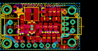
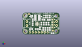
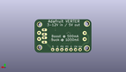
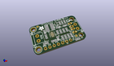

Contents
========

* [PROJ-ADAF-2190-STAN-01>Adafruit Verter PCB](#proj-adaf-2190-stan-01adafruit-verter-pcb)
	* [Images](#images)
	* [Interactive BOM](#interactive-bom)
	* [Tags](#tags)
  
![][im]
# PROJ-ADAF-2190-STAN-01>Adafruit Verter PCB

- ID: PROJ-ADAF-2190-STAN-01
- Hex ID: PRA2190
- Name: Adafruit Verter PCB
- Description: 

## Images
  
  

|eagleImage|kicadPcb3dFront|kicadPcb3dBack|kicadPcb3d|
| :---: | :---: | :---: | :---: |
|||||

## Interactive BOM

- Interactive BOM page: [ibom.html](kicad/bom/ibom.html)

## Tags

- hexID: PRA2190
- oompType: PROJ
- oompSize: ADAF
- oompColor: 2190
- oompDesc: STAN
- oompIndex: 01
- oompName: Adafruit Verter PCB
- sources: All source files from https://github.com/adafruit/Adafruit-Verter-PCB (source licence details in srcLicense.md)
- linkBuyPage: http://www.adafruit.com/products/2190
- oompPart: ERROR, C1 10uF/16V X5R, 0, 0, 0
- oompPart: ERROR, C2 10uF/16V X5R, 0, 0, 0
- oompPart: CAPC-0805-X-NF100-V50, C3, 14.985999999999999, 5.334, 270
- oompPart: CAPC-0805-X-PF10-01, C4, 19.685, 4.826, 270
- oompPart: ERROR, C5 22uF/10V X5R, 0, 0, 0
- oompPart: ERROR, C6 22uF/10V X5R, 0, 0, 0
- oompPart: ERROR, C7 22uF/10V X5R, 0, 0, 0
- oompPart: ERROR, C8 1uF/10V X5R, 0, 0, 0
- oompPart: UNMATCHED-UNMATCHED-X-UNMATCHED-01, CN1, 32.766, 9.524999999999999, 90
- oompPart: UNMATCHED-UNMATCHED-X-UNMATCHED-01, D1, 21.717, 15.620999999999999, 0
- oompPart: SKIP-UNMATCHED-X-UNMATCHED-01, FID1, 26.034999999999997, 3.302, 0
- oompPart: SKIP-UNMATCHED-X-UNMATCHED-01, FID2, 5.588, 17.779999999999998, 0
- oompPart: UNMATCHED-UNMATCHED-X-UNMATCHED-01, JP1, 13.97, 1.778, 0
- oompPart: UNMATCHED-UNMATCHED-X-UNMATCHED-01, L1, 12.7, 14.604999999999999, 0
- oompPart: UNMATCHED-UNMATCHED-X-UNMATCHED-01, Q1, 17.399, 15.493999999999998, 90
- oompPart: RESE-0805-X-O105-01, R1, 21.59, 4.826, 270
- oompPart: RESE-0805-X-UNMATCHED-01, R2, 17.779999999999998, 4.826, 90
- oompPart: RESE-0805-X-O105-01, R3, 17.906999999999996, 12.827, 180
- oompPart: RESE-0805-X-O102-01, R4, 20.066, 15.620999999999999, 270
- oompPart: RESE-0805-X-UNMATCHED-01, R5, 7.365999999999999, 4.699, 0
- oompPart: RESE-0805-X-UNMATCHED-01, R6, 12.191999999999998, 4.699, 0
- oompPart: ERROR, R9 75K 1%, 0, 0, 0
- oompPart: ERROR, R10 49.9K 1%, 0, 0, 0
- oompPart: ERROR, R11 75K 1%, 0, 0, 0
- oompPart: ERROR, R12 49.9K 1%, 0, 0, 0
- oompPart: SKIP-UNMATCHED-X-UNMATCHED-01, U$15, 2.54, 2.54, 0
- oompPart: SKIP-UNMATCHED-X-UNMATCHED-01, U$17, 2.54, 16.509999999999998, 0
- oompPart: UNMATCHED-UNMATCHED-X-UNMATCHED-01, U1, 12.7, 9.143999999999998, 270
- oompPart: UNMATCHED-UNMATCHED-X-UNMATCHED-01, X1, 3.8099999999999996, 9.524999999999999, 270
- oompPart: UNMATCHED-UNMATCHED-X-UNMATCHED-01, X2, 29.209999999999997, 9.524999999999999, 90
- rawPart: 

[im]: kicadPcb3d_450.png
