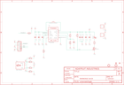

Contents
========

* [PRA2190 > Adafruit](#pra2190--adafruit)
	* [Schematic](#schematic)
	* [Interactive BOM](#interactive-bom)
	* [OOMP Parts](#oomp-parts)
	* [Images](#images)
	* [Tags](#tags)
  
![][im]
# PRA2190 > Adafruit

- ID: PROJ-ADAF-2190-STAN-01
- Hex ID: PRA2190
- Name: Adafruit
- Description: Adafruit
- Long Link: [http://oom.lt/PROJ-ADAF-2190-STAN-01](http://oom.lt/PROJ-ADAF-2190-STAN-01)
- Short Link: [http://oom.lt/PRA2190](http://oom.lt/PRA2190)

## Schematic
  

## Interactive BOM

- Interactive BOM page: [ibom.html](https://htmlpreview.github.io/?https://github.com/oomlout/oomlout_OOMP_projects/blob/main/PROJ-ADAF-2190-STAN-01/kicad/bom/ibom.html)

## OOMP Parts
  

|OOMP Parts|
| :---: |
|C1,CAPC-0805-X-UNMATCHED-01,C1,10uF/16V X5R,CAP_CERAMIC0805-NOOUTLINE,0805-NO,Ceramic Capacitors,,|
|C2,CAPC-0805-X-UNMATCHED-01,C2,10uF/16V X5R,CAP_CERAMIC0805-NOOUTLINE,0805-NO,Ceramic Capacitors,,|
|C3,CAPC-0805-X-NF100-V50,C3,0.1uF,CAP_CERAMIC0805-NOOUTLINE,0805-NO,Ceramic Capacitors,,|
|C4,CAPC-0805-X-UNMATCHED-01,C4,10pF,CAP_CERAMIC0805-NOOUTLINE,0805-NO,Ceramic Capacitors,,|
|C5,CAPC-0805-X-UNMATCHED-01,C5,22uF/10V X5R,CAP_CERAMIC0805-NOOUTLINE,0805-NO,Ceramic Capacitors,,|
|C6,CAPC-0805-X-UNMATCHED-01,C6,22uF/10V X5R,CAP_CERAMIC0805-NOOUTLINE,0805-NO,Ceramic Capacitors,,|
|C7,CAPC-0805-X-UNMATCHED-01,C7,22uF/10V X5R,CAP_CERAMIC0805-NOOUTLINE,0805-NO,Ceramic Capacitors,,|
|C8,CAPC-0805-X-UNMATCHED-01,C8,1uF/10V X5R,CAP_CERAMIC0805-NOOUTLINE,0805-NO,Ceramic Capacitors,,|
|CN1,UNMATCHED-UNMATCHED-X-UNMATCHED-01,CN1,USBA_FEMALE,USB_TYPEAPTHFML,USB_HOST-PTH,USB - Type A Connectors,,|
|D1,LEDS-0805-G-STAN-01,D1,GREEN,LED0805_NOOUTLINE,CHIPLED_0805_NOOUTLINE,LED,,|
|JP1,HEAD-I01-X-PI07-01,FID1,FIDUCIAL,FIDUCIAL,FIDUCIAL_1MM,Fiducial Alignment Points,EXCLUDE,|
|L1,UNMATCHED-UNMATCHED-X-UNMATCHED-01,FID2,FIDUCIAL,FIDUCIAL,FIDUCIAL_1MM,Fiducial Alignment Points,EXCLUDE,|
|Q1,MOSN-SO23-X-KBSS138-01,JP1,,HEADER-1X770MIL,1X07_ROUND_70,PIN HEADER,,|
|R1,RESE-0805-X-O105-01,L1,NRS5030T1R0NMGJ ,INDUCTORTDK_VLC5045,INDUCTOR_5X5MM_TDK_VLC5045,Inductors,,|
|R2,RESE-0805-X-O1053-01,Q1,BSS138,MOSFET-NWIDE,SOT23-WIDE,N-Channel Mosfet,,|
|R3,RESE-0805-X-O105-01,R1,1M,RESISTOR0805_NOOUTLINE,0805-NO,Resistors,,|
|R4,RESE-0805-X-O102-01,R2,105K,RESISTOR0805_NOOUTLINE,0805-NO,Resistors,,|
|R5,RESE-0805-X-O1053-01,R3,1M,RESISTOR0805_NOOUTLINE,0805-NO,Resistors,,|
|R6,RESE-0805-X-O1053-01,R4,1K,RESISTOR0805_NOOUTLINE,0805-NO,Resistors,,|
|R9,RESE-0805-X-UNMATCHED-01,R5,105K,RESISTOR0805_NOOUTLINE,0805-NO,Resistors,,|
|R10,RESE-0805-X-UNMATCHED-01,R6,105K,RESISTOR0805_NOOUTLINE,0805-NO,Resistors,,|
|R11,RESE-0805-X-UNMATCHED-01,R9,75K 1%,RESISTOR0805_NOOUTLINE,0805-NO,Resistors,,|
|R12,RESE-0805-X-UNMATCHED-01,R10,49.9K 1%,RESISTOR0805_NOOUTLINE,0805-NO,Resistors,,|
|U1,UNMATCHED-UNMATCHED-X-UNMATCHED-01,R11,75K 1%,RESISTOR0805_NOOUTLINE,0805-NO,Resistors,,|
|X1,UNMATCHED-UNMATCHED-X-UNMATCHED-01,R12,49.9K 1%,RESISTOR0805_NOOUTLINE,0805-NO,Resistors,,|
|X2,UNMATCHED-UNMATCHED-X-UNMATCHED-01,U$15,MOUNTINGHOLE2.5,MOUNTINGHOLE2.5,MOUNTINGHOLE_2.5_PLATED,Mounting Hole,EXCLUDE,|

## Images
  
  

|kicadPcb3d|kicadPcb3dFront|kicadPcb3dBack|eagleImage|eagleSchemImage|
| :---: | :---: | :---: | :---: | :---: |
||||||

## Tags

- hexID: PRA2190
- oompType: PROJ
- oompSize: ADAF
- oompColor: 2190
- oompDesc: STAN
- oompIndex: 01
- oompName: Adafruit Verter PCB
- sources: All source files from https://github.com/adafruit/Adafruit-Verter-PCB (source licence details in srcLicense.md)
- linkBuyPage: http://www.adafruit.com/products/2190
- oompID: PROJ-ADAF-2190-STAN-01
- oompParts: C1,CAPC-0805-X-UNMATCHED-01
- oompParts: C2,CAPC-0805-X-UNMATCHED-01
- oompParts: C3,CAPC-0805-X-NF100-V50
- oompParts: C4,CAPC-0805-X-UNMATCHED-01
- oompParts: C5,CAPC-0805-X-UNMATCHED-01
- oompParts: C6,CAPC-0805-X-UNMATCHED-01
- oompParts: C7,CAPC-0805-X-UNMATCHED-01
- oompParts: C8,CAPC-0805-X-UNMATCHED-01
- oompParts: CN1,UNMATCHED-UNMATCHED-X-UNMATCHED-01
- oompParts: D1,LEDS-0805-G-STAN-01
- oompParts: JP1,HEAD-I01-X-PI07-01
- oompParts: L1,UNMATCHED-UNMATCHED-X-UNMATCHED-01
- oompParts: Q1,MOSN-SO23-X-KBSS138-01
- oompParts: R1,RESE-0805-X-O105-01
- oompParts: R2,RESE-0805-X-O1053-01
- oompParts: R3,RESE-0805-X-O105-01
- oompParts: R4,RESE-0805-X-O102-01
- oompParts: R5,RESE-0805-X-O1053-01
- oompParts: R6,RESE-0805-X-O1053-01
- oompParts: R9,RESE-0805-X-UNMATCHED-01
- oompParts: R10,RESE-0805-X-UNMATCHED-01
- oompParts: R11,RESE-0805-X-UNMATCHED-01
- oompParts: R12,RESE-0805-X-UNMATCHED-01
- oompParts: U1,UNMATCHED-UNMATCHED-X-UNMATCHED-01
- oompParts: X1,UNMATCHED-UNMATCHED-X-UNMATCHED-01
- oompParts: X2,UNMATCHED-UNMATCHED-X-UNMATCHED-01
- rawParts: C1,10uF/16V X5R,CAP_CERAMIC0805-NOOUTLINE,0805-NO,Ceramic Capacitors,,
- rawParts: C2,10uF/16V X5R,CAP_CERAMIC0805-NOOUTLINE,0805-NO,Ceramic Capacitors,,
- rawParts: C3,0.1uF,CAP_CERAMIC0805-NOOUTLINE,0805-NO,Ceramic Capacitors,,
- rawParts: C4,10pF,CAP_CERAMIC0805-NOOUTLINE,0805-NO,Ceramic Capacitors,,
- rawParts: C5,22uF/10V X5R,CAP_CERAMIC0805-NOOUTLINE,0805-NO,Ceramic Capacitors,,
- rawParts: C6,22uF/10V X5R,CAP_CERAMIC0805-NOOUTLINE,0805-NO,Ceramic Capacitors,,
- rawParts: C7,22uF/10V X5R,CAP_CERAMIC0805-NOOUTLINE,0805-NO,Ceramic Capacitors,,
- rawParts: C8,1uF/10V X5R,CAP_CERAMIC0805-NOOUTLINE,0805-NO,Ceramic Capacitors,,
- rawParts: CN1,USBA_FEMALE,USB_TYPEAPTHFML,USB_HOST-PTH,USB - Type A Connectors,,
- rawParts: D1,GREEN,LED0805_NOOUTLINE,CHIPLED_0805_NOOUTLINE,LED,,
- rawParts: FID1,FIDUCIAL,FIDUCIAL,FIDUCIAL_1MM,Fiducial Alignment Points,EXCLUDE,
- rawParts: FID2,FIDUCIAL,FIDUCIAL,FIDUCIAL_1MM,Fiducial Alignment Points,EXCLUDE,
- rawParts: JP1,,HEADER-1X770MIL,1X07_ROUND_70,PIN HEADER,,
- rawParts: L1,NRS5030T1R0NMGJ ,INDUCTORTDK_VLC5045,INDUCTOR_5X5MM_TDK_VLC5045,Inductors,,
- rawParts: Q1,BSS138,MOSFET-NWIDE,SOT23-WIDE,N-Channel Mosfet,,
- rawParts: R1,1M,RESISTOR0805_NOOUTLINE,0805-NO,Resistors,,
- rawParts: R2,105K,RESISTOR0805_NOOUTLINE,0805-NO,Resistors,,
- rawParts: R3,1M,RESISTOR0805_NOOUTLINE,0805-NO,Resistors,,
- rawParts: R4,1K,RESISTOR0805_NOOUTLINE,0805-NO,Resistors,,
- rawParts: R5,105K,RESISTOR0805_NOOUTLINE,0805-NO,Resistors,,
- rawParts: R6,105K,RESISTOR0805_NOOUTLINE,0805-NO,Resistors,,
- rawParts: R9,75K 1%,RESISTOR0805_NOOUTLINE,0805-NO,Resistors,,
- rawParts: R10,49.9K 1%,RESISTOR0805_NOOUTLINE,0805-NO,Resistors,,
- rawParts: R11,75K 1%,RESISTOR0805_NOOUTLINE,0805-NO,Resistors,,
- rawParts: R12,49.9K 1%,RESISTOR0805_NOOUTLINE,0805-NO,Resistors,,
- rawParts: U$15,MOUNTINGHOLE2.5,MOUNTINGHOLE2.5,MOUNTINGHOLE_2.5_PLATED,Mounting Hole,EXCLUDE,
- rawParts: U$17,MOUNTINGHOLE2.5,MOUNTINGHOLE2.5,MOUNTINGHOLE_2.5_PLATED,Mounting Hole,EXCLUDE,
- rawParts: U1,TPS63060,VREG_TPS63060/1,PWSON-N10,TPS63060/63061 2A Boost/Buck Switch Converter,,
- rawParts: X1,,TERMBLOCK_1X2,TERMBLOCK_1X2-3.5MM,3.5mm Terminal block,,
- rawParts: X2,,TERMBLOCK_1X2,TERMBLOCK_1X2-3.5MM,3.5mm Terminal block,,

[im]: kicadPcb3d_450.png
