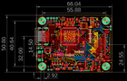
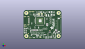
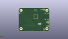
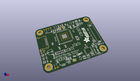

Contents
========

* [PROJ-ADAF-2218-STAN-01>Adafruit TFP401 HDMI To 40Pin TFT PCB](#proj-adaf-2218-stan-01adafruit-tfp401-hdmi-to-40pin-tft-pcb)
	* [Images](#images)
	* [Interactive BOM](#interactive-bom)
	* [OOMP Parts](#oomp-parts)
	* [Tags](#tags)
  
![][im]
# PROJ-ADAF-2218-STAN-01>Adafruit TFP401 HDMI To 40Pin TFT PCB

- ID: PROJ-ADAF-2218-STAN-01
- Hex ID: PRA2218
- Name: Adafruit TFP401 HDMI To 40Pin TFT PCB
- Description: 

## Images
  
  

|eagleImage|kicadPcb3dFront|kicadPcb3dBack|kicadPcb3d|
| :---: | :---: | :---: | :---: |
|||||

## Interactive BOM

- Interactive BOM page: [ibom.html](kicad/bom/ibom.html)

## OOMP Parts
  

|OOMP Parts|
| :---: |
|<table><tr><td></td><td> C1</td><td>[CAPC-0805-X-NF100-V50 SMD (0805) 100 nF Capacitor (Ceramic) 50v](https://github.com/oomlout/oomlout_OOMP_parts/tree/main/CAPC-0805-X-NF100-V50/)</td><td>[C85N100](https://github.com/oomlout/oomlout_OOMP_parts/tree/main/CAPC-0805-X-NF100-V50/)</td></tr></table>|
|<table><tr><td></td><td> C2</td><td>[CAPC-0805-X-NF100-V50 SMD (0805) 100 nF Capacitor (Ceramic) 50v](https://github.com/oomlout/oomlout_OOMP_parts/tree/main/CAPC-0805-X-NF100-V50/)</td><td>[C85N100](https://github.com/oomlout/oomlout_OOMP_parts/tree/main/CAPC-0805-X-NF100-V50/)</td></tr></table>|
|<table><tr><td></td><td> C3</td><td>[CAPC-0805-X-NF100-V50 SMD (0805) 100 nF Capacitor (Ceramic) 50v](https://github.com/oomlout/oomlout_OOMP_parts/tree/main/CAPC-0805-X-NF100-V50/)</td><td>[C85N100](https://github.com/oomlout/oomlout_OOMP_parts/tree/main/CAPC-0805-X-NF100-V50/)</td></tr></table>|
|<table><tr><td></td><td> C4</td><td>[CAPC-0805-X-NF100-V50 SMD (0805) 100 nF Capacitor (Ceramic) 50v](https://github.com/oomlout/oomlout_OOMP_parts/tree/main/CAPC-0805-X-NF100-V50/)</td><td>[C85N100](https://github.com/oomlout/oomlout_OOMP_parts/tree/main/CAPC-0805-X-NF100-V50/)</td></tr></table>|
|<table><tr><td></td><td> C5</td><td>[CAPC-0805-X-NF100-V50 SMD (0805) 100 nF Capacitor (Ceramic) 50v](https://github.com/oomlout/oomlout_OOMP_parts/tree/main/CAPC-0805-X-NF100-V50/)</td><td>[C85N100](https://github.com/oomlout/oomlout_OOMP_parts/tree/main/CAPC-0805-X-NF100-V50/)</td></tr></table>|
|CAPC-UNMATCHED-X-NF100-V50, C6, 40.799999934, 35.000000104, 90,C6, 0.1uF, _0805MP, microbuilder, (1.60629921, 1.37795276), R90|
|<table><tr><td></td><td> C7</td><td>[CAPC-0805-X-NF100-V50 SMD (0805) 100 nF Capacitor (Ceramic) 50v](https://github.com/oomlout/oomlout_OOMP_parts/tree/main/CAPC-0805-X-NF100-V50/)</td><td>[C85N100](https://github.com/oomlout/oomlout_OOMP_parts/tree/main/CAPC-0805-X-NF100-V50/)</td></tr></table>|
|<table><tr><td></td><td> C8</td><td>[CAPC-0805-X-NF100-V50 SMD (0805) 100 nF Capacitor (Ceramic) 50v](https://github.com/oomlout/oomlout_OOMP_parts/tree/main/CAPC-0805-X-NF100-V50/)</td><td>[C85N100](https://github.com/oomlout/oomlout_OOMP_parts/tree/main/CAPC-0805-X-NF100-V50/)</td></tr></table>|
|<table><tr><td></td><td> C9</td><td>[CAPC-0805-X-NF100-V50 SMD (0805) 100 nF Capacitor (Ceramic) 50v](https://github.com/oomlout/oomlout_OOMP_parts/tree/main/CAPC-0805-X-NF100-V50/)</td><td>[C85N100](https://github.com/oomlout/oomlout_OOMP_parts/tree/main/CAPC-0805-X-NF100-V50/)</td></tr></table>|
|<table><tr><td></td><td> C10</td><td>[CAPC-0805-X-NF100-V50 SMD (0805) 100 nF Capacitor (Ceramic) 50v](https://github.com/oomlout/oomlout_OOMP_parts/tree/main/CAPC-0805-X-NF100-V50/)</td><td>[C85N100](https://github.com/oomlout/oomlout_OOMP_parts/tree/main/CAPC-0805-X-NF100-V50/)</td></tr></table>|
|<table><tr><td></td><td> C11</td><td>[CAPC-0805-X-NF100-V50 SMD (0805) 100 nF Capacitor (Ceramic) 50v](https://github.com/oomlout/oomlout_OOMP_parts/tree/main/CAPC-0805-X-NF100-V50/)</td><td>[C85N100](https://github.com/oomlout/oomlout_OOMP_parts/tree/main/CAPC-0805-X-NF100-V50/)</td></tr></table>|
|<table><tr><td></td><td> C12</td><td>[CAPC-0805-X-UF10-V25 SMD (0805) 10 uF Capacitor (Ceramic) 25v](https://github.com/oomlout/oomlout_OOMP_parts/tree/main/CAPC-0805-X-UF10-V25/)</td><td>[C85U010](https://github.com/oomlout/oomlout_OOMP_parts/tree/main/CAPC-0805-X-UF10-V25/)</td></tr></table>|
|<table><tr><td></td><td> C13</td><td>[CAPC-0805-X-UF10-V25 SMD (0805) 10 uF Capacitor (Ceramic) 25v](https://github.com/oomlout/oomlout_OOMP_parts/tree/main/CAPC-0805-X-UF10-V25/)</td><td>[C85U010](https://github.com/oomlout/oomlout_OOMP_parts/tree/main/CAPC-0805-X-UF10-V25/)</td></tr></table>|
|<table><tr><td></td><td> C14</td><td>[CAPC-0805-X-UF10-V25 SMD (0805) 10 uF Capacitor (Ceramic) 25v](https://github.com/oomlout/oomlout_OOMP_parts/tree/main/CAPC-0805-X-UF10-V25/)</td><td>[C85U010](https://github.com/oomlout/oomlout_OOMP_parts/tree/main/CAPC-0805-X-UF10-V25/)</td></tr></table>|
|<table><tr><td></td><td> C15</td><td>[CAPC-0805-X-UF10-V25 SMD (0805) 10 uF Capacitor (Ceramic) 25v](https://github.com/oomlout/oomlout_OOMP_parts/tree/main/CAPC-0805-X-UF10-V25/)</td><td>[C85U010](https://github.com/oomlout/oomlout_OOMP_parts/tree/main/CAPC-0805-X-UF10-V25/)</td></tr></table>|
|<table><tr><td></td><td> C16</td><td>[CAPC-0805-X-UF10-V25 SMD (0805) 10 uF Capacitor (Ceramic) 25v](https://github.com/oomlout/oomlout_OOMP_parts/tree/main/CAPC-0805-X-UF10-V25/)</td><td>[C85U010](https://github.com/oomlout/oomlout_OOMP_parts/tree/main/CAPC-0805-X-UF10-V25/)</td></tr></table>|
|CAPC-0805-X-UNMATCHED-01, C17, 53.99999995, 42.50000009, 90,C17, 1uF, 0805-NO, microbuilder, (2.12598425, 1.67322835), R90|
|CAPC-0805-X-UNMATCHED-01, C18, 51.80000003199999, 42.50000009, 90,C18, 1uF, 0805-NO, microbuilder, (2.03937008, 1.67322835), R90|
|<table><tr><td></td><td> C19</td><td>[CAPC-0805-X-NF100-V50 SMD (0805) 100 nF Capacitor (Ceramic) 50v](https://github.com/oomlout/oomlout_OOMP_parts/tree/main/CAPC-0805-X-NF100-V50/)</td><td>[C85N100](https://github.com/oomlout/oomlout_OOMP_parts/tree/main/CAPC-0805-X-NF100-V50/)</td></tr></table>|
|<table><tr><td></td><td> C20</td><td>[CAPC-0805-X-NF100-V50 SMD (0805) 100 nF Capacitor (Ceramic) 50v](https://github.com/oomlout/oomlout_OOMP_parts/tree/main/CAPC-0805-X-NF100-V50/)</td><td>[C85N100](https://github.com/oomlout/oomlout_OOMP_parts/tree/main/CAPC-0805-X-NF100-V50/)</td></tr></table>|
|CAPC-0805-X-NF10-01, C21, 55.372, 9.270999999999999, 270,C21, 0.01uF, 0805-NO, microbuilder, (2.18, 0.365), R270|
|CAPC-0805-X-NF10-01, C22, 59.309, 10.287, 180,C22, 0.01uF, 0805-NO, microbuilder, (2.335, 0.405), R180|
|<table><tr><td></td><td> C23</td><td>[CAPC-0805-X-NF100-V50 SMD (0805) 100 nF Capacitor (Ceramic) 50v](https://github.com/oomlout/oomlout_OOMP_parts/tree/main/CAPC-0805-X-NF100-V50/)</td><td>[C85N100](https://github.com/oomlout/oomlout_OOMP_parts/tree/main/CAPC-0805-X-NF100-V50/)</td></tr></table>|
|CAPC-0805-X-NF10-01, C24, 53.974999999999994, 12.7, 270,C24, 0.01uF, 0805-NO, microbuilder, (2.125, 0.5), R270|
|CAPC-0805-X-NF10-01, C25, 52.197, 11.049, 270,C25, 0.01uF, 0805-NO, microbuilder, (2.055, 0.435), R270|
|CAPE-UNMATCHED-X-UNMATCHED-01, C26, 9.779, 19.049999999999997, 180,C26, 100uF, PANASONIC_C, microbuilder, (0.385, 0.75), R180|
|UNMATCHED-UNMATCHED-X-UNMATCHED-01, D1, 47.299999887999995, 40.200000118, 180,D1, MBR0540, SOD-123, microbuilder, (1.86220472, 1.58267717), R180|
|UNMATCHED-UNMATCHED-X-UNMATCHED-01, D2, 48.799999936, 45.09999997, 90,D2, MM3Z24VT1G, SMADIODE, microbuilder, (1.92125984, 1.77559055), R90|
|UNMATCHED-UNMATCHED-X-UNMATCHED-01, D3, 53.08599999999999, 47.244, 90,D3, 2N4148, SOD-323, microbuilder, (2.09, 1.86), R90|
|UNMATCHED-UNMATCHED-X-UNMATCHED-01, FB1, 20.199999985999998, 15.549999888, 90,FB1, Ferrite, _0805MP, microbuilder, (0.79527559, 0.61220472), R90|
|UNMATCHED-UNMATCHED-X-UNMATCHED-01, FB2, 41.199999895999994, 25.199999891999997, 180,FB2, Ferrite, _0805MP, microbuilder, (1.62204724, 0.99212598), R180|
|UNMATCHED-UNMATCHED-X-UNMATCHED-01, FB3, 16.600000074, 15.549999888, 90,FB3, Ferrite, _0805MP, microbuilder, (0.65354331, 0.61220472), R90|
|UNMATCHED-UNMATCHED-X-UNMATCHED-01, FB4, 18.400000029999998, 15.549999888, 90,FB4, Ferrite, _0805MP, microbuilder, (0.72440945, 0.61220472), R90|
|UNMATCHED-UNMATCHED-X-UNMATCHED-01, FB5, 57.657999999999994, 12.065, 0,FB5, ferrite, _0805MP, microbuilder, (2.27, 0.475), R0|
|UNMATCHED-UNMATCHED-X-UNMATCHED-01, FB6, 62.992, 10.287, 0,FB6, ferrite, _0805MP, microbuilder, (2.48, 0.405), R0|
|UNMATCHED-UNMATCHED-X-UNMATCHED-01, FB7, 48.387, 1.9049999999999998, 180,FB7, Ferrite, _0805MP, microbuilder, (1.905, 0.075), R180|
|UNMATCHED-UNMATCHED-X-UNMATCHED-01, FB8, 37.973, 7.492999999999999, 0,FB8, Ferrite, _0805MP, microbuilder, (1.495, 0.295), R0|
|UNMATCHED-UNMATCHED-X-UNMATCHED-01, FB9, 56.515, 16.383, 0,FB9, ferrite, _0805MP, microbuilder, (2.225, 0.645), R0|
|UNMATCHED-UNMATCHED-X-UNMATCHED-01, FB10, 56.641999999999996, 14.604999999999999, 0,FB10, ferrite, _0805MP, microbuilder, (2.23, 0.575), R0|
|UNMATCHED-UNMATCHED-X-UNMATCHED-01, IC1, 46.101, 7.746999999999999, 90,IC1, AR1100_SSOP, TSSOP20-5.3MMBODY, microbuilder, (1.815, 0.305), R90|
|UNMATCHED-UNMATCHED-X-UNMATCHED-01, JP1, 64.77, 39.37, 270,JP1, 1X02_ROUND, microbuilder, (2.55, 1.55), R270|
|UNMATCHED-UNMATCHED-X-UNMATCHED-01, JP2, 2.921, 21.336, 0,JP2, 1X02_ROUND, microbuilder, (0.115, 0.84), R0|
|UNMATCHED-UNMATCHED-X-UNMATCHED-01, JP6, 11.599999914, 2.199999918, 180,JP6, 1X02_ROUND, microbuilder, (0.45669291, 0.08661417), R180|
|UNMATCHED-UNMATCHED-X-UNMATCHED-01, JP7, 13.97, 48.26, 0,JP7, 1X04_ROUND_76, microbuilder, (0.55, 1.9), R0|
|UNMATCHED-UNMATCHED-X-UNMATCHED-01, L1, 41.500000058, 41.400000004, 0,L1, BRL3225T150K, INDUCTOR_5X5MM_NR5040_NOTHERMALS, microbuilder, (1.63385827, 1.62992126), R0|
|UNMATCHED-UNMATCHED-X-UNMATCHED-01, LED1, 54.483, 2.034999994, 270,LED1, Red, CHIPLED_0805_NOOUTLINE, microbuilder, (2.145, 0.08011811), R270|
|UNMATCHED-UNMATCHED-X-UNMATCHED-01, LED2, 23.981000043999998, 3.5589999939999997, 270,LED2, Green, CHIPLED_0805_NOOUTLINE, microbuilder, (0.94413386, 0.14011811), R270|
|UNMATCHED-UNMATCHED-X-UNMATCHED-01, LED3, 39.422500022, 1.526999994, 270,LED3, Blue, CHIPLED_0805_NOOUTLINE, microbuilder, (1.55206693, 0.06011811), R270|
|UNMATCHED-UNMATCHED-X-UNMATCHED-01, Q1, 35.63200011, 3.302, 270,Q1, BSS138, SOT23-R, microbuilder, (1.40283465, 0.13), R270|
|<table><tr><td></td><td> R1</td><td>[RESE-0805-X-O103-01 SMD (0805) 10k Ohm Resistor](https://github.com/oomlout/oomlout_OOMP_parts/tree/main/RESE-0805-X-O103-01/)</td><td>[R85103](https://github.com/oomlout/oomlout_OOMP_parts/tree/main/RESE-0805-X-O103-01/)</td></tr></table>|
|<table><tr><td></td><td> R2</td><td>[RESE-0805-X-O103-01 SMD (0805) 10k Ohm Resistor](https://github.com/oomlout/oomlout_OOMP_parts/tree/main/RESE-0805-X-O103-01/)</td><td>[R85103](https://github.com/oomlout/oomlout_OOMP_parts/tree/main/RESE-0805-X-O103-01/)</td></tr></table>|
|<table><tr><td></td><td> R3</td><td>[RESE-0805-X-O103-01 SMD (0805) 10k Ohm Resistor](https://github.com/oomlout/oomlout_OOMP_parts/tree/main/RESE-0805-X-O103-01/)</td><td>[R85103](https://github.com/oomlout/oomlout_OOMP_parts/tree/main/RESE-0805-X-O103-01/)</td></tr></table>|
|<table><tr><td></td><td> R4</td><td>[RESE-0805-X-O103-01 SMD (0805) 10k Ohm Resistor](https://github.com/oomlout/oomlout_OOMP_parts/tree/main/RESE-0805-X-O103-01/)</td><td>[R85103](https://github.com/oomlout/oomlout_OOMP_parts/tree/main/RESE-0805-X-O103-01/)</td></tr></table>|
|RESE-UNMATCHED-X-O103-01, R5, 21.999999942, 15.549999888, 90,R5, 10K, _0805MP, microbuilder, (0.86614173, 0.61220472), R90|
|RESE-UNMATCHED-X-UNMATCHED-01, R6, 46.95000008, 28.099999934, 270,R6, 33, RESPACK_4X0603, microbuilder, (1.8484252, 1.10629921), R270|
|RESE-UNMATCHED-X-UNMATCHED-01, R7, 46.95000008, 32.200000116, 270,R7, 33, RESPACK_4X0603, microbuilder, (1.8484252, 1.26771654), R270|
|RESE-UNMATCHED-X-UNMATCHED-01, R8, 35.400000066, 18.049999967999998, 180,R8, 33, RESPACK_4X0603, microbuilder, (1.39370079, 0.71062992), R180|
|RESE-UNMATCHED-X-UNMATCHED-01, R9, 39.499999994, 18.049999967999998, 180,R9, 33, RESPACK_4X0603, microbuilder, (1.55511811, 0.71062992), R180|
|RESE-UNMATCHED-X-UNMATCHED-01, R10, 27.199999955999996, 15.299999879999998, 180,R10, 33, RESPACK_4X0603, microbuilder, (1.07086614, 0.6023622), R180|
|RESE-UNMATCHED-X-UNMATCHED-01, R11, 31.299999884, 15.299999879999998, 180,R11, 33, RESPACK_4X0603, microbuilder, (1.23228346, 0.6023622), R180|
|RESE-UNMATCHED-X-UNMATCHED-01, R12, 46.95000008, 36.300000044, 270,R12, 33, RESPACK_4X0603, microbuilder, (1.8484252, 1.42913386), R270|
|RESE-UNMATCHED-X-O103-01, R13, 45.44100004999999, 12.065, 180,R13, 10K, _0805MP, microbuilder, (1.78901575, 0.475), R180|
|<table><tr><td></td><td> R14</td><td>[RESE-0805-X-O102-01 SMD (0805) 1k Ohm Resistor](https://github.com/oomlout/oomlout_OOMP_parts/tree/main/RESE-0805-X-O102-01/)</td><td>[R85102](https://github.com/oomlout/oomlout_OOMP_parts/tree/main/RESE-0805-X-O102-01/)</td></tr></table>|
|ERROR, R15 3 ohm, 0, 0, 0,R15, 3, ohm, 0805-NO, microbuilder, (1.25015748, 1.85177165), R270|
|ERROR, R16 12 ohm, 0, 0, 0,R16, 12, ohm, 0805-NO, microbuilder, (1.16141732, 1.84677165), R270|
|ERROR, R17 12 ohm, 0, 0, 0,R17, 12, ohm, 0805-NO, microbuilder, (1.06267717, 1.85177165), R270|
|<table><tr><td></td><td> R18</td><td>[RESE-0805-X-O103-01 SMD (0805) 10k Ohm Resistor](https://github.com/oomlout/oomlout_OOMP_parts/tree/main/RESE-0805-X-O103-01/)</td><td>[R85103](https://github.com/oomlout/oomlout_OOMP_parts/tree/main/RESE-0805-X-O103-01/)</td></tr></table>|
|<table><tr><td></td><td> R19</td><td>[RESE-0805-X-O102-01 SMD (0805) 1k Ohm Resistor](https://github.com/oomlout/oomlout_OOMP_parts/tree/main/RESE-0805-X-O102-01/)</td><td>[R85102](https://github.com/oomlout/oomlout_OOMP_parts/tree/main/RESE-0805-X-O102-01/)</td></tr></table>|
|<table><tr><td></td><td> R20</td><td>[RESE-0805-X-O102-01 SMD (0805) 1k Ohm Resistor](https://github.com/oomlout/oomlout_OOMP_parts/tree/main/RESE-0805-X-O102-01/)</td><td>[R85102](https://github.com/oomlout/oomlout_OOMP_parts/tree/main/RESE-0805-X-O102-01/)</td></tr></table>|
|<table><tr><td></td><td> R21</td><td>[RESE-0805-X-O102-01 SMD (0805) 1k Ohm Resistor](https://github.com/oomlout/oomlout_OOMP_parts/tree/main/RESE-0805-X-O102-01/)</td><td>[R85102](https://github.com/oomlout/oomlout_OOMP_parts/tree/main/RESE-0805-X-O102-01/)</td></tr></table>|
|UNMATCHED-UNMATCHED-X-UNMATCHED-01, SJ1, 19.627000115999998, 15.749999995999998, M270,SJ1, SOLDERJUMPER_ARROW_NOPASTE, microbuilder, (0.77271654, 0.62007874), MR270|
|UNMATCHED-UNMATCHED-X-UNMATCHED-01, SJ2, 22.103999987999998, 15.749999995999998, M90,SJ2, SOLDERJUMPER_ARROW_NOPASTE, microbuilder, (0.87023622, 0.62007874), MR90|
|UNMATCHED-UNMATCHED-X-UNMATCHED-01, SJ3, 32.034999938, 44.065000008, 0,SJ3, +50mA, SOLDERJUMPER_ARROW_NOPASTE, microbuilder, (1.26122047, 1.73484252), R0|
|UNMATCHED-UNMATCHED-X-UNMATCHED-01, SJ4, 26.954999938, 44.018000101999995, 0,SJ4, +25mA, SOLDERJUMPER_ARROW_NOPASTE, microbuilder, (1.06122047, 1.73299213), R0|
|UNMATCHED-UNMATCHED-X-UNMATCHED-01, SJ6, 29.463999999999995, 3.175, 0,SJ6, SOLDERJUMPER_CLOSEDWIRE, microbuilder, (1.16, 0.125), R0|
|UNMATCHED-UNMATCHED-X-UNMATCHED-01, U1, 28.999999912, 32.000000008, 0,U1, TFP401, S-PQFP-G100, microbuilder, (1.14173228, 1.25984252), R0|
|UNMATCHED-UNMATCHED-X-UNMATCHED-01, U2, 23.49999999, 47.499999996, 270,U2, 24LC02BT-I/OT, SOT23-5, microbuilder, (0.92519685, 1.87007874), R270|
|UNMATCHED-UNMATCHED-X-UNMATCHED-01, U3, 18.400000029999998, 5.200000014, 180,U3, LT1117(3V3), SOT223-R, microbuilder, (0.72440945, 0.20472441), R180|
|UNMATCHED-UNMATCHED-X-UNMATCHED-01, U4, 41.400000004, 47.499999996, 90,U4, FAN5333BSX, SOT23-5, microbuilder, (1.62992126, 1.87007874), R90|
|UNMATCHED-UNMATCHED-X-UNMATCHED-01, X1, 9.250000042, 32.000000008, 270,X1, 47151-0001, HDMI_MOLEX_47151-0001_DIMLAYER, microbuilder, (0.36417323, 1.25984252), R270|
|UNMATCHED-UNMATCHED-X-UNMATCHED-01, X2, 4.38500012, 14.499999956, 270,X2, microUSB, 4UCONN_20329, microbuilder, (0.1726378, 0.57086614), R270|
|UNMATCHED-UNMATCHED-X-UNMATCHED-01, X3, 62.200000059999994, 24.549999921999998, 270,X3, XF2-40-RARBT, 4-1734839-0, adafruit, (2.4488189, 0.96653543), R270|
|UNMATCHED-UNMATCHED-X-UNMATCHED-01, Y1, 51.985999914, 4.916000073999999, 90,Y1, 12MHz, RESONATOR-SMD, SparkFun, (2.04669291, 0.19354331), R90|

## Tags

- hexID: PRA2218
- oompType: PROJ
- oompSize: ADAF
- oompColor: 2218
- oompDesc: STAN
- oompIndex: 01
- oompName: Adafruit TFP401 HDMI To 40Pin TFT PCB
- sources: All source files from https://github.com/adafruit/Adafruit-TFP401-HDMI-To-40Pin-TFT-PCB (source licence details in srcLicense.md)
- linkBuyPage: http://www.adafruit.com/products/2218
- oompPart: CAPC-0805-X-NF100-V50, C1, 48.387, 3.556, 0
- oompPart: CAPC-0805-X-NF100-V50, C2, 26.299999978, 19.999999877999997, 270
- oompPart: CAPC-0805-X-NF100-V50, C3, 27.050000002, 41.799999966, 180
- oompPart: CAPC-0805-X-NF100-V50, C4, 43.561, 3.302, 0
- oompPart: CAPC-0805-X-NF100-V50, C5, 41.199999895999994, 26.873000101999995, 0
- oompPart: CAPC-UNMATCHED-X-NF100-V50, C6, 40.799999934, 35.000000104, 90
- oompPart: CAPC-0805-X-NF100-V50, C7, 31.75, 41.799999966, 180
- oompPart: CAPC-0805-X-NF100-V50, C8, 20.249999885999998, 40.250000017999994, 0
- oompPart: CAPC-0805-X-NF100-V50, C9, 14.700000063999997, 15.549999888, 270
- oompPart: CAPC-0805-X-NF100-V50, C10, 19.999999877999997, 20.004000123999997, 270
- oompPart: CAPC-0805-X-NF100-V50, C11, 14.499999956, 27.250000109999995, 270
- oompPart: CAPC-0805-X-UF10-V25, C12, 12.419000054, 14.406999888, 270
- oompPart: CAPC-0805-X-UF10-V25, C13, 13.899999885999998, 7.2999998779999995, 90
- oompPart: CAPC-0805-X-UF10-V25, C14, 22.89999992, 7.2999998779999995, 90
- oompPart: CAPC-0805-X-UF10-V25, C15, 41.199999895999994, 23.399999936, 180
- oompPart: CAPC-0805-X-UF10-V25, C16, 37.522999884, 45.32700002399999, 270
- oompPart: CAPC-0805-X-UNMATCHED-01, C17, 53.99999995, 42.50000009, 90
- oompPart: CAPC-0805-X-UNMATCHED-01, C18, 51.80000003199999, 42.50000009, 90
- oompPart: CAPC-0805-X-NF100-V50, C19, 44.999999916, 47.100000034, 270
- oompPart: CAPC-0805-X-NF100-V50, C20, 24.299999913999997, 42.900000051999996, 270
- oompPart: CAPC-0805-X-NF10-01, C21, 55.372, 9.270999999999999, 270
- oompPart: CAPC-0805-X-NF10-01, C22, 59.309, 10.287, 180
- oompPart: CAPC-0805-X-NF100-V50, C23, 26.669999999999998, 6.223, 90
- oompPart: CAPC-0805-X-NF10-01, C24, 53.974999999999994, 12.7, 270
- oompPart: CAPC-0805-X-NF10-01, C25, 52.197, 11.049, 270
- oompPart: CAPE-UNMATCHED-X-UNMATCHED-01, C26, 9.779, 19.049999999999997, 180
- oompPart: UNMATCHED-UNMATCHED-X-UNMATCHED-01, D1, 47.299999887999995, 40.200000118, 180
- oompPart: UNMATCHED-UNMATCHED-X-UNMATCHED-01, D2, 48.799999936, 45.09999997, 90
- oompPart: UNMATCHED-UNMATCHED-X-UNMATCHED-01, D3, 53.08599999999999, 47.244, 90
- oompPart: UNMATCHED-UNMATCHED-X-UNMATCHED-01, FB1, 20.199999985999998, 15.549999888, 90
- oompPart: UNMATCHED-UNMATCHED-X-UNMATCHED-01, FB2, 41.199999895999994, 25.199999891999997, 180
- oompPart: UNMATCHED-UNMATCHED-X-UNMATCHED-01, FB3, 16.600000074, 15.549999888, 90
- oompPart: UNMATCHED-UNMATCHED-X-UNMATCHED-01, FB4, 18.400000029999998, 15.549999888, 90
- oompPart: UNMATCHED-UNMATCHED-X-UNMATCHED-01, FB5, 57.657999999999994, 12.065, 0
- oompPart: UNMATCHED-UNMATCHED-X-UNMATCHED-01, FB6, 62.992, 10.287, 0
- oompPart: UNMATCHED-UNMATCHED-X-UNMATCHED-01, FB7, 48.387, 1.9049999999999998, 180
- oompPart: UNMATCHED-UNMATCHED-X-UNMATCHED-01, FB8, 37.973, 7.492999999999999, 0
- oompPart: UNMATCHED-UNMATCHED-X-UNMATCHED-01, FB9, 56.515, 16.383, 0
- oompPart: UNMATCHED-UNMATCHED-X-UNMATCHED-01, FB10, 56.641999999999996, 14.604999999999999, 0
- oompPart: SKIP-UNMATCHED-X-UNMATCHED-01, FID1, 37.189000044, 41.945999928, 0
- oompPart: SKIP-UNMATCHED-X-UNMATCHED-01, FID2, 8.261999986, 9.513000023999998, 0
- oompPart: SKIP-UNMATCHED-X-UNMATCHED-01, FID3, 45.874999943999995, 14.760999942, 0
- oompPart: UNMATCHED-UNMATCHED-X-UNMATCHED-01, IC1, 46.101, 7.746999999999999, 90
- oompPart: UNMATCHED-UNMATCHED-X-UNMATCHED-01, JP1, 64.77, 39.37, 270
- oompPart: UNMATCHED-UNMATCHED-X-UNMATCHED-01, JP2, 2.921, 21.336, 0
- oompPart: UNMATCHED-UNMATCHED-X-UNMATCHED-01, JP6, 11.599999914, 2.199999918, 180
- oompPart: UNMATCHED-UNMATCHED-X-UNMATCHED-01, JP7, 13.97, 48.26, 0
- oompPart: UNMATCHED-UNMATCHED-X-UNMATCHED-01, L1, 41.500000058, 41.400000004, 0
- oompPart: UNMATCHED-UNMATCHED-X-UNMATCHED-01, LED1, 54.483, 2.034999994, 270
- oompPart: UNMATCHED-UNMATCHED-X-UNMATCHED-01, LED2, 23.981000043999998, 3.5589999939999997, 270
- oompPart: UNMATCHED-UNMATCHED-X-UNMATCHED-01, LED3, 39.422500022, 1.526999994, 270
- oompPart: UNMATCHED-UNMATCHED-X-UNMATCHED-01, Q1, 35.63200011, 3.302, 270
- oompPart: RESE-0805-X-O103-01, R1, 17.699999906, 42.900000051999996, 270
- oompPart: RESE-0805-X-O103-01, R2, 23.899999951999998, 15.549999888, 90
- oompPart: RESE-0805-X-O103-01, R3, 19.900000077999998, 42.900000051999996, 270
- oompPart: RESE-0805-X-O103-01, R4, 22.099999995999998, 42.900000051999996, 270
- oompPart: RESE-UNMATCHED-X-O103-01, R5, 21.999999942, 15.549999888, 90
- oompPart: RESE-UNMATCHED-X-UNMATCHED-01, R6, 46.95000008, 28.099999934, 270
- oompPart: RESE-UNMATCHED-X-UNMATCHED-01, R7, 46.95000008, 32.200000116, 270
- oompPart: RESE-UNMATCHED-X-UNMATCHED-01, R8, 35.400000066, 18.049999967999998, 180
- oompPart: RESE-UNMATCHED-X-UNMATCHED-01, R9, 39.499999994, 18.049999967999998, 180
- oompPart: RESE-UNMATCHED-X-UNMATCHED-01, R10, 27.199999955999996, 15.299999879999998, 180
- oompPart: RESE-UNMATCHED-X-UNMATCHED-01, R11, 31.299999884, 15.299999879999998, 180
- oompPart: RESE-UNMATCHED-X-UNMATCHED-01, R12, 46.95000008, 36.300000044, 270
- oompPart: RESE-UNMATCHED-X-O103-01, R13, 45.44100004999999, 12.065, 180
- oompPart: RESE-0805-X-O102-01, R14, 55.022999936, 4.690000018, 90
- oompPart: ERROR, R15 3 ohm, 0, 0, 0
- oompPart: ERROR, R16 12 ohm, 0, 0, 0
- oompPart: ERROR, R17 12 ohm, 0, 0, 0
- oompPart: RESE-0805-X-O103-01, R18, 35.300000012, 47.100000034, 90
- oompPart: RESE-0805-X-O102-01, R19, 24.79999993, 6.231999982, 90
- oompPart: RESE-0805-X-O102-01, R20, 39.422500022, 3.429, 180
- oompPart: RESE-0805-X-O102-01, R21, 30.943000089999998, 6.7290000039999995, 0
- oompPart: UNMATCHED-UNMATCHED-X-UNMATCHED-01, SJ1, 19.627000115999998, 15.749999995999998, M270
- oompPart: UNMATCHED-UNMATCHED-X-UNMATCHED-01, SJ2, 22.103999987999998, 15.749999995999998, M90
- oompPart: UNMATCHED-UNMATCHED-X-UNMATCHED-01, SJ3, 32.034999938, 44.065000008, 0
- oompPart: UNMATCHED-UNMATCHED-X-UNMATCHED-01, SJ4, 26.954999938, 44.018000101999995, 0
- oompPart: UNMATCHED-UNMATCHED-X-UNMATCHED-01, SJ6, 29.463999999999995, 3.175, 0
- oompPart: SKIP-UNMATCHED-X-UNMATCHED-01, U$31, 5.08, 45.72, 0
- oompPart: SKIP-UNMATCHED-X-UNMATCHED-01, U$32, 60.959999999999994, 45.72, 0
- oompPart: SKIP-UNMATCHED-X-UNMATCHED-01, U$33, 60.959999999999994, 5.08, 0
- oompPart: SKIP-UNMATCHED-X-UNMATCHED-01, U$34, 5.08, 5.08, 0
- oompPart: UNMATCHED-UNMATCHED-X-UNMATCHED-01, U1, 28.999999912, 32.000000008, 0
- oompPart: UNMATCHED-UNMATCHED-X-UNMATCHED-01, U2, 23.49999999, 47.499999996, 270
- oompPart: UNMATCHED-UNMATCHED-X-UNMATCHED-01, U3, 18.400000029999998, 5.200000014, 180
- oompPart: UNMATCHED-UNMATCHED-X-UNMATCHED-01, U4, 41.400000004, 47.499999996, 90
- oompPart: UNMATCHED-UNMATCHED-X-UNMATCHED-01, X1, 9.250000042, 32.000000008, 270
- oompPart: UNMATCHED-UNMATCHED-X-UNMATCHED-01, X2, 4.38500012, 14.499999956, 270
- oompPart: UNMATCHED-UNMATCHED-X-UNMATCHED-01, X3, 62.200000059999994, 24.549999921999998, 270
- oompPart: UNMATCHED-UNMATCHED-X-UNMATCHED-01, Y1, 51.985999914, 4.916000073999999, 90
- rawPart: C1, 0.1uF, 0805-NO, microbuilder, (1.905, 0.14), R0
- rawPart: C2, 0.1uF, 0805-NO, microbuilder, (1.03543307, 0.78740157), R270
- rawPart: C3, 0.1uF, 0805-NO, microbuilder, (1.06496063, 1.64566929), R180
- rawPart: C4, 0.1uF, 0805-NO, microbuilder, (1.715, 0.13), R0
- rawPart: C5, 0.1uF, 0805-NO, microbuilder, (1.62204724, 1.05799213), R0
- rawPart: C6, 0.1uF, _0805MP, microbuilder, (1.60629921, 1.37795276), R90
- rawPart: C7, 0.1uF, 0805-NO, microbuilder, (1.25, 1.64566929), R180
- rawPart: C8, 0.1uF, 0805-NO, microbuilder, (0.79724409, 1.58464567), R0
- rawPart: C9, 0.1uF, 0805-NO, microbuilder, (0.57874016, 0.61220472), R270
- rawPart: C10, 0.1uF, 0805-NO, microbuilder, (0.78740157, 0.78755906), R270
- rawPart: C11, 0.1uF, 0805-NO, microbuilder, (0.57086614, 1.07283465), R270
- rawPart: C12, 10uF, 0805-NO, microbuilder, (0.48893701, 0.56720472), R270
- rawPart: C13, 10uF, 0805-NO, microbuilder, (0.54724409, 0.28740157), R90
- rawPart: C14, 10uF, 0805-NO, microbuilder, (0.9015748, 0.28740157), R90
- rawPart: C15, 10uF, 0805-NO, microbuilder, (1.62204724, 0.92125984), R180
- rawPart: C16, 10uF, 0805-NO, microbuilder, (1.47728346, 1.78452756), R270
- rawPart: C17, 1uF, 0805-NO, microbuilder, (2.12598425, 1.67322835), R90
- rawPart: C18, 1uF, 0805-NO, microbuilder, (2.03937008, 1.67322835), R90
- rawPart: C19, 0.1uF, 0805-NO, microbuilder, (1.77165354, 1.85433071), R270
- rawPart: C20, 0.1uF, 0805-NO, microbuilder, (0.95669291, 1.68897638), R270
- rawPart: C21, 0.01uF, 0805-NO, microbuilder, (2.18, 0.365), R270
- rawPart: C22, 0.01uF, 0805-NO, microbuilder, (2.335, 0.405), R180
- rawPart: C23, 0.1uF, 0805-NO, microbuilder, (1.05, 0.245), R90
- rawPart: C24, 0.01uF, 0805-NO, microbuilder, (2.125, 0.5), R270
- rawPart: C25, 0.01uF, 0805-NO, microbuilder, (2.055, 0.435), R270
- rawPart: C26, 100uF, PANASONIC_C, microbuilder, (0.385, 0.75), R180
- rawPart: D1, MBR0540, SOD-123, microbuilder, (1.86220472, 1.58267717), R180
- rawPart: D2, MM3Z24VT1G, SMADIODE, microbuilder, (1.92125984, 1.77559055), R90
- rawPart: D3, 2N4148, SOD-323, microbuilder, (2.09, 1.86), R90
- rawPart: FB1, Ferrite, _0805MP, microbuilder, (0.79527559, 0.61220472), R90
- rawPart: FB2, Ferrite, _0805MP, microbuilder, (1.62204724, 0.99212598), R180
- rawPart: FB3, Ferrite, _0805MP, microbuilder, (0.65354331, 0.61220472), R90
- rawPart: FB4, Ferrite, _0805MP, microbuilder, (0.72440945, 0.61220472), R90
- rawPart: FB5, ferrite, _0805MP, microbuilder, (2.27, 0.475), R0
- rawPart: FB6, ferrite, _0805MP, microbuilder, (2.48, 0.405), R0
- rawPart: FB7, Ferrite, _0805MP, microbuilder, (1.905, 0.075), R180
- rawPart: FB8, Ferrite, _0805MP, microbuilder, (1.495, 0.295), R0
- rawPart: FB9, ferrite, _0805MP, microbuilder, (2.225, 0.645), R0
- rawPart: FB10, ferrite, _0805MP, microbuilder, (2.23, 0.575), R0
- rawPart: FID1, FIDUCIAL, FIDUCIAL_1MM, microbuilder, (1.46413386, 1.65141732), R0
- rawPart: FID2, FIDUCIAL, FIDUCIAL_1MM, microbuilder, (0.32527559, 0.37452756), R0
- rawPart: FID3, FIDUCIAL, FIDUCIAL_1MM, microbuilder, (1.80610236, 0.58114173), R0
- rawPart: IC1, AR1100_SSOP, TSSOP20-5.3MMBODY, microbuilder, (1.815, 0.305), R90
- rawPart: JP1, 1X02_ROUND, microbuilder, (2.55, 1.55), R270
- rawPart: JP2, 1X02_ROUND, microbuilder, (0.115, 0.84), R0
- rawPart: JP6, 1X02_ROUND, microbuilder, (0.45669291, 0.08661417), R180
- rawPart: JP7, 1X04_ROUND_76, microbuilder, (0.55, 1.9), R0
- rawPart: L1, BRL3225T150K, INDUCTOR_5X5MM_NR5040_NOTHERMALS, microbuilder, (1.63385827, 1.62992126), R0
- rawPart: LED1, Red, CHIPLED_0805_NOOUTLINE, microbuilder, (2.145, 0.08011811), R270
- rawPart: LED2, Green, CHIPLED_0805_NOOUTLINE, microbuilder, (0.94413386, 0.14011811), R270
- rawPart: LED3, Blue, CHIPLED_0805_NOOUTLINE, microbuilder, (1.55206693, 0.06011811), R270
- rawPart: Q1, BSS138, SOT23-R, microbuilder, (1.40283465, 0.13), R270
- rawPart: R1, 10K, 0805-NO, microbuilder, (0.69685039, 1.68897638), R270
- rawPart: R2, 10K, 0805-NO, microbuilder, (0.94094488, 0.61220472), R90
- rawPart: R3, 10K, 0805-NO, microbuilder, (0.78346457, 1.68897638), R270
- rawPart: R4, 10K, 0805-NO, microbuilder, (0.87007874, 1.68897638), R270
- rawPart: R5, 10K, _0805MP, microbuilder, (0.86614173, 0.61220472), R90
- rawPart: R6, 33, RESPACK_4X0603, microbuilder, (1.8484252, 1.10629921), R270
- rawPart: R7, 33, RESPACK_4X0603, microbuilder, (1.8484252, 1.26771654), R270
- rawPart: R8, 33, RESPACK_4X0603, microbuilder, (1.39370079, 0.71062992), R180
- rawPart: R9, 33, RESPACK_4X0603, microbuilder, (1.55511811, 0.71062992), R180
- rawPart: R10, 33, RESPACK_4X0603, microbuilder, (1.07086614, 0.6023622), R180
- rawPart: R11, 33, RESPACK_4X0603, microbuilder, (1.23228346, 0.6023622), R180
- rawPart: R12, 33, RESPACK_4X0603, microbuilder, (1.8484252, 1.42913386), R270
- rawPart: R13, 10K, _0805MP, microbuilder, (1.78901575, 0.475), R180
- rawPart: R14, 1K, 0805-NO, microbuilder, (2.16625984, 0.18464567), R90
- rawPart: R15, 3, ohm, 0805-NO, microbuilder, (1.25015748, 1.85177165), R270
- rawPart: R16, 12, ohm, 0805-NO, microbuilder, (1.16141732, 1.84677165), R270
- rawPart: R17, 12, ohm, 0805-NO, microbuilder, (1.06267717, 1.85177165), R270
- rawPart: R18, 10K, 0805-NO, microbuilder, (1.38976378, 1.85433071), R90
- rawPart: R19, 1K, 0805-NO, microbuilder, (0.97637795, 0.24535433), R90
- rawPart: R20, 1K, 0805-NO, microbuilder, (1.55206693, 0.135), R180
- rawPart: R21, 1K, 0805-NO, microbuilder, (1.21822835, 0.26492126), R0
- rawPart: SJ1, SOLDERJUMPER_ARROW_NOPASTE, microbuilder, (0.77271654, 0.62007874), MR270
- rawPart: SJ2, SOLDERJUMPER_ARROW_NOPASTE, microbuilder, (0.87023622, 0.62007874), MR90
- rawPart: SJ3, +50mA, SOLDERJUMPER_ARROW_NOPASTE, microbuilder, (1.26122047, 1.73484252), R0
- rawPart: SJ4, +25mA, SOLDERJUMPER_ARROW_NOPASTE, microbuilder, (1.06122047, 1.73299213), R0
- rawPart: SJ6, SOLDERJUMPER_CLOSEDWIRE, microbuilder, (1.16, 0.125), R0
- rawPart: U$31, MOUNTINGHOLE3.0, MOUNTINGHOLE_3.0_PLATED, microbuilder, (0.2, 1.8), R0
- rawPart: U$32, MOUNTINGHOLE3.0, MOUNTINGHOLE_3.0_PLATED, microbuilder, (2.4, 1.8), R0
- rawPart: U$33, MOUNTINGHOLE3.0, MOUNTINGHOLE_3.0_PLATED, microbuilder, (2.4, 0.2), R0
- rawPart: U$34, MOUNTINGHOLE3.0, MOUNTINGHOLE_3.0_PLATED, microbuilder, (0.2, 0.2), R0
- rawPart: U1, TFP401, S-PQFP-G100, microbuilder, (1.14173228, 1.25984252), R0
- rawPart: U2, 24LC02BT-I/OT, SOT23-5, microbuilder, (0.92519685, 1.87007874), R270
- rawPart: U3, LT1117(3V3), SOT223-R, microbuilder, (0.72440945, 0.20472441), R180
- rawPart: U4, FAN5333BSX, SOT23-5, microbuilder, (1.62992126, 1.87007874), R90
- rawPart: X1, 47151-0001, HDMI_MOLEX_47151-0001_DIMLAYER, microbuilder, (0.36417323, 1.25984252), R270
- rawPart: X2, microUSB, 4UCONN_20329, microbuilder, (0.1726378, 0.57086614), R270
- rawPart: X3, XF2-40-RARBT, 4-1734839-0, adafruit, (2.4488189, 0.96653543), R270
- rawPart: Y1, 12MHz, RESONATOR-SMD, SparkFun, (2.04669291, 0.19354331), R90

[im]: kicadPcb3d_450.png
