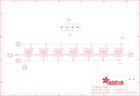

Contents
========

* [PRA2226 > Adafruit NeoPixel Jewel 7](#pra2226--adafruit-neopixel-jewel-7)
	* [Schematic](#schematic)
	* [PCB](#pcb)
	* [Interactive BOM](#interactive-bom)
	* [OOMP Parts](#oomp-parts)
	* [Images](#images)
	* [Tags](#tags)
  
![][im]
# PRA2226 > Adafruit NeoPixel Jewel 7

- ID: PROJ-ADAF-2226-STAN-01
- Hex ID: PRA2226
- Name: Adafruit
- Description: Adafruit
- Long Link: [http://oom.lt/PROJ-ADAF-2226-STAN-01](http://oom.lt/PROJ-ADAF-2226-STAN-01)
- Short Link: [http://oom.lt/PRA2226](http://oom.lt/PRA2226)

## Schematic
  

## PCB
  

## Interactive BOM

- Interactive BOM page: [ibom.html](https://htmlpreview.github.io/?https://github.com/oomlout/oomlout_OOMP_projects/blob/main/PROJ-ADAF-2226-STAN-01/kicad/bom/ibom.html)

## OOMP Parts
  

|OOMP Parts|
| :---: |
|[CAPC-0603-X-UF1-V25  SMD (0603) 1 uF Capacitor (Ceramic) 25v  C1, C2, C6, C10](https://github.com/oomlout/oomlout_OOMP_parts/tree/main/CAPC-0603-X-UF1-V25/)|
|HEAD-I01-X-PI01-01 DIN, DOUT, GND, GND_2, VDD|
|[LEDS-5050-RGB-K2812-01  SMD (5050) Smart Controller (WS2812B) RGB LED  LED1, LED2, LED3, LED4, LED5, LED6, LED7](https://github.com/oomlout/oomlout_OOMP_parts/tree/main/LEDS-5050-RGB-K2812-01/)|
|[RESE-0603-X-O471-01  SMD (0603) 470 Ohm Resistor  R1](https://github.com/oomlout/oomlout_OOMP_parts/tree/main/RESE-0603-X-O471-01/)|

## Images
  
  

|bominteractivefront|bominteractiveback|kicadPcb3d|kicadPcb3dFront|kicadPcb3dBack|eagleImage|eagleSchemImage|pcbdraw|pcbdrawback|
| :---: | :---: | :---: | :---: | :---: | :---: | :---: | :---: | :---: |
||||||||||

## Tags

- hexID: PRA2226
- oompType: PROJ
- oompSize: ADAF
- oompColor: 2226
- oompDesc: STAN
- oompIndex: 01
- oompName: Adafruit NeoPixel Jewel 7
- sources: All source files from https://github.com/adafruit/Adafruit-NeoPixel-Jewel-7 (source licence details in srcLicense.md)
- linkBuyPage: http://www.adafruit.com/products/2226
- oompID: PROJ-ADAF-2226-STAN-01
- oompParts: C1,CAPC-0603-X-UF1-V25
- oompParts: C2,CAPC-0603-X-UF1-V25
- oompParts: C6,CAPC-0603-X-UF1-V25
- oompParts: C10,CAPC-0603-X-UF1-V25
- oompParts: DIN,HEAD-I01-X-PI01-01
- oompParts: DOUT,HEAD-I01-X-PI01-01
- oompParts: GND,HEAD-I01-X-PI01-01
- oompParts: GND_2,HEAD-I01-X-PI01-01
- oompParts: LED1,LEDS-5050-RGB-K2812-01
- oompParts: LED2,LEDS-5050-RGB-K2812-01
- oompParts: LED3,LEDS-5050-RGB-K2812-01
- oompParts: LED4,LEDS-5050-RGB-K2812-01
- oompParts: LED5,LEDS-5050-RGB-K2812-01
- oompParts: LED6,LEDS-5050-RGB-K2812-01
- oompParts: LED7,LEDS-5050-RGB-K2812-01
- oompParts: R1,RESE-0603-X-O471-01
- oompParts: VDD,HEAD-I01-X-PI01-01
- rawParts: C1,1uF,C-EUC0603,C0603,CAPACITOR, European symbol,,
- rawParts: C2,1uF,C-EUC0603,C0603,CAPACITOR, European symbol,,
- rawParts: C6,1uF,C-EUC0603,C0603,CAPACITOR, European symbol,,
- rawParts: C10,1uF,C-EUC0603,C0603,CAPACITOR, European symbol,,
- rawParts: DIN,,PINHD-1X1CB,1X01-CLEANBIG,Pin header 1x1 for 0.1 spacing,,
- rawParts: DOUT,,PINHD-1X1CB,1X01-CLEANBIG,Pin header 1x1 for 0.1 spacing,,
- rawParts: FID1,FIDUCIAL,FIDUCIAL,FIDUCIAL_1MM,Fiducial Alignment Points,EXCLUDE,
- rawParts: FID2,FIDUCIAL,FIDUCIAL,FIDUCIAL_1MM,Fiducial Alignment Points,EXCLUDE,
- rawParts: GND,,PINHD-1X1CB,1X01-CLEANBIG,Pin header 1x1 for 0.1 spacing,,
- rawParts: GND_2,,PINHD-1X1CB,1X01-CLEANBIG,Pin header 1x1 for 0.1 spacing,,
- rawParts: LED1,WS2812B5050,WS2812B5050,WS2812B,,,
- rawParts: LED2,WS2812B5050,WS2812B5050,WS2812B,,,
- rawParts: LED3,WS2812B5050,WS2812B5050,WS2812B,,,
- rawParts: LED4,WS2812B5050,WS2812B5050,WS2812B,,,
- rawParts: LED5,WS2812B5050,WS2812B5050,WS2812B,,,
- rawParts: LED6,WS2812B5050,WS2812B5050,WS2812B,,,
- rawParts: LED7,WS2812B5050,WS2812B5050,WS2812B,,,
- rawParts: R1,470,RESISTOR_0603_NOOUT,0603-NO,Resistors,,
- rawParts: VDD,,PINHD-1X1CB,1X01-CLEANBIG,Pin header 1x1 for 0.1 spacing,,

[im]: kicadPcb3d_450.png
