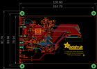
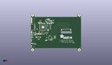
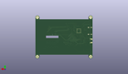
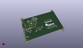

Contents
========

* [PROJ-ADAF-2260-STAN-01>Adafruit 5 HDMI Backpack PCB](#proj-adaf-2260-stan-01adafruit-5-hdmi-backpack-pcb)
	* [Images](#images)
	* [Interactive BOM](#interactive-bom)
	* [OOMP Parts](#oomp-parts)
	* [Tags](#tags)
  
![][im]
# PROJ-ADAF-2260-STAN-01>Adafruit 5 HDMI Backpack PCB

- ID: PROJ-ADAF-2260-STAN-01
- Hex ID: PRA2260
- Name: Adafruit 5 HDMI Backpack PCB
- Description: 

## Images
  
  

|eagleImage|kicadPcb3dFront|kicadPcb3dBack|kicadPcb3d|
| :---: | :---: | :---: | :---: |
|||||

## Interactive BOM

- Interactive BOM page: [ibom.html](kicad/bom/ibom.html)

## OOMP Parts
  

|OOMP Parts|
| :---: |
|UNMATCHED-UNMATCHED-X-UNMATCHED-01, BACKLITEPWM, 1.6, 73.3, 0,BACKLITEPWM, 1X01_SMD_MASKHELD_2X2MM, microbuilder, (1.6, 73.3), R0|
|<table><tr><td></td><td> C1</td><td>[CAPC-0805-X-NF100-V50 SMD (0805) 100 nF Capacitor (Ceramic) 50v](https://github.com/oomlout/oomlout_OOMP_parts/tree/main/CAPC-0805-X-NF100-V50/)</td><td>[C85N100](https://github.com/oomlout/oomlout_OOMP_parts/tree/main/CAPC-0805-X-NF100-V50/)</td></tr></table>|
|<table><tr><td></td><td> C2</td><td>[CAPC-0805-X-NF100-V50 SMD (0805) 100 nF Capacitor (Ceramic) 50v](https://github.com/oomlout/oomlout_OOMP_parts/tree/main/CAPC-0805-X-NF100-V50/)</td><td>[C85N100](https://github.com/oomlout/oomlout_OOMP_parts/tree/main/CAPC-0805-X-NF100-V50/)</td></tr></table>|
|<table><tr><td></td><td> C3</td><td>[CAPC-0805-X-NF100-V50 SMD (0805) 100 nF Capacitor (Ceramic) 50v](https://github.com/oomlout/oomlout_OOMP_parts/tree/main/CAPC-0805-X-NF100-V50/)</td><td>[C85N100](https://github.com/oomlout/oomlout_OOMP_parts/tree/main/CAPC-0805-X-NF100-V50/)</td></tr></table>|
|<table><tr><td></td><td> C4</td><td>[CAPC-0805-X-NF100-V50 SMD (0805) 100 nF Capacitor (Ceramic) 50v](https://github.com/oomlout/oomlout_OOMP_parts/tree/main/CAPC-0805-X-NF100-V50/)</td><td>[C85N100](https://github.com/oomlout/oomlout_OOMP_parts/tree/main/CAPC-0805-X-NF100-V50/)</td></tr></table>|
|<table><tr><td></td><td> C5</td><td>[CAPC-0805-X-NF100-V50 SMD (0805) 100 nF Capacitor (Ceramic) 50v](https://github.com/oomlout/oomlout_OOMP_parts/tree/main/CAPC-0805-X-NF100-V50/)</td><td>[C85N100](https://github.com/oomlout/oomlout_OOMP_parts/tree/main/CAPC-0805-X-NF100-V50/)</td></tr></table>|
|<table><tr><td></td><td> C6</td><td>[CAPC-0805-X-NF100-V50 SMD (0805) 100 nF Capacitor (Ceramic) 50v](https://github.com/oomlout/oomlout_OOMP_parts/tree/main/CAPC-0805-X-NF100-V50/)</td><td>[C85N100](https://github.com/oomlout/oomlout_OOMP_parts/tree/main/CAPC-0805-X-NF100-V50/)</td></tr></table>|
|<table><tr><td></td><td> C7</td><td>[CAPC-0805-X-NF100-V50 SMD (0805) 100 nF Capacitor (Ceramic) 50v](https://github.com/oomlout/oomlout_OOMP_parts/tree/main/CAPC-0805-X-NF100-V50/)</td><td>[C85N100](https://github.com/oomlout/oomlout_OOMP_parts/tree/main/CAPC-0805-X-NF100-V50/)</td></tr></table>|
|<table><tr><td></td><td> C8</td><td>[CAPC-0805-X-NF100-V50 SMD (0805) 100 nF Capacitor (Ceramic) 50v](https://github.com/oomlout/oomlout_OOMP_parts/tree/main/CAPC-0805-X-NF100-V50/)</td><td>[C85N100](https://github.com/oomlout/oomlout_OOMP_parts/tree/main/CAPC-0805-X-NF100-V50/)</td></tr></table>|
|<table><tr><td></td><td> C9</td><td>[CAPC-0805-X-NF100-V50 SMD (0805) 100 nF Capacitor (Ceramic) 50v](https://github.com/oomlout/oomlout_OOMP_parts/tree/main/CAPC-0805-X-NF100-V50/)</td><td>[C85N100](https://github.com/oomlout/oomlout_OOMP_parts/tree/main/CAPC-0805-X-NF100-V50/)</td></tr></table>|
|<table><tr><td></td><td> C10</td><td>[CAPC-0805-X-NF100-V50 SMD (0805) 100 nF Capacitor (Ceramic) 50v](https://github.com/oomlout/oomlout_OOMP_parts/tree/main/CAPC-0805-X-NF100-V50/)</td><td>[C85N100](https://github.com/oomlout/oomlout_OOMP_parts/tree/main/CAPC-0805-X-NF100-V50/)</td></tr></table>|
|<table><tr><td></td><td> C11</td><td>[CAPC-0805-X-NF100-V50 SMD (0805) 100 nF Capacitor (Ceramic) 50v](https://github.com/oomlout/oomlout_OOMP_parts/tree/main/CAPC-0805-X-NF100-V50/)</td><td>[C85N100](https://github.com/oomlout/oomlout_OOMP_parts/tree/main/CAPC-0805-X-NF100-V50/)</td></tr></table>|
|CAPC-0805-X-UNMATCHED-01, C12, 8.609, 32.772, 270,C12, 10uF, 0805-NO, microbuilder, (8.609, 32.772), R270|
|CAPC-0805-X-UNMATCHED-01, C13, 13.9, 26.3, 90,C13, 10uF, 0805-NO, microbuilder, (13.9, 26.3), R90|
|CAPC-0805-X-UNMATCHED-01, C14, 22.9, 26.3, 90,C14, 10uF, 0805-NO, microbuilder, (22.9, 26.3), R90|
|CAPC-0805-X-UNMATCHED-01, C15, 41.2, 42.4, 180,C15, 10uF, 0805-NO, microbuilder, (41.2, 42.4), R180|
|CAPC-0805-X-UNMATCHED-01, C16, 37.65, 64.2, 270,C16, 10uF, 0805-NO, microbuilder, (37.65, 64.2), R270|
|CAPC-0805-X-UNMATCHED-01, C17, 54.0, 61.5, 90,C17, 1uF, 0805-NO, microbuilder, (54, 61.5), R90|
|CAPC-0805-X-UNMATCHED-01, C18, 51.8, 61.5, 90,C18, 1uF, 0805-NO, microbuilder, (51.8, 61.5), R90|
|<table><tr><td></td><td> C19</td><td>[CAPC-0805-X-NF100-V50 SMD (0805) 100 nF Capacitor (Ceramic) 50v](https://github.com/oomlout/oomlout_OOMP_parts/tree/main/CAPC-0805-X-NF100-V50/)</td><td>[C85N100](https://github.com/oomlout/oomlout_OOMP_parts/tree/main/CAPC-0805-X-NF100-V50/)</td></tr></table>|
|<table><tr><td></td><td> C20</td><td>[CAPC-0805-X-NF100-V50 SMD (0805) 100 nF Capacitor (Ceramic) 50v](https://github.com/oomlout/oomlout_OOMP_parts/tree/main/CAPC-0805-X-NF100-V50/)</td><td>[C85N100](https://github.com/oomlout/oomlout_OOMP_parts/tree/main/CAPC-0805-X-NF100-V50/)</td></tr></table>|
|CAPC-0805-X-NF10-01, C21, 57.315, 27.735, 180,C21, 0.01uF, 0805-NO, microbuilder, (57.315, 27.735), R180|
|CAPC-0805-X-NF10-01, C22, 57.315, 23.925, 0,C22, 0.01uF, 0805-NO, microbuilder, (57.315, 23.925), R0|
|<table><tr><td></td><td> C23</td><td>[CAPC-0805-X-NF100-V50 SMD (0805) 100 nF Capacitor (Ceramic) 50v](https://github.com/oomlout/oomlout_OOMP_parts/tree/main/CAPC-0805-X-NF100-V50/)</td><td>[C85N100](https://github.com/oomlout/oomlout_OOMP_parts/tree/main/CAPC-0805-X-NF100-V50/)</td></tr></table>|
|UNMATCHED-UNMATCHED-X-UNMATCHED-01, C24, 9.017, 37.338, 180,C24, 100uF/6V, PANASONIC_C, microbuilder, (9.017, 37.338), R180|
|CAPC-0805-X-UNMATCHED-01, C25, 11.684, 26.416, 90,C25, 1uF, 0805-NO, microbuilder, (11.684, 26.416), R90|
|UNMATCHED-UNMATCHED-X-UNMATCHED-01, D1, 47.3, 59.2, 180,D1, MBR0540, SOD-123, microbuilder, (47.3, 59.2), R180|
|UNMATCHED-UNMATCHED-X-UNMATCHED-01, D2, 48.8, 64.1, 90,D2, MM3Z24VT1G, SMADIODE, microbuilder, (48.8, 64.1), R90|
|UNMATCHED-UNMATCHED-X-UNMATCHED-01, D3, 53.721, 67.691, 180,D3, 1N4148, SOD-323, microbuilder, (53.721, 67.691), R180|
|UNMATCHED-0805-X-UNMATCHED-01, FB1, 15.882, 34.55, 90,FB1, Ferrite, _0805MP, microbuilder, (15.882, 34.55), R90|
|UNMATCHED-0805-X-UNMATCHED-01, FB2, 41.2, 44.073, 180,FB2, Ferrite, _0805MP, microbuilder, (41.2, 44.073), R180|
|UNMATCHED-0805-X-UNMATCHED-01, FB3, 12.536, 34.55, 90,FB3, Ferrite, _0805MP, microbuilder, (12.536, 34.55), R90|
|UNMATCHED-0805-X-UNMATCHED-01, FB4, 14.209, 34.55, 90,FB4, Ferrite, _0805MP, microbuilder, (14.209, 34.55), R90|
|UNMATCHED-0805-X-UNMATCHED-01, FB5, 57.315, 29.64, 0,FB5, Ferrite, _0805MP, microbuilder, (57.315, 29.64), R0|
|UNMATCHED-0805-X-UNMATCHED-01, FB6, 57.315, 25.83, 0,FB6, Ferrite, _0805MP, microbuilder, (57.315, 25.83), R0|
|UNMATCHED-0805-X-UNMATCHED-01, FB7, 48.641, 18.843, 180,FB7, Ferrite, _0805MP, microbuilder, (48.641, 18.843), R180|
|UNMATCHED-0805-X-UNMATCHED-01, FB8, 37.973, 25.493, 0,FB8, Ferrite, _0805MP, microbuilder, (37.973, 25.493), R0|
|UNMATCHED-UNMATCHED-X-UNMATCHED-01, GND, 1.6, 64.9, 0,GND, 1X01_SMD_MASKHELD_2X2MM, microbuilder, (1.6, 64.9), R0|
|UNMATCHED-UNMATCHED-X-UNMATCHED-01, IC1, 46.101, 25.366, 90,IC1, AR1100, TSSOP20-5.3MMBODY, microbuilder, (46.101, 25.366), R90|
|UNMATCHED-UNMATCHED-X-UNMATCHED-01, J1, 120.7, 0.0, M0,J1, TFTLCD-KD50G21-40NT-A1, TFTLCD-KD50G21-40NT-A1, microbuilder, (120.7, 0), MR0|
|UNMATCHED-UNMATCHED-X-UNMATCHED-01, JP3, 1.6, 62.1, 0,JP3, 1X01_SMD_MASKHELD_2X2MM, microbuilder, (1.6, 62.1), R0|
|UNMATCHED-UNMATCHED-X-UNMATCHED-01, JP4, 1.6, 67.7, 0,JP4, 1X01_SMD_MASKHELD_2X2MM, microbuilder, (1.6, 67.7), R0|
|UNMATCHED-UNMATCHED-X-UNMATCHED-01, JP5, 1.6, 70.5, 0,JP5, 1X01_SMD_MASKHELD_2X2MM, microbuilder, (1.6, 70.5), R0|
|UNMATCHED-UNMATCHED-X-UNMATCHED-01, JP6, 1.7, 37.2, 0,JP6, 1X01_SMD_MASKHELD_2X2MM, microbuilder, (1.7, 37.2), R0|
|UNMATCHED-UNMATCHED-X-UNMATCHED-01, JP7, 1.7, 40.0, 0,JP7, 1X01_SMD_MASKHELD_2X2MM, microbuilder, (1.7, 40), R0|
|UNMATCHED-UNMATCHED-X-UNMATCHED-01, L1, 41.5, 60.4, 0,L1, 15uH, INDUCTOR_5X5MM_NR5040_NOTHERMALS, microbuilder, (41.5, 60.4), R0|
|UNMATCHED-UNMATCHED-X-UNMATCHED-01, LED1, 1.0, 2.145, 0,LED1, Red, CHIPLED_0805_NOOUTLINE, microbuilder, (1, 2.145), R0|
|UNMATCHED-UNMATCHED-X-UNMATCHED-01, LED2, 1.1, 21.5, 180,LED2, Green, CHIPLED_0805_NOOUTLINE, microbuilder, (1.1, 21.5), R180|
|UNMATCHED-UNMATCHED-X-UNMATCHED-01, LED3, 1.0, 11.8225, 180,LED3, Blue, CHIPLED_0805_NOOUTLINE, microbuilder, (1, 11.8225), R180|
|UNMATCHED-UNMATCHED-X-UNMATCHED-01, Q1, 7.268, 10.698, 90,Q1, BSS138, SOT23-WIDE, microbuilder, (7.268, 10.698), R90|
|<table><tr><td></td><td> R1</td><td>[RESE-0805-X-O103-01 SMD (0805) 10k Ohm Resistor](https://github.com/oomlout/oomlout_OOMP_parts/tree/main/RESE-0805-X-O103-01/)</td><td>[R85103](https://github.com/oomlout/oomlout_OOMP_parts/tree/main/RESE-0805-X-O103-01/)</td></tr></table>|
|<table><tr><td></td><td> R2</td><td>[RESE-0805-X-O103-01 SMD (0805) 10k Ohm Resistor](https://github.com/oomlout/oomlout_OOMP_parts/tree/main/RESE-0805-X-O103-01/)</td><td>[R85103](https://github.com/oomlout/oomlout_OOMP_parts/tree/main/RESE-0805-X-O103-01/)</td></tr></table>|
|<table><tr><td></td><td> R3</td><td>[RESE-0805-X-O103-01 SMD (0805) 10k Ohm Resistor](https://github.com/oomlout/oomlout_OOMP_parts/tree/main/RESE-0805-X-O103-01/)</td><td>[R85103](https://github.com/oomlout/oomlout_OOMP_parts/tree/main/RESE-0805-X-O103-01/)</td></tr></table>|
|<table><tr><td></td><td> R4</td><td>[RESE-0805-X-O103-01 SMD (0805) 10k Ohm Resistor](https://github.com/oomlout/oomlout_OOMP_parts/tree/main/RESE-0805-X-O103-01/)</td><td>[R85103](https://github.com/oomlout/oomlout_OOMP_parts/tree/main/RESE-0805-X-O103-01/)</td></tr></table>|
|<table><tr><td></td><td> R5</td><td>[RESE-0805-X-O103-01 SMD (0805) 10k Ohm Resistor](https://github.com/oomlout/oomlout_OOMP_parts/tree/main/RESE-0805-X-O103-01/)</td><td>[R85103](https://github.com/oomlout/oomlout_OOMP_parts/tree/main/RESE-0805-X-O103-01/)</td></tr></table>|
|RESE-UNMATCHED-X-UNMATCHED-01, R6, 46.95, 47.1, 270,R6, 33, RESPACK_4X0603, microbuilder, (46.95, 47.1), R270|
|RESE-UNMATCHED-X-UNMATCHED-01, R7, 46.95, 51.2, 270,R7, 33, RESPACK_4X0603, microbuilder, (46.95, 51.2), R270|
|RESE-UNMATCHED-X-UNMATCHED-01, R8, 35.4, 37.05, 180,R8, 33, RESPACK_4X0603, microbuilder, (35.4, 37.05), R180|
|RESE-UNMATCHED-X-UNMATCHED-01, R9, 39.5, 37.05, 180,R9, 33, RESPACK_4X0603, microbuilder, (39.5, 37.05), R180|
|RESE-UNMATCHED-X-UNMATCHED-01, R10, 27.2, 34.3, 180,R10, 33, RESPACK_4X0603, microbuilder, (27.2, 34.3), R180|
|RESE-UNMATCHED-X-UNMATCHED-01, R11, 31.3, 34.3, 180,R11, 33, RESPACK_4X0603, microbuilder, (31.3, 34.3), R180|
|RESE-UNMATCHED-X-UNMATCHED-01, R12, 46.95, 55.3, 270,R12, 33, RESPACK_4X0603, microbuilder, (46.95, 55.3), R270|
|<table><tr><td></td><td> R13</td><td>[RESE-0805-X-O103-01 SMD (0805) 10k Ohm Resistor](https://github.com/oomlout/oomlout_OOMP_parts/tree/main/RESE-0805-X-O103-01/)</td><td>[R85103](https://github.com/oomlout/oomlout_OOMP_parts/tree/main/RESE-0805-X-O103-01/)</td></tr></table>|
|RESE-0805-X-UNMATCHED-01, R14, 1.223, 5.882, 90,R14, 1K, 0805-NO, microbuilder, (1.223, 5.882), R90|
|RESE-0805-X-UNMATCHED-01, R15, 38.227, 69.596, 180,R15, 12, 0805-NO, microbuilder, (38.227, 69.596), R180|
|RESE-0805-X-UNMATCHED-01, R16, 44.954, 69.728, 90,R16, 12, 0805-NO, microbuilder, (44.954, 69.728), R90|
|<table><tr><td></td><td> R18</td><td>[RESE-0805-X-O103-01 SMD (0805) 10k Ohm Resistor](https://github.com/oomlout/oomlout_OOMP_parts/tree/main/RESE-0805-X-O103-01/)</td><td>[R85103](https://github.com/oomlout/oomlout_OOMP_parts/tree/main/RESE-0805-X-O103-01/)</td></tr></table>|
|RESE-0805-X-UNMATCHED-01, R19, 1.1, 17.7, 270,R19, 1K, 0805-NO, microbuilder, (1.1, 17.7), R270|
|RESE-0805-X-UNMATCHED-01, R20, 3.6775, 10.698, 0,R20, 1K, 0805-NO, microbuilder, (3.6775, 10.698), R0|
|RESE-0805-X-UNMATCHED-01, R21, 10.957, 9.771, 180,R21, 1K, 0805-NO, microbuilder, (10.957, 9.771), R180|
|UNMATCHED-UNMATCHED-X-UNMATCHED-01, U1, 29.0, 51.0, 0,U1, TFP401, S-PQFP-G100, microbuilder, (29, 51), R0|
|UNMATCHED-UNMATCHED-X-UNMATCHED-01, U2, 23.5, 66.5, 270,U2, 24LC02BT-I/OT, SOT23-5, microbuilder, (23.5, 66.5), R270|
|UNMATCHED-UNMATCHED-X-UNMATCHED-01, U3, 18.4, 24.2, 180,U3, LT1117(3V3), SOT223-R, microbuilder, (18.4, 24.2), R180|
|UNMATCHED-UNMATCHED-X-UNMATCHED-01, U4, 41.4, 66.5, 90,U4, FAN5333BSX, SOT23-5, microbuilder, (41.4, 66.5), R90|
|UNMATCHED-UNMATCHED-X-UNMATCHED-01, X1, 9.25, 51.0, 270,X1, 47151-0001, HDMI_MOLEX_47151-0001_DIMLAYER, microbuilder, (9.25, 51), R270|
|UNMATCHED-UNMATCHED-X-UNMATCHED-01, X2, 3.75, 29.6, 270,X2, MicroUSB, 4UCONN_20329, microbuilder, (3.75, 29.6), R270|
|UNMATCHED-UNMATCHED-X-UNMATCHED-01, Y1, 52.186, 22.408, 90,Y1, 12MHz, RESONATOR-SMD, SparkFun, (52.186, 22.408), R90|

## Tags

- hexID: PRA2260
- oompType: PROJ
- oompSize: ADAF
- oompColor: 2260
- oompDesc: STAN
- oompIndex: 01
- oompName: Adafruit 5 HDMI Backpack PCB
- sources: All source files from https://github.com/adafruit/Adafruit-5-HDMI-Backpack-PCB (source licence details in srcLicense.md)
- linkBuyPage: http://www.adafruit.com/products/2260
- oompPart: UNMATCHED-UNMATCHED-X-UNMATCHED-01, BACKLITEPWM, 1.6, 73.3, 0
- oompPart: CAPC-0805-X-NF100-V50, C1, 48.641, 20.821, 0
- oompPart: CAPC-0805-X-NF100-V50, C2, 26.3, 39.0, 270
- oompPart: CAPC-0805-X-NF100-V50, C3, 27.05, 60.8, 180
- oompPart: CAPC-0805-X-NF100-V50, C4, 43.561, 20.821, 0
- oompPart: CAPC-0805-X-NF100-V50, C5, 41.2, 45.873, 0
- oompPart: CAPC-0805-X-NF100-V50, C6, 40.8, 54.0, 90
- oompPart: CAPC-0805-X-NF100-V50, C7, 31.75, 60.8, 180
- oompPart: CAPC-0805-X-NF100-V50, C8, 20.25, 59.25, 0
- oompPart: CAPC-0805-X-NF100-V50, C9, 10.509, 32.772, 270
- oompPart: CAPC-0805-X-NF100-V50, C10, 20.0, 38.75, 270
- oompPart: CAPC-0805-X-NF100-V50, C11, 14.5, 46.25, 270
- oompPart: CAPC-0805-X-UNMATCHED-01, C12, 8.609, 32.772, 270
- oompPart: CAPC-0805-X-UNMATCHED-01, C13, 13.9, 26.3, 90
- oompPart: CAPC-0805-X-UNMATCHED-01, C14, 22.9, 26.3, 90
- oompPart: CAPC-0805-X-UNMATCHED-01, C15, 41.2, 42.4, 180
- oompPart: CAPC-0805-X-UNMATCHED-01, C16, 37.65, 64.2, 270
- oompPart: CAPC-0805-X-UNMATCHED-01, C17, 54.0, 61.5, 90
- oompPart: CAPC-0805-X-UNMATCHED-01, C18, 51.8, 61.5, 90
- oompPart: CAPC-0805-X-NF100-V50, C19, 45.0, 66.1, 270
- oompPart: CAPC-0805-X-NF100-V50, C20, 24.3, 61.9, 270
- oompPart: CAPC-0805-X-NF10-01, C21, 57.315, 27.735, 180
- oompPart: CAPC-0805-X-NF10-01, C22, 57.315, 23.925, 0
- oompPart: CAPC-0805-X-NF100-V50, C23, 34.983, 18.473, 270
- oompPart: UNMATCHED-UNMATCHED-X-UNMATCHED-01, C24, 9.017, 37.338, 180
- oompPart: CAPC-0805-X-UNMATCHED-01, C25, 11.684, 26.416, 90
- oompPart: UNMATCHED-UNMATCHED-X-UNMATCHED-01, D1, 47.3, 59.2, 180
- oompPart: UNMATCHED-UNMATCHED-X-UNMATCHED-01, D2, 48.8, 64.1, 90
- oompPart: UNMATCHED-UNMATCHED-X-UNMATCHED-01, D3, 53.721, 67.691, 180
- oompPart: UNMATCHED-0805-X-UNMATCHED-01, FB1, 15.882, 34.55, 90
- oompPart: UNMATCHED-0805-X-UNMATCHED-01, FB2, 41.2, 44.073, 180
- oompPart: UNMATCHED-0805-X-UNMATCHED-01, FB3, 12.536, 34.55, 90
- oompPart: UNMATCHED-0805-X-UNMATCHED-01, FB4, 14.209, 34.55, 90
- oompPart: UNMATCHED-0805-X-UNMATCHED-01, FB5, 57.315, 29.64, 0
- oompPart: UNMATCHED-0805-X-UNMATCHED-01, FB6, 57.315, 25.83, 0
- oompPart: UNMATCHED-0805-X-UNMATCHED-01, FB7, 48.641, 18.843, 180
- oompPart: UNMATCHED-0805-X-UNMATCHED-01, FB8, 37.973, 25.493, 0
- oompPart: SKIP-UNMATCHED-X-UNMATCHED-01, FID1, 36.3, 61.2, 0
- oompPart: SKIP-UNMATCHED-X-UNMATCHED-01, FID2, 37.98, 32.45, 0
- oompPart: SKIP-UNMATCHED-X-UNMATCHED-01, FID3, 118.63, 2.154, 0
- oompPart: SKIP-UNMATCHED-X-UNMATCHED-01, FID4, 9.398, 71.755, 0
- oompPart: SKIP-UNMATCHED-X-UNMATCHED-01, FID5, 7.239, 3.175, 0
- oompPart: SKIP-UNMATCHED-X-UNMATCHED-01, FID6, 118.618, 74.041, 0
- oompPart: UNMATCHED-UNMATCHED-X-UNMATCHED-01, GND, 1.6, 64.9, 0
- oompPart: UNMATCHED-UNMATCHED-X-UNMATCHED-01, IC1, 46.101, 25.366, 90
- oompPart: UNMATCHED-UNMATCHED-X-UNMATCHED-01, J1, 120.7, 0.0, M0
- oompPart: UNMATCHED-UNMATCHED-X-UNMATCHED-01, JP3, 1.6, 62.1, 0
- oompPart: UNMATCHED-UNMATCHED-X-UNMATCHED-01, JP4, 1.6, 67.7, 0
- oompPart: UNMATCHED-UNMATCHED-X-UNMATCHED-01, JP5, 1.6, 70.5, 0
- oompPart: UNMATCHED-UNMATCHED-X-UNMATCHED-01, JP6, 1.7, 37.2, 0
- oompPart: UNMATCHED-UNMATCHED-X-UNMATCHED-01, JP7, 1.7, 40.0, 0
- oompPart: UNMATCHED-UNMATCHED-X-UNMATCHED-01, L1, 41.5, 60.4, 0
- oompPart: UNMATCHED-UNMATCHED-X-UNMATCHED-01, LED1, 1.0, 2.145, 0
- oompPart: UNMATCHED-UNMATCHED-X-UNMATCHED-01, LED2, 1.1, 21.5, 180
- oompPart: UNMATCHED-UNMATCHED-X-UNMATCHED-01, LED3, 1.0, 11.8225, 180
- oompPart: UNMATCHED-UNMATCHED-X-UNMATCHED-01, Q1, 7.268, 10.698, 90
- oompPart: RESE-0805-X-O103-01, R1, 17.7, 61.9, 270
- oompPart: RESE-0805-X-O103-01, R2, 19.915, 34.411, 270
- oompPart: RESE-0805-X-O103-01, R3, 19.9, 61.9, 270
- oompPart: RESE-0805-X-O103-01, R4, 22.1, 61.9, 270
- oompPart: RESE-0805-X-O103-01, R5, 21.619, 34.423, 90
- oompPart: RESE-UNMATCHED-X-UNMATCHED-01, R6, 46.95, 47.1, 270
- oompPart: RESE-UNMATCHED-X-UNMATCHED-01, R7, 46.95, 51.2, 270
- oompPart: RESE-UNMATCHED-X-UNMATCHED-01, R8, 35.4, 37.05, 180
- oompPart: RESE-UNMATCHED-X-UNMATCHED-01, R9, 39.5, 37.05, 180
- oompPart: RESE-UNMATCHED-X-UNMATCHED-01, R10, 27.2, 34.3, 180
- oompPart: RESE-UNMATCHED-X-UNMATCHED-01, R11, 31.3, 34.3, 180
- oompPart: RESE-UNMATCHED-X-UNMATCHED-01, R12, 46.95, 55.3, 270
- oompPart: RESE-0805-X-O103-01, R13, 45.441, 29.811, 180
- oompPart: RESE-0805-X-UNMATCHED-01, R14, 1.223, 5.882, 90
- oompPart: RESE-0805-X-UNMATCHED-01, R15, 38.227, 69.596, 180
- oompPart: RESE-0805-X-UNMATCHED-01, R16, 44.954, 69.728, 90
- oompPart: RESE-0805-X-O103-01, R18, 35.3, 66.1, 90
- oompPart: RESE-0805-X-UNMATCHED-01, R19, 1.1, 17.7, 270
- oompPart: RESE-0805-X-UNMATCHED-01, R20, 3.6775, 10.698, 0
- oompPart: RESE-0805-X-UNMATCHED-01, R21, 10.957, 9.771, 180
- oompPart: SKIP-UNMATCHED-X-UNMATCHED-01, SJ1, 17.838, 34.465, 90
- oompPart: SKIP-UNMATCHED-X-UNMATCHED-01, SJ2, 23.501, 34.496, 90
- oompPart: SKIP-UNMATCHED-X-UNMATCHED-01, SJ3, 41.91, 69.596, 0
- oompPart: SKIP-UNMATCHED-X-UNMATCHED-01, SJ4, 37.846, 19.304, 0
- oompPart: SKIP-UNMATCHED-X-UNMATCHED-01, U$31, 4.0, 79.8, 0
- oompPart: SKIP-UNMATCHED-X-UNMATCHED-01, U$32, 116.7, 79.8, 0
- oompPart: SKIP-UNMATCHED-X-UNMATCHED-01, U$33, 116.7, -4.0, 0
- oompPart: SKIP-UNMATCHED-X-UNMATCHED-01, U$34, 4.0, -4.0, 0
- oompPart: UNMATCHED-UNMATCHED-X-UNMATCHED-01, U1, 29.0, 51.0, 0
- oompPart: UNMATCHED-UNMATCHED-X-UNMATCHED-01, U2, 23.5, 66.5, 270
- oompPart: UNMATCHED-UNMATCHED-X-UNMATCHED-01, U3, 18.4, 24.2, 180
- oompPart: UNMATCHED-UNMATCHED-X-UNMATCHED-01, U4, 41.4, 66.5, 90
- oompPart: UNMATCHED-UNMATCHED-X-UNMATCHED-01, X1, 9.25, 51.0, 270
- oompPart: UNMATCHED-UNMATCHED-X-UNMATCHED-01, X2, 3.75, 29.6, 270
- oompPart: UNMATCHED-UNMATCHED-X-UNMATCHED-01, Y1, 52.186, 22.408, 90
- rawPart: BACKLITEPWM, 1X01_SMD_MASKHELD_2X2MM, microbuilder, (1.6, 73.3), R0
- rawPart: C1, 0.1uF, 0805-NO, microbuilder, (48.641, 20.821), R0
- rawPart: C2, 0.1uF, 0805-NO, microbuilder, (26.3, 39), R270
- rawPart: C3, 0.1uF, 0805-NO, microbuilder, (27.05, 60.8), R180
- rawPart: C4, 0.1uF, _0805MP, microbuilder, (43.561, 20.821), R0
- rawPart: C5, 0.1u, 0805-NO, microbuilder, (41.2, 45.873), R0
- rawPart: C6, 0.1uF, _0805MP, microbuilder, (40.8, 54), R90
- rawPart: C7, 0.1uF, 0805-NO, microbuilder, (31.75, 60.8), R180
- rawPart: C8, 0.1uF, 0805-NO, microbuilder, (20.25, 59.25), R0
- rawPart: C9, 0.1uF, 0805-NO, microbuilder, (10.509, 32.772), R270
- rawPart: C10, 0.1uF, 0805-NO, microbuilder, (20, 38.75), R270
- rawPart: C11, 0.1uF, 0805-NO, microbuilder, (14.5, 46.25), R270
- rawPart: C12, 10uF, 0805-NO, microbuilder, (8.609, 32.772), R270
- rawPart: C13, 10uF, 0805-NO, microbuilder, (13.9, 26.3), R90
- rawPart: C14, 10uF, 0805-NO, microbuilder, (22.9, 26.3), R90
- rawPart: C15, 10uF, 0805-NO, microbuilder, (41.2, 42.4), R180
- rawPart: C16, 10uF, 0805-NO, microbuilder, (37.65, 64.2), R270
- rawPart: C17, 1uF, 0805-NO, microbuilder, (54, 61.5), R90
- rawPart: C18, 1uF, 0805-NO, microbuilder, (51.8, 61.5), R90
- rawPart: C19, 0.1uF, 0805-NO, microbuilder, (45, 66.1), R270
- rawPart: C20, 0.1uF, 0805-NO, microbuilder, (24.3, 61.9), R270
- rawPart: C21, 0.01uF, 0805-NO, microbuilder, (57.315, 27.735), R180
- rawPart: C22, 0.01uF, 0805-NO, microbuilder, (57.315, 23.925), R0
- rawPart: C23, 0.1uF, 0805-NO, microbuilder, (34.983, 18.473), R270
- rawPart: C24, 100uF/6V, PANASONIC_C, microbuilder, (9.017, 37.338), R180
- rawPart: C25, 1uF, 0805-NO, microbuilder, (11.684, 26.416), R90
- rawPart: D1, MBR0540, SOD-123, microbuilder, (47.3, 59.2), R180
- rawPart: D2, MM3Z24VT1G, SMADIODE, microbuilder, (48.8, 64.1), R90
- rawPart: D3, 1N4148, SOD-323, microbuilder, (53.721, 67.691), R180
- rawPart: FB1, Ferrite, _0805MP, microbuilder, (15.882, 34.55), R90
- rawPart: FB2, Ferrite, _0805MP, microbuilder, (41.2, 44.073), R180
- rawPart: FB3, Ferrite, _0805MP, microbuilder, (12.536, 34.55), R90
- rawPart: FB4, Ferrite, _0805MP, microbuilder, (14.209, 34.55), R90
- rawPart: FB5, Ferrite, _0805MP, microbuilder, (57.315, 29.64), R0
- rawPart: FB6, Ferrite, _0805MP, microbuilder, (57.315, 25.83), R0
- rawPart: FB7, Ferrite, _0805MP, microbuilder, (48.641, 18.843), R180
- rawPart: FB8, Ferrite, _0805MP, microbuilder, (37.973, 25.493), R0
- rawPart: FID1, FIDUCIAL, FIDUCIAL_1MM, microbuilder, (36.3, 61.2), R0
- rawPart: FID2, FIDUCIAL, FIDUCIAL_1MM, microbuilder, (37.98, 32.45), R0
- rawPart: FID3, FIDUCIAL, FIDUCIAL_1MM, microbuilder, (118.63, 2.154), R0
- rawPart: FID4, FIDUCIAL, FIDUCIAL_1MM, microbuilder, (9.398, 71.755), R0
- rawPart: FID5, FIDUCIAL, FIDUCIAL_1MM, microbuilder, (7.239, 3.175), R0
- rawPart: FID6, FIDUCIAL, FIDUCIAL_1MM, microbuilder, (118.618, 74.041), R0
- rawPart: GND, 1X01_SMD_MASKHELD_2X2MM, microbuilder, (1.6, 64.9), R0
- rawPart: IC1, AR1100, TSSOP20-5.3MMBODY, microbuilder, (46.101, 25.366), R90
- rawPart: J1, TFTLCD-KD50G21-40NT-A1, TFTLCD-KD50G21-40NT-A1, microbuilder, (120.7, 0), MR0
- rawPart: JP3, 1X01_SMD_MASKHELD_2X2MM, microbuilder, (1.6, 62.1), R0
- rawPart: JP4, 1X01_SMD_MASKHELD_2X2MM, microbuilder, (1.6, 67.7), R0
- rawPart: JP5, 1X01_SMD_MASKHELD_2X2MM, microbuilder, (1.6, 70.5), R0
- rawPart: JP6, 1X01_SMD_MASKHELD_2X2MM, microbuilder, (1.7, 37.2), R0
- rawPart: JP7, 1X01_SMD_MASKHELD_2X2MM, microbuilder, (1.7, 40), R0
- rawPart: L1, 15uH, INDUCTOR_5X5MM_NR5040_NOTHERMALS, microbuilder, (41.5, 60.4), R0
- rawPart: LED1, Red, CHIPLED_0805_NOOUTLINE, microbuilder, (1, 2.145), R0
- rawPart: LED2, Green, CHIPLED_0805_NOOUTLINE, microbuilder, (1.1, 21.5), R180
- rawPart: LED3, Blue, CHIPLED_0805_NOOUTLINE, microbuilder, (1, 11.8225), R180
- rawPart: Q1, BSS138, SOT23-WIDE, microbuilder, (7.268, 10.698), R90
- rawPart: R1, 10K, 0805-NO, microbuilder, (17.7, 61.9), R270
- rawPart: R2, 10K, _0805MP, microbuilder, (19.915, 34.411), R270
- rawPart: R3, 10K, 0805-NO, microbuilder, (19.9, 61.9), R270
- rawPart: R4, 10K, 0805-NO, microbuilder, (22.1, 61.9), R270
- rawPart: R5, 10K, _0805MP, microbuilder, (21.619, 34.423), R90
- rawPart: R6, 33, RESPACK_4X0603, microbuilder, (46.95, 47.1), R270
- rawPart: R7, 33, RESPACK_4X0603, microbuilder, (46.95, 51.2), R270
- rawPart: R8, 33, RESPACK_4X0603, microbuilder, (35.4, 37.05), R180
- rawPart: R9, 33, RESPACK_4X0603, microbuilder, (39.5, 37.05), R180
- rawPart: R10, 33, RESPACK_4X0603, microbuilder, (27.2, 34.3), R180
- rawPart: R11, 33, RESPACK_4X0603, microbuilder, (31.3, 34.3), R180
- rawPart: R12, 33, RESPACK_4X0603, microbuilder, (46.95, 55.3), R270
- rawPart: R13, 10K, 0805-NO, microbuilder, (45.441, 29.811), R180
- rawPart: R14, 1K, 0805-NO, microbuilder, (1.223, 5.882), R90
- rawPart: R15, 12, 0805-NO, microbuilder, (38.227, 69.596), R180
- rawPart: R16, 12, 0805-NO, microbuilder, (44.954, 69.728), R90
- rawPart: R18, 10K, 0805-NO, microbuilder, (35.3, 66.1), R90
- rawPart: R19, 1K, 0805-NO, microbuilder, (1.1, 17.7), R270
- rawPart: R20, 1K, 0805-NO, microbuilder, (3.6775, 10.698), R0
- rawPart: R21, 1K, 0805-NO, microbuilder, (10.957, 9.771), R180
- rawPart: SJ1, SOLDERJUMPER_ARROW_NOPASTE, microbuilder, (17.838, 34.465), R90
- rawPart: SJ2, SOLDERJUMPER_ARROW_NOPASTE, microbuilder, (23.501, 34.496), R90
- rawPart: SJ3, -25mA, SOLDERJUMPER_CLOSEDWIRE, microbuilder, (41.91, 69.596), R0
- rawPart: SJ4, SOLDERJUMPER_CLOSEDWIRE, microbuilder, (37.846, 19.304), R0
- rawPart: U$31, MOUNTINGHOLE3.0, MOUNTINGHOLE_3.0_PLATED, microbuilder, (4, 79.8), R0
- rawPart: U$32, MOUNTINGHOLE3.0, MOUNTINGHOLE_3.0_PLATED, microbuilder, (116.7, 79.8), R0
- rawPart: U$33, MOUNTINGHOLE3.0, MOUNTINGHOLE_3.0_PLATED, microbuilder, (116.7, -4), R0
- rawPart: U$34, MOUNTINGHOLE3.0, MOUNTINGHOLE_3.0_PLATED, microbuilder, (4, -4), R0
- rawPart: U1, TFP401, S-PQFP-G100, microbuilder, (29, 51), R0
- rawPart: U2, 24LC02BT-I/OT, SOT23-5, microbuilder, (23.5, 66.5), R270
- rawPart: U3, LT1117(3V3), SOT223-R, microbuilder, (18.4, 24.2), R180
- rawPart: U4, FAN5333BSX, SOT23-5, microbuilder, (41.4, 66.5), R90
- rawPart: X1, 47151-0001, HDMI_MOLEX_47151-0001_DIMLAYER, microbuilder, (9.25, 51), R270
- rawPart: X2, MicroUSB, 4UCONN_20329, microbuilder, (3.75, 29.6), R270
- rawPart: Y1, 12MHz, RESONATOR-SMD, SparkFun, (52.186, 22.408), R90
- oompID: PROJ-ADAF-2260-STAN-01

[im]: kicadPcb3d_450.png
