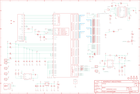

Contents
========

* [PRA2260 > Adafruit 5 HDMI Backpack PCB](#pra2260--adafruit-5-hdmi-backpack-pcb)
	* [Schematic](#schematic)
	* [PCB](#pcb)
	* [Interactive BOM](#interactive-bom)
	* [OOMP Parts](#oomp-parts)
	* [Images](#images)
	* [Tags](#tags)
  
![][im]
# PRA2260 > Adafruit 5 HDMI Backpack PCB

- ID: PROJ-ADAF-2260-STAN-01
- Hex ID: PRA2260
- Name: Adafruit
- Description: Adafruit
- Long Link: [http://oom.lt/PROJ-ADAF-2260-STAN-01](http://oom.lt/PROJ-ADAF-2260-STAN-01)
- Short Link: [http://oom.lt/PRA2260](http://oom.lt/PRA2260)

## Schematic
  

## PCB
  

## Interactive BOM

- Interactive BOM page: [ibom.html](https://htmlpreview.github.io/?https://github.com/oomlout/oomlout_OOMP_projects/blob/main/PROJ-ADAF-2260-STAN-01/kicad/bom/ibom.html)

## OOMP Parts
  

|OOMP Parts|
| :---: |
|HEAD-UNMATCHED-X-PI01-01 BACKLITEPWM, GND, JP3, JP4, JP5, JP6, JP7|
|CAPC-0805-X-UF1D-01 C1, C2, C3, C4, C5, C6, C7, C8, C9, C10, C11, C19, C20, C23|
|[CAPC-0805-X-UF10-V10  SMD (0805) 10 uF Capacitor (Ceramic) 10v  C12, C13, C14, C15, C16](https://github.com/oomlout/oomlout_OOMP_parts/tree/main/CAPC-0805-X-UF10-V10/)|
|[CAPC-0805-X-UF1-V25  SMD (0805) 1 uF Capacitor (Ceramic) 25v  C17, C18, C25](https://github.com/oomlout/oomlout_OOMP_parts/tree/main/CAPC-0805-X-UF1-V25/)|
|CAPC-0805-X-UNMATCHED-01 C21, C22|
|CAPE-PANC-X-UNMATCHED-01 C24|
|DIOD-S123-X-UNMATCHED-01 D1|
|DIOD-UNMATCHED-X-UNMATCHED-01 D2|
|[DIOD-S323-X-K4148-01  SMD (SOD-323) Diode  D3](https://github.com/oomlout/oomlout_OOMP_parts/tree/main/DIOD-S323-X-K4148-01/)|
|FERB-0805-X-UNMATCHED-01 FB1, FB2, FB3, FB4, FB5, FB6, FB7, FB8|
|UNMATCHED-UNMATCHED-X-UNMATCHED-01 IC1, J1, L1, U1, U3, X1, X2, Y1|
|[LEDS-0805-R-STAN-01  SMD (0805) Red LED  LED1](https://github.com/oomlout/oomlout_OOMP_parts/tree/main/LEDS-0805-R-STAN-01/)|
|[LEDS-0805-G-STAN-01  SMD (0805) Green LED  LED2](https://github.com/oomlout/oomlout_OOMP_parts/tree/main/LEDS-0805-G-STAN-01/)|
|[LEDS-0805-L-STAN-01  SMD (0805) Blue LED  LED3](https://github.com/oomlout/oomlout_OOMP_parts/tree/main/LEDS-0805-L-STAN-01/)|
|[MOSN-SO23-X-KBSS138-01  SMD (SOT-23) BSS138 N-Ch. MOSFET  Q1](https://github.com/oomlout/oomlout_OOMP_parts/tree/main/MOSN-SO23-X-KBSS138-01/)|
|[RESE-0805-X-O103-01  SMD (0805) 10k Ohm Resistor  R1, R2, R3, R4, R5, R13, R18](https://github.com/oomlout/oomlout_OOMP_parts/tree/main/RESE-0805-X-O103-01/)|
|RESA-06038-X-O330X4-01 R6, R7, R8, R9, R10, R11, R12|
|[RESE-0805-X-O102-01  SMD (0805) 1k Ohm Resistor  R14, R19, R20, R21](https://github.com/oomlout/oomlout_OOMP_parts/tree/main/RESE-0805-X-O102-01/)|
|RESE-0805-X-O120-01 R15, R16|
|UNMATCHED-SO235-X-UNMATCHED-01 U2, U4|

## Images
  
  

|kicadPcb3d|kicadPcb3dFront|kicadPcb3dBack|eagleImage|eagleSchemImage|
| :---: | :---: | :---: | :---: | :---: |
||||||

## Tags

- hexID: PRA2260
- oompType: PROJ
- oompSize: ADAF
- oompColor: 2260
- oompDesc: STAN
- oompIndex: 01
- oompName: Adafruit 5 HDMI Backpack PCB
- sources: All source files from https://github.com/adafruit/Adafruit-5-HDMI-Backpack-PCB (source licence details in srcLicense.md)
- linkBuyPage: http://www.adafruit.com/products/2260
- oompID: PROJ-ADAF-2260-STAN-01
- oompParts: BACKLITEPWM,HEAD-UNMATCHED-X-PI01-01
- oompParts: C1,CAPC-0805-X-UF1D-01
- oompParts: C2,CAPC-0805-X-UF1D-01
- oompParts: C3,CAPC-0805-X-UF1D-01
- oompParts: C4,CAPC-0805-X-UF1D-01
- oompParts: C5,CAPC-0805-X-UF1D-01
- oompParts: C6,CAPC-0805-X-UF1D-01
- oompParts: C7,CAPC-0805-X-UF1D-01
- oompParts: C8,CAPC-0805-X-UF1D-01
- oompParts: C9,CAPC-0805-X-UF1D-01
- oompParts: C10,CAPC-0805-X-UF1D-01
- oompParts: C11,CAPC-0805-X-UF1D-01
- oompParts: C12,CAPC-0805-X-UF10-V10
- oompParts: C13,CAPC-0805-X-UF10-V10
- oompParts: C14,CAPC-0805-X-UF10-V10
- oompParts: C15,CAPC-0805-X-UF10-V10
- oompParts: C16,CAPC-0805-X-UF10-V10
- oompParts: C17,CAPC-0805-X-UF1-V25
- oompParts: C18,CAPC-0805-X-UF1-V25
- oompParts: C19,CAPC-0805-X-UF1D-01
- oompParts: C20,CAPC-0805-X-UF1D-01
- oompParts: C21,CAPC-0805-X-UNMATCHED-01
- oompParts: C22,CAPC-0805-X-UNMATCHED-01
- oompParts: C23,CAPC-0805-X-UF1D-01
- oompParts: C24,CAPE-PANC-X-UNMATCHED-01
- oompParts: C25,CAPC-0805-X-UF1-V25
- oompParts: D1,DIOD-S123-X-UNMATCHED-01
- oompParts: D2,DIOD-UNMATCHED-X-UNMATCHED-01
- oompParts: D3,DIOD-S323-X-K4148-01
- oompParts: FB1,FERB-0805-X-UNMATCHED-01
- oompParts: FB2,FERB-0805-X-UNMATCHED-01
- oompParts: FB3,FERB-0805-X-UNMATCHED-01
- oompParts: FB4,FERB-0805-X-UNMATCHED-01
- oompParts: FB5,FERB-0805-X-UNMATCHED-01
- oompParts: FB6,FERB-0805-X-UNMATCHED-01
- oompParts: FB7,FERB-0805-X-UNMATCHED-01
- oompParts: FB8,FERB-0805-X-UNMATCHED-01
- oompParts: GND,HEAD-UNMATCHED-X-PI01-01
- oompParts: IC1,UNMATCHED-UNMATCHED-X-UNMATCHED-01
- oompParts: J1,UNMATCHED-UNMATCHED-X-UNMATCHED-01
- oompParts: JP3,HEAD-UNMATCHED-X-PI01-01
- oompParts: JP4,HEAD-UNMATCHED-X-PI01-01
- oompParts: JP5,HEAD-UNMATCHED-X-PI01-01
- oompParts: JP6,HEAD-UNMATCHED-X-PI01-01
- oompParts: JP7,HEAD-UNMATCHED-X-PI01-01
- oompParts: L1,UNMATCHED-UNMATCHED-X-UNMATCHED-01
- oompParts: LED1,LEDS-0805-R-STAN-01
- oompParts: LED2,LEDS-0805-G-STAN-01
- oompParts: LED3,LEDS-0805-L-STAN-01
- oompParts: Q1,MOSN-SO23-X-KBSS138-01
- oompParts: R1,RESE-0805-X-O103-01
- oompParts: R2,RESE-0805-X-O103-01
- oompParts: R3,RESE-0805-X-O103-01
- oompParts: R4,RESE-0805-X-O103-01
- oompParts: R5,RESE-0805-X-O103-01
- oompParts: R6,RESA-06038-X-O330X4-01
- oompParts: R7,RESA-06038-X-O330X4-01
- oompParts: R8,RESA-06038-X-O330X4-01
- oompParts: R9,RESA-06038-X-O330X4-01
- oompParts: R10,RESA-06038-X-O330X4-01
- oompParts: R11,RESA-06038-X-O330X4-01
- oompParts: R12,RESA-06038-X-O330X4-01
- oompParts: R13,RESE-0805-X-O103-01
- oompParts: R14,RESE-0805-X-O102-01
- oompParts: R15,RESE-0805-X-O120-01
- oompParts: R16,RESE-0805-X-O120-01
- oompParts: R18,RESE-0805-X-O103-01
- oompParts: R19,RESE-0805-X-O102-01
- oompParts: R20,RESE-0805-X-O102-01
- oompParts: R21,RESE-0805-X-O102-01
- oompParts: U1,UNMATCHED-UNMATCHED-X-UNMATCHED-01
- oompParts: U2,UNMATCHED-SO235-X-UNMATCHED-01
- oompParts: U3,UNMATCHED-UNMATCHED-X-UNMATCHED-01
- oompParts: U4,UNMATCHED-SO235-X-UNMATCHED-01
- oompParts: X1,UNMATCHED-UNMATCHED-X-UNMATCHED-01
- oompParts: X2,UNMATCHED-UNMATCHED-X-UNMATCHED-01
- oompParts: Y1,UNMATCHED-UNMATCHED-X-UNMATCHED-01
- rawParts: BACKLITEPWM,,HEADER-1X1-SMD_MASKHELD_2X2MM,1X01_SMD_MASKHELD_2X2MM,PIN HEADER,,
- rawParts: C1,0.1uF,CAP_CERAMIC0805-NOOUTLINE,0805-NO,Ceramic Capacitors,,
- rawParts: C2,0.1uF,CAP_CERAMIC0805-NOOUTLINE,0805-NO,Ceramic Capacitors,,
- rawParts: C3,0.1uF,CAP_CERAMIC0805-NOOUTLINE,0805-NO,Ceramic Capacitors,,
- rawParts: C4,0.1uF,CAP_CERAMIC_0805MP,_0805MP,Ceramic Capacitors,,
- rawParts: C5,0.1u,CAP_CERAMIC0805-NOOUTLINE,0805-NO,Ceramic Capacitors,,
- rawParts: C6,0.1uF,CAP_CERAMIC_0805MP,_0805MP,Ceramic Capacitors,,
- rawParts: C7,0.1uF,CAP_CERAMIC0805-NOOUTLINE,0805-NO,Ceramic Capacitors,,
- rawParts: C8,0.1uF,CAP_CERAMIC0805-NOOUTLINE,0805-NO,Ceramic Capacitors,,
- rawParts: C9,0.1uF,CAP_CERAMIC0805-NOOUTLINE,0805-NO,Ceramic Capacitors,,
- rawParts: C10,0.1uF,CAP_CERAMIC0805-NOOUTLINE,0805-NO,Ceramic Capacitors,,
- rawParts: C11,0.1uF,CAP_CERAMIC0805-NOOUTLINE,0805-NO,Ceramic Capacitors,,
- rawParts: C12,10uF,CAP_CERAMIC0805-NOOUTLINE,0805-NO,Ceramic Capacitors,,
- rawParts: C13,10uF,CAP_CERAMIC0805-NOOUTLINE,0805-NO,Ceramic Capacitors,,
- rawParts: C14,10uF,CAP_CERAMIC0805-NOOUTLINE,0805-NO,Ceramic Capacitors,,
- rawParts: C15,10uF,CAP_CERAMIC0805-NOOUTLINE,0805-NO,Ceramic Capacitors,,
- rawParts: C16,10uF,CAP_CERAMIC0805-NOOUTLINE,0805-NO,Ceramic Capacitors,,
- rawParts: C17,1uF,CAP_CERAMIC0805-NOOUTLINE,0805-NO,Ceramic Capacitors,,
- rawParts: C18,1uF,CAP_CERAMIC0805-NOOUTLINE,0805-NO,Ceramic Capacitors,,
- rawParts: C19,0.1uF,CAP_CERAMIC0805-NOOUTLINE,0805-NO,Ceramic Capacitors,,
- rawParts: C20,0.1uF,CAP_CERAMIC0805-NOOUTLINE,0805-NO,Ceramic Capacitors,,
- rawParts: C21,0.01uF,CAP_CERAMIC0805-NOOUTLINE,0805-NO,Ceramic Capacitors,,
- rawParts: C22,0.01uF,CAP_CERAMIC0805-NOOUTLINE,0805-NO,Ceramic Capacitors,,
- rawParts: C23,0.1uF,CAP_CERAMIC0805-NOOUTLINE,0805-NO,Ceramic Capacitors,,
- rawParts: C24,100uF/6V,CAP_ELECTROLYTICPANASONIC_C,PANASONIC_C,Electrolytic Capacitors,,
- rawParts: C25,1uF,CAP_CERAMIC0805-NOOUTLINE,0805-NO,Ceramic Capacitors,,
- rawParts: D1,MBR0540,DIODESOD-123,SOD-123,Diode,,
- rawParts: D2,MM3Z24VT1G,DIODESMA,SMADIODE,Diode,,
- rawParts: D3,1N4148,DIODESOD-323,SOD-323,Diode,,
- rawParts: FB1,Ferrite,FERRITE_0805MP,_0805MP,Ferrite Bead,,
- rawParts: FB2,Ferrite,FERRITE_0805MP,_0805MP,Ferrite Bead,,
- rawParts: FB3,Ferrite,FERRITE_0805MP,_0805MP,Ferrite Bead,,
- rawParts: FB4,Ferrite,FERRITE_0805MP,_0805MP,Ferrite Bead,,
- rawParts: FB5,Ferrite,FERRITE_0805MP,_0805MP,Ferrite Bead,,
- rawParts: FB6,Ferrite,FERRITE_0805MP,_0805MP,Ferrite Bead,,
- rawParts: FB7,Ferrite,FERRITE_0805MP,_0805MP,Ferrite Bead,,
- rawParts: FB8,Ferrite,FERRITE_0805MP,_0805MP,Ferrite Bead,,
- rawParts: FID1,FIDUCIAL,FIDUCIAL,FIDUCIAL_1MM,Fiducial Alignment Points,EXCLUDE,
- rawParts: FID2,FIDUCIAL,FIDUCIAL,FIDUCIAL_1MM,Fiducial Alignment Points,EXCLUDE,
- rawParts: FID3,FIDUCIAL,FIDUCIAL,FIDUCIAL_1MM,Fiducial Alignment Points,EXCLUDE,
- rawParts: FID4,FIDUCIAL,FIDUCIAL,FIDUCIAL_1MM,Fiducial Alignment Points,EXCLUDE,
- rawParts: FID5,FIDUCIAL,FIDUCIAL,FIDUCIAL_1MM,Fiducial Alignment Points,EXCLUDE,
- rawParts: FID6,FIDUCIAL,FIDUCIAL,FIDUCIAL_1MM,Fiducial Alignment Points,EXCLUDE,
- rawParts: GND,,HEADER-1X1-SMD_MASKHELD_2X2MM,1X01_SMD_MASKHELD_2X2MM,PIN HEADER,,
- rawParts: IC1,AR1100,AR1100_SSOP,TSSOP20-5.3MMBODY,,,
- rawParts: J1,TFTLCD-KD50G21-40NT-A1,TFTLCD-KD50G21-40NT-A1,TFTLCD-KD50G21-40NT-A1,OMRON FPC Connector,,
- rawParts: JP3,,HEADER-1X1-SMD_MASKHELD_2X2MM,1X01_SMD_MASKHELD_2X2MM,PIN HEADER,,
- rawParts: JP4,,HEADER-1X1-SMD_MASKHELD_2X2MM,1X01_SMD_MASKHELD_2X2MM,PIN HEADER,,
- rawParts: JP5,,HEADER-1X1-SMD_MASKHELD_2X2MM,1X01_SMD_MASKHELD_2X2MM,PIN HEADER,,
- rawParts: JP6,,HEADER-1X1-SMD_MASKHELD_2X2MM,1X01_SMD_MASKHELD_2X2MM,PIN HEADER,,
- rawParts: JP7,,HEADER-1X1-SMD_MASKHELD_2X2MM,1X01_SMD_MASKHELD_2X2MM,PIN HEADER,,
- rawParts: L1,15uH,INDUCTORNR5040,INDUCTOR_5X5MM_NR5040_NOTHERMALS,Inductors,,
- rawParts: LED1,Red,LED0805_NOOUTLINE,CHIPLED_0805_NOOUTLINE,LED,,
- rawParts: LED2,Green,LED0805_NOOUTLINE,CHIPLED_0805_NOOUTLINE,LED,,
- rawParts: LED3,Blue,LED0805_NOOUTLINE,CHIPLED_0805_NOOUTLINE,LED,,
- rawParts: Q1,BSS138,MOSFET-NWIDE,SOT23-WIDE,N-Channel Mosfet,,
- rawParts: R1,10K,RESISTOR0805_NOOUTLINE,0805-NO,Resistors,,
- rawParts: R2,10K,RESISTOR_0805MP,_0805MP,Resistors,,
- rawParts: R3,10K,RESISTOR0805_NOOUTLINE,0805-NO,Resistors,,
- rawParts: R4,10K,RESISTOR0805_NOOUTLINE,0805-NO,Resistors,,
- rawParts: R5,10K,RESISTOR_0805MP,_0805MP,Resistors,,
- rawParts: R6,33,RESISTOR_4PACK_US,RESPACK_4X0603,Resistor Packs (4 resistors),,
- rawParts: R7,33,RESISTOR_4PACK_US,RESPACK_4X0603,Resistor Packs (4 resistors),,
- rawParts: R8,33,RESISTOR_4PACK_US,RESPACK_4X0603,Resistor Packs (4 resistors),,
- rawParts: R9,33,RESISTOR_4PACK_US,RESPACK_4X0603,Resistor Packs (4 resistors),,
- rawParts: R10,33,RESISTOR_4PACK_US,RESPACK_4X0603,Resistor Packs (4 resistors),,
- rawParts: R11,33,RESISTOR_4PACK_US,RESPACK_4X0603,Resistor Packs (4 resistors),,
- rawParts: R12,33,RESISTOR_4PACK_US,RESPACK_4X0603,Resistor Packs (4 resistors),,
- rawParts: R13,10K,RESISTOR0805_NOOUTLINE,0805-NO,Resistors,,
- rawParts: R14,1K,RESISTOR0805_NOOUTLINE,0805-NO,Resistors,,
- rawParts: R15,12,RESISTOR0805_NOOUTLINE,0805-NO,Resistors,,
- rawParts: R16,12,RESISTOR0805_NOOUTLINE,0805-NO,Resistors,,
- rawParts: R18,10K,RESISTOR0805_NOOUTLINE,0805-NO,Resistors,,
- rawParts: R19,1K,RESISTOR0805_NOOUTLINE,0805-NO,Resistors,,
- rawParts: R20,1K,RESISTOR0805_NOOUTLINE,0805-NO,Resistors,,
- rawParts: R21,1K,RESISTOR0805_NOOUTLINE,0805-NO,Resistors,,
- rawParts: SJ1,,SOLDERJUMPER,SOLDERJUMPER_ARROW_NOPASTE,SMD Solder JUMPER,EXCLUDE,
- rawParts: SJ2,,SOLDERJUMPER,SOLDERJUMPER_ARROW_NOPASTE,SMD Solder JUMPER,EXCLUDE,
- rawParts: SJ3,-25mA,SOLDERJUMPERCLOSED,SOLDERJUMPER_CLOSEDWIRE,SMD Solder JUMPER,,
- rawParts: SJ4,,SOLDERJUMPERCLOSED,SOLDERJUMPER_CLOSEDWIRE,SMD Solder JUMPER,,
- rawParts: U$31,MOUNTINGHOLE3.0,MOUNTINGHOLE3.0,MOUNTINGHOLE_3.0_PLATED,Mounting Hole,EXCLUDE,
- rawParts: U$32,MOUNTINGHOLE3.0,MOUNTINGHOLE3.0,MOUNTINGHOLE_3.0_PLATED,Mounting Hole,EXCLUDE,
- rawParts: U$33,MOUNTINGHOLE3.0,MOUNTINGHOLE3.0,MOUNTINGHOLE_3.0_PLATED,Mounting Hole,EXCLUDE,
- rawParts: U$34,MOUNTINGHOLE3.0,MOUNTINGHOLE3.0,MOUNTINGHOLE_3.0_PLATED,Mounting Hole,EXCLUDE,
- rawParts: U1,TFP401,TFP401,S-PQFP-G100,TFP401 PanelBus Digital Receiver,,
- rawParts: U2,24LC02BT-I/OT,EEPROM_I2C_MCP24AA32,SOT23-5,Microchip 32K (4K x 8) 1.8V I2C EEPROM,,
- rawParts: U3,LT1117(3V3),VREG_SOT223,SOT223-R,SOT-223 Fixed Voltage Regulators,,
- rawParts: U4,FAN5333BSX,VREG_FAN5331,SOT23-5,FAN5331 - LED/OLED 20V Boost Converter,,
- rawParts: X1,47151-0001,HDMI_MOLEX_47151DIM,HDMI_MOLEX_47151-0001_DIMLAYER,The default footprint uses layer 46 (Milling) for the tabs, the DIMLAYER footprint uses layer 20 (Dimensions).  Both will probably require special instructions to the board house,,
- rawParts: X2,MicroUSB,USBMICRO_20329,4UCONN_20329,USB Connectors,,
- rawParts: Y1,12MHz,RESONATORSMD,RESONATOR-SMD,Resonator,,

[im]: kicadPcb3d_450.png
