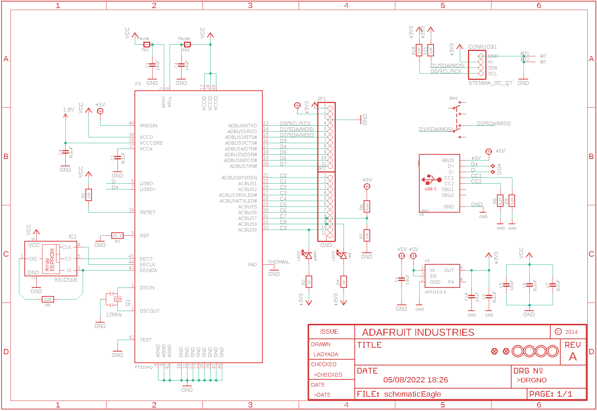
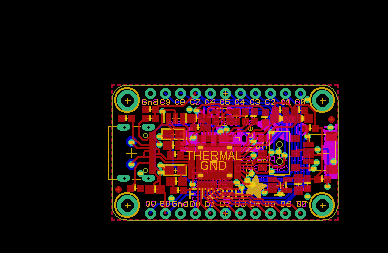
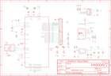

Contents
========

* [PRA2264 > Adafruit FT232H Breakout PCB](#pra2264--adafruit-ft232h-breakout-pcb)
	* [Schematic](#schematic)
	* [PCB](#pcb)
	* [Interactive BOM](#interactive-bom)
	* [OOMP Parts](#oomp-parts)
	* [Images](#images)
	* [Tags](#tags)
  
![][im]
# PRA2264 > Adafruit FT232H Breakout PCB

- ID: PROJ-ADAF-2264-STAN-01
- Hex ID: PRA2264
- Name: Adafruit
- Description: Adafruit
- Long Link: [http://oom.lt/PROJ-ADAF-2264-STAN-01](http://oom.lt/PROJ-ADAF-2264-STAN-01)
- Short Link: [http://oom.lt/PRA2264](http://oom.lt/PRA2264)

## Schematic
  

## PCB
  

## Interactive BOM

- Interactive BOM page: [ibom.html](https://htmlpreview.github.io/?https://github.com/oomlout/oomlout_OOMP_projects/blob/main/PROJ-ADAF-2264-STAN-01/kicad/bom/ibom.html)

## OOMP Parts
  

|OOMP Parts|
| :---: |
|[CAPC-0805-X-UF10-V10  SMD (0805) 10 uF Capacitor (Ceramic) 10v  C1, C3, C4, C5, C10](https://github.com/oomlout/oomlout_OOMP_parts/tree/main/CAPC-0805-X-UF10-V10/)|
|CAPC-0603-X-UF1D-01 C2, C6, C7, C8, C9|
|HEAD-I01-X-UNMATCHED-01 CONN1|
|UNMATCHED-UNMATCHED-X-UNMATCHED-01 D+, D-, IC2, Q1, SW1, X6|
|FERB-0805-X-UNMATCHED-01 FB1, FB2|
|UNMATCHED-SO23-X-UNMATCHED-01 IC1|
|HEAD-I01-X-PI11-01 JP1, JP2|
|[LEDS-0805-G-STAN-01  SMD (0805) Green LED  LED1](https://github.com/oomlout/oomlout_OOMP_parts/tree/main/LEDS-0805-G-STAN-01/)|
|[LEDS-0805-R-STAN-01  SMD (0805) Red LED  LED2](https://github.com/oomlout/oomlout_OOMP_parts/tree/main/LEDS-0805-R-STAN-01/)|
|[RESE-0603-X-O123-01  SMD (0603) 12k Ohm Resistor  R1, R7, R10, R11](https://github.com/oomlout/oomlout_OOMP_parts/tree/main/RESE-0603-X-O123-01/)|
|RESE-0603-X-UNMATCHED-01 R2|
|[RESE-0603-X-O102-01  SMD (0603) 1k Ohm Resistor  R3, R4](https://github.com/oomlout/oomlout_OOMP_parts/tree/main/RESE-0603-X-O102-01/)|
|[RESE-0603-X-O222-01  SMD (0603) 2.2k Ohm Resistor  R5](https://github.com/oomlout/oomlout_OOMP_parts/tree/main/RESE-0603-X-O222-01/)|
|[RESE-0603-X-O472-01  SMD (0603) 4.7k Ohm Resistor  R6, R8, R9](https://github.com/oomlout/oomlout_OOMP_parts/tree/main/RESE-0603-X-O472-01/)|
|UNMATCHED-SO235-X-UNMATCHED-01 U2|

## Images
  
  

|kicadPcb3d|kicadPcb3dFront|kicadPcb3dBack|eagleImage|eagleSchemImage|
| :---: | :---: | :---: | :---: | :---: |
||||||

## Tags

- hexID: PRA2264
- oompType: PROJ
- oompSize: ADAF
- oompColor: 2264
- oompDesc: STAN
- oompIndex: 01
- oompName: Adafruit FT232H Breakout PCB
- sources: All source files from https://github.com/adafruit/Adafruit-FT232H-Breakout-PCB (source licence details in srcLicense.md)
- linkBuyPage: http://www.adafruit.com/products/2264
- oompID: PROJ-ADAF-2264-STAN-01
- oompParts: C1,CAPC-0805-X-UF10-V10
- oompParts: C2,CAPC-0603-X-UF1D-01
- oompParts: C3,CAPC-0805-X-UF10-V10
- oompParts: C4,CAPC-0805-X-UF10-V10
- oompParts: C5,CAPC-0805-X-UF10-V10
- oompParts: C6,CAPC-0603-X-UF1D-01
- oompParts: C7,CAPC-0603-X-UF1D-01
- oompParts: C8,CAPC-0603-X-UF1D-01
- oompParts: C9,CAPC-0603-X-UF1D-01
- oompParts: C10,CAPC-0805-X-UF10-V10
- oompParts: CONN1,HEAD-I01-X-UNMATCHED-01
- oompParts: D+,UNMATCHED-UNMATCHED-X-UNMATCHED-01
- oompParts: D-,UNMATCHED-UNMATCHED-X-UNMATCHED-01
- oompParts: FB1,FERB-0805-X-UNMATCHED-01
- oompParts: FB2,FERB-0805-X-UNMATCHED-01
- oompParts: IC1,UNMATCHED-SO23-X-UNMATCHED-01
- oompParts: IC2,UNMATCHED-UNMATCHED-X-UNMATCHED-01
- oompParts: JP1,HEAD-I01-X-PI11-01
- oompParts: JP2,HEAD-I01-X-PI11-01
- oompParts: LED1,LEDS-0805-G-STAN-01
- oompParts: LED2,LEDS-0805-R-STAN-01
- oompParts: Q1,UNMATCHED-UNMATCHED-X-UNMATCHED-01
- oompParts: R1,RESE-0603-X-O123-01
- oompParts: R2,RESE-0603-X-UNMATCHED-01
- oompParts: R3,RESE-0603-X-O102-01
- oompParts: R4,RESE-0603-X-O102-01
- oompParts: R5,RESE-0603-X-O222-01
- oompParts: R6,RESE-0603-X-O472-01
- oompParts: R7,RESE-0603-X-O123-01
- oompParts: R8,RESE-0603-X-O472-01
- oompParts: R9,RESE-0603-X-O472-01
- oompParts: R10,RESE-0603-X-O123-01
- oompParts: R11,RESE-0603-X-O123-01
- oompParts: SW1,UNMATCHED-UNMATCHED-X-UNMATCHED-01
- oompParts: U2,UNMATCHED-SO235-X-UNMATCHED-01
- oompParts: X6,UNMATCHED-UNMATCHED-X-UNMATCHED-01
- rawParts: C1,10uF,CAP_CERAMIC0805-NOOUTLINE,0805-NO,Ceramic Capacitors,,,,,,,,,
- rawParts: C2,0.1uF,CAP_CERAMIC0603_NO,0603-NO,Ceramic Capacitors,,,,,,,,,
- rawParts: C3,10uF,CAP_CERAMIC0805-NOOUTLINE,0805-NO,Ceramic Capacitors,,,,,,,,,
- rawParts: C4,10uF,CAP_CERAMIC0805-NOOUTLINE,0805-NO,Ceramic Capacitors,,,,,,,,,
- rawParts: C5,10uF,CAP_CERAMIC0805-NOOUTLINE,0805-NO,Ceramic Capacitors,,,,,,,,,
- rawParts: C6,0.1uF,CAP_CERAMIC0603_NO,0603-NO,Ceramic Capacitors,,,,,,,,,
- rawParts: C7,0.1uF,CAP_CERAMIC0603_NO,0603-NO,Ceramic Capacitors,,,,,,,,,
- rawParts: C8,0.1uF,CAP_CERAMIC0603_NO,0603-NO,Ceramic Capacitors,,,,,,,,,
- rawParts: C9,0.1uF,CAP_CERAMIC0603_NO,0603-NO,Ceramic Capacitors,,,,,,,,,
- rawParts: C10,10µF,CAP_CERAMIC0805-NOOUTLINE,0805-NO,Ceramic Capacitors,,,,,,,A,,
- rawParts: CONN1,STEMMA_I2C_QT,STEMMA_I2C_QT,JST_SH4,,,,,,,,,,
- rawParts: D+,TPTP17R,TPTP17R,TP17R,Test pad,,,,,,0,,,
- rawParts: D-,TPTP17R,TPTP17R,TP17R,Test pad,,,,,,0,,,
- rawParts: FB1,Ferrite,FERRITE_0805,_0805,Ferrite Bead,,,,,,,,,
- rawParts: FB2,Ferrite,FERRITE_0805,_0805,Ferrite Bead,,,,,,,,,
- rawParts: FID1,FIDUCIAL,FIDUCIAL,FIDUCIAL_1MM,Fiducial Alignment Points,EXCLUDE,,,,,,,,
- rawParts: FID2,FIDUCIAL,FIDUCIAL,FIDUCIAL_1MM,Fiducial Alignment Points,EXCLUDE,,,,,,,,
- rawParts: IC1,93LC56B,93LC76A,SOT23-6,8K Microwire Compatible Serial EEPROM,,MICROCHIP,93LC76AT-I/OT,1556170,61H6824,,,,
- rawParts: IC2,FT232HQ,FT232HQ,QFN48_8MM,,,,,,,,,,
- rawParts: JP1,,HEADER-1X11,1X11_ROUND,,,,,,,,,,
- rawParts: JP2,,HEADER-1X11,1X11_ROUND,,,,,,,,,,
- rawParts: LED1,green,LED0805_NOOUTLINE,CHIPLED_0805_NOOUTLINE,LED,,,,,,,,,
- rawParts: LED2,red,LED0805_NOOUTLINE,CHIPLED_0805_NOOUTLINE,LED,,,,,,,,,
- rawParts: Q1,12MHz,RESONATORSMD,RESONATOR-SMD,Resonator,,,,,,,,,
- rawParts: R1,12K,RESISTOR_0603_NOOUT,0603-NO,Resistors,,,,,,,,,
- rawParts: R2,12K 1%,RESISTOR_0603_NOOUT,0603-NO,Resistors,,,,,,,,,
- rawParts: R3,1K,RESISTOR_0603_NOOUT,0603-NO,Resistors,,,,,,,,,
- rawParts: R4,1K,RESISTOR_0603_NOOUT,0603-NO,Resistors,,,,,,,,,
- rawParts: R5,2.2K,RESISTOR_0603_NOOUT,0603-NO,Resistors,,,,,,,,,
- rawParts: R6,5.1K,RESISTOR_0603_NOOUT,0603-NO,Resistors,,,,,,,,,
- rawParts: R7,12K,RESISTOR_0603_NOOUT,0603-NO,Resistors,,,,,,,,,
- rawParts: R8,5.1K,RESISTOR_0603_NOOUT,0603-NO,Resistors,,,,,,,,,
- rawParts: R9,5.1K,RESISTOR_0603_NOOUT,0603-NO,Resistors,,,,,,,,,
- rawParts: R10,12K,RESISTOR_0603_NOOUT,0603-NO,Resistors,,,,,,,,,
- rawParts: R11,12K,RESISTOR_0603_NOOUT,0603-NO,Resistors,,,,,,,,,
- rawParts: SW1,,SWITCH_DPDTEG1390,EG1390,Switch - DPDT,,,,,,,,,
- rawParts: U$4,MOUNTINGHOLE2.5,MOUNTINGHOLE2.5,MOUNTINGHOLE_2.5_PLATED,Mounting Hole,EXCLUDE,,,,,,,,
- rawParts: U$5,MOUNTINGHOLE2.5,MOUNTINGHOLE2.5,MOUNTINGHOLE_2.5_PLATED,Mounting Hole,EXCLUDE,,,,,,,,
- rawParts: U$6,MOUNTINGHOLE2.5,MOUNTINGHOLE2.5,MOUNTINGHOLE_2.5_PLATED,Mounting Hole,EXCLUDE,,,,,,D,,
- rawParts: U$7,MOUNTINGHOLE2.5,MOUNTINGHOLE2.5,MOUNTINGHOLE_2.5_PLATED,Mounting Hole,EXCLUDE,,,,,,,,
- rawParts: U2,AP2112-3.3,VREG_SOT23-5,SOT23-5,SOT23-5 Fixed Voltage Regulators,,,,,,,,,
- rawParts: X6,USBC,USB_C,USB_C_CUSB31-CFM2AX-01-X,USB Type-C USB 2.0 Connector,,,,,,,,,

[im]: kicadPcb3d_450.png
