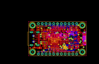
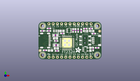
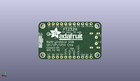
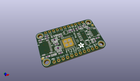

Contents
========

* [PROJ-ADAF-2264-STAN-01>Adafruit FT232H Breakout PCB](#proj-adaf-2264-stan-01adafruit-ft232h-breakout-pcb)
	* [Images](#images)
	* [Interactive BOM](#interactive-bom)
	* [OOMP Parts](#oomp-parts)
	* [Tags](#tags)
  
![][im]
# PROJ-ADAF-2264-STAN-01>Adafruit FT232H Breakout PCB

- ID: PROJ-ADAF-2264-STAN-01
- Hex ID: PRA2264
- Name: Adafruit FT232H Breakout PCB
- Description: 

## Images
  
  

|eagleImage|kicadPcb3dFront|kicadPcb3dBack|kicadPcb3d|
| :---: | :---: | :---: | :---: |
|||||

## Interactive BOM

- Interactive BOM page: [ibom.html](kicad/bom/ibom.html)

## OOMP Parts
  

|OOMP Parts|
| :---: |
|CAPE-0805-X-UNMATCHED-01, C1, 7.238999999999999, 5.334, 180,C1, 10uF, 0805-NO, microbuilder, (0.285, 0.21), R180|
|CAPE-0603-X-NF100-01, C2, 23.9649, 17.5641, 90,C2, 0.1uF, 0603-NO, microbuilder, (0.9435, 0.6915), R90|
|CAPE-0805-X-UNMATCHED-01, C3, 10.287, 12.7, 180,C3, 10uF, 0805-NO, microbuilder, (0.405, 0.5), R180|
|CAPE-0805-X-UNMATCHED-01, C4, 10.795, 6.604, 180,C4, 10uF, 0805-NO, microbuilder, (0.425, 0.26), R180|
|CAPE-0805-X-UNMATCHED-01, C5, 14.224, 17.272000000000002, 180,C5, 10uF, 0805-NO, microbuilder, (0.56, 0.68), R180|
|CAPE-0603-X-NF100-01, C6, 14.477999999999998, 15.748, 180,C6, 0.1uF, 0603-NO, microbuilder, (0.57, 0.62), R180|
|CAPE-0603-X-NF100-01, C7, 11.176, 5.08, 180,C7, 0.1uF, 0603-NO, microbuilder, (0.44, 0.2), R180|
|CAPE-0603-X-NF100-01, C8, 22.4409, 17.5641, 90,C8, 0.1uF, 0603-NO, microbuilder, (0.8835, 0.6915), R90|
|CAPE-0603-X-NF100-01, C9, 33.019999999999996, 6.223, 270,C9, 0.1uF, 0603-NO, microbuilder, (1.3, 0.245), R270|
|CAPE-0805-X-UNMATCHED-01, C10, 31.369, 6.095999999999999, 270,C10, 10uF, 0805-NO, microbuilder, (1.235, 0.24), R270|
|UNMATCHED-UNMATCHED-X-UNMATCHED-01, CONN1, 35.559999999999995, 11.43, 90,CONN1, STEMMA_I2C_QT, JST_SH4, microbuilder, (1.4, 0.45), R90|
|UNMATCHED-UNMATCHED-X-UNMATCHED-01, D+, 3.175, 9.524999999999999, M0,D+, TPTP17R, TP17R, testpad, (0.125, 0.375), MR0|
|UNMATCHED-UNMATCHED-X-UNMATCHED-01, D-, 3.175, 13.334999999999999, M0,D-, TPTP17R, TP17R, testpad, (0.125, 0.525), MR0|
|UNMATCHED-0805-X-UNMATCHED-01, FB1, 10.287, 14.604999999999999, 180,FB1, Ferrite, _0805, microbuilder, (0.405, 0.575), R180|
|UNMATCHED-0805-X-UNMATCHED-01, FB2, 10.668, 8.509, 0,FB2, Ferrite, _0805, microbuilder, (0.42, 0.335), R0|
|UNMATCHED-UNMATCHED-X-UNMATCHED-01, IC1, 18.536393712, 17.507946949999997, 90,IC1, 93LC56B, SOT23-6, microchip, (0.72977928, 0.68928925), R90|
|UNMATCHED-UNMATCHED-X-UNMATCHED-01, IC2, 17.272000000000002, 10.033, 0,IC2, FT232HQ, QFN48_8MM, microbuilder, (0.68, 0.395), R0|
|UNMATCHED-UNMATCHED-X-UNMATCHED-01, JP1, 19.049999999999997, 1.27, 0,JP1, 1X11_ROUND, microbuilder, (0.75, 0.05), R0|
|UNMATCHED-UNMATCHED-X-UNMATCHED-01, JP2, 19.049999999999997, 21.59, 180,JP2, 1X11_ROUND, microbuilder, (0.75, 0.85), R180|
|UNMATCHED-UNMATCHED-X-UNMATCHED-01, LED1, 28.448, 17.272000000000002, 90,LED1, green, CHIPLED_0805_NOOUTLINE, microbuilder, (1.12, 0.68), R90|
|UNMATCHED-UNMATCHED-X-UNMATCHED-01, LED2, 32.13099999999999, 17.272000000000002, 90,LED2, red, CHIPLED_0805_NOOUTLINE, microbuilder, (1.265, 0.68), R90|
|UNMATCHED-UNMATCHED-X-UNMATCHED-01, Q1, 10.668, 17.272000000000002, 180,Q1, 12MHz, RESONATOR-SMD, SparkFun, (0.42, 0.68), R180|
|<table><tr><td></td><td> R1</td><td>[RESE-0603-X-O123-01 SMD (0603) 12k Ohm Resistor](https://github.com/oomlout/oomlout_OOMP_parts/tree/main/RESE-0603-X-O123-01/)</td><td>[R6123](https://github.com/oomlout/oomlout_OOMP_parts/tree/main/RESE-0603-X-O123-01/)</td></tr></table>|
|ERROR, R2 12K 1%, 0, 0, 0,R2, 12K, 1%, 0603-NO, microbuilder, (0.42, 0.44), R180|
|RESE-0603-X-UNMATCHED-01, R3, 28.320999999999998, 18.668999999999997, 0,R3, 1K, 0603-NO, microbuilder, (1.115, 0.735), R0|
|RESE-0603-X-UNMATCHED-01, R4, 31.623, 18.668999999999997, 0,R4, 1K, 0603-NO, microbuilder, (1.245, 0.735), R0|
|RESE-0603-X-UNMATCHED-01, R5, 20.922312486, 17.562296854, 270,R5, 2.2K, 0603-NO, microbuilder, (0.82371309, 0.69142901), R270|
|RESE-0603-X-UNMATCHED-01, R6, 6.35, 17.272000000000002, 180,R6, 5.1K, 0603-NO, microbuilder, (0.25, 0.68), R180|
|<table><tr><td></td><td> R7</td><td>[RESE-0603-X-O123-01 SMD (0603) 12k Ohm Resistor](https://github.com/oomlout/oomlout_OOMP_parts/tree/main/RESE-0603-X-O123-01/)</td><td>[R6123](https://github.com/oomlout/oomlout_OOMP_parts/tree/main/RESE-0603-X-O123-01/)</td></tr></table>|
|RESE-0603-X-UNMATCHED-01, R8, 3.937, 5.460999999999999, 180,R8, 5.1K, 0603-NO, microbuilder, (0.155, 0.215), R180|
|RESE-0603-X-UNMATCHED-01, R9, 2.2859999999999996, 17.272000000000002, 0,R9, 5.1K, 0603-NO, microbuilder, (0.09, 0.68), R0|
|<table><tr><td></td><td> R10</td><td>[RESE-0603-X-O123-01 SMD (0603) 12k Ohm Resistor](https://github.com/oomlout/oomlout_OOMP_parts/tree/main/RESE-0603-X-O123-01/)</td><td>[R6123](https://github.com/oomlout/oomlout_OOMP_parts/tree/main/RESE-0603-X-O123-01/)</td></tr></table>|
|<table><tr><td></td><td> R11</td><td>[RESE-0603-X-O123-01 SMD (0603) 12k Ohm Resistor](https://github.com/oomlout/oomlout_OOMP_parts/tree/main/RESE-0603-X-O123-01/)</td><td>[R6123](https://github.com/oomlout/oomlout_OOMP_parts/tree/main/RESE-0603-X-O123-01/)</td></tr></table>|
|UNMATCHED-UNMATCHED-X-UNMATCHED-01, SW1, 28.194000000000003, 11.43, 90,SW1, EG1390, microbuilder, (1.11, 0.45), R90|
|UNMATCHED-UNMATCHED-X-UNMATCHED-01, U2, 28.320999999999998, 5.968999999999999, 270,U2, AP2112-3.3, SOT23-5, microbuilder, (1.115, 0.235), R270|
|UNMATCHED-UNMATCHED-X-UNMATCHED-01, X6, 3.175, 11.43, 270,X6, USBC, USB_C_CUSB31-CFM2AX-01-X, microbuilder, (0.125, 0.45), R270|

## Tags

- hexID: PRA2264
- oompType: PROJ
- oompSize: ADAF
- oompColor: 2264
- oompDesc: STAN
- oompIndex: 01
- oompName: Adafruit FT232H Breakout PCB
- sources: All source files from https://github.com/adafruit/Adafruit-FT232H-Breakout-PCB (source licence details in srcLicense.md)
- linkBuyPage: http://www.adafruit.com/products/2264
- oompPart: CAPE-0805-X-UNMATCHED-01, C1, 7.238999999999999, 5.334, 180
- oompPart: CAPE-0603-X-NF100-01, C2, 23.9649, 17.5641, 90
- oompPart: CAPE-0805-X-UNMATCHED-01, C3, 10.287, 12.7, 180
- oompPart: CAPE-0805-X-UNMATCHED-01, C4, 10.795, 6.604, 180
- oompPart: CAPE-0805-X-UNMATCHED-01, C5, 14.224, 17.272000000000002, 180
- oompPart: CAPE-0603-X-NF100-01, C6, 14.477999999999998, 15.748, 180
- oompPart: CAPE-0603-X-NF100-01, C7, 11.176, 5.08, 180
- oompPart: CAPE-0603-X-NF100-01, C8, 22.4409, 17.5641, 90
- oompPart: CAPE-0603-X-NF100-01, C9, 33.019999999999996, 6.223, 270
- oompPart: CAPE-0805-X-UNMATCHED-01, C10, 31.369, 6.095999999999999, 270
- oompPart: UNMATCHED-UNMATCHED-X-UNMATCHED-01, CONN1, 35.559999999999995, 11.43, 90
- oompPart: UNMATCHED-UNMATCHED-X-UNMATCHED-01, D+, 3.175, 9.524999999999999, M0
- oompPart: UNMATCHED-UNMATCHED-X-UNMATCHED-01, D-, 3.175, 13.334999999999999, M0
- oompPart: UNMATCHED-0805-X-UNMATCHED-01, FB1, 10.287, 14.604999999999999, 180
- oompPart: UNMATCHED-0805-X-UNMATCHED-01, FB2, 10.668, 8.509, 0
- oompPart: SKIP-UNMATCHED-X-UNMATCHED-01, FID1, 0.9652, 5.2578, 0
- oompPart: SKIP-UNMATCHED-X-UNMATCHED-01, FID2, 36.957, 17.145, 0
- oompPart: UNMATCHED-UNMATCHED-X-UNMATCHED-01, IC1, 18.536393712, 17.507946949999997, 90
- oompPart: UNMATCHED-UNMATCHED-X-UNMATCHED-01, IC2, 17.272000000000002, 10.033, 0
- oompPart: UNMATCHED-UNMATCHED-X-UNMATCHED-01, JP1, 19.049999999999997, 1.27, 0
- oompPart: UNMATCHED-UNMATCHED-X-UNMATCHED-01, JP2, 19.049999999999997, 21.59, 180
- oompPart: UNMATCHED-UNMATCHED-X-UNMATCHED-01, LED1, 28.448, 17.272000000000002, 90
- oompPart: UNMATCHED-UNMATCHED-X-UNMATCHED-01, LED2, 32.13099999999999, 17.272000000000002, 90
- oompPart: UNMATCHED-UNMATCHED-X-UNMATCHED-01, Q1, 10.668, 17.272000000000002, 180
- oompPart: RESE-0603-X-O123-01, R1, 25.8064, 17.3736, 90
- oompPart: ERROR, R2 12K 1%, 0, 0, 0
- oompPart: RESE-0603-X-UNMATCHED-01, R3, 28.320999999999998, 18.668999999999997, 0
- oompPart: RESE-0603-X-UNMATCHED-01, R4, 31.623, 18.668999999999997, 0
- oompPart: RESE-0603-X-UNMATCHED-01, R5, 20.922312486, 17.562296854, 270
- oompPart: RESE-0603-X-UNMATCHED-01, R6, 6.35, 17.272000000000002, 180
- oompPart: RESE-0603-X-O123-01, R7, 6.35, 18.796, 0
- oompPart: RESE-0603-X-UNMATCHED-01, R8, 3.937, 5.460999999999999, 180
- oompPart: RESE-0603-X-UNMATCHED-01, R9, 2.2859999999999996, 17.272000000000002, 0
- oompPart: RESE-0603-X-O123-01, R10, 33.400999999999996, 15.620999999999999, 0
- oompPart: RESE-0603-X-O123-01, R11, 35.433, 6.985, 180
- oompPart: UNMATCHED-UNMATCHED-X-UNMATCHED-01, SW1, 28.194000000000003, 11.43, 90
- oompPart: SKIP-UNMATCHED-X-UNMATCHED-01, U$4, 2.54, 20.32, 0
- oompPart: SKIP-UNMATCHED-X-UNMATCHED-01, U$5, 2.54, 2.54, 0
- oompPart: SKIP-UNMATCHED-X-UNMATCHED-01, U$6, 35.559999999999995, 20.32, 0
- oompPart: SKIP-UNMATCHED-X-UNMATCHED-01, U$7, 35.559999999999995, 2.54, 0
- oompPart: UNMATCHED-UNMATCHED-X-UNMATCHED-01, U2, 28.320999999999998, 5.968999999999999, 270
- oompPart: UNMATCHED-UNMATCHED-X-UNMATCHED-01, X6, 3.175, 11.43, 270
- rawPart: C1, 10uF, 0805-NO, microbuilder, (0.285, 0.21), R180
- rawPart: C2, 0.1uF, 0603-NO, microbuilder, (0.9435, 0.6915), R90
- rawPart: C3, 10uF, 0805-NO, microbuilder, (0.405, 0.5), R180
- rawPart: C4, 10uF, 0805-NO, microbuilder, (0.425, 0.26), R180
- rawPart: C5, 10uF, 0805-NO, microbuilder, (0.56, 0.68), R180
- rawPart: C6, 0.1uF, 0603-NO, microbuilder, (0.57, 0.62), R180
- rawPart: C7, 0.1uF, 0603-NO, microbuilder, (0.44, 0.2), R180
- rawPart: C8, 0.1uF, 0603-NO, microbuilder, (0.8835, 0.6915), R90
- rawPart: C9, 0.1uF, 0603-NO, microbuilder, (1.3, 0.245), R270
- rawPart: C10, 10uF, 0805-NO, microbuilder, (1.235, 0.24), R270
- rawPart: CONN1, STEMMA_I2C_QT, JST_SH4, microbuilder, (1.4, 0.45), R90
- rawPart: D+, TPTP17R, TP17R, testpad, (0.125, 0.375), MR0
- rawPart: D-, TPTP17R, TP17R, testpad, (0.125, 0.525), MR0
- rawPart: FB1, Ferrite, _0805, microbuilder, (0.405, 0.575), R180
- rawPart: FB2, Ferrite, _0805, microbuilder, (0.42, 0.335), R0
- rawPart: FID1, FIDUCIAL, FIDUCIAL_1MM, microbuilder, (0.038, 0.207), R0
- rawPart: FID2, FIDUCIAL, FIDUCIAL_1MM, microbuilder, (1.455, 0.675), R0
- rawPart: IC1, 93LC56B, SOT23-6, microchip, (0.72977928, 0.68928925), R90
- rawPart: IC2, FT232HQ, QFN48_8MM, microbuilder, (0.68, 0.395), R0
- rawPart: JP1, 1X11_ROUND, microbuilder, (0.75, 0.05), R0
- rawPart: JP2, 1X11_ROUND, microbuilder, (0.75, 0.85), R180
- rawPart: LED1, green, CHIPLED_0805_NOOUTLINE, microbuilder, (1.12, 0.68), R90
- rawPart: LED2, red, CHIPLED_0805_NOOUTLINE, microbuilder, (1.265, 0.68), R90
- rawPart: Q1, 12MHz, RESONATOR-SMD, SparkFun, (0.42, 0.68), R180
- rawPart: R1, 12K, 0603-NO, microbuilder, (1.016, 0.684), R90
- rawPart: R2, 12K, 1%, 0603-NO, microbuilder, (0.42, 0.44), R180
- rawPart: R3, 1K, 0603-NO, microbuilder, (1.115, 0.735), R0
- rawPart: R4, 1K, 0603-NO, microbuilder, (1.245, 0.735), R0
- rawPart: R5, 2.2K, 0603-NO, microbuilder, (0.82371309, 0.69142901), R270
- rawPart: R6, 5.1K, 0603-NO, microbuilder, (0.25, 0.68), R180
- rawPart: R7, 12K, 0603-NO, microbuilder, (0.25, 0.74), R0
- rawPart: R8, 5.1K, 0603-NO, microbuilder, (0.155, 0.215), R180
- rawPart: R9, 5.1K, 0603-NO, microbuilder, (0.09, 0.68), R0
- rawPart: R10, 12K, 0603-NO, microbuilder, (1.315, 0.615), R0
- rawPart: R11, 12K, 0603-NO, microbuilder, (1.395, 0.275), R180
- rawPart: SW1, EG1390, microbuilder, (1.11, 0.45), R90
- rawPart: U$4, MOUNTINGHOLE2.5, MOUNTINGHOLE_2.5_PLATED, microbuilder, (0.1, 0.8), R0
- rawPart: U$5, MOUNTINGHOLE2.5, MOUNTINGHOLE_2.5_PLATED, microbuilder, (0.1, 0.1), R0
- rawPart: U$6, MOUNTINGHOLE2.5, MOUNTINGHOLE_2.5_PLATED, microbuilder, (1.4, 0.8), R0
- rawPart: U$7, MOUNTINGHOLE2.5, MOUNTINGHOLE_2.5_PLATED, microbuilder, (1.4, 0.1), R0
- rawPart: U2, AP2112-3.3, SOT23-5, microbuilder, (1.115, 0.235), R270
- rawPart: X6, USBC, USB_C_CUSB31-CFM2AX-01-X, microbuilder, (0.125, 0.45), R270

[im]: kicadPcb3d_450.png
