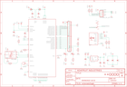

Contents
========

* [PRA2264 > Adafruit](#pra2264--adafruit)
	* [Schematic](#schematic)
	* [Interactive BOM](#interactive-bom)
	* [OOMP Parts](#oomp-parts)
	* [Images](#images)
	* [Tags](#tags)
  
![][im]
# PRA2264 > Adafruit

- ID: PROJ-ADAF-2264-STAN-01
- Hex ID: PRA2264
- Name: Adafruit
- Description: Adafruit
- Long Link: [http://oom.lt/PROJ-ADAF-2264-STAN-01](http://oom.lt/PROJ-ADAF-2264-STAN-01)
- Long Link: [http://oom.lt/PRA2264](http://oom.lt/PRA2264)

## Schematic
  
![][schem]
## Interactive BOM

- Interactive BOM page: [ibom.html](https://htmlpreview.github.io/?https://github.com/oomlout/oomlout_OOMP_projects/blob/main/PROJ-ADAF-2264-STAN-01/kicad/bom/ibom.html)

## OOMP Parts
  

|OOMP Parts|
| :---: |
|C1,UNMATCHED-UNMATCHED-UNMATCHED-UNMATCHED-UNMATCHED,C1,10uF,CAP_CERAMIC0805-NOOUTLINE,0805-NO,Ceramic Capacitors,,,,,,,,,|
|C2,UNMATCHED-UNMATCHED-UNMATCHED-UNMATCHED-UNMATCHED,C2,0.1uF,CAP_CERAMIC0603_NO,0603-NO,Ceramic Capacitors,,,,,,,,,|
|C3,UNMATCHED-UNMATCHED-UNMATCHED-UNMATCHED-UNMATCHED,C3,10uF,CAP_CERAMIC0805-NOOUTLINE,0805-NO,Ceramic Capacitors,,,,,,,,,|
|C4,UNMATCHED-UNMATCHED-UNMATCHED-UNMATCHED-UNMATCHED,C4,10uF,CAP_CERAMIC0805-NOOUTLINE,0805-NO,Ceramic Capacitors,,,,,,,,,|
|C5,UNMATCHED-UNMATCHED-UNMATCHED-UNMATCHED-UNMATCHED,C5,10uF,CAP_CERAMIC0805-NOOUTLINE,0805-NO,Ceramic Capacitors,,,,,,,,,|
|C6,UNMATCHED-UNMATCHED-UNMATCHED-UNMATCHED-UNMATCHED,C6,0.1uF,CAP_CERAMIC0603_NO,0603-NO,Ceramic Capacitors,,,,,,,,,|
|C7,UNMATCHED-UNMATCHED-UNMATCHED-UNMATCHED-UNMATCHED,C7,0.1uF,CAP_CERAMIC0603_NO,0603-NO,Ceramic Capacitors,,,,,,,,,|
|C8,UNMATCHED-UNMATCHED-UNMATCHED-UNMATCHED-UNMATCHED,C8,0.1uF,CAP_CERAMIC0603_NO,0603-NO,Ceramic Capacitors,,,,,,,,,|
|C9,UNMATCHED-UNMATCHED-UNMATCHED-UNMATCHED-UNMATCHED,C9,0.1uF,CAP_CERAMIC0603_NO,0603-NO,Ceramic Capacitors,,,,,,,,,|
|C10,UNMATCHED-UNMATCHED-UNMATCHED-UNMATCHED-UNMATCHED,C10,10µF,CAP_CERAMIC0805-NOOUTLINE,0805-NO,Ceramic Capacitors,,,,,,,A,,|
|CONN1,UNMATCHED-UNMATCHED-UNMATCHED-UNMATCHED-UNMATCHED,CONN1,STEMMA_I2C_QT,STEMMA_I2C_QT,JST_SH4,,,,,,,,,,|
|D+,UNMATCHED-UNMATCHED-UNMATCHED-UNMATCHED-UNMATCHED,D+,TPTP17R,TPTP17R,TP17R,Test pad,,,,,,0,,,|
|D-,UNMATCHED-UNMATCHED-UNMATCHED-UNMATCHED-UNMATCHED,D-,TPTP17R,TPTP17R,TP17R,Test pad,,,,,,0,,,|
|FB1,UNMATCHED-UNMATCHED-UNMATCHED-UNMATCHED-UNMATCHED,FB1,Ferrite,FERRITE_0805,_0805,Ferrite Bead,,,,,,,,,|
|FB2,UNMATCHED-UNMATCHED-UNMATCHED-UNMATCHED-UNMATCHED,FB2,Ferrite,FERRITE_0805,_0805,Ferrite Bead,,,,,,,,,|
|IC1,UNMATCHED-UNMATCHED-UNMATCHED-UNMATCHED-UNMATCHED,FID1,FIDUCIAL,FIDUCIAL,FIDUCIAL_1MM,Fiducial Alignment Points,EXCLUDE,,,,,,,,|
|IC2,UNMATCHED-UNMATCHED-UNMATCHED-UNMATCHED-UNMATCHED,FID2,FIDUCIAL,FIDUCIAL,FIDUCIAL_1MM,Fiducial Alignment Points,EXCLUDE,,,,,,,,|
|JP1,UNMATCHED-UNMATCHED-UNMATCHED-UNMATCHED-UNMATCHED,IC1,93LC56B,93LC76A,SOT23-6,8K Microwire Compatible Serial EEPROM,,MICROCHIP,93LC76AT-I/OT,1556170,61H6824,,,,|
|JP2,UNMATCHED-UNMATCHED-UNMATCHED-UNMATCHED-UNMATCHED,IC2,FT232HQ,FT232HQ,QFN48_8MM,,,,,,,,,,|
|LED1,UNMATCHED-UNMATCHED-UNMATCHED-UNMATCHED-UNMATCHED,JP1,,HEADER-1X11,1X11_ROUND,,,,,,,,,,|
|LED2,UNMATCHED-UNMATCHED-UNMATCHED-UNMATCHED-UNMATCHED,JP2,,HEADER-1X11,1X11_ROUND,,,,,,,,,,|
|Q1,UNMATCHED-UNMATCHED-UNMATCHED-UNMATCHED-UNMATCHED,LED1,green,LED0805_NOOUTLINE,CHIPLED_0805_NOOUTLINE,LED,,,,,,,,,|
|R1,UNMATCHED-UNMATCHED-UNMATCHED-UNMATCHED-UNMATCHED,LED2,red,LED0805_NOOUTLINE,CHIPLED_0805_NOOUTLINE,LED,,,,,,,,,|
|R2,UNMATCHED-UNMATCHED-UNMATCHED-UNMATCHED-UNMATCHED,Q1,12MHz,RESONATORSMD,RESONATOR-SMD,Resonator,,,,,,,,,|
|R3,UNMATCHED-UNMATCHED-UNMATCHED-UNMATCHED-UNMATCHED,R1,12K,RESISTOR_0603_NOOUT,0603-NO,Resistors,,,,,,,,,|
|R4,UNMATCHED-UNMATCHED-UNMATCHED-UNMATCHED-UNMATCHED,R2,12K 1%,RESISTOR_0603_NOOUT,0603-NO,Resistors,,,,,,,,,|
|R5,UNMATCHED-UNMATCHED-UNMATCHED-UNMATCHED-UNMATCHED,R3,1K,RESISTOR_0603_NOOUT,0603-NO,Resistors,,,,,,,,,|
|R6,UNMATCHED-UNMATCHED-UNMATCHED-UNMATCHED-UNMATCHED,R4,1K,RESISTOR_0603_NOOUT,0603-NO,Resistors,,,,,,,,,|
|R7,UNMATCHED-UNMATCHED-UNMATCHED-UNMATCHED-UNMATCHED,R5,2.2K,RESISTOR_0603_NOOUT,0603-NO,Resistors,,,,,,,,,|
|R8,UNMATCHED-UNMATCHED-UNMATCHED-UNMATCHED-UNMATCHED,R6,5.1K,RESISTOR_0603_NOOUT,0603-NO,Resistors,,,,,,,,,|
|R9,UNMATCHED-UNMATCHED-UNMATCHED-UNMATCHED-UNMATCHED,R7,12K,RESISTOR_0603_NOOUT,0603-NO,Resistors,,,,,,,,,|
|R10,UNMATCHED-UNMATCHED-UNMATCHED-UNMATCHED-UNMATCHED,R8,5.1K,RESISTOR_0603_NOOUT,0603-NO,Resistors,,,,,,,,,|
|R11,UNMATCHED-UNMATCHED-UNMATCHED-UNMATCHED-UNMATCHED,R9,5.1K,RESISTOR_0603_NOOUT,0603-NO,Resistors,,,,,,,,,|
|SW1,UNMATCHED-UNMATCHED-UNMATCHED-UNMATCHED-UNMATCHED,R10,12K,RESISTOR_0603_NOOUT,0603-NO,Resistors,,,,,,,,,|
|U2,UNMATCHED-UNMATCHED-UNMATCHED-UNMATCHED-UNMATCHED,R11,12K,RESISTOR_0603_NOOUT,0603-NO,Resistors,,,,,,,,,|
|X6,UNMATCHED-UNMATCHED-UNMATCHED-UNMATCHED-UNMATCHED,SW1,,SWITCH_DPDTEG1390,EG1390,Switch - DPDT,,,,,,,,,|

## Images
  
  

|kicadPcb3d|kicadPcb3dFront|kicadPcb3dBack|eagleImage|eagleSchemImage|
| :---: | :---: | :---: | :---: | :---: |
||||||

## Tags

- hexID: PRA2264
- oompType: PROJ
- oompSize: ADAF
- oompColor: 2264
- oompDesc: STAN
- oompIndex: 01
- oompName: Adafruit FT232H Breakout PCB
- sources: All source files from https://github.com/adafruit/Adafruit-FT232H-Breakout-PCB (source licence details in srcLicense.md)
- linkBuyPage: http://www.adafruit.com/products/2264
- oompID: PROJ-ADAF-2264-STAN-01
- oompParts: C1,UNMATCHED-UNMATCHED-UNMATCHED-UNMATCHED-UNMATCHED
- oompParts: C2,UNMATCHED-UNMATCHED-UNMATCHED-UNMATCHED-UNMATCHED
- oompParts: C3,UNMATCHED-UNMATCHED-UNMATCHED-UNMATCHED-UNMATCHED
- oompParts: C4,UNMATCHED-UNMATCHED-UNMATCHED-UNMATCHED-UNMATCHED
- oompParts: C5,UNMATCHED-UNMATCHED-UNMATCHED-UNMATCHED-UNMATCHED
- oompParts: C6,UNMATCHED-UNMATCHED-UNMATCHED-UNMATCHED-UNMATCHED
- oompParts: C7,UNMATCHED-UNMATCHED-UNMATCHED-UNMATCHED-UNMATCHED
- oompParts: C8,UNMATCHED-UNMATCHED-UNMATCHED-UNMATCHED-UNMATCHED
- oompParts: C9,UNMATCHED-UNMATCHED-UNMATCHED-UNMATCHED-UNMATCHED
- oompParts: C10,UNMATCHED-UNMATCHED-UNMATCHED-UNMATCHED-UNMATCHED
- oompParts: CONN1,UNMATCHED-UNMATCHED-UNMATCHED-UNMATCHED-UNMATCHED
- oompParts: D+,UNMATCHED-UNMATCHED-UNMATCHED-UNMATCHED-UNMATCHED
- oompParts: D-,UNMATCHED-UNMATCHED-UNMATCHED-UNMATCHED-UNMATCHED
- oompParts: FB1,UNMATCHED-UNMATCHED-UNMATCHED-UNMATCHED-UNMATCHED
- oompParts: FB2,UNMATCHED-UNMATCHED-UNMATCHED-UNMATCHED-UNMATCHED
- oompParts: IC1,UNMATCHED-UNMATCHED-UNMATCHED-UNMATCHED-UNMATCHED
- oompParts: IC2,UNMATCHED-UNMATCHED-UNMATCHED-UNMATCHED-UNMATCHED
- oompParts: JP1,UNMATCHED-UNMATCHED-UNMATCHED-UNMATCHED-UNMATCHED
- oompParts: JP2,UNMATCHED-UNMATCHED-UNMATCHED-UNMATCHED-UNMATCHED
- oompParts: LED1,UNMATCHED-UNMATCHED-UNMATCHED-UNMATCHED-UNMATCHED
- oompParts: LED2,UNMATCHED-UNMATCHED-UNMATCHED-UNMATCHED-UNMATCHED
- oompParts: Q1,UNMATCHED-UNMATCHED-UNMATCHED-UNMATCHED-UNMATCHED
- oompParts: R1,UNMATCHED-UNMATCHED-UNMATCHED-UNMATCHED-UNMATCHED
- oompParts: R2,UNMATCHED-UNMATCHED-UNMATCHED-UNMATCHED-UNMATCHED
- oompParts: R3,UNMATCHED-UNMATCHED-UNMATCHED-UNMATCHED-UNMATCHED
- oompParts: R4,UNMATCHED-UNMATCHED-UNMATCHED-UNMATCHED-UNMATCHED
- oompParts: R5,UNMATCHED-UNMATCHED-UNMATCHED-UNMATCHED-UNMATCHED
- oompParts: R6,UNMATCHED-UNMATCHED-UNMATCHED-UNMATCHED-UNMATCHED
- oompParts: R7,UNMATCHED-UNMATCHED-UNMATCHED-UNMATCHED-UNMATCHED
- oompParts: R8,UNMATCHED-UNMATCHED-UNMATCHED-UNMATCHED-UNMATCHED
- oompParts: R9,UNMATCHED-UNMATCHED-UNMATCHED-UNMATCHED-UNMATCHED
- oompParts: R10,UNMATCHED-UNMATCHED-UNMATCHED-UNMATCHED-UNMATCHED
- oompParts: R11,UNMATCHED-UNMATCHED-UNMATCHED-UNMATCHED-UNMATCHED
- oompParts: SW1,UNMATCHED-UNMATCHED-UNMATCHED-UNMATCHED-UNMATCHED
- oompParts: U2,UNMATCHED-UNMATCHED-UNMATCHED-UNMATCHED-UNMATCHED
- oompParts: X6,UNMATCHED-UNMATCHED-UNMATCHED-UNMATCHED-UNMATCHED
- rawParts: C1,10uF,CAP_CERAMIC0805-NOOUTLINE,0805-NO,Ceramic Capacitors,,,,,,,,,
- rawParts: C2,0.1uF,CAP_CERAMIC0603_NO,0603-NO,Ceramic Capacitors,,,,,,,,,
- rawParts: C3,10uF,CAP_CERAMIC0805-NOOUTLINE,0805-NO,Ceramic Capacitors,,,,,,,,,
- rawParts: C4,10uF,CAP_CERAMIC0805-NOOUTLINE,0805-NO,Ceramic Capacitors,,,,,,,,,
- rawParts: C5,10uF,CAP_CERAMIC0805-NOOUTLINE,0805-NO,Ceramic Capacitors,,,,,,,,,
- rawParts: C6,0.1uF,CAP_CERAMIC0603_NO,0603-NO,Ceramic Capacitors,,,,,,,,,
- rawParts: C7,0.1uF,CAP_CERAMIC0603_NO,0603-NO,Ceramic Capacitors,,,,,,,,,
- rawParts: C8,0.1uF,CAP_CERAMIC0603_NO,0603-NO,Ceramic Capacitors,,,,,,,,,
- rawParts: C9,0.1uF,CAP_CERAMIC0603_NO,0603-NO,Ceramic Capacitors,,,,,,,,,
- rawParts: C10,10µF,CAP_CERAMIC0805-NOOUTLINE,0805-NO,Ceramic Capacitors,,,,,,,A,,
- rawParts: CONN1,STEMMA_I2C_QT,STEMMA_I2C_QT,JST_SH4,,,,,,,,,,
- rawParts: D+,TPTP17R,TPTP17R,TP17R,Test pad,,,,,,0,,,
- rawParts: D-,TPTP17R,TPTP17R,TP17R,Test pad,,,,,,0,,,
- rawParts: FB1,Ferrite,FERRITE_0805,_0805,Ferrite Bead,,,,,,,,,
- rawParts: FB2,Ferrite,FERRITE_0805,_0805,Ferrite Bead,,,,,,,,,
- rawParts: FID1,FIDUCIAL,FIDUCIAL,FIDUCIAL_1MM,Fiducial Alignment Points,EXCLUDE,,,,,,,,
- rawParts: FID2,FIDUCIAL,FIDUCIAL,FIDUCIAL_1MM,Fiducial Alignment Points,EXCLUDE,,,,,,,,
- rawParts: IC1,93LC56B,93LC76A,SOT23-6,8K Microwire Compatible Serial EEPROM,,MICROCHIP,93LC76AT-I/OT,1556170,61H6824,,,,
- rawParts: IC2,FT232HQ,FT232HQ,QFN48_8MM,,,,,,,,,,
- rawParts: JP1,,HEADER-1X11,1X11_ROUND,,,,,,,,,,
- rawParts: JP2,,HEADER-1X11,1X11_ROUND,,,,,,,,,,
- rawParts: LED1,green,LED0805_NOOUTLINE,CHIPLED_0805_NOOUTLINE,LED,,,,,,,,,
- rawParts: LED2,red,LED0805_NOOUTLINE,CHIPLED_0805_NOOUTLINE,LED,,,,,,,,,
- rawParts: Q1,12MHz,RESONATORSMD,RESONATOR-SMD,Resonator,,,,,,,,,
- rawParts: R1,12K,RESISTOR_0603_NOOUT,0603-NO,Resistors,,,,,,,,,
- rawParts: R2,12K 1%,RESISTOR_0603_NOOUT,0603-NO,Resistors,,,,,,,,,
- rawParts: R3,1K,RESISTOR_0603_NOOUT,0603-NO,Resistors,,,,,,,,,
- rawParts: R4,1K,RESISTOR_0603_NOOUT,0603-NO,Resistors,,,,,,,,,
- rawParts: R5,2.2K,RESISTOR_0603_NOOUT,0603-NO,Resistors,,,,,,,,,
- rawParts: R6,5.1K,RESISTOR_0603_NOOUT,0603-NO,Resistors,,,,,,,,,
- rawParts: R7,12K,RESISTOR_0603_NOOUT,0603-NO,Resistors,,,,,,,,,
- rawParts: R8,5.1K,RESISTOR_0603_NOOUT,0603-NO,Resistors,,,,,,,,,
- rawParts: R9,5.1K,RESISTOR_0603_NOOUT,0603-NO,Resistors,,,,,,,,,
- rawParts: R10,12K,RESISTOR_0603_NOOUT,0603-NO,Resistors,,,,,,,,,
- rawParts: R11,12K,RESISTOR_0603_NOOUT,0603-NO,Resistors,,,,,,,,,
- rawParts: SW1,,SWITCH_DPDTEG1390,EG1390,Switch - DPDT,,,,,,,,,
- rawParts: U$4,MOUNTINGHOLE2.5,MOUNTINGHOLE2.5,MOUNTINGHOLE_2.5_PLATED,Mounting Hole,EXCLUDE,,,,,,,,
- rawParts: U$5,MOUNTINGHOLE2.5,MOUNTINGHOLE2.5,MOUNTINGHOLE_2.5_PLATED,Mounting Hole,EXCLUDE,,,,,,,,
- rawParts: U$6,MOUNTINGHOLE2.5,MOUNTINGHOLE2.5,MOUNTINGHOLE_2.5_PLATED,Mounting Hole,EXCLUDE,,,,,,D,,
- rawParts: U$7,MOUNTINGHOLE2.5,MOUNTINGHOLE2.5,MOUNTINGHOLE_2.5_PLATED,Mounting Hole,EXCLUDE,,,,,,,,
- rawParts: U2,AP2112-3.3,VREG_SOT23-5,SOT23-5,SOT23-5 Fixed Voltage Regulators,,,,,,,,,
- rawParts: X6,USBC,USB_C,USB_C_CUSB31-CFM2AX-01-X,USB Type-C USB 2.0 Connector,,,,,,,,,

[im]: kicadPcb3d_450.png
[schem]: eagleSchemImage.png
