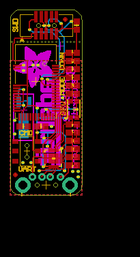
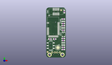
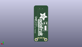
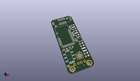

Contents
========

* [PROJ-ADAF-2267-STAN-01>Adafruit Bluefruit LE USB Friend and Sniffer PCB](#proj-adaf-2267-stan-01adafruit-bluefruit-le-usb-friend-and-sniffer-pcb)
	* [Images](#images)
	* [Interactive BOM](#interactive-bom)
	* [OOMP Parts](#oomp-parts)
	* [Tags](#tags)
  
![][im]
# PROJ-ADAF-2267-STAN-01>Adafruit Bluefruit LE USB Friend and Sniffer PCB

- ID: PROJ-ADAF-2267-STAN-01
- Hex ID: PRA2267
- Name: Adafruit Bluefruit LE USB Friend and Sniffer PCB
- Description: 

## Images
  
  

|eagleImage|kicadPcb3dFront|kicadPcb3dBack|kicadPcb3d|
| :---: | :---: | :---: | :---: |
|||||

## Interactive BOM

- Interactive BOM page: [ibom.html](kicad/bom/ibom.html)

## OOMP Parts
  

|OOMP Parts|
| :---: |
|CAPC-0805-X-UNMATCHED-01, C1, 3.302, 17.018, 0,C1, 1uF, _0805MP, microbuilder, (0.13, 0.67), R0|
|CAPC-0805-X-UNMATCHED-01, C2, 15.493999999999998, 35.306, 0,C2, 1uF, _0805MP, microbuilder, (0.61, 1.39), R0|
|CAPC-0805-X-UNMATCHED-01, C3, 15.493999999999998, 7.365999999999999, 0,C3, 10uF, _0805MP, microbuilder, (0.61, 0.29), R0|
|CAPC-0805-X-UNMATCHED-01, C4, 7.619999999999999, 17.018, 0,C4, 10uF, _0805MP, microbuilder, (0.3, 0.67), R0|
|UNMATCHED-UNMATCHED-X-UNMATCHED-01, LED1, 15.493999999999998, 13.462, 90,LED1, YELLOW, CHIPLED_0805_NOOUTLINE, microbuilder, (0.61, 0.53), R90|
|UNMATCHED-UNMATCHED-X-UNMATCHED-01, LED2, 15.493999999999998, 11.43, 90,LED2, GREEN, CHIPLED_0805_NOOUTLINE, microbuilder, (0.61, 0.45), R90|
|UNMATCHED-UNMATCHED-X-UNMATCHED-01, LED3, 15.493999999999998, 27.178, 90,LED3, RED, CHIPLED_0805_NOOUTLINE, microbuilder, (0.61, 1.07), R90|
|UNMATCHED-UNMATCHED-X-UNMATCHED-01, LED4, 15.493999999999998, 33.274, 90,LED4, BLUE, CHIPLED_0805_NOOUTLINE, microbuilder, (0.61, 1.31), R90|
|RESE-0805-X-UNMATCHED-01, R1, 15.493999999999998, 15.493999999999998, 0,R1, 1K, _0805MP, microbuilder, (0.61, 0.61), R0|
|RESE-0805-X-UNMATCHED-01, R2, 15.493999999999998, 9.398, 0,R2, 1K, _0805MP, microbuilder, (0.61, 0.37), R0|
|RESE-0805-X-UNMATCHED-01, R3, 15.493999999999998, 29.209999999999997, 180,R3, 1K, _0805MP, microbuilder, (0.61, 1.15), R180|
|RESE-0805-X-UNMATCHED-01, R4, 15.493999999999998, 17.525999999999996, 0,R4, 0, _0805MP, microbuilder, (0.61, 0.69), R0|
|<table><tr><td></td><td> R5</td><td>[RESE-0805-X-O103-01 SMD (0805) 10k Ohm Resistor](https://github.com/oomlout/oomlout_OOMP_parts/tree/main/RESE-0805-X-O103-01/)</td><td>[R85103](https://github.com/oomlout/oomlout_OOMP_parts/tree/main/RESE-0805-X-O103-01/)</td></tr></table>|
|<table><tr><td></td><td> R6</td><td>[RESE-0805-X-O103-01 SMD (0805) 10k Ohm Resistor](https://github.com/oomlout/oomlout_OOMP_parts/tree/main/RESE-0805-X-O103-01/)</td><td>[R85103](https://github.com/oomlout/oomlout_OOMP_parts/tree/main/RESE-0805-X-O103-01/)</td></tr></table>|
|RESE-0805-X-UNMATCHED-01, R7, 15.493999999999998, 31.241999999999997, 180,R7, 1K, _0805MP, microbuilder, (0.61, 1.23), R180|
|UNMATCHED-UNMATCHED-X-UNMATCHED-01, SW1, 15.748, 21.336, 270,SW1, KMR2, BTN_KMR2_4.6X2.8, microbuilder, (0.62, 0.84), R270|
|UNMATCHED-UNMATCHED-X-UNMATCHED-01, SW2, 4.064, 10.921999999999999, 270,SW2, KMR2, EG1390, adafruit, (0.16, 0.43), R270|
|UNMATCHED-UNMATCHED-X-UNMATCHED-01, U1, 6.35, 28.194000000000003, 0,U1, nrf51822_32KB, BLE_MODULE_RAYTAC_MDBT40, microbuilder, (0.25, 1.11), R0|
|UNMATCHED-UNMATCHED-X-UNMATCHED-01, U2, 10.668, 9.143999999999998, 0,U2, FT231XQ-x, QFN20_4MM, microbuilder, (0.42, 0.36), R0|
|ERROR, X1 USB A, 0, 0, 0,X1, USB, A, USB_A-THM, microbuilder, (0.35, 0.1), R180|
|UNMATCHED-UNMATCHED-X-UNMATCHED-01, X2, 8.889999999999999, 42.163999999999994, 0,X2, 20317, 2X05_1.27MM_BOX_POSTS, microbuilder, (0.35, 1.66), R0|
|UNMATCHED-UNMATCHED-X-UNMATCHED-01, Y1, 3.302, 21.081999999999997, M90,Y1, DNC, CRYSTAL_CYL_2X6MM_SMT, microbuilder, (0.13, 0.83), MR90|

## Tags

- hexID: PRA2267
- oompType: PROJ
- oompSize: ADAF
- oompColor: 2267
- oompDesc: STAN
- oompIndex: 01
- oompName: Adafruit Bluefruit LE USB Friend and Sniffer PCB
- sources: All source files from https://github.com/adafruit/Adafruit-Bluefruit-LE-USB-Friend-and-Sniffer-PCB (source licence details in srcLicense.md)
- linkBuyPage: http://www.adafruit.com/products/2267
- oompID: PROJ-ADAF-2267-STAN-01
- oompPart: CAPC-0805-X-UNMATCHED-01, C1, 3.302, 17.018, 0
- oompPart: CAPC-0805-X-UNMATCHED-01, C2, 15.493999999999998, 35.306, 0
- oompPart: CAPC-0805-X-UNMATCHED-01, C3, 15.493999999999998, 7.365999999999999, 0
- oompPart: CAPC-0805-X-UNMATCHED-01, C4, 7.619999999999999, 17.018, 0
- oompPart: SKIP-UNMATCHED-X-UNMATCHED-01, FID1, 13.589, 43.561, 0
- oompPart: SKIP-UNMATCHED-X-UNMATCHED-01, FID2, 1.27, 5.08, 0
- oompPart: UNMATCHED-UNMATCHED-X-UNMATCHED-01, LED1, 15.493999999999998, 13.462, 90
- oompPart: UNMATCHED-UNMATCHED-X-UNMATCHED-01, LED2, 15.493999999999998, 11.43, 90
- oompPart: UNMATCHED-UNMATCHED-X-UNMATCHED-01, LED3, 15.493999999999998, 27.178, 90
- oompPart: UNMATCHED-UNMATCHED-X-UNMATCHED-01, LED4, 15.493999999999998, 33.274, 90
- oompPart: RESE-0805-X-UNMATCHED-01, R1, 15.493999999999998, 15.493999999999998, 0
- oompPart: RESE-0805-X-UNMATCHED-01, R2, 15.493999999999998, 9.398, 0
- oompPart: RESE-0805-X-UNMATCHED-01, R3, 15.493999999999998, 29.209999999999997, 180
- oompPart: RESE-0805-X-UNMATCHED-01, R4, 15.493999999999998, 17.525999999999996, 0
- oompPart: RESE-0805-X-O103-01, R5, 16.509999999999998, 42.163999999999994, 270
- oompPart: RESE-0805-X-O103-01, R6, 15.493999999999998, 25.145999999999997, 0
- oompPart: RESE-0805-X-UNMATCHED-01, R7, 15.493999999999998, 31.241999999999997, 180
- oompPart: UNMATCHED-UNMATCHED-X-UNMATCHED-01, SW1, 15.748, 21.336, 270
- oompPart: UNMATCHED-UNMATCHED-X-UNMATCHED-01, SW2, 4.064, 10.921999999999999, 270
- oompPart: UNMATCHED-UNMATCHED-X-UNMATCHED-01, U1, 6.35, 28.194000000000003, 0
- oompPart: UNMATCHED-UNMATCHED-X-UNMATCHED-01, U2, 10.668, 9.143999999999998, 0
- oompPart: ERROR, X1 USB A, 0, 0, 0
- oompPart: UNMATCHED-UNMATCHED-X-UNMATCHED-01, X2, 8.889999999999999, 42.163999999999994, 0
- oompPart: UNMATCHED-UNMATCHED-X-UNMATCHED-01, Y1, 3.302, 21.081999999999997, M90
- rawPart: C1, 1uF, _0805MP, microbuilder, (0.13, 0.67), R0
- rawPart: C2, 1uF, _0805MP, microbuilder, (0.61, 1.39), R0
- rawPart: C3, 10uF, _0805MP, microbuilder, (0.61, 0.29), R0
- rawPart: C4, 10uF, _0805MP, microbuilder, (0.3, 0.67), R0
- rawPart: FID1, FIDUCIAL, FIDUCIAL_1MM, microbuilder, (0.535, 1.715), R0
- rawPart: FID2, FIDUCIAL, FIDUCIAL_1MM, microbuilder, (0.05, 0.2), R0
- rawPart: LED1, YELLOW, CHIPLED_0805_NOOUTLINE, microbuilder, (0.61, 0.53), R90
- rawPart: LED2, GREEN, CHIPLED_0805_NOOUTLINE, microbuilder, (0.61, 0.45), R90
- rawPart: LED3, RED, CHIPLED_0805_NOOUTLINE, microbuilder, (0.61, 1.07), R90
- rawPart: LED4, BLUE, CHIPLED_0805_NOOUTLINE, microbuilder, (0.61, 1.31), R90
- rawPart: R1, 1K, _0805MP, microbuilder, (0.61, 0.61), R0
- rawPart: R2, 1K, _0805MP, microbuilder, (0.61, 0.37), R0
- rawPart: R3, 1K, _0805MP, microbuilder, (0.61, 1.15), R180
- rawPart: R4, 0, _0805MP, microbuilder, (0.61, 0.69), R0
- rawPart: R5, 10K, _0805MP, microbuilder, (0.65, 1.66), R270
- rawPart: R6, 10K, _0805MP, microbuilder, (0.61, 0.99), R0
- rawPart: R7, 1K, _0805MP, microbuilder, (0.61, 1.23), R180
- rawPart: SW1, KMR2, BTN_KMR2_4.6X2.8, microbuilder, (0.62, 0.84), R270
- rawPart: SW2, KMR2, EG1390, adafruit, (0.16, 0.43), R270
- rawPart: U1, nrf51822_32KB, BLE_MODULE_RAYTAC_MDBT40, microbuilder, (0.25, 1.11), R0
- rawPart: U2, FT231XQ-x, QFN20_4MM, microbuilder, (0.42, 0.36), R0
- rawPart: X1, USB, A, USB_A-THM, microbuilder, (0.35, 0.1), R180
- rawPart: X2, 20317, 2X05_1.27MM_BOX_POSTS, microbuilder, (0.35, 1.66), R0
- rawPart: Y1, DNC, CRYSTAL_CYL_2X6MM_SMT, microbuilder, (0.13, 0.83), MR90

[im]: kicadPcb3d_450.png
