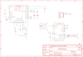

Contents
========

* [PRA2267 > Adafruit Bluefruit LE USB Friend and Sniffer PCB](#pra2267--adafruit-bluefruit-le-usb-friend-and-sniffer-pcb)
	* [Schematic](#schematic)
	* [PCB](#pcb)
	* [Interactive BOM](#interactive-bom)
	* [OOMP Parts](#oomp-parts)
	* [Images](#images)
	* [Tags](#tags)
  
![][im]
# PRA2267 > Adafruit Bluefruit LE USB Friend and Sniffer PCB

- ID: PROJ-ADAF-2267-STAN-01
- Hex ID: PRA2267
- Name: Adafruit
- Description: Adafruit
- Long Link: [http://oom.lt/PROJ-ADAF-2267-STAN-01](http://oom.lt/PROJ-ADAF-2267-STAN-01)
- Short Link: [http://oom.lt/PRA2267](http://oom.lt/PRA2267)

## Schematic
  

## PCB
  

## Interactive BOM

- Interactive BOM page: [ibom.html](https://htmlpreview.github.io/?https://github.com/oomlout/oomlout_OOMP_projects/blob/main/PROJ-ADAF-2267-STAN-01/kicad/bom/ibom.html)

## OOMP Parts
  

|OOMP ID|Name|Identifier|
| :---: | :---: | :---: |
|[CAPC-0805-X-UF1-V25](https://github.com/oomlout/oomlout_OOMP_parts/tree/main/CAPC-0805-X-UF1-V25/)|[SMD (0805) 1 uF Capacitor (Ceramic) 25v](https://github.com/oomlout/oomlout_OOMP_parts/tree/main/CAPC-0805-X-UF1-V25/)|[C1, C2](https://github.com/oomlout/oomlout_OOMP_parts/tree/main/CAPC-0805-X-UF1-V25/)|
|[CAPC-0805-X-UF10-V10](https://github.com/oomlout/oomlout_OOMP_parts/tree/main/CAPC-0805-X-UF10-V10/)|[SMD (0805) 10 uF Capacitor (Ceramic) 10v](https://github.com/oomlout/oomlout_OOMP_parts/tree/main/CAPC-0805-X-UF10-V10/)|[C3, C4](https://github.com/oomlout/oomlout_OOMP_parts/tree/main/CAPC-0805-X-UF10-V10/)|
|[LEDS-0805-Y-STAN-01](https://github.com/oomlout/oomlout_OOMP_parts/tree/main/LEDS-0805-Y-STAN-01/)|[SMD (0805) Yellow LED](https://github.com/oomlout/oomlout_OOMP_parts/tree/main/LEDS-0805-Y-STAN-01/)|[LED1](https://github.com/oomlout/oomlout_OOMP_parts/tree/main/LEDS-0805-Y-STAN-01/)|
|[LEDS-0805-G-STAN-01](https://github.com/oomlout/oomlout_OOMP_parts/tree/main/LEDS-0805-G-STAN-01/)|[SMD (0805) Green LED](https://github.com/oomlout/oomlout_OOMP_parts/tree/main/LEDS-0805-G-STAN-01/)|[LED2](https://github.com/oomlout/oomlout_OOMP_parts/tree/main/LEDS-0805-G-STAN-01/)|
|[LEDS-0805-R-STAN-01](https://github.com/oomlout/oomlout_OOMP_parts/tree/main/LEDS-0805-R-STAN-01/)|[SMD (0805) Red LED](https://github.com/oomlout/oomlout_OOMP_parts/tree/main/LEDS-0805-R-STAN-01/)|[LED3](https://github.com/oomlout/oomlout_OOMP_parts/tree/main/LEDS-0805-R-STAN-01/)|
|[LEDS-0805-L-STAN-01](https://github.com/oomlout/oomlout_OOMP_parts/tree/main/LEDS-0805-L-STAN-01/)|[SMD (0805) Blue LED](https://github.com/oomlout/oomlout_OOMP_parts/tree/main/LEDS-0805-L-STAN-01/)|[LED4](https://github.com/oomlout/oomlout_OOMP_parts/tree/main/LEDS-0805-L-STAN-01/)|
|[RESE-0805-X-O102-01](https://github.com/oomlout/oomlout_OOMP_parts/tree/main/RESE-0805-X-O102-01/)|[SMD (0805) 1k Ohm Resistor](https://github.com/oomlout/oomlout_OOMP_parts/tree/main/RESE-0805-X-O102-01/)|[R1, R2, R3, R7](https://github.com/oomlout/oomlout_OOMP_parts/tree/main/RESE-0805-X-O102-01/)|
|RESE-0805-X-UNMATCHED-01||R4|
|[RESE-0805-X-O103-01](https://github.com/oomlout/oomlout_OOMP_parts/tree/main/RESE-0805-X-O103-01/)|[SMD (0805) 10k Ohm Resistor](https://github.com/oomlout/oomlout_OOMP_parts/tree/main/RESE-0805-X-O103-01/)|[R5, R6](https://github.com/oomlout/oomlout_OOMP_parts/tree/main/RESE-0805-X-O103-01/)|
|[BUTA-4628-X-STAN-01](https://github.com/oomlout/oomlout_OOMP_parts/tree/main/BUTA-4628-X-STAN-01/)|[SMD (4628) Pushbutton (Tactile)](https://github.com/oomlout/oomlout_OOMP_parts/tree/main/BUTA-4628-X-STAN-01/)|[SW1](https://github.com/oomlout/oomlout_OOMP_parts/tree/main/BUTA-4628-X-STAN-01/)|
|UNMATCHED-UNMATCHED-X-UNMATCHED-01||SW2, U1, U2, X1, X2, Y1|

## Images
  
  

|bominteractivefront|bominteractiveback|kicadPcb3d|kicadPcb3dFront|kicadPcb3dBack|kicadSchem|eagleImage|eagleSchemImage|pcbdraw|pcbdrawback|
| :---: | :---: | :---: | :---: | :---: | :---: | :---: | :---: | :---: | :---: |
|||||||||||

## Tags

- hexID: PRA2267
- oompType: PROJ
- oompSize: ADAF
- oompColor: 2267
- oompDesc: STAN
- oompIndex: 01
- oompName: Adafruit Bluefruit LE USB Friend and Sniffer PCB
- sources: All source files from https://github.com/adafruit/Adafruit-Bluefruit-LE-USB-Friend-and-Sniffer-PCB (source licence details in srcLicense.md)
- linkBuyPage: http://www.adafruit.com/products/2267
- oompID: PROJ-ADAF-2267-STAN-01
- oompParts: C1,CAPC-0805-X-UF1-V25
- oompParts: C2,CAPC-0805-X-UF1-V25
- oompParts: C3,CAPC-0805-X-UF10-V10
- oompParts: C4,CAPC-0805-X-UF10-V10
- oompParts: LED1,LEDS-0805-Y-STAN-01
- oompParts: LED2,LEDS-0805-G-STAN-01
- oompParts: LED3,LEDS-0805-R-STAN-01
- oompParts: LED4,LEDS-0805-L-STAN-01
- oompParts: R1,RESE-0805-X-O102-01
- oompParts: R2,RESE-0805-X-O102-01
- oompParts: R3,RESE-0805-X-O102-01
- oompParts: R4,RESE-0805-X-UNMATCHED-01
- oompParts: R5,RESE-0805-X-O103-01
- oompParts: R6,RESE-0805-X-O103-01
- oompParts: R7,RESE-0805-X-O102-01
- oompParts: SW1,BUTA-4628-X-STAN-01
- oompParts: SW2,UNMATCHED-UNMATCHED-X-UNMATCHED-01
- oompParts: U1,UNMATCHED-UNMATCHED-X-UNMATCHED-01
- oompParts: U2,UNMATCHED-UNMATCHED-X-UNMATCHED-01
- oompParts: X1,UNMATCHED-UNMATCHED-X-UNMATCHED-01
- oompParts: X2,UNMATCHED-UNMATCHED-X-UNMATCHED-01
- oompParts: Y1,UNMATCHED-UNMATCHED-X-UNMATCHED-01
- rawParts: C1,1uF,CAP_CERAMIC_0805MP,_0805MP,Ceramic Capacitors,,
- rawParts: C2,1uF,CAP_CERAMIC_0805MP,_0805MP,Ceramic Capacitors,,
- rawParts: C3,10uF,CAP_CERAMIC_0805MP,_0805MP,Ceramic Capacitors,,
- rawParts: C4,10uF,CAP_CERAMIC_0805MP,_0805MP,Ceramic Capacitors,,
- rawParts: FID1,FIDUCIAL,FIDUCIAL,FIDUCIAL_1MM,Fiducial Alignment Points,EXCLUDE,
- rawParts: FID2,FIDUCIAL,FIDUCIAL,FIDUCIAL_1MM,Fiducial Alignment Points,EXCLUDE,
- rawParts: LED1,YELLOW,LED0805_NOOUTLINE,CHIPLED_0805_NOOUTLINE,LED,,
- rawParts: LED2,GREEN,LED0805_NOOUTLINE,CHIPLED_0805_NOOUTLINE,LED,,
- rawParts: LED3,RED,LED0805_NOOUTLINE,CHIPLED_0805_NOOUTLINE,LED,,
- rawParts: LED4,BLUE,LED0805_NOOUTLINE,CHIPLED_0805_NOOUTLINE,LED,,
- rawParts: R1,1K,RESISTOR_0805MP,_0805MP,Resistors,,
- rawParts: R2,1K,RESISTOR_0805MP,_0805MP,Resistors,,
- rawParts: R3,1K,RESISTOR_0805MP,_0805MP,Resistors,,
- rawParts: R4,0,RESISTOR_0805MP,_0805MP,Resistors,,
- rawParts: R5,10K,RESISTOR_0805MP,_0805MP,Resistors,,
- rawParts: R6,10K,RESISTOR_0805MP,_0805MP,Resistors,,
- rawParts: R7,1K,RESISTOR_0805MP,_0805MP,Resistors,,
- rawParts: SW1,KMR2,SWITCH_TACT_SMT4.6X2.8,BTN_KMR2_4.6X2.8,SMT Tact Switches,,
- rawParts: SW2,KMR2,DPDT-EG1390,EG1390,,,
- rawParts: U1,nrf51822_32KB,BLE_MODULE_RAYTAC_MDBT40,BLE_MODULE_RAYTAC_MDBT40,nRF51822 Bluetooth Low Energy Module,,
- rawParts: U2,FT231XQ-x ,FT231X,QFN20_4MM,FT231X USB To Full Handshake UART IC,,
- rawParts: X1,USB A,USB_TYPEA_CLIENTTHM,USB_A-THM,USB - Type A Connectors,,
- rawParts: X2,20317,JTAG-CORTEXBOXPOSTS,2X05_1.27MM_BOX_POSTS,Serial Wire (SW-DP) Connector,,
- rawParts: Y1,DNC,CRYSTAL2.0X6.0_32.768,CRYSTAL_CYL_2X6MM_SMT,Crystals,,

[im]: kicadPcb3d_450.png
