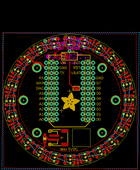
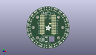

Contents
========

* [PROJ-ADAF-2268-STAN-01>Adafruit Particle Spark Neopixel Ring PCB](#proj-adaf-2268-stan-01adafruit-particle-spark-neopixel-ring-pcb)
	* [Images](#images)
	* [Interactive BOM](#interactive-bom)
	* [OOMP Parts](#oomp-parts)
	* [Tags](#tags)
  
![][im]
# PROJ-ADAF-2268-STAN-01>Adafruit Particle Spark Neopixel Ring PCB

- ID: PROJ-ADAF-2268-STAN-01
- Hex ID: PRA2268
- Name: Adafruit Particle Spark Neopixel Ring PCB
- Description: 

## Images
  
  

|eagleImage|kicadPcb3dFront|kicadPcb3dBack|kicadPcb3d|
| :---: | :---: | :---: | :---: |
|||||

## Interactive BOM

- Interactive BOM page: [ibom.html](kicad/bom/ibom.html)

## OOMP Parts
  

|OOMP Parts|
| :---: |
|CAPC-0603-X-UNMATCHED-01, C2, 11.858496983999999, 28.629103016, 67.5,C2, 1uF, C0603, rcl, (0.46686996, 1.12713004), R67.5|
|CAPC-0603-X-UNMATCHED-01, C3, 18.864324984, 24.584406253999997, 52.5,C3, 1uF, C0603, rcl, (0.74268996, 0.96789001), R52.5|
|CAPC-0603-X-UNMATCHED-01, C4, 24.584406253999997, 18.864324984, 37.5,C4, 1uF, C0603, rcl, (0.96789001, 0.74268996), R37.5|
|CAPC-0603-X-UNMATCHED-01, C5, 28.629103016, 11.858496983999999, 22.5,C5, 1uF, C0603, rcl, (1.12713004, 0.46686996), R22.5|
|CAPC-0603-X-UNMATCHED-01, C7, 30.722825015999998, -4.044696762, 352.5,C7, 1uF, C0603, rcl, (1.20956004, -0.15924003), R352.5|
|CAPC-0603-X-UNMATCHED-01, C8, 28.629103016, -11.858496983999999, 337.5,C8, 1uF, C0603, rcl, (1.12713004, -0.46686996), R337.5|
|CAPC-0603-X-UNMATCHED-01, C10, 18.864324984, -24.584406253999997, 307.5,C10, 1uF, C0603, rcl, (0.74268996, -0.96789001), R307.5|
|CAPC-0603-X-UNMATCHED-01, C12, 4.044696762, -30.722825015999998, 277.5,C12, 1uF, C0603, rcl, (0.15924003, -1.20956004), R277.5|
|CAPC-0603-X-UNMATCHED-01, C14, -11.858496983999999, -28.629103016, 247.5,C14, 1uF, C0603, rcl, (-0.46686996, -1.12713004), R247.5|
|CAPC-0603-X-UNMATCHED-01, C16, -24.584406253999997, -18.864324984, 217.5,C16, 1uF, C0603, rcl, (-0.96789001, -0.74268996), R217.5|
|CAPC-0603-X-UNMATCHED-01, C17, -28.629103016, -11.858496983999999, 202.5,C17, 1uF, C0603, rcl, (-1.12713004, -0.46686996), R202.5|
|CAPC-0603-X-UNMATCHED-01, C19, -30.722825015999998, 4.044696762, 172.5,C19, 1uF, C0603, rcl, (-1.20956004, 0.15924003), R172.5|
|CAPC-0603-X-UNMATCHED-01, C20, -28.629103016, 11.858496983999999, 157.5,C20, 1uF, C0603, rcl, (-1.12713004, 0.46686996), R157.5|
|CAPC-0603-X-UNMATCHED-01, C21, -24.584406253999997, 18.864324984, 142.5,C21, 1uF, C0603, rcl, (-0.96789001, 0.74268996), R142.5|
|CAPC-0603-X-UNMATCHED-01, C22, -18.864324984, 24.584406253999997, 127.5,C22, 1uF, C0603, rcl, (-0.74268996, 0.96789001), R127.5|
|UNMATCHED-UNMATCHED-X-UNMATCHED-01, D1, -12.127999874, -18.866000114, 90,D1, MBR120, SOD-123, microbuilder, (-0.47748031, -0.74275591), R90|
|UNMATCHED-UNMATCHED-X-UNMATCHED-01, IC1, -3.0479999999999996, 21.843999999999998, 90,IC1, 74AHC1G125DBV, SOT23-5, 74xx-little-us, (-0.12, 0.86), R90|
|UNMATCHED-UNMATCHED-X-UNMATCHED-01, JP1, 0.0, 24.383999999999997, 0,JP1, 1X01_ROUND, microbuilder, (0, 0.96), R0|
|UNMATCHED-UNMATCHED-X-UNMATCHED-01, JP2, -12.065, 29.209999999999997, 0,JP2, 1X01-CLEANBIG, NeoPixelRing, (-0.475, 1.15), R0|
|UNMATCHED-UNMATCHED-X-UNMATCHED-01, LED1, 0.0, 29.209999999999997, 0,LED1, WS2812B5050, WS2812B-NARROW, microbuilder, (0, 1.15), R0|
|UNMATCHED-UNMATCHED-X-UNMATCHED-01, LED2, 7.560056254, 28.214575016, 345,LED2, WS2812B5050, WS2812B-NARROW, microbuilder, (0.29764001, 1.11081004), R345|
|UNMATCHED-UNMATCHED-X-UNMATCHED-01, LED3, 14.604999999999999, 25.296622, 330,LED3, WS2812B5050, WS2812B-NARROW, microbuilder, (0.575, 0.99593), R330|
|UNMATCHED-UNMATCHED-X-UNMATCHED-01, LED4, 20.654518762, 20.654518762, 315,LED4, WS2812B5050, WS2812B-NARROW, microbuilder, (0.81317003, 0.81317003), R315|
|UNMATCHED-UNMATCHED-X-UNMATCHED-01, LED5, 25.296622, 14.604999999999999, 300,LED5, WS2812B5050, WS2812B-NARROW, microbuilder, (0.99593, 0.575), R300|
|UNMATCHED-UNMATCHED-X-UNMATCHED-01, LED6, 28.214575016, 7.560056254, 285,LED6, WS2812B5050, WS2812B-NARROW, microbuilder, (1.11081004, 0.29764001), R285|
|UNMATCHED-UNMATCHED-X-UNMATCHED-01, LED7, 29.209999999999997, 0.0, 270,LED7, WS2812B5050, WS2812B-NARROW, microbuilder, (1.15, 0), R270|
|UNMATCHED-UNMATCHED-X-UNMATCHED-01, LED8, 28.214575016, -7.560056254, 255,LED8, WS2812B5050, WS2812B-NARROW, microbuilder, (1.11081004, -0.29764001), R255|
|UNMATCHED-UNMATCHED-X-UNMATCHED-01, LED9, 25.296622, -14.604999999999999, 240,LED9, WS2812B5050, WS2812B-NARROW, microbuilder, (0.99593, -0.575), R240|
|UNMATCHED-UNMATCHED-X-UNMATCHED-01, LED10, 20.654518762, -20.654518762, 225,LED10, WS2812B5050, WS2812B-NARROW, microbuilder, (0.81317003, -0.81317003), R225|
|UNMATCHED-UNMATCHED-X-UNMATCHED-01, LED11, 14.604999999999999, -25.296622, 210,LED11, WS2812B5050, WS2812B-NARROW, microbuilder, (0.575, -0.99593), R210|
|UNMATCHED-UNMATCHED-X-UNMATCHED-01, LED12, 7.560056254, -28.214575016, 195,LED12, WS2812B5050, WS2812B-NARROW, microbuilder, (0.29764001, -1.11081004), R195|
|UNMATCHED-UNMATCHED-X-UNMATCHED-01, LED13, 0.0, -29.209999999999997, 180,LED13, WS2812B5050, WS2812B-NARROW, microbuilder, (0, -1.15), R180|
|UNMATCHED-UNMATCHED-X-UNMATCHED-01, LED14, -7.560056254, -28.214575016, 165,LED14, WS2812B5050, WS2812B-NARROW, microbuilder, (-0.29764001, -1.11081004), R165|
|UNMATCHED-UNMATCHED-X-UNMATCHED-01, LED15, -14.604999999999999, -25.296622, 150,LED15, WS2812B5050, WS2812B-NARROW, microbuilder, (-0.575, -0.99593), R150|
|UNMATCHED-UNMATCHED-X-UNMATCHED-01, LED16, -20.654518762, -20.654518762, 135,LED16, WS2812B5050, WS2812B-NARROW, microbuilder, (-0.81317003, -0.81317003), R135|
|UNMATCHED-UNMATCHED-X-UNMATCHED-01, LED17, -25.296622, -14.604999999999999, 120,LED17, WS2812B5050, WS2812B-NARROW, microbuilder, (-0.99593, -0.575), R120|
|UNMATCHED-UNMATCHED-X-UNMATCHED-01, LED18, -28.214575016, -7.560056254, 105,LED18, WS2812B5050, WS2812B-NARROW, microbuilder, (-1.11081004, -0.29764001), R105|
|UNMATCHED-UNMATCHED-X-UNMATCHED-01, LED19, -29.209999999999997, 0.0, 90,LED19, WS2812B5050, WS2812B-NARROW, microbuilder, (-1.15, 0), R90|
|UNMATCHED-UNMATCHED-X-UNMATCHED-01, LED20, -28.214575016, 7.560056254, 75,LED20, WS2812B5050, WS2812B-NARROW, microbuilder, (-1.11081004, 0.29764001), R75|
|UNMATCHED-UNMATCHED-X-UNMATCHED-01, LED21, -25.296622, 14.604999999999999, 60,LED21, WS2812B5050, WS2812B-NARROW, microbuilder, (-0.99593, 0.575), R60|
|UNMATCHED-UNMATCHED-X-UNMATCHED-01, LED22, -20.654518762, 20.654518762, 45,LED22, WS2812B5050, WS2812B-NARROW, microbuilder, (-0.81317003, 0.81317003), R45|
|UNMATCHED-UNMATCHED-X-UNMATCHED-01, LED23, -14.604999999999999, 25.296622, 30,LED23, WS2812B5050, WS2812B-NARROW, microbuilder, (-0.575, 0.99593), R30|
|UNMATCHED-UNMATCHED-X-UNMATCHED-01, LED24, -7.560056254, 28.214575016, 15,LED24, WS2812B5050, WS2812B-NARROW, microbuilder, (-0.29764001, 1.11081004), R15|
|ERROR, R1 470 ohm, 0, 0, 0,R1, 470, ohm, 0603-NO, microbuilder, (-0.27682296, 0.87764198), R90|
|UNMATCHED-UNMATCHED-X-UNMATCHED-01, SJ2, 3.302, 5.842, 0,SJ2, SOLDERJUMPER_CLOSEDWIRE, microbuilder, (0.13, 0.23), R0|
|UNMATCHED-UNMATCHED-X-UNMATCHED-01, X1, -3.9000000739999994, -18.500000084, 270,X1, JST-2PH, JSTPH2, microbuilder, (-0.15354331, -0.72834646), R270|

## Tags

- hexID: PRA2268
- oompType: PROJ
- oompSize: ADAF
- oompColor: 2268
- oompDesc: STAN
- oompIndex: 01
- oompName: Adafruit Particle Spark Neopixel Ring PCB
- sources: All source files from https://github.com/adafruit/Adafruit-Particle-Spark-Neopixel-Ring-PCB (source licence details in srcLicense.md)
- linkBuyPage: http://www.adafruit.com/products/2268
- oompPart: CAPC-0603-X-UNMATCHED-01, C2, 11.858496983999999, 28.629103016, 67.5
- oompPart: CAPC-0603-X-UNMATCHED-01, C3, 18.864324984, 24.584406253999997, 52.5
- oompPart: CAPC-0603-X-UNMATCHED-01, C4, 24.584406253999997, 18.864324984, 37.5
- oompPart: CAPC-0603-X-UNMATCHED-01, C5, 28.629103016, 11.858496983999999, 22.5
- oompPart: CAPC-0603-X-UNMATCHED-01, C7, 30.722825015999998, -4.044696762, 352.5
- oompPart: CAPC-0603-X-UNMATCHED-01, C8, 28.629103016, -11.858496983999999, 337.5
- oompPart: CAPC-0603-X-UNMATCHED-01, C10, 18.864324984, -24.584406253999997, 307.5
- oompPart: CAPC-0603-X-UNMATCHED-01, C12, 4.044696762, -30.722825015999998, 277.5
- oompPart: CAPC-0603-X-UNMATCHED-01, C14, -11.858496983999999, -28.629103016, 247.5
- oompPart: CAPC-0603-X-UNMATCHED-01, C16, -24.584406253999997, -18.864324984, 217.5
- oompPart: CAPC-0603-X-UNMATCHED-01, C17, -28.629103016, -11.858496983999999, 202.5
- oompPart: CAPC-0603-X-UNMATCHED-01, C19, -30.722825015999998, 4.044696762, 172.5
- oompPart: CAPC-0603-X-UNMATCHED-01, C20, -28.629103016, 11.858496983999999, 157.5
- oompPart: CAPC-0603-X-UNMATCHED-01, C21, -24.584406253999997, 18.864324984, 142.5
- oompPart: CAPC-0603-X-UNMATCHED-01, C22, -18.864324984, 24.584406253999997, 127.5
- oompPart: UNMATCHED-UNMATCHED-X-UNMATCHED-01, D1, -12.127999874, -18.866000114, 90
- oompPart: SKIP-UNMATCHED-X-UNMATCHED-01, FID1, -31.699199999999998, -4.191, 0
- oompPart: SKIP-UNMATCHED-X-UNMATCHED-01, FID2, 31.699199999999998, 4.1655999999999995, 0
- oompPart: UNMATCHED-UNMATCHED-X-UNMATCHED-01, IC1, -3.0479999999999996, 21.843999999999998, 90
- oompPart: UNMATCHED-UNMATCHED-X-UNMATCHED-01, JP1, 0.0, 24.383999999999997, 0
- oompPart: UNMATCHED-UNMATCHED-X-UNMATCHED-01, JP2, -12.065, 29.209999999999997, 0
- oompPart: UNMATCHED-UNMATCHED-X-UNMATCHED-01, LED1, 0.0, 29.209999999999997, 0
- oompPart: UNMATCHED-UNMATCHED-X-UNMATCHED-01, LED2, 7.560056254, 28.214575016, 345
- oompPart: UNMATCHED-UNMATCHED-X-UNMATCHED-01, LED3, 14.604999999999999, 25.296622, 330
- oompPart: UNMATCHED-UNMATCHED-X-UNMATCHED-01, LED4, 20.654518762, 20.654518762, 315
- oompPart: UNMATCHED-UNMATCHED-X-UNMATCHED-01, LED5, 25.296622, 14.604999999999999, 300
- oompPart: UNMATCHED-UNMATCHED-X-UNMATCHED-01, LED6, 28.214575016, 7.560056254, 285
- oompPart: UNMATCHED-UNMATCHED-X-UNMATCHED-01, LED7, 29.209999999999997, 0.0, 270
- oompPart: UNMATCHED-UNMATCHED-X-UNMATCHED-01, LED8, 28.214575016, -7.560056254, 255
- oompPart: UNMATCHED-UNMATCHED-X-UNMATCHED-01, LED9, 25.296622, -14.604999999999999, 240
- oompPart: UNMATCHED-UNMATCHED-X-UNMATCHED-01, LED10, 20.654518762, -20.654518762, 225
- oompPart: UNMATCHED-UNMATCHED-X-UNMATCHED-01, LED11, 14.604999999999999, -25.296622, 210
- oompPart: UNMATCHED-UNMATCHED-X-UNMATCHED-01, LED12, 7.560056254, -28.214575016, 195
- oompPart: UNMATCHED-UNMATCHED-X-UNMATCHED-01, LED13, 0.0, -29.209999999999997, 180
- oompPart: UNMATCHED-UNMATCHED-X-UNMATCHED-01, LED14, -7.560056254, -28.214575016, 165
- oompPart: UNMATCHED-UNMATCHED-X-UNMATCHED-01, LED15, -14.604999999999999, -25.296622, 150
- oompPart: UNMATCHED-UNMATCHED-X-UNMATCHED-01, LED16, -20.654518762, -20.654518762, 135
- oompPart: UNMATCHED-UNMATCHED-X-UNMATCHED-01, LED17, -25.296622, -14.604999999999999, 120
- oompPart: UNMATCHED-UNMATCHED-X-UNMATCHED-01, LED18, -28.214575016, -7.560056254, 105
- oompPart: UNMATCHED-UNMATCHED-X-UNMATCHED-01, LED19, -29.209999999999997, 0.0, 90
- oompPart: UNMATCHED-UNMATCHED-X-UNMATCHED-01, LED20, -28.214575016, 7.560056254, 75
- oompPart: UNMATCHED-UNMATCHED-X-UNMATCHED-01, LED21, -25.296622, 14.604999999999999, 60
- oompPart: UNMATCHED-UNMATCHED-X-UNMATCHED-01, LED22, -20.654518762, 20.654518762, 45
- oompPart: UNMATCHED-UNMATCHED-X-UNMATCHED-01, LED23, -14.604999999999999, 25.296622, 30
- oompPart: UNMATCHED-UNMATCHED-X-UNMATCHED-01, LED24, -7.560056254, 28.214575016, 15
- oompPart: ERROR, R1 470 ohm, 0, 0, 0
- oompPart: UNMATCHED-UNMATCHED-X-UNMATCHED-01, SJ2, 3.302, 5.842, 0
- oompPart: SKIP-UNMATCHED-X-UNMATCHED-01, U$2, 0.0, 4.5999999439999995, 0
- oompPart: SKIP-UNMATCHED-X-UNMATCHED-01, U$3, 16.000000004, 16.000000004, 0
- oompPart: SKIP-UNMATCHED-X-UNMATCHED-01, U$4, -16.000000004, 16.000000004, 0
- oompPart: SKIP-UNMATCHED-X-UNMATCHED-01, U$5, -16.000000004, -16.000000004, 0
- oompPart: SKIP-UNMATCHED-X-UNMATCHED-01, U$6, 16.000000004, -16.000000004, 0
- oompPart: SKIP-UNMATCHED-X-UNMATCHED-01, U$9, -22.605999999999998, 0.0, 0
- oompPart: SKIP-UNMATCHED-X-UNMATCHED-01, U$10, 22.605999999999998, 0.0, 0
- oompPart: UNMATCHED-UNMATCHED-X-UNMATCHED-01, X1, -3.9000000739999994, -18.500000084, 270
- rawPart: C2, 1uF, C0603, rcl, (0.46686996, 1.12713004), R67.5
- rawPart: C3, 1uF, C0603, rcl, (0.74268996, 0.96789001), R52.5
- rawPart: C4, 1uF, C0603, rcl, (0.96789001, 0.74268996), R37.5
- rawPart: C5, 1uF, C0603, rcl, (1.12713004, 0.46686996), R22.5
- rawPart: C7, 1uF, C0603, rcl, (1.20956004, -0.15924003), R352.5
- rawPart: C8, 1uF, C0603, rcl, (1.12713004, -0.46686996), R337.5
- rawPart: C10, 1uF, C0603, rcl, (0.74268996, -0.96789001), R307.5
- rawPart: C12, 1uF, C0603, rcl, (0.15924003, -1.20956004), R277.5
- rawPart: C14, 1uF, C0603, rcl, (-0.46686996, -1.12713004), R247.5
- rawPart: C16, 1uF, C0603, rcl, (-0.96789001, -0.74268996), R217.5
- rawPart: C17, 1uF, C0603, rcl, (-1.12713004, -0.46686996), R202.5
- rawPart: C19, 1uF, C0603, rcl, (-1.20956004, 0.15924003), R172.5
- rawPart: C20, 1uF, C0603, rcl, (-1.12713004, 0.46686996), R157.5
- rawPart: C21, 1uF, C0603, rcl, (-0.96789001, 0.74268996), R142.5
- rawPart: C22, 1uF, C0603, rcl, (-0.74268996, 0.96789001), R127.5
- rawPart: D1, MBR120, SOD-123, microbuilder, (-0.47748031, -0.74275591), R90
- rawPart: FID1, FIDUCIAL, FIDUCIAL_1MM, microbuilder, (-1.248, -0.165), R0
- rawPart: FID2, FIDUCIAL, FIDUCIAL_1MM, microbuilder, (1.248, 0.164), R0
- rawPart: IC1, 74AHC1G125DBV, SOT23-5, 74xx-little-us, (-0.12, 0.86), R90
- rawPart: JP1, 1X01_ROUND, microbuilder, (0, 0.96), R0
- rawPart: JP2, 1X01-CLEANBIG, NeoPixelRing, (-0.475, 1.15), R0
- rawPart: LED1, WS2812B5050, WS2812B-NARROW, microbuilder, (0, 1.15), R0
- rawPart: LED2, WS2812B5050, WS2812B-NARROW, microbuilder, (0.29764001, 1.11081004), R345
- rawPart: LED3, WS2812B5050, WS2812B-NARROW, microbuilder, (0.575, 0.99593), R330
- rawPart: LED4, WS2812B5050, WS2812B-NARROW, microbuilder, (0.81317003, 0.81317003), R315
- rawPart: LED5, WS2812B5050, WS2812B-NARROW, microbuilder, (0.99593, 0.575), R300
- rawPart: LED6, WS2812B5050, WS2812B-NARROW, microbuilder, (1.11081004, 0.29764001), R285
- rawPart: LED7, WS2812B5050, WS2812B-NARROW, microbuilder, (1.15, 0), R270
- rawPart: LED8, WS2812B5050, WS2812B-NARROW, microbuilder, (1.11081004, -0.29764001), R255
- rawPart: LED9, WS2812B5050, WS2812B-NARROW, microbuilder, (0.99593, -0.575), R240
- rawPart: LED10, WS2812B5050, WS2812B-NARROW, microbuilder, (0.81317003, -0.81317003), R225
- rawPart: LED11, WS2812B5050, WS2812B-NARROW, microbuilder, (0.575, -0.99593), R210
- rawPart: LED12, WS2812B5050, WS2812B-NARROW, microbuilder, (0.29764001, -1.11081004), R195
- rawPart: LED13, WS2812B5050, WS2812B-NARROW, microbuilder, (0, -1.15), R180
- rawPart: LED14, WS2812B5050, WS2812B-NARROW, microbuilder, (-0.29764001, -1.11081004), R165
- rawPart: LED15, WS2812B5050, WS2812B-NARROW, microbuilder, (-0.575, -0.99593), R150
- rawPart: LED16, WS2812B5050, WS2812B-NARROW, microbuilder, (-0.81317003, -0.81317003), R135
- rawPart: LED17, WS2812B5050, WS2812B-NARROW, microbuilder, (-0.99593, -0.575), R120
- rawPart: LED18, WS2812B5050, WS2812B-NARROW, microbuilder, (-1.11081004, -0.29764001), R105
- rawPart: LED19, WS2812B5050, WS2812B-NARROW, microbuilder, (-1.15, 0), R90
- rawPart: LED20, WS2812B5050, WS2812B-NARROW, microbuilder, (-1.11081004, 0.29764001), R75
- rawPart: LED21, WS2812B5050, WS2812B-NARROW, microbuilder, (-0.99593, 0.575), R60
- rawPart: LED22, WS2812B5050, WS2812B-NARROW, microbuilder, (-0.81317003, 0.81317003), R45
- rawPart: LED23, WS2812B5050, WS2812B-NARROW, microbuilder, (-0.575, 0.99593), R30
- rawPart: LED24, WS2812B5050, WS2812B-NARROW, microbuilder, (-0.29764001, 1.11081004), R15
- rawPart: R1, 470, ohm, 0603-NO, microbuilder, (-0.27682296, 0.87764198), R90
- rawPart: SJ2, SOLDERJUMPER_CLOSEDWIRE, microbuilder, (0.13, 0.23), R0
- rawPart: U$2, PHOTON, SPARK_CORE_STACKABLE, Spark, (0, 0.18110236), R0
- rawPart: U$3, MOUNTINGHOLE3.0THIN, MOUNTINGHOLE_3.0_PLATEDTHIN, microbuilder, (0.62992126, 0.62992126), R0
- rawPart: U$4, MOUNTINGHOLE3.0THIN, MOUNTINGHOLE_3.0_PLATEDTHIN, microbuilder, (-0.62992126, 0.62992126), R0
- rawPart: U$5, MOUNTINGHOLE3.0THIN, MOUNTINGHOLE_3.0_PLATEDTHIN, microbuilder, (-0.62992126, -0.62992126), R0
- rawPart: U$6, MOUNTINGHOLE3.0THIN, MOUNTINGHOLE_3.0_PLATEDTHIN, microbuilder, (0.62992126, -0.62992126), R0
- rawPart: U$9, MOUNTINGHOLE3.0THIN, MOUNTINGHOLE_3.0_PLATEDTHIN, microbuilder, (-0.89, 0), R0
- rawPart: U$10, MOUNTINGHOLE3.0THIN, MOUNTINGHOLE_3.0_PLATEDTHIN, microbuilder, (0.89, 0), R0
- rawPart: X1, JST-2PH, JSTPH2, microbuilder, (-0.15354331, -0.72834646), R270

[im]: kicadPcb3d_450.png
