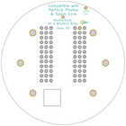

Contents
========

* [PRA2268 > Adafruit Particle Spark Neopixel Ring PCB](#pra2268--adafruit-particle-spark-neopixel-ring-pcb)
	* [Schematic](#schematic)
	* [PCB](#pcb)
	* [Interactive BOM](#interactive-bom)
	* [OOMP Parts](#oomp-parts)
	* [Images](#images)
	* [Tags](#tags)
  
![][im]
# PRA2268 > Adafruit Particle Spark Neopixel Ring PCB

- ID: PROJ-ADAF-2268-STAN-01
- Hex ID: PRA2268
- Name: Adafruit
- Description: Adafruit
- Long Link: [http://oom.lt/PROJ-ADAF-2268-STAN-01](http://oom.lt/PROJ-ADAF-2268-STAN-01)
- Short Link: [http://oom.lt/PRA2268](http://oom.lt/PRA2268)

## Schematic
  

## PCB
  

## Interactive BOM

- Interactive BOM page: [ibom.html](https://htmlpreview.github.io/?https://github.com/oomlout/oomlout_OOMP_projects/blob/main/PROJ-ADAF-2268-STAN-01/kicad/bom/ibom.html)

## OOMP Parts
  

|OOMP Parts|
| :---: |
|[CAPC-0603-X-UF1-V25  SMD (0603) 1 uF Capacitor (Ceramic) 25v  C2, C3, C4, C5, C7, C8, C10, C12, C14, C16, C17, C19, C20, C21, C22](https://github.com/oomlout/oomlout_OOMP_parts/tree/main/CAPC-0603-X-UF1-V25/)|
|[DIOD-S123-X-KMBR120-01  SMD (SOD-123) MBR120 Diode  D1](https://github.com/oomlout/oomlout_OOMP_parts/tree/main/DIOD-S123-X-KMBR120-01/)|
|UNMATCHED-SO235-X-UNMATCHED-01 IC1|
|HEAD-I01-X-PI01-01 JP1, JP2|
|[LEDS-5050-RGB-K2812-01  SMD (5050) Smart Controller (WS2812B) RGB LED  LED1, LED2, LED3, LED4, LED5, LED6, LED7, LED8, LED9, LED10, LED11, LED12, LED13, LED14, LED15, LED16, LED17, LED18, LED19, LED20, LED21, LED22, LED23, LED24](https://github.com/oomlout/oomlout_OOMP_parts/tree/main/LEDS-5050-RGB-K2812-01/)|
|RESE-0603-X-UNMATCHED-01 R1|
|UNMATCHED-UNMATCHED-X-UNMATCHED-01 U$2, X1|

## Images
  
  

|bominteractivefront|bominteractiveback|kicadPcb3d|kicadPcb3dFront|kicadPcb3dBack|eagleImage|eagleSchemImage|pcbdraw|pcbdrawback|
| :---: | :---: | :---: | :---: | :---: | :---: | :---: | :---: | :---: |
||||||||||

## Tags

- hexID: PRA2268
- oompType: PROJ
- oompSize: ADAF
- oompColor: 2268
- oompDesc: STAN
- oompIndex: 01
- oompName: Adafruit Particle Spark Neopixel Ring PCB
- sources: All source files from https://github.com/adafruit/Adafruit-Particle-Spark-Neopixel-Ring-PCB (source licence details in srcLicense.md)
- linkBuyPage: http://www.adafruit.com/products/2268
- oompID: PROJ-ADAF-2268-STAN-01
- oompParts: C2,CAPC-0603-X-UF1-V25
- oompParts: C3,CAPC-0603-X-UF1-V25
- oompParts: C4,CAPC-0603-X-UF1-V25
- oompParts: C5,CAPC-0603-X-UF1-V25
- oompParts: C7,CAPC-0603-X-UF1-V25
- oompParts: C8,CAPC-0603-X-UF1-V25
- oompParts: C10,CAPC-0603-X-UF1-V25
- oompParts: C12,CAPC-0603-X-UF1-V25
- oompParts: C14,CAPC-0603-X-UF1-V25
- oompParts: C16,CAPC-0603-X-UF1-V25
- oompParts: C17,CAPC-0603-X-UF1-V25
- oompParts: C19,CAPC-0603-X-UF1-V25
- oompParts: C20,CAPC-0603-X-UF1-V25
- oompParts: C21,CAPC-0603-X-UF1-V25
- oompParts: C22,CAPC-0603-X-UF1-V25
- oompParts: D1,DIOD-S123-X-KMBR120-01
- oompParts: IC1,UNMATCHED-SO235-X-UNMATCHED-01
- oompParts: JP1,HEAD-I01-X-PI01-01
- oompParts: JP2,HEAD-I01-X-PI01-01
- oompParts: LED1,LEDS-5050-RGB-K2812-01
- oompParts: LED2,LEDS-5050-RGB-K2812-01
- oompParts: LED3,LEDS-5050-RGB-K2812-01
- oompParts: LED4,LEDS-5050-RGB-K2812-01
- oompParts: LED5,LEDS-5050-RGB-K2812-01
- oompParts: LED6,LEDS-5050-RGB-K2812-01
- oompParts: LED7,LEDS-5050-RGB-K2812-01
- oompParts: LED8,LEDS-5050-RGB-K2812-01
- oompParts: LED9,LEDS-5050-RGB-K2812-01
- oompParts: LED10,LEDS-5050-RGB-K2812-01
- oompParts: LED11,LEDS-5050-RGB-K2812-01
- oompParts: LED12,LEDS-5050-RGB-K2812-01
- oompParts: LED13,LEDS-5050-RGB-K2812-01
- oompParts: LED14,LEDS-5050-RGB-K2812-01
- oompParts: LED15,LEDS-5050-RGB-K2812-01
- oompParts: LED16,LEDS-5050-RGB-K2812-01
- oompParts: LED17,LEDS-5050-RGB-K2812-01
- oompParts: LED18,LEDS-5050-RGB-K2812-01
- oompParts: LED19,LEDS-5050-RGB-K2812-01
- oompParts: LED20,LEDS-5050-RGB-K2812-01
- oompParts: LED21,LEDS-5050-RGB-K2812-01
- oompParts: LED22,LEDS-5050-RGB-K2812-01
- oompParts: LED23,LEDS-5050-RGB-K2812-01
- oompParts: LED24,LEDS-5050-RGB-K2812-01
- oompParts: R1,RESE-0603-X-UNMATCHED-01
- oompParts: U$2,UNMATCHED-UNMATCHED-X-UNMATCHED-01
- oompParts: X1,UNMATCHED-UNMATCHED-X-UNMATCHED-01
- rawParts: C2,1uF,C-EUC0603,C0603,CAPACITOR, European symbol,,
- rawParts: C3,1uF,C-EUC0603,C0603,CAPACITOR, European symbol,,
- rawParts: C4,1uF,C-EUC0603,C0603,CAPACITOR, European symbol,,
- rawParts: C5,1uF,C-EUC0603,C0603,CAPACITOR, European symbol,,
- rawParts: C7,1uF,C-EUC0603,C0603,CAPACITOR, European symbol,,
- rawParts: C8,1uF,C-EUC0603,C0603,CAPACITOR, European symbol,,
- rawParts: C10,1uF,C-EUC0603,C0603,CAPACITOR, European symbol,,
- rawParts: C12,1uF,C-EUC0603,C0603,CAPACITOR, European symbol,,
- rawParts: C14,1uF,C-EUC0603,C0603,CAPACITOR, European symbol,,
- rawParts: C16,1uF,C-EUC0603,C0603,CAPACITOR, European symbol,,
- rawParts: C17,1uF,C-EUC0603,C0603,CAPACITOR, European symbol,,
- rawParts: C19,1uF,C-EUC0603,C0603,CAPACITOR, European symbol,,
- rawParts: C20,1uF,C-EUC0603,C0603,CAPACITOR, European symbol,,
- rawParts: C21,1uF,C-EUC0603,C0603,CAPACITOR, European symbol,,
- rawParts: C22,1uF,C-EUC0603,C0603,CAPACITOR, European symbol,,
- rawParts: D1,MBR120,DIODESOD-123,SOD-123,Diode,,
- rawParts: FID1,FIDUCIAL,FIDUCIAL,FIDUCIAL_1MM,Fiducial Alignment Points,EXCLUDE,
- rawParts: FID2,FIDUCIAL,FIDUCIAL,FIDUCIAL_1MM,Fiducial Alignment Points,EXCLUDE,
- rawParts: IC1,74AHC1G125DBV,74AHC1G125DBV,SOT23-5,Single Bus Buffer Gate with 3-State Output,,
- rawParts: JP1,,HEADER-1X1ROUND,1X01_ROUND,PIN HEADER,,
- rawParts: JP2,,PINHD-1X1CB,1X01-CLEANBIG,Pin header 1x1 for 0.1 spacing,,
- rawParts: LED1,WS2812B5050,WS2812B5050-NARROW,WS2812B-NARROW,,,
- rawParts: LED2,WS2812B5050,WS2812B5050-NARROW,WS2812B-NARROW,,,
- rawParts: LED3,WS2812B5050,WS2812B5050-NARROW,WS2812B-NARROW,,,
- rawParts: LED4,WS2812B5050,WS2812B5050-NARROW,WS2812B-NARROW,,,
- rawParts: LED5,WS2812B5050,WS2812B5050-NARROW,WS2812B-NARROW,,,
- rawParts: LED6,WS2812B5050,WS2812B5050-NARROW,WS2812B-NARROW,,,
- rawParts: LED7,WS2812B5050,WS2812B5050-NARROW,WS2812B-NARROW,,,
- rawParts: LED8,WS2812B5050,WS2812B5050-NARROW,WS2812B-NARROW,,,
- rawParts: LED9,WS2812B5050,WS2812B5050-NARROW,WS2812B-NARROW,,,
- rawParts: LED10,WS2812B5050,WS2812B5050-NARROW,WS2812B-NARROW,,,
- rawParts: LED11,WS2812B5050,WS2812B5050-NARROW,WS2812B-NARROW,,,
- rawParts: LED12,WS2812B5050,WS2812B5050-NARROW,WS2812B-NARROW,,,
- rawParts: LED13,WS2812B5050,WS2812B5050-NARROW,WS2812B-NARROW,,,
- rawParts: LED14,WS2812B5050,WS2812B5050-NARROW,WS2812B-NARROW,,,
- rawParts: LED15,WS2812B5050,WS2812B5050-NARROW,WS2812B-NARROW,,,
- rawParts: LED16,WS2812B5050,WS2812B5050-NARROW,WS2812B-NARROW,,,
- rawParts: LED17,WS2812B5050,WS2812B5050-NARROW,WS2812B-NARROW,,,
- rawParts: LED18,WS2812B5050,WS2812B5050-NARROW,WS2812B-NARROW,,,
- rawParts: LED19,WS2812B5050,WS2812B5050-NARROW,WS2812B-NARROW,,,
- rawParts: LED20,WS2812B5050,WS2812B5050-NARROW,WS2812B-NARROW,,,
- rawParts: LED21,WS2812B5050,WS2812B5050-NARROW,WS2812B-NARROW,,,
- rawParts: LED22,WS2812B5050,WS2812B5050-NARROW,WS2812B-NARROW,,,
- rawParts: LED23,WS2812B5050,WS2812B5050-NARROW,WS2812B-NARROW,,,
- rawParts: LED24,WS2812B5050,WS2812B5050-NARROW,WS2812B-NARROW,,,
- rawParts: R1,470 ohm,RESISTOR_0603_NOOUT,0603-NO,Resistors,,
- rawParts: SJ2,,SOLDERJUMPER_CLOSED,SOLDERJUMPER_CLOSEDWIRE,Solder Jumper - Closed,,
- rawParts: U$2,PHOTON,SPARK_CORE,SPARK_CORE_STACKABLE,,,
- rawParts: U$3,MOUNTINGHOLE3.0THIN,MOUNTINGHOLE3.0THIN,MOUNTINGHOLE_3.0_PLATEDTHIN,Mounting Hole,EXCLUDE,
- rawParts: U$4,MOUNTINGHOLE3.0THIN,MOUNTINGHOLE3.0THIN,MOUNTINGHOLE_3.0_PLATEDTHIN,Mounting Hole,EXCLUDE,
- rawParts: U$5,MOUNTINGHOLE3.0THIN,MOUNTINGHOLE3.0THIN,MOUNTINGHOLE_3.0_PLATEDTHIN,Mounting Hole,EXCLUDE,
- rawParts: U$6,MOUNTINGHOLE3.0THIN,MOUNTINGHOLE3.0THIN,MOUNTINGHOLE_3.0_PLATEDTHIN,Mounting Hole,EXCLUDE,
- rawParts: U$9,MOUNTINGHOLE3.0THIN,MOUNTINGHOLE3.0THIN,MOUNTINGHOLE_3.0_PLATEDTHIN,Mounting Hole,EXCLUDE,
- rawParts: U$10,MOUNTINGHOLE3.0THIN,MOUNTINGHOLE3.0THIN,MOUNTINGHOLE_3.0_PLATEDTHIN,Mounting Hole,EXCLUDE,
- rawParts: X1,JST-2PH,CON_JST_PH_2PIN,JSTPH2,JST 2-Pin Right-Angle Connector,,

[im]: kicadPcb3d_450.png
