Contents
========

* [PRA2298 > Adafruit PiTFT Plus 2.8 PCB](#pra2298--adafruit-pitft-plus-28-pcb)
	* [Schematic](#schematic)
	* [PCB](#pcb)
	* [Interactive BOM](#interactive-bom)
	* [OOMP Parts](#oomp-parts)
	* [Images](#images)
	* [Tags](#tags)
  
![][im]
# PRA2298 > Adafruit PiTFT Plus 2.8 PCB

- ID: PROJ-ADAF-2298-STAN-01
- Hex ID: PRA2298
- Name: Adafruit 2298
- Description: Adafruit 2298
- Long Link: [http://oom.lt/PROJ-ADAF-2298-STAN-01](http://oom.lt/PROJ-ADAF-2298-STAN-01)
- Short Link: [http://oom.lt/PRA2298](http://oom.lt/PRA2298)

## Schematic
  
[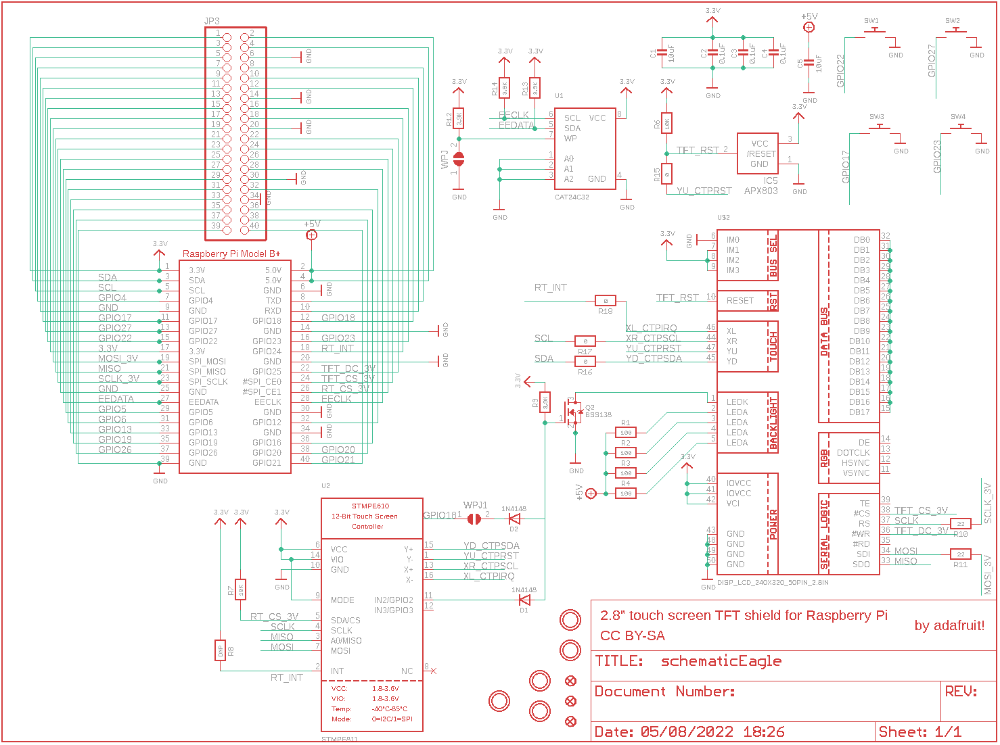](eagleSchemImage.png)
## PCB
  
[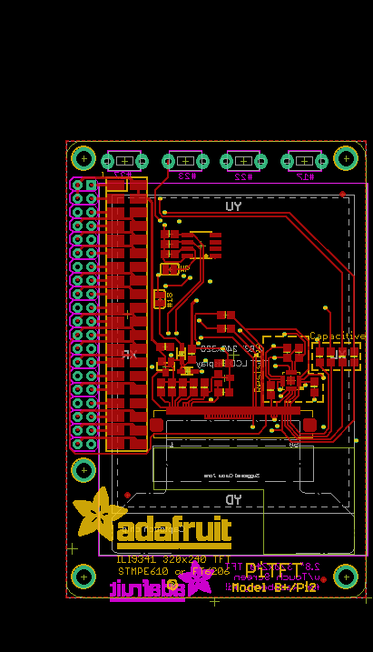](eagleImage.png)
## Interactive BOM

- Interactive BOM page: [ibom.html](https://htmlpreview.github.io/?https://github.com/oomlout/oomlout_OOMP_projects/blob/main/PROJ-ADAF-2298-STAN-01/kicad/bom/ibom.html)

## OOMP Parts
  

|OOMP ID|Name|Identifier|
| :---: | :---: | :---: |
|[CAPC-0805-X-UF10-V10](https://github.com/oomlout/oomlout_OOMP_parts/tree/main/CAPC-0805-X-UF10-V10/)|[SMD (0805) 10 uF Capacitor (Ceramic) 10v](https://github.com/oomlout/oomlout_OOMP_parts/tree/main/CAPC-0805-X-UF10-V10/)|[C1, C5](https://github.com/oomlout/oomlout_OOMP_parts/tree/main/CAPC-0805-X-UF10-V10/)|
|[CAPC-0805-X-NF100-V50](https://github.com/oomlout/oomlout_OOMP_parts/tree/main/CAPC-0805-X-NF100-V50/)|[SMD (0805) 100 nF Capacitor (Ceramic) 50v](https://github.com/oomlout/oomlout_OOMP_parts/tree/main/CAPC-0805-X-NF100-V50/)|[C2, C3, C4](https://github.com/oomlout/oomlout_OOMP_parts/tree/main/CAPC-0805-X-NF100-V50/)|
|[DIOD-S323-X-K4148-01](https://github.com/oomlout/oomlout_OOMP_parts/tree/main/DIOD-S323-X-K4148-01/)|[SMD (SOD-323) Diode](https://github.com/oomlout/oomlout_OOMP_parts/tree/main/DIOD-S323-X-K4148-01/)|[D1, D2](https://github.com/oomlout/oomlout_OOMP_parts/tree/main/DIOD-S323-X-K4148-01/)|
|UNMATCHED-SO23-X-UNMATCHED-01||IC5|
|HEAD-I01-X-PI2X20-01||JP3|
|[MOSN-SO23-X-KBSS138-01](https://github.com/oomlout/oomlout_OOMP_parts/tree/main/MOSN-SO23-X-KBSS138-01/)|[SMD (SOT-23) BSS138 N-Ch. MOSFET](https://github.com/oomlout/oomlout_OOMP_parts/tree/main/MOSN-SO23-X-KBSS138-01/)|[Q2](https://github.com/oomlout/oomlout_OOMP_parts/tree/main/MOSN-SO23-X-KBSS138-01/)|
|[RESE-0805-X-O101-01](https://github.com/oomlout/oomlout_OOMP_parts/tree/main/RESE-0805-X-O101-01/)|[SMD (0805) 100 Ohm Resistor](https://github.com/oomlout/oomlout_OOMP_parts/tree/main/RESE-0805-X-O101-01/)|[R1, R2, R3, R4](https://github.com/oomlout/oomlout_OOMP_parts/tree/main/RESE-0805-X-O101-01/)|
|[RESE-0805-X-O103-01](https://github.com/oomlout/oomlout_OOMP_parts/tree/main/RESE-0805-X-O103-01/)|[SMD (0805) 10k Ohm Resistor](https://github.com/oomlout/oomlout_OOMP_parts/tree/main/RESE-0805-X-O103-01/)|[R6, R7](https://github.com/oomlout/oomlout_OOMP_parts/tree/main/RESE-0805-X-O103-01/)|
|RESE-0805-X-UNMATCHED-01||R8, R15, R16, R17, R18|
|RESE-0805-X-O392-01||R9, R12, R13, R14|
|[RESE-0805-X-O220-01](https://github.com/oomlout/oomlout_OOMP_parts/tree/main/RESE-0805-X-O220-01/)|[SMD (0805) 22 Ohm Resistor](https://github.com/oomlout/oomlout_OOMP_parts/tree/main/RESE-0805-X-O220-01/)|[R10, R11](https://github.com/oomlout/oomlout_OOMP_parts/tree/main/RESE-0805-X-O220-01/)|
|UNMATCHED-UNMATCHED-X-UNMATCHED-01||RPI1, SW1, SW2, SW3, SW4, U$2, U1, U2|

## Images
  
  

|bominteractivefront|bominteractiveback|kicadPcb3d|kicadPcb3dFront|kicadPcb3dBack|kicadSchem|eagleImage|eagleSchemImage|pcbdraw|pcbdrawback|
| :---: | :---: | :---: | :---: | :---: | :---: | :---: | :---: | :---: | :---: |
|[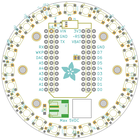](bomFront.png)|[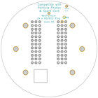](bomBack.png)|[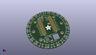](kicadPcb3d.png)||[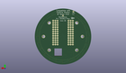](kicadPcb3dBack.png)|[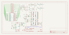](kicadSchem.png)|[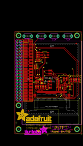](eagleImage.png)|[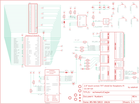](eagleSchemImage.png)|[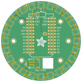](pcbdraw.png)|[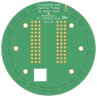](pcbdrawBack.png)|

## Tags

- hexID: PRA2298
- oompType: PROJ
- oompSize: ADAF
- oompColor: 2298
- oompDesc: STAN
- oompIndex: 01
- oompName: Adafruit PiTFT Plus 2.8 PCB
- sources: All source files from https://github.com/adafruit/Adafruit-PiTFT-Plus-2.8-PCB (source licence details in srcLicense.md)
- linkBuyPage: http://www.adafruit.com/products/2298
- oompID: PROJ-ADAF-2298-STAN-01
- oompParts: C1,CAPC-0805-X-UF10-V10
- oompParts: C2,CAPC-0805-X-NF100-V50
- oompParts: C3,CAPC-0805-X-NF100-V50
- oompParts: C4,CAPC-0805-X-NF100-V50
- oompParts: C5,CAPC-0805-X-UF10-V10
- oompParts: D1,DIOD-S323-X-K4148-01
- oompParts: D2,DIOD-S323-X-K4148-01
- oompParts: IC5,UNMATCHED-SO23-X-UNMATCHED-01
- oompParts: JP3,HEAD-I01-X-PI2X20-01
- oompParts: Q2,MOSN-SO23-X-KBSS138-01
- oompParts: R1,RESE-0805-X-O101-01
- oompParts: R2,RESE-0805-X-O101-01
- oompParts: R3,RESE-0805-X-O101-01
- oompParts: R4,RESE-0805-X-O101-01
- oompParts: R6,RESE-0805-X-O103-01
- oompParts: R7,RESE-0805-X-O103-01
- oompParts: R8,RESE-0805-X-UNMATCHED-01
- oompParts: R9,RESE-0805-X-O392-01
- oompParts: R10,RESE-0805-X-O220-01
- oompParts: R11,RESE-0805-X-O220-01
- oompParts: R12,RESE-0805-X-O392-01
- oompParts: R13,RESE-0805-X-O392-01
- oompParts: R14,RESE-0805-X-O392-01
- oompParts: R15,RESE-0805-X-UNMATCHED-01
- oompParts: R16,RESE-0805-X-UNMATCHED-01
- oompParts: R17,RESE-0805-X-UNMATCHED-01
- oompParts: R18,RESE-0805-X-UNMATCHED-01
- oompParts: RPI1,UNMATCHED-UNMATCHED-X-UNMATCHED-01
- oompParts: SW1,UNMATCHED-UNMATCHED-X-UNMATCHED-01
- oompParts: SW2,UNMATCHED-UNMATCHED-X-UNMATCHED-01
- oompParts: SW3,UNMATCHED-UNMATCHED-X-UNMATCHED-01
- oompParts: SW4,UNMATCHED-UNMATCHED-X-UNMATCHED-01
- oompParts: U$2,UNMATCHED-UNMATCHED-X-UNMATCHED-01
- oompParts: U1,UNMATCHED-UNMATCHED-X-UNMATCHED-01
- oompParts: U2,UNMATCHED-UNMATCHED-X-UNMATCHED-01
- rawParts: C1,10uF,CAP_CERAMIC0805-NOOUTLINE,0805-NO,Ceramic Capacitors,,
- rawParts: C2,0.1uF,CAP_CERAMIC0805-NOOUTLINE,0805-NO,Ceramic Capacitors,,
- rawParts: C3,0.1uF,CAP_CERAMIC0805-NOOUTLINE,0805-NO,Ceramic Capacitors,,
- rawParts: C4,0.1uF,CAP_CERAMIC0805-NOOUTLINE,0805-NO,Ceramic Capacitors,,
- rawParts: C5,10uF,CAP_CERAMIC0805-NOOUTLINE,0805-NO,Ceramic Capacitors,,
- rawParts: D1,1N4148,DIODESOD-323,SOD-323,Diode,,
- rawParts: D2,1N4148,DIODESOD-323,SOD-323,Diode,,
- rawParts: IC5,APX803,AXP083-SAG,SOT23,,,
- rawParts: JP3,,PINHD-2X20_SMT,2X20_SMT_MALE,PIN HEADER,,
- rawParts: Q2,BSS138,MOSFET-NWIDE,SOT23-WIDE,N-Channel Mosfet,,
- rawParts: R1,100,RESISTOR0805_NOOUTLINE,0805-NO,Resistors,,
- rawParts: R2,100,RESISTOR0805_NOOUTLINE,0805-NO,Resistors,,
- rawParts: R3,100,RESISTOR0805_NOOUTLINE,0805-NO,Resistors,,
- rawParts: R4,100,RESISTOR0805_NOOUTLINE,0805-NO,Resistors,,
- rawParts: R6,10K,RESISTOR0805_NOOUTLINE,0805-NO,Resistors,,
- rawParts: R7,10K,RESISTOR0805_NOOUTLINE,0805-NO,Resistors,,
- rawParts: R8,DNP,RESISTOR0805_NOOUTLINE,0805-NO,Resistors,,
- rawParts: R9,3.9K,RESISTOR0805_NOOUTLINE,0805-NO,Resistors,,
- rawParts: R10,22,RESISTOR0805_NOOUTLINE,0805-NO,Resistors,,
- rawParts: R11,22,RESISTOR0805_NOOUTLINE,0805-NO,Resistors,,
- rawParts: R12,3.9K,RESISTOR0805_NOOUTLINE,0805-NO,Resistors,,
- rawParts: R13,3.9K,RESISTOR0805_NOOUTLINE,0805-NO,Resistors,,
- rawParts: R14,3.9K,RESISTOR0805_NOOUTLINE,0805-NO,Resistors,,
- rawParts: R15,0,RESISTOR0805_NOOUTLINE,0805-NO,Resistors,,
- rawParts: R16,0,RESISTOR0805_NOOUTLINE,0805-NO,Resistors,,
- rawParts: R17,0,RESISTOR0805_NOOUTLINE,0805-NO,Resistors,,
- rawParts: R18,0,RESISTOR0805_NOOUTLINE,0805-NO,Resistors,,
- rawParts: RPI1,RASPBERRYPI_BPLUS_SHIELD_NODIM,RASPBERRYPI_BPLUS_SHIELD_NODIM,RASPBERRYPI_BPLUS_SHIELD_NODIM,,,
- rawParts: SW1,,SWITCH_PUSHBUTTONEVQ-PE,TACT_PANA-EVQ,Buttons,,
- rawParts: SW2,,SWITCH_PUSHBUTTONEVQ-PE,TACT_PANA-EVQ,Buttons,,
- rawParts: SW3,,SWITCH_PUSHBUTTONEVQ-PE,TACT_PANA-EVQ,Buttons,,
- rawParts: SW4,,SWITCH_PUSHBUTTONEVQ-PE,TACT_PANA-EVQ,Buttons,,
- rawParts: U$2,DISP_LCD_240X320_50PIN_2.8IN,DISP_LCD_240X320_50PIN_2.8IN,TFT_2.83IN_240X320_50PIN,,,
- rawParts: U$3,MOUNTINGHOLE3.0THIN,MOUNTINGHOLE3.0THIN,MOUNTINGHOLE_3.0_PLATEDTHIN,Mounting Hole,EXCLUDE,
- rawParts: U$10,FIDUCIAL,FIDUCIAL,FIDUCIAL_1MM,Fiducial Alignment Points,EXCLUDE,
- rawParts: U$11,FIDUCIAL,FIDUCIAL,FIDUCIAL_1MM,Fiducial Alignment Points,EXCLUDE,
- rawParts: U$15,MOUNTINGHOLE3.0THIN,MOUNTINGHOLE3.0THIN,MOUNTINGHOLE_3.0_PLATEDTHIN,Mounting Hole,EXCLUDE,
- rawParts: U$16,MOUNTINGHOLE3.0THIN,MOUNTINGHOLE3.0THIN,MOUNTINGHOLE_3.0_PLATEDTHIN,Mounting Hole,EXCLUDE,
- rawParts: U$17,MOUNTINGHOLE3.0THIN,MOUNTINGHOLE3.0THIN,MOUNTINGHOLE_3.0_PLATEDTHIN,Mounting Hole,EXCLUDE,
- rawParts: U$18,FIDUCIAL,FIDUCIAL,FIDUCIAL_1MM,Fiducial Alignment Points,EXCLUDE,
- rawParts: U$40,MOUNTINGHOLE3.0THIN,MOUNTINGHOLE3.0THIN,MOUNTINGHOLE_3.0_PLATEDTHIN,Mounting Hole,EXCLUDE,
- rawParts: U1,CAT24C32,EEPROM_I2C_SOIC8_GENERIC,SOIC8_150MIL,Note: The same pinout is used for many I2C EEPROMs in SOIC8(150mil) from a variety of manufacturers and in various sizes.,,
- rawParts: U2,STMPE811,STMPE610,QFN16_3MM,STMPE610 - 12-Bit Touch Screen Controller,,
- rawParts: WPJ,,SOLDERJUMPERCLOSED,SOLDERJUMPER_CLOSEDWIRE,SMD Solder JUMPER,,
- rawParts: WPJ1,,SOLDERJUMPERCLOSED,SOLDERJUMPER_CLOSEDWIRE,SMD Solder JUMPER,,

[im]: kicadPcb3d_450.png
