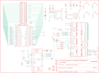

Contents
========

* [PRA2298 > Adafruit](#pra2298--adafruit)
	* [Schematic](#schematic)
	* [Interactive BOM](#interactive-bom)
	* [OOMP Parts](#oomp-parts)
	* [Images](#images)
	* [Tags](#tags)
  
![][im]
# PRA2298 > Adafruit

- ID: PROJ-ADAF-2298-STAN-01
- Hex ID: PRA2298
- Name: Adafruit
- Description: Adafruit
- Long Link: [http://oom.lt/PROJ-ADAF-2298-STAN-01](http://oom.lt/PROJ-ADAF-2298-STAN-01)
- Short Link: [http://oom.lt/PRA2298](http://oom.lt/PRA2298)

## Schematic
  

## Interactive BOM

- Interactive BOM page: [ibom.html](https://htmlpreview.github.io/?https://github.com/oomlout/oomlout_OOMP_projects/blob/main/PROJ-ADAF-2298-STAN-01/kicad/bom/ibom.html)

## OOMP Parts
  

|OOMP Parts|
| :---: |
|C1,CAPC-0805-X-UF10-V10,C1,10uF,CAP_CERAMIC0805-NOOUTLINE,0805-NO,Ceramic Capacitors,,|
|C2,CAPC-0805-X-NF100-V50,C2,0.1uF,CAP_CERAMIC0805-NOOUTLINE,0805-NO,Ceramic Capacitors,,|
|C3,CAPC-0805-X-NF100-V50,C3,0.1uF,CAP_CERAMIC0805-NOOUTLINE,0805-NO,Ceramic Capacitors,,|
|C4,CAPC-0805-X-NF100-V50,C4,0.1uF,CAP_CERAMIC0805-NOOUTLINE,0805-NO,Ceramic Capacitors,,|
|C5,CAPC-0805-X-UF10-V10,C5,10uF,CAP_CERAMIC0805-NOOUTLINE,0805-NO,Ceramic Capacitors,,|
|D1,DIOD-S323-X-K4148-01,D1,1N4148,DIODESOD-323,SOD-323,Diode,,|
|D2,DIOD-S323-X-K4148-01,D2,1N4148,DIODESOD-323,SOD-323,Diode,,|
|IC5,UNMATCHED-SO23-X-UNMATCHED-01,IC5,APX803,AXP083-SAG,SOT23,,,|
|JP3,UNMATCHED-UNMATCHED-X-UNMATCHED-01,JP3,,PINHD-2X20_SMT,2X20_SMT_MALE,PIN HEADER,,|
|Q2,MOSN-SO23-X-KBSS138-01,Q2,BSS138,MOSFET-NWIDE,SOT23-WIDE,N-Channel Mosfet,,|
|R1,RESE-0805-X-O101-01,R1,100,RESISTOR0805_NOOUTLINE,0805-NO,Resistors,,|
|R2,RESE-0805-X-O101-01,R2,100,RESISTOR0805_NOOUTLINE,0805-NO,Resistors,,|
|R3,RESE-0805-X-O101-01,R3,100,RESISTOR0805_NOOUTLINE,0805-NO,Resistors,,|
|R4,RESE-0805-X-O101-01,R4,100,RESISTOR0805_NOOUTLINE,0805-NO,Resistors,,|
|R6,RESE-0805-X-O103-01,R6,10K,RESISTOR0805_NOOUTLINE,0805-NO,Resistors,,|
|R7,RESE-0805-X-O103-01,R7,10K,RESISTOR0805_NOOUTLINE,0805-NO,Resistors,,|
|R8,RESE-0805-X-UNMATCHED-01,R8,DNP,RESISTOR0805_NOOUTLINE,0805-NO,Resistors,,|
|R9,RESE-0805-X-UNMATCHED-01,R9,3.9K,RESISTOR0805_NOOUTLINE,0805-NO,Resistors,,|
|R10,RESE-0805-X-O21-01,R10,22,RESISTOR0805_NOOUTLINE,0805-NO,Resistors,,|
|R11,RESE-0805-X-O21-01,R11,22,RESISTOR0805_NOOUTLINE,0805-NO,Resistors,,|
|R12,RESE-0805-X-UNMATCHED-01,R12,3.9K,RESISTOR0805_NOOUTLINE,0805-NO,Resistors,,|
|R13,RESE-0805-X-UNMATCHED-01,R13,3.9K,RESISTOR0805_NOOUTLINE,0805-NO,Resistors,,|
|R14,RESE-0805-X-UNMATCHED-01,R14,3.9K,RESISTOR0805_NOOUTLINE,0805-NO,Resistors,,|
|R15,RESE-0805-X-UNMATCHED-01,R15,0,RESISTOR0805_NOOUTLINE,0805-NO,Resistors,,|
|R16,RESE-0805-X-UNMATCHED-01,R16,0,RESISTOR0805_NOOUTLINE,0805-NO,Resistors,,|
|R17,RESE-0805-X-UNMATCHED-01,R17,0,RESISTOR0805_NOOUTLINE,0805-NO,Resistors,,|
|R18,RESE-0805-X-UNMATCHED-01,R18,0,RESISTOR0805_NOOUTLINE,0805-NO,Resistors,,|
|RPI1,UNMATCHED-UNMATCHED-X-UNMATCHED-01,RPI1,RASPBERRYPI_BPLUS_SHIELD_NODIM,RASPBERRYPI_BPLUS_SHIELD_NODIM,RASPBERRYPI_BPLUS_SHIELD_NODIM,,,|
|SW1,UNMATCHED-UNMATCHED-X-UNMATCHED-01,SW1,,SWITCH_PUSHBUTTONEVQ-PE,TACT_PANA-EVQ,Buttons,,|
|SW2,UNMATCHED-UNMATCHED-X-UNMATCHED-01,SW2,,SWITCH_PUSHBUTTONEVQ-PE,TACT_PANA-EVQ,Buttons,,|
|SW3,UNMATCHED-UNMATCHED-X-UNMATCHED-01,SW3,,SWITCH_PUSHBUTTONEVQ-PE,TACT_PANA-EVQ,Buttons,,|
|SW4,UNMATCHED-UNMATCHED-X-UNMATCHED-01,SW4,,SWITCH_PUSHBUTTONEVQ-PE,TACT_PANA-EVQ,Buttons,,|
|U$2,UNMATCHED-UNMATCHED-X-UNMATCHED-01,U$2,DISP_LCD_240X320_50PIN_2.8IN,DISP_LCD_240X320_50PIN_2.8IN,TFT_2.83IN_240X320_50PIN,,,|
|U1,UNMATCHED-UNMATCHED-X-UNMATCHED-01,U$3,MOUNTINGHOLE3.0THIN,MOUNTINGHOLE3.0THIN,MOUNTINGHOLE_3.0_PLATEDTHIN,Mounting Hole,EXCLUDE,|
|U2,UNMATCHED-UNMATCHED-X-UNMATCHED-01,U$10,FIDUCIAL,FIDUCIAL,FIDUCIAL_1MM,Fiducial Alignment Points,EXCLUDE,|

## Images
  
  

|kicadPcb3d|kicadPcb3dFront|kicadPcb3dBack|eagleImage|eagleSchemImage|
| :---: | :---: | :---: | :---: | :---: |
||||||

## Tags

- hexID: PRA2298
- oompType: PROJ
- oompSize: ADAF
- oompColor: 2298
- oompDesc: STAN
- oompIndex: 01
- oompName: Adafruit PiTFT Plus 2.8 PCB
- sources: All source files from https://github.com/adafruit/Adafruit-PiTFT-Plus-2.8-PCB (source licence details in srcLicense.md)
- linkBuyPage: http://www.adafruit.com/products/2298
- oompID: PROJ-ADAF-2298-STAN-01
- oompParts: C1,CAPC-0805-X-UF10-V10
- oompParts: C2,CAPC-0805-X-NF100-V50
- oompParts: C3,CAPC-0805-X-NF100-V50
- oompParts: C4,CAPC-0805-X-NF100-V50
- oompParts: C5,CAPC-0805-X-UF10-V10
- oompParts: D1,DIOD-S323-X-K4148-01
- oompParts: D2,DIOD-S323-X-K4148-01
- oompParts: IC5,UNMATCHED-SO23-X-UNMATCHED-01
- oompParts: JP3,UNMATCHED-UNMATCHED-X-UNMATCHED-01
- oompParts: Q2,MOSN-SO23-X-KBSS138-01
- oompParts: R1,RESE-0805-X-O101-01
- oompParts: R2,RESE-0805-X-O101-01
- oompParts: R3,RESE-0805-X-O101-01
- oompParts: R4,RESE-0805-X-O101-01
- oompParts: R6,RESE-0805-X-O103-01
- oompParts: R7,RESE-0805-X-O103-01
- oompParts: R8,RESE-0805-X-UNMATCHED-01
- oompParts: R9,RESE-0805-X-UNMATCHED-01
- oompParts: R10,RESE-0805-X-O21-01
- oompParts: R11,RESE-0805-X-O21-01
- oompParts: R12,RESE-0805-X-UNMATCHED-01
- oompParts: R13,RESE-0805-X-UNMATCHED-01
- oompParts: R14,RESE-0805-X-UNMATCHED-01
- oompParts: R15,RESE-0805-X-UNMATCHED-01
- oompParts: R16,RESE-0805-X-UNMATCHED-01
- oompParts: R17,RESE-0805-X-UNMATCHED-01
- oompParts: R18,RESE-0805-X-UNMATCHED-01
- oompParts: RPI1,UNMATCHED-UNMATCHED-X-UNMATCHED-01
- oompParts: SW1,UNMATCHED-UNMATCHED-X-UNMATCHED-01
- oompParts: SW2,UNMATCHED-UNMATCHED-X-UNMATCHED-01
- oompParts: SW3,UNMATCHED-UNMATCHED-X-UNMATCHED-01
- oompParts: SW4,UNMATCHED-UNMATCHED-X-UNMATCHED-01
- oompParts: U$2,UNMATCHED-UNMATCHED-X-UNMATCHED-01
- oompParts: U1,UNMATCHED-UNMATCHED-X-UNMATCHED-01
- oompParts: U2,UNMATCHED-UNMATCHED-X-UNMATCHED-01
- rawParts: C1,10uF,CAP_CERAMIC0805-NOOUTLINE,0805-NO,Ceramic Capacitors,,
- rawParts: C2,0.1uF,CAP_CERAMIC0805-NOOUTLINE,0805-NO,Ceramic Capacitors,,
- rawParts: C3,0.1uF,CAP_CERAMIC0805-NOOUTLINE,0805-NO,Ceramic Capacitors,,
- rawParts: C4,0.1uF,CAP_CERAMIC0805-NOOUTLINE,0805-NO,Ceramic Capacitors,,
- rawParts: C5,10uF,CAP_CERAMIC0805-NOOUTLINE,0805-NO,Ceramic Capacitors,,
- rawParts: D1,1N4148,DIODESOD-323,SOD-323,Diode,,
- rawParts: D2,1N4148,DIODESOD-323,SOD-323,Diode,,
- rawParts: IC5,APX803,AXP083-SAG,SOT23,,,
- rawParts: JP3,,PINHD-2X20_SMT,2X20_SMT_MALE,PIN HEADER,,
- rawParts: Q2,BSS138,MOSFET-NWIDE,SOT23-WIDE,N-Channel Mosfet,,
- rawParts: R1,100,RESISTOR0805_NOOUTLINE,0805-NO,Resistors,,
- rawParts: R2,100,RESISTOR0805_NOOUTLINE,0805-NO,Resistors,,
- rawParts: R3,100,RESISTOR0805_NOOUTLINE,0805-NO,Resistors,,
- rawParts: R4,100,RESISTOR0805_NOOUTLINE,0805-NO,Resistors,,
- rawParts: R6,10K,RESISTOR0805_NOOUTLINE,0805-NO,Resistors,,
- rawParts: R7,10K,RESISTOR0805_NOOUTLINE,0805-NO,Resistors,,
- rawParts: R8,DNP,RESISTOR0805_NOOUTLINE,0805-NO,Resistors,,
- rawParts: R9,3.9K,RESISTOR0805_NOOUTLINE,0805-NO,Resistors,,
- rawParts: R10,22,RESISTOR0805_NOOUTLINE,0805-NO,Resistors,,
- rawParts: R11,22,RESISTOR0805_NOOUTLINE,0805-NO,Resistors,,
- rawParts: R12,3.9K,RESISTOR0805_NOOUTLINE,0805-NO,Resistors,,
- rawParts: R13,3.9K,RESISTOR0805_NOOUTLINE,0805-NO,Resistors,,
- rawParts: R14,3.9K,RESISTOR0805_NOOUTLINE,0805-NO,Resistors,,
- rawParts: R15,0,RESISTOR0805_NOOUTLINE,0805-NO,Resistors,,
- rawParts: R16,0,RESISTOR0805_NOOUTLINE,0805-NO,Resistors,,
- rawParts: R17,0,RESISTOR0805_NOOUTLINE,0805-NO,Resistors,,
- rawParts: R18,0,RESISTOR0805_NOOUTLINE,0805-NO,Resistors,,
- rawParts: RPI1,RASPBERRYPI_BPLUS_SHIELD_NODIM,RASPBERRYPI_BPLUS_SHIELD_NODIM,RASPBERRYPI_BPLUS_SHIELD_NODIM,,,
- rawParts: SW1,,SWITCH_PUSHBUTTONEVQ-PE,TACT_PANA-EVQ,Buttons,,
- rawParts: SW2,,SWITCH_PUSHBUTTONEVQ-PE,TACT_PANA-EVQ,Buttons,,
- rawParts: SW3,,SWITCH_PUSHBUTTONEVQ-PE,TACT_PANA-EVQ,Buttons,,
- rawParts: SW4,,SWITCH_PUSHBUTTONEVQ-PE,TACT_PANA-EVQ,Buttons,,
- rawParts: U$2,DISP_LCD_240X320_50PIN_2.8IN,DISP_LCD_240X320_50PIN_2.8IN,TFT_2.83IN_240X320_50PIN,,,
- rawParts: U$3,MOUNTINGHOLE3.0THIN,MOUNTINGHOLE3.0THIN,MOUNTINGHOLE_3.0_PLATEDTHIN,Mounting Hole,EXCLUDE,
- rawParts: U$10,FIDUCIAL,FIDUCIAL,FIDUCIAL_1MM,Fiducial Alignment Points,EXCLUDE,
- rawParts: U$11,FIDUCIAL,FIDUCIAL,FIDUCIAL_1MM,Fiducial Alignment Points,EXCLUDE,
- rawParts: U$15,MOUNTINGHOLE3.0THIN,MOUNTINGHOLE3.0THIN,MOUNTINGHOLE_3.0_PLATEDTHIN,Mounting Hole,EXCLUDE,
- rawParts: U$16,MOUNTINGHOLE3.0THIN,MOUNTINGHOLE3.0THIN,MOUNTINGHOLE_3.0_PLATEDTHIN,Mounting Hole,EXCLUDE,
- rawParts: U$17,MOUNTINGHOLE3.0THIN,MOUNTINGHOLE3.0THIN,MOUNTINGHOLE_3.0_PLATEDTHIN,Mounting Hole,EXCLUDE,
- rawParts: U$18,FIDUCIAL,FIDUCIAL,FIDUCIAL_1MM,Fiducial Alignment Points,EXCLUDE,
- rawParts: U$40,MOUNTINGHOLE3.0THIN,MOUNTINGHOLE3.0THIN,MOUNTINGHOLE_3.0_PLATEDTHIN,Mounting Hole,EXCLUDE,
- rawParts: U1,CAT24C32,EEPROM_I2C_SOIC8_GENERIC,SOIC8_150MIL,Note: The same pinout is used for many I2C EEPROMs in SOIC8(150mil) from a variety of manufacturers and in various sizes.,,
- rawParts: U2,STMPE811,STMPE610,QFN16_3MM,STMPE610 - 12-Bit Touch Screen Controller,,
- rawParts: WPJ,,SOLDERJUMPERCLOSED,SOLDERJUMPER_CLOSEDWIRE,SMD Solder JUMPER,,
- rawParts: WPJ1,,SOLDERJUMPERCLOSED,SOLDERJUMPER_CLOSEDWIRE,SMD Solder JUMPER,,

[im]: kicadPcb3d_450.png
