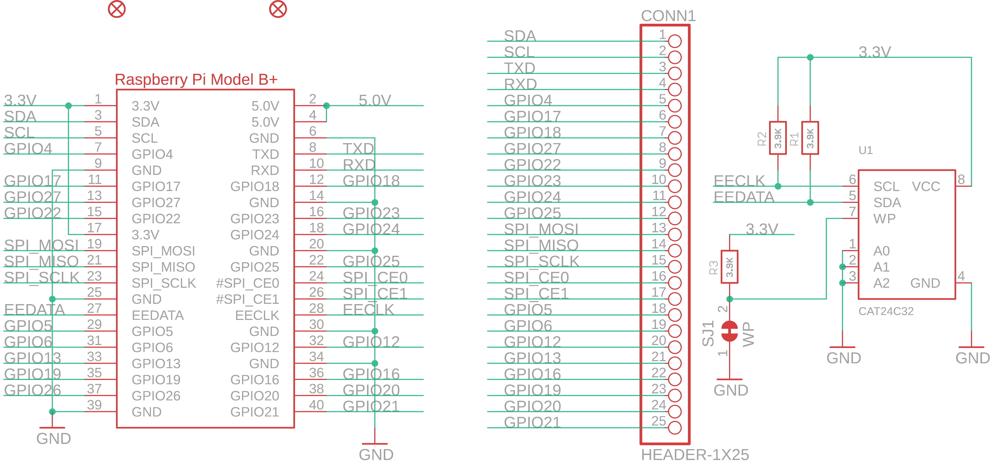

Contents
========

* [PRA2310 > Adafruit Perma Proto HAT PCB](#pra2310--adafruit-perma-proto-hat-pcb)
	* [Schematic](#schematic)
	* [PCB](#pcb)
	* [Interactive BOM](#interactive-bom)
	* [OOMP Parts](#oomp-parts)
	* [Images](#images)
	* [Tags](#tags)
  
![][im]
# PRA2310 > Adafruit Perma Proto HAT PCB

- ID: PROJ-ADAF-2310-STAN-01
- Hex ID: PRA2310
- Name: Adafruit
- Description: Adafruit
- Long Link: [http://oom.lt/PROJ-ADAF-2310-STAN-01](http://oom.lt/PROJ-ADAF-2310-STAN-01)
- Short Link: [http://oom.lt/PRA2310](http://oom.lt/PRA2310)

## Schematic
  

## PCB
  

## Interactive BOM

- Interactive BOM page: [ibom.html](https://htmlpreview.github.io/?https://github.com/oomlout/oomlout_OOMP_projects/blob/main/PROJ-ADAF-2310-STAN-01/kicad/bom/ibom.html)

## OOMP Parts
  

|OOMP ID|Name|Identifier|
| :---: | :---: | :---: |
|HEAD-I01-X-PI25-01||CONN1|
|RESE-0805-X-O392-01||R1, R2, R3|
|UNMATCHED-UNMATCHED-X-UNMATCHED-01||RPI1, U1|

## Images
  
  

|bominteractivefront|bominteractiveback|kicadPcb3d|kicadPcb3dFront|kicadPcb3dBack|eagleImage|eagleSchemImage|pcbdraw|pcbdrawback|
| :---: | :---: | :---: | :---: | :---: | :---: | :---: | :---: | :---: |
||||||||||

## Tags

- hexID: PRA2310
- oompType: PROJ
- oompSize: ADAF
- oompColor: 2310
- oompDesc: STAN
- oompIndex: 01
- oompName: Adafruit Perma Proto HAT PCB
- sources: All source files from https://github.com/adafruit/Adafruit-Perma-Proto-HAT-PCB (source licence details in srcLicense.md)
- linkBuyPage: http://www.adafruit.com/products/2310
- oompID: PROJ-ADAF-2310-STAN-01
- oompParts: CONN1,HEAD-I01-X-PI25-01
- oompParts: R1,RESE-0805-X-O392-01
- oompParts: R2,RESE-0805-X-O392-01
- oompParts: R3,RESE-0805-X-O392-01
- oompParts: RPI1,UNMATCHED-UNMATCHED-X-UNMATCHED-01
- oompParts: U1,UNMATCHED-UNMATCHED-X-UNMATCHED-01
- rawParts: CONN1,HEADER-1X25,HEADER-1X25,1X25_ROUND_70MIL,,,
- rawParts: FID2,FIDUCIAL,FIDUCIAL,FIDUCIAL_1MM,Fiducial Alignment Points,EXCLUDE,
- rawParts: FID3,FIDUCIAL,FIDUCIAL,FIDUCIAL_1MM,Fiducial Alignment Points,EXCLUDE,
- rawParts: R1,3.9K,RESISTOR0805_NOOUTLINE,0805-NO,Resistors,,
- rawParts: R2,3.9K,RESISTOR0805_NOOUTLINE,0805-NO,Resistors,,
- rawParts: R3,3.9K,RESISTOR0805_NOOUTLINE,0805-NO,Resistors,,
- rawParts: RPI1,RASPBERRYPI_BPLUS_HATNOSLOTS,RASPBERRYPI_BPLUS_HATNOSLOTS,PI_HAT_NOSLOTS,,,
- rawParts: SJ1,WP,SOLDERJUMPER_CLOSED,SOLDERJUMPER_CLOSEDWIRE,Solder Jumper - Closed,,
- rawParts: U1,CAT24C32,EEPROM_I2C_SOIC8_GENERIC,SOIC8_150MIL,Note: The same pinout is used for many I2C EEPROMs in SOIC8(150mil) from a variety of manufacturers and in various sizes.,,

[im]: kicadPcb3d_450.png
