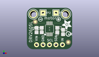

Contents
========

* [PROJ-ADAF-2310-STAN-01>Adafruit Perma Proto HAT PCB](#proj-adaf-2310-stan-01adafruit-perma-proto-hat-pcb)
	* [Images](#images)
	* [Interactive BOM](#interactive-bom)
	* [Tags](#tags)
  
![][im]
# PROJ-ADAF-2310-STAN-01>Adafruit Perma Proto HAT PCB

- ID: PROJ-ADAF-2310-STAN-01
- Hex ID: PRA2310
- Name: Adafruit Perma Proto HAT PCB
- Description: 

## Images
  
  

|eagleImage|kicadPcb3dFront|kicadPcb3dBack|kicadPcb3d|
| :---: | :---: | :---: | :---: |
|||||

## Interactive BOM

- Interactive BOM page: [ibom.html](kicad/bom/ibom.html)

## Tags

- hexID: PRA2310
- oompType: PROJ
- oompSize: ADAF
- oompColor: 2310
- oompDesc: STAN
- oompIndex: 01
- oompName: Adafruit Perma Proto HAT PCB
- sources: All source files from https://github.com/adafruit/Adafruit-Perma-Proto-HAT-PCB (source licence details in srcLicense.md)
- linkBuyPage: http://www.adafruit.com/products/2310
- oompID: PROJ-ADAF-2310-STAN-01
- oompParts: CONN1,UNMATCHED-UNMATCHED-UNMATCHED-UNMATCHED-UNMATCHED
- oompParts: R1,UNMATCHED-UNMATCHED-UNMATCHED-UNMATCHED-UNMATCHED
- oompParts: R2,UNMATCHED-UNMATCHED-UNMATCHED-UNMATCHED-UNMATCHED
- oompParts: R3,UNMATCHED-UNMATCHED-UNMATCHED-UNMATCHED-UNMATCHED
- oompParts: RPI1,UNMATCHED-UNMATCHED-UNMATCHED-UNMATCHED-UNMATCHED
- oompParts: SJ1,UNMATCHED-UNMATCHED-UNMATCHED-UNMATCHED-UNMATCHED
- oompParts: U1,UNMATCHED-UNMATCHED-UNMATCHED-UNMATCHED-UNMATCHED
- rawParts: CONN1,HEADER-1X25,HEADER-1X25,1X25_ROUND_70MIL,,,
- rawParts: FID2,FIDUCIAL,FIDUCIAL,FIDUCIAL_1MM,Fiducial Alignment Points,EXCLUDE,
- rawParts: FID3,FIDUCIAL,FIDUCIAL,FIDUCIAL_1MM,Fiducial Alignment Points,EXCLUDE,
- rawParts: R1,3.9K,RESISTOR0805_NOOUTLINE,0805-NO,Resistors,,
- rawParts: R2,3.9K,RESISTOR0805_NOOUTLINE,0805-NO,Resistors,,
- rawParts: R3,3.9K,RESISTOR0805_NOOUTLINE,0805-NO,Resistors,,
- rawParts: RPI1,RASPBERRYPI_BPLUS_HATNOSLOTS,RASPBERRYPI_BPLUS_HATNOSLOTS,PI_HAT_NOSLOTS,,,
- rawParts: SJ1,WP,SOLDERJUMPER_CLOSED,SOLDERJUMPER_CLOSEDWIRE,Solder Jumper - Closed,,
- rawParts: U1,CAT24C32,EEPROM_I2C_SOIC8_GENERIC,SOIC8_150MIL,Note: The same pinout is used for many I2C EEPROMs in SOIC8(150mil) from a variety of manufacturers and in various sizes.,,

[im]: kicadPcb3d_450.png
