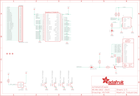

Contents
========

* [PRA2315 > Adafruit PiTFT 2.2 Inch HAT PCB](#pra2315--adafruit-pitft-22-inch-hat-pcb)
	* [Schematic](#schematic)
	* [PCB](#pcb)
	* [Interactive BOM](#interactive-bom)
	* [OOMP Parts](#oomp-parts)
	* [Images](#images)
	* [Tags](#tags)
  
![][im]
# PRA2315 > Adafruit PiTFT 2.2 Inch HAT PCB

- ID: PROJ-ADAF-2315-STAN-01
- Hex ID: PRA2315
- Name: Adafruit
- Description: Adafruit
- Long Link: [http://oom.lt/PROJ-ADAF-2315-STAN-01](http://oom.lt/PROJ-ADAF-2315-STAN-01)
- Short Link: [http://oom.lt/PRA2315](http://oom.lt/PRA2315)

## Schematic
  

## PCB
  

## Interactive BOM

- Interactive BOM page: [ibom.html](https://htmlpreview.github.io/?https://github.com/oomlout/oomlout_OOMP_projects/blob/main/PROJ-ADAF-2315-STAN-01/kicad/bom/ibom.html)

## OOMP Parts
  

|OOMP Parts|
| :---: |
|HEAD-I01-X-PI25-01 CONN1|
|UNMATCHED-SO23-X-UNMATCHED-01 IC5, Q1|
|RESE-0805-X-O392-01 R1, R2, R3|
|[RESE-0805-X-O101-01  SMD (0805) 100 Ohm Resistor  R4, R5, R7, R8](https://github.com/oomlout/oomlout_OOMP_parts/tree/main/RESE-0805-X-O101-01/)|
|[RESE-0805-X-O103-01  SMD (0805) 10k Ohm Resistor  R6](https://github.com/oomlout/oomlout_OOMP_parts/tree/main/RESE-0805-X-O103-01/)|
|[RESE-0805-X-O102-01  SMD (0805) 1k Ohm Resistor  R9, R10](https://github.com/oomlout/oomlout_OOMP_parts/tree/main/RESE-0805-X-O102-01/)|
|UNMATCHED-UNMATCHED-X-UNMATCHED-01 RPI1, U1, U2|
|[BUTA-6060-X-STAN-01  SMD (6060) Pushbutton (Tactile)  SW1, SW2, SW3, SW4](https://github.com/oomlout/oomlout_OOMP_parts/tree/main/BUTA-6060-X-STAN-01/)|

## Images
  
  

|kicadPcb3d|kicadPcb3dFront|kicadPcb3dBack|eagleImage|eagleSchemImage|
| :---: | :---: | :---: | :---: | :---: |
||||||

## Tags

- hexID: PRA2315
- oompType: PROJ
- oompSize: ADAF
- oompColor: 2315
- oompDesc: STAN
- oompIndex: 01
- oompName: Adafruit PiTFT 2.2 Inch HAT PCB
- sources: All source files from https://github.com/adafruit/Adafruit-PiTFT-2.2-Inch-HAT-PCB (source licence details in srcLicense.md)
- linkBuyPage: http://www.adafruit.com/products/2315
- oompID: PROJ-ADAF-2315-STAN-01
- oompParts: CONN1,HEAD-I01-X-PI25-01
- oompParts: IC5,UNMATCHED-SO23-X-UNMATCHED-01
- oompParts: Q1,UNMATCHED-SO23-X-UNMATCHED-01
- oompParts: R1,RESE-0805-X-O392-01
- oompParts: R2,RESE-0805-X-O392-01
- oompParts: R3,RESE-0805-X-O392-01
- oompParts: R4,RESE-0805-X-O101-01
- oompParts: R5,RESE-0805-X-O101-01
- oompParts: R6,RESE-0805-X-O103-01
- oompParts: R7,RESE-0805-X-O101-01
- oompParts: R8,RESE-0805-X-O101-01
- oompParts: R9,RESE-0805-X-O102-01
- oompParts: R10,RESE-0805-X-O102-01
- oompParts: RPI1,UNMATCHED-UNMATCHED-X-UNMATCHED-01
- oompParts: SW1,BUTA-6060-X-STAN-01
- oompParts: SW2,BUTA-6060-X-STAN-01
- oompParts: SW3,BUTA-6060-X-STAN-01
- oompParts: SW4,BUTA-6060-X-STAN-01
- oompParts: U1,UNMATCHED-UNMATCHED-X-UNMATCHED-01
- oompParts: U2,UNMATCHED-UNMATCHED-X-UNMATCHED-01
- rawParts: CONN1,HEADER-1X25,HEADER-1X25,1X25_ROUND_70MIL,,,
- rawParts: FID1,FIDUCIAL,FIDUCIAL,FIDUCIAL_1MM,Fiducial Alignment Points,EXCLUDE,
- rawParts: FID2,FIDUCIAL,FIDUCIAL,FIDUCIAL_1MM,Fiducial Alignment Points,EXCLUDE,
- rawParts: FID3,FIDUCIAL,FIDUCIAL,FIDUCIAL_1MM,Fiducial Alignment Points,EXCLUDE,
- rawParts: IC5,AXP803,AXP083-SAG,SOT23,,,
- rawParts: Q1,MMBT2222,MMBT2222ALT1-NPN-SOT23-BEC,SOT23-BEC,NPN Transistror,,
- rawParts: R1,3.9K,RESISTOR0805_NOOUTLINE,0805-NO,Resistors,,
- rawParts: R2,3.9K,RESISTOR0805_NOOUTLINE,0805-NO,Resistors,,
- rawParts: R3,3.9K,RESISTOR0805_NOOUTLINE,0805-NO,Resistors,,
- rawParts: R4,100,RESISTOR0805_NOOUTLINE,0805-NO,Resistors,,
- rawParts: R5,100,RESISTOR0805_NOOUTLINE,0805-NO,Resistors,,
- rawParts: R6,10K,RESISTOR0805_NOOUTLINE,0805-NO,Resistors,,
- rawParts: R7,100,RESISTOR0805_NOOUTLINE,0805-NO,Resistors,,
- rawParts: R8,100,RESISTOR0805_NOOUTLINE,0805-NO,Resistors,,
- rawParts: R9,1K,RESISTOR0805_NOOUTLINE,0805-NO,Resistors,,
- rawParts: R10,1K,RESISTOR0805_NOOUTLINE,0805-NO,Resistors,,
- rawParts: RPI1,RASPBERRYPI_BPLUS_HATNOSLOTS,RASPBERRYPI_BPLUS_HATNOSLOTS,PI_HAT_NOSLOTS,,,
- rawParts: SJ1,WP,SOLDERJUMPER_CLOSED,SOLDERJUMPER_CLOSEDWIRE,Solder Jumper - Closed,,
- rawParts: SJ2,BACKLITE,SOLDERJUMPERCLOSED,SOLDERJUMPER_CLOSEDWIRE,SMD Solder JUMPER,,
- rawParts: SW1,SPST_TACT-EVQQ2,SPST_TACT-EVQQ2,EVQ-Q2,SMT 6mm switch, EVQQ2 series,,
- rawParts: SW2,SPST_TACT-EVQQ2,SPST_TACT-EVQQ2,EVQ-Q2,SMT 6mm switch, EVQQ2 series,,
- rawParts: SW3,SPST_TACT-EVQQ2,SPST_TACT-EVQQ2,EVQ-Q2,SMT 6mm switch, EVQQ2 series,,
- rawParts: SW4,SPST_TACT-EVQQ2,SPST_TACT-EVQQ2,EVQ-Q2,SMT 6mm switch, EVQQ2 series,,
- rawParts: U1,CAT24C32,EEPROM_I2C_SOIC8_GENERIC,SOIC8_150MIL,Note: The same pinout is used for many I2C EEPROMs in SOIC8(150mil) from a variety of manufacturers and in various sizes.,,
- rawParts: U2,2.2TFT,DISP_LCD_TM022HDH26,TM022HDH26_2.2IN_LCD,TM022HDH26 2.2 Inch 240x320 18-bit LCD - ILI9340C Controller,,

[im]: kicadPcb3d_450.png
