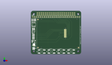

Contents
========

* [PROJ-ADAF-2315-STAN-01>Adafruit PiTFT 2.2 Inch HAT PCB](#proj-adaf-2315-stan-01adafruit-pitft-22-inch-hat-pcb)
	* [Images](#images)
	* [Interactive BOM](#interactive-bom)
	* [Tags](#tags)
  
![][im]
# PROJ-ADAF-2315-STAN-01>Adafruit PiTFT 2.2 Inch HAT PCB

- ID: PROJ-ADAF-2315-STAN-01
- Hex ID: PRA2315
- Name: Adafruit PiTFT 2.2 Inch HAT PCB
- Description: 

## Images
  
  

|eagleImage|kicadPcb3dFront|kicadPcb3dBack|kicadPcb3d|
| :---: | :---: | :---: | :---: |
|||||

## Interactive BOM

- Interactive BOM page: [ibom.html](kicad/bom/ibom.html)

## Tags

- hexID: PRA2315
- oompType: PROJ
- oompSize: ADAF
- oompColor: 2315
- oompDesc: STAN
- oompIndex: 01
- oompName: Adafruit PiTFT 2.2 Inch HAT PCB
- sources: All source files from https://github.com/adafruit/Adafruit-PiTFT-2.2-Inch-HAT-PCB (source licence details in srcLicense.md)
- linkBuyPage: http://www.adafruit.com/products/2315
- oompPart: UNMATCHED-UNMATCHED-X-UNMATCHED-01, CONN1, 32.638999999999996, 48.641, 0
- oompPart: SKIP-UNMATCHED-X-UNMATCHED-01, FID1, 9.143999999999998, 8.509, 0
- oompPart: SKIP-UNMATCHED-X-UNMATCHED-01, FID2, 9.143999999999998, 45.211999999999996, 0
- oompPart: SKIP-UNMATCHED-X-UNMATCHED-01, FID3, 61.722, 8.509, 0
- oompPart: UNMATCHED-UNMATCHED-X-UNMATCHED-01, IC5, 4.826, 16.509999999999998, 180
- oompPart: UNMATCHED-UNMATCHED-X-UNMATCHED-01, Q1, 3.0479999999999996, 28.828999999999997, 270
- oompPart: RESE-0805-X-UNMATCHED-01, R1, 5.842, 44.704, 90
- oompPart: RESE-0805-X-UNMATCHED-01, R2, 3.937, 44.704, 90
- oompPart: RESE-0805-X-UNMATCHED-01, R3, 1.651, 44.704, 270
- oompPart: RESE-0805-X-UNMATCHED-01, R4, 3.302, 20.066, 180
- oompPart: RESE-0805-X-UNMATCHED-01, R5, 3.302, 22.098, 180
- oompPart: RESE-0805-X-O103-01, R6, 1.778, 16.764, 270
- oompPart: RESE-0805-X-UNMATCHED-01, R7, 3.302, 26.162, 180
- oompPart: RESE-0805-X-UNMATCHED-01, R8, 3.302, 24.13, 180
- oompPart: RESE-0805-X-O102-01, R9, 2.2859999999999996, 32.638999999999996, 270
- oompPart: RESE-0805-X-O102-01, R10, 4.3180000000000005, 32.638999999999996, 270
- oompPart: UNMATCHED-UNMATCHED-X-UNMATCHED-01, RPI1, 0.0, 0.0, 0
- oompPart: UNMATCHED-UNMATCHED-X-UNMATCHED-01, SJ1, 3.6829999999999994, 41.783, M0
- oompPart: UNMATCHED-UNMATCHED-X-UNMATCHED-01, SJ2, 3.302, 36.068, M180
- oompPart: UNMATCHED-UNMATCHED-X-UNMATCHED-01, SW1, 52.197, 3.429, 0
- oompPart: UNMATCHED-UNMATCHED-X-UNMATCHED-01, SW2, 39.37, 3.429, 0
- oompPart: UNMATCHED-UNMATCHED-X-UNMATCHED-01, SW3, 26.669999999999998, 3.429, 0
- oompPart: UNMATCHED-UNMATCHED-X-UNMATCHED-01, SW4, 13.97, 3.429, 0
- oompPart: UNMATCHED-UNMATCHED-X-UNMATCHED-01, U1, 3.556, 38.73499999999999, 0
- oompPart: UNMATCHED-UNMATCHED-X-UNMATCHED-01, U2, 33.274, 27.178, 90
- rawPart: 

[im]: kicadPcb3d_450.png
