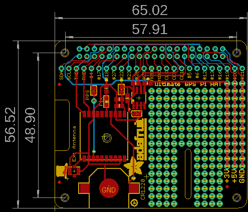
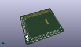
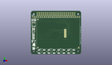
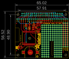
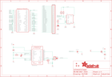

Contents
========

* [PRA2324 > Adafruit Ultimate GPS HAT PCB](#pra2324--adafruit-ultimate-gps-hat-pcb)
	* [Schematic](#schematic)
	* [PCB](#pcb)
	* [Interactive BOM](#interactive-bom)
	* [OOMP Parts](#oomp-parts)
	* [Images](#images)
	* [Tags](#tags)
  
![][im]
# PRA2324 > Adafruit Ultimate GPS HAT PCB

- ID: PROJ-ADAF-2324-STAN-01
- Hex ID: PRA2324
- Name: Adafruit
- Description: Adafruit
- Long Link: [http://oom.lt/PROJ-ADAF-2324-STAN-01](http://oom.lt/PROJ-ADAF-2324-STAN-01)
- Short Link: [http://oom.lt/PRA2324](http://oom.lt/PRA2324)

## Schematic
  

## PCB
  

## Interactive BOM

- Interactive BOM page: [ibom.html](https://htmlpreview.github.io/?https://github.com/oomlout/oomlout_OOMP_projects/blob/main/PROJ-ADAF-2324-STAN-01/kicad/bom/ibom.html)

## OOMP Parts
  

|OOMP Parts|
| :---: |
|UNMATCHED-UNMATCHED-X-UNMATCHED-01 B1, RPI1, U$20, U1, U2|
|CAPC-0805-X-UF1D-01 C1|
|[CAPC-0805-X-UF10-V10  SMD (0805) 10 uF Capacitor (Ceramic) 10v  C2](https://github.com/oomlout/oomlout_OOMP_parts/tree/main/CAPC-0805-X-UF10-V10/)|
|HEAD-I01-X-PI25-01 CONN1|
|FERB-0805-X-UNMATCHED-01 FB1|
|HEAD-I01-X-PI01-01 JP1|
|[LEDS-0805-R-STAN-01  SMD (0805) Red LED  LED1](https://github.com/oomlout/oomlout_OOMP_parts/tree/main/LEDS-0805-R-STAN-01/)|
|RESE-0805-X-O392-01 R1, R2, R3|
|RESE-0805-X-O471-01 R4|

## Images
  
  

|kicadPcb3d|kicadPcb3dFront|kicadPcb3dBack|eagleImage|eagleSchemImage|
| :---: | :---: | :---: | :---: | :---: |
||||||

## Tags

- hexID: PRA2324
- oompType: PROJ
- oompSize: ADAF
- oompColor: 2324
- oompDesc: STAN
- oompIndex: 01
- oompName: Adafruit Ultimate GPS HAT PCB
- sources: All source files from https://github.com/adafruit/Adafruit-Ultimate-GPS-HAT-PCB (source licence details in srcLicense.md)
- linkBuyPage: http://www.adafruit.com/products/2324
- oompID: PROJ-ADAF-2324-STAN-01
- oompParts: B1,UNMATCHED-UNMATCHED-X-UNMATCHED-01
- oompParts: C1,CAPC-0805-X-UF1D-01
- oompParts: C2,CAPC-0805-X-UF10-V10
- oompParts: CONN1,HEAD-I01-X-PI25-01
- oompParts: FB1,FERB-0805-X-UNMATCHED-01
- oompParts: JP1,HEAD-I01-X-PI01-01
- oompParts: LED1,LEDS-0805-R-STAN-01
- oompParts: R1,RESE-0805-X-O392-01
- oompParts: R2,RESE-0805-X-O392-01
- oompParts: R3,RESE-0805-X-O392-01
- oompParts: R4,RESE-0805-X-O471-01
- oompParts: RPI1,UNMATCHED-UNMATCHED-X-UNMATCHED-01
- oompParts: U$20,UNMATCHED-UNMATCHED-X-UNMATCHED-01
- oompParts: U1,UNMATCHED-UNMATCHED-X-UNMATCHED-01
- oompParts: U2,UNMATCHED-UNMATCHED-X-UNMATCHED-01
- rawParts: B1,CR1220,BATTERYCR1220_SMT,CR1220,CR1220 SMT - Digikey: 3001K-ND,,
- rawParts: C1,0.1uF,CAP_CERAMIC0805-NOOUTLINE,0805-NO,Ceramic Capacitors,,
- rawParts: C2,10uF,CAP_CERAMIC0805-NOOUTLINE,0805-NO,Ceramic Capacitors,,
- rawParts: CONN1,HEADER-1X25,HEADER-1X25,1X25_ROUND_70MIL,,,
- rawParts: FB1,Ferrite,FERRITE0805,0805,Ferrite Bead,,
- rawParts: FID1,FIDUCIAL,FIDUCIAL,FIDUCIAL_1MM,Fiducial Alignment Points,EXCLUDE,
- rawParts: FID2,FIDUCIAL,FIDUCIAL,FIDUCIAL_1MM,Fiducial Alignment Points,EXCLUDE,
- rawParts: FID3,FIDUCIAL,FIDUCIAL,FIDUCIAL_1MM,Fiducial Alignment Points,EXCLUDE,
- rawParts: JP1,,PINHD-1X1CB,1X01-CLEANBIG,Pin header 1x1 for 0.1 spacing,,
- rawParts: LED1,RED,LED0805,CHIPLED_0805,LED,,
- rawParts: R1,3.9K,RESISTOR0805_NOOUTLINE,0805-NO,Resistors,,
- rawParts: R2,3.9K,RESISTOR0805_NOOUTLINE,0805-NO,Resistors,,
- rawParts: R3,3.9K,RESISTOR0805_NOOUTLINE,0805-NO,Resistors,,
- rawParts: R4,470,RESISTOR0805_NOOUTLINE,0805-NO,Resistors,,
- rawParts: RPI1,RASPBERRYPI_BPLUS_HATSLOTS,RASPBERRYPI_BPLUS_HATSLOTS,PI_HAT_SLOTS,,,
- rawParts: SJ1,WP,SOLDERJUMPER_CLOSED,SOLDERJUMPER_CLOSEDWIRE,Solder Jumper - Closed,,
- rawParts: SJ2,PPS,SOLDERJUMPER_CLOSED,SOLDERJUMPER_CLOSEDWIRE,Solder Jumper - Closed,,
- rawParts: U$20,U.FL,U.FL,U.FL,U.FL Antenna Connector,,
- rawParts: U1,CAT24C32,EEPROM_I2C_SOIC8_GENERIC,SOIC8_150MIL,Note: The same pinout is used for many I2C EEPROMs in SOIC8(150mil) from a variety of manufacturers and in various sizes.,,
- rawParts: U2,FGPMMOPA6H,GPS_FGPMMOPA6H,FGPMMOPA6H,GPS Module - MTK MT3339 Chipset, -165dBm sensitivity, 22 channels, 10Hz, auto-select external antenna options,,

[im]: kicadPcb3d_450.png
