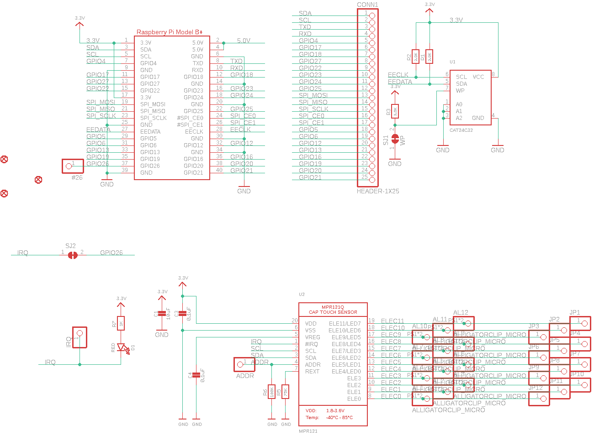
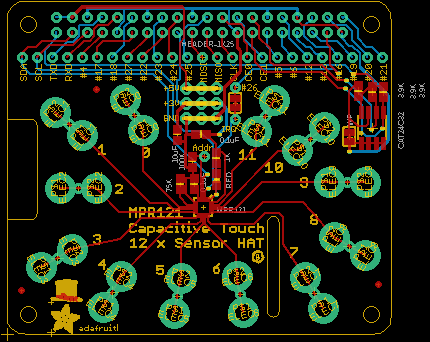
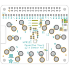
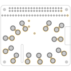
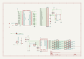
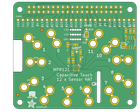
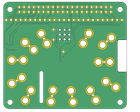

Contents
========

* [PRA2340 > Adafruit Capacitive Touch HAT PCB](#pra2340--adafruit-capacitive-touch-hat-pcb)
	* [Schematic](#schematic)
	* [PCB](#pcb)
	* [Interactive BOM](#interactive-bom)
	* [OOMP Parts](#oomp-parts)
	* [Images](#images)
	* [Tags](#tags)
  
![][im]
# PRA2340 > Adafruit Capacitive Touch HAT PCB

- ID: PROJ-ADAF-2340-STAN-01
- Hex ID: PRA2340
- Name: Adafruit 2340
- Description: Adafruit 2340
- Long Link: [http://oom.lt/PROJ-ADAF-2340-STAN-01](http://oom.lt/PROJ-ADAF-2340-STAN-01)
- Short Link: [http://oom.lt/PRA2340](http://oom.lt/PRA2340)

## Schematic
  

## PCB
  

## Interactive BOM

- Interactive BOM page: [ibom.html](https://htmlpreview.github.io/?https://github.com/oomlout/oomlout_OOMP_projects/blob/main/PROJ-ADAF-2340-STAN-01/kicad/bom/ibom.html)

## OOMP Parts
  

|OOMP ID|Name|Identifier|
| :---: | :---: | :---: |
|HEAD-I01-X-PI01-01||#26, ADDR, IRQ, JP1, JP2, JP3, JP4, JP5, JP6, JP7, JP8, JP9, JP10, JP11, JP12|
|[CAPC-0805-X-UF10-V10](https://github.com/oomlout/oomlout_OOMP_parts/tree/main/CAPC-0805-X-UF10-V10/)|[SMD (0805) 10 uF Capacitor (Ceramic) 10v](https://github.com/oomlout/oomlout_OOMP_parts/tree/main/CAPC-0805-X-UF10-V10/)|[C1](https://github.com/oomlout/oomlout_OOMP_parts/tree/main/CAPC-0805-X-UF10-V10/)|
|[CAPC-0805-X-NF100-V50](https://github.com/oomlout/oomlout_OOMP_parts/tree/main/CAPC-0805-X-NF100-V50/)|[SMD (0805) 100 nF Capacitor (Ceramic) 50v](https://github.com/oomlout/oomlout_OOMP_parts/tree/main/CAPC-0805-X-NF100-V50/)|[C3, C4](https://github.com/oomlout/oomlout_OOMP_parts/tree/main/CAPC-0805-X-NF100-V50/)|
|HEAD-I01-X-PI25-01||CONN1|
|[LEDS-0805-R-STAN-01](https://github.com/oomlout/oomlout_OOMP_parts/tree/main/LEDS-0805-R-STAN-01/)|[SMD (0805) Red LED](https://github.com/oomlout/oomlout_OOMP_parts/tree/main/LEDS-0805-R-STAN-01/)|[D1](https://github.com/oomlout/oomlout_OOMP_parts/tree/main/LEDS-0805-R-STAN-01/)|
|RESE-0805-X-O392-01||R1, R2, R3|
|[RESE-0805-X-O753-01](https://github.com/oomlout/oomlout_OOMP_parts/tree/main/RESE-0805-X-O753-01/)|[SMD (0805) 75k Ohm Resistor](https://github.com/oomlout/oomlout_OOMP_parts/tree/main/RESE-0805-X-O753-01/)|[R5](https://github.com/oomlout/oomlout_OOMP_parts/tree/main/RESE-0805-X-O753-01/)|
|RESE-0805-X-O1003-01||R6|
|[RESE-0805-X-O102-01](https://github.com/oomlout/oomlout_OOMP_parts/tree/main/RESE-0805-X-O102-01/)|[SMD (0805) 1k Ohm Resistor](https://github.com/oomlout/oomlout_OOMP_parts/tree/main/RESE-0805-X-O102-01/)|[R7](https://github.com/oomlout/oomlout_OOMP_parts/tree/main/RESE-0805-X-O102-01/)|
|UNMATCHED-UNMATCHED-X-UNMATCHED-01||RPI1, U1, U2|

## Images
  
  

|bominteractivefront|bominteractiveback|kicadPcb3d|kicadPcb3dFront|kicadPcb3dBack|kicadSchem|eagleImage|eagleSchemImage|pcbdraw|pcbdrawback|
| :---: | :---: | :---: | :---: | :---: | :---: | :---: | :---: | :---: | :---: |
|||||||||||

## Tags

- hexID: PRA2340
- oompType: PROJ
- oompSize: ADAF
- oompColor: 2340
- oompDesc: STAN
- oompIndex: 01
- oompName: Adafruit Capacitive Touch HAT PCB
- sources: All source files from https://github.com/adafruit/Adafruit-Capacitive-Touch-HAT-PCB (source licence details in srcLicense.md)
- linkBuyPage: http://www.adafruit.com/products/2340
- oompID: PROJ-ADAF-2340-STAN-01
- oompParts: #26,HEAD-I01-X-PI01-01
- oompParts: ADDR,HEAD-I01-X-PI01-01
- oompParts: C1,CAPC-0805-X-UF10-V10
- oompParts: C3,CAPC-0805-X-NF100-V50
- oompParts: C4,CAPC-0805-X-NF100-V50
- oompParts: CONN1,HEAD-I01-X-PI25-01
- oompParts: D1,LEDS-0805-R-STAN-01
- oompParts: IRQ,HEAD-I01-X-PI01-01
- oompParts: JP1,HEAD-I01-X-PI01-01
- oompParts: JP2,HEAD-I01-X-PI01-01
- oompParts: JP3,HEAD-I01-X-PI01-01
- oompParts: JP4,HEAD-I01-X-PI01-01
- oompParts: JP5,HEAD-I01-X-PI01-01
- oompParts: JP6,HEAD-I01-X-PI01-01
- oompParts: JP7,HEAD-I01-X-PI01-01
- oompParts: JP8,HEAD-I01-X-PI01-01
- oompParts: JP9,HEAD-I01-X-PI01-01
- oompParts: JP10,HEAD-I01-X-PI01-01
- oompParts: JP11,HEAD-I01-X-PI01-01
- oompParts: JP12,HEAD-I01-X-PI01-01
- oompParts: R1,RESE-0805-X-O392-01
- oompParts: R2,RESE-0805-X-O392-01
- oompParts: R3,RESE-0805-X-O392-01
- oompParts: R5,RESE-0805-X-O753-01
- oompParts: R6,RESE-0805-X-O1003-01
- oompParts: R7,RESE-0805-X-O102-01
- oompParts: RPI1,UNMATCHED-UNMATCHED-X-UNMATCHED-01
- oompParts: U1,UNMATCHED-UNMATCHED-X-UNMATCHED-01
- oompParts: U2,UNMATCHED-UNMATCHED-X-UNMATCHED-01
- rawParts: #26,,HEADER-1X1ROUND,1X01_ROUND,PIN HEADER,,
- rawParts: ADDR,,HEADER-1X1ROUND,1X01_ROUND,PIN HEADER,,
- rawParts: AL1,ALLIGATORCLIP_MICRO,ALLIGATORCLIP_MICRO,ALLIGATORCLIP,,,
- rawParts: AL2,ALLIGATORCLIP_MICRO,ALLIGATORCLIP_MICRO,ALLIGATORCLIP,,,
- rawParts: AL3,ALLIGATORCLIP_MICRO,ALLIGATORCLIP_MICRO,ALLIGATORCLIP,,,
- rawParts: AL4,ALLIGATORCLIP_MICRO,ALLIGATORCLIP_MICRO,ALLIGATORCLIP,,,
- rawParts: AL5,ALLIGATORCLIP_MICRO,ALLIGATORCLIP_MICRO,ALLIGATORCLIP,,,
- rawParts: AL6,ALLIGATORCLIP_MICRO,ALLIGATORCLIP_MICRO,ALLIGATORCLIP,,,
- rawParts: AL7,ALLIGATORCLIP_MICRO,ALLIGATORCLIP_MICRO,ALLIGATORCLIP,,,
- rawParts: AL8,ALLIGATORCLIP_MICRO,ALLIGATORCLIP_MICRO,ALLIGATORCLIP,,,
- rawParts: AL9,ALLIGATORCLIP_MICRO,ALLIGATORCLIP_MICRO,ALLIGATORCLIP,,,
- rawParts: AL10,ALLIGATORCLIP_MICRO,ALLIGATORCLIP_MICRO,ALLIGATORCLIP,,,
- rawParts: AL11,ALLIGATORCLIP_MICRO,ALLIGATORCLIP_MICRO,ALLIGATORCLIP,,,
- rawParts: AL12,ALLIGATORCLIP_MICRO,ALLIGATORCLIP_MICRO,ALLIGATORCLIP,,,
- rawParts: C1,10uF,CAP_CERAMIC0805-NOOUTLINE,0805-NO,Ceramic Capacitors,,
- rawParts: C3,0.1uF,CAP_CERAMIC0805-NOOUTLINE,0805-NO,Ceramic Capacitors,,
- rawParts: C4,0.1uF,CAP_CERAMIC0805-NOOUTLINE,0805-NO,Ceramic Capacitors,,
- rawParts: CONN1,HEADER-1X25,HEADER-1X25,1X25_ROUND_70MIL,,,
- rawParts: D1,RED,LED0805_NOOUTLINE,CHIPLED_0805_NOOUTLINE,LED,,
- rawParts: FID1,FIDUCIAL,FIDUCIAL,FIDUCIAL_1MM,Fiducial Alignment Points,EXCLUDE,
- rawParts: FID2,FIDUCIAL,FIDUCIAL,FIDUCIAL_1MM,Fiducial Alignment Points,EXCLUDE,
- rawParts: FID3,FIDUCIAL,FIDUCIAL,FIDUCIAL_1MM,Fiducial Alignment Points,EXCLUDE,
- rawParts: IRQ,,HEADER-1X1ROUND,1X01_ROUND,PIN HEADER,,
- rawParts: JP1,,HEADER-1X1ROUND,1X01_ROUND,PIN HEADER,,
- rawParts: JP2,,HEADER-1X1ROUND,1X01_ROUND,PIN HEADER,,
- rawParts: JP3,,HEADER-1X1ROUND,1X01_ROUND,PIN HEADER,,
- rawParts: JP4,,HEADER-1X1ROUND,1X01_ROUND,PIN HEADER,,
- rawParts: JP5,,HEADER-1X1ROUND,1X01_ROUND,PIN HEADER,,
- rawParts: JP6,,HEADER-1X1ROUND,1X01_ROUND,PIN HEADER,,
- rawParts: JP7,,HEADER-1X1ROUND,1X01_ROUND,PIN HEADER,,
- rawParts: JP8,,HEADER-1X1ROUND,1X01_ROUND,PIN HEADER,,
- rawParts: JP9,,HEADER-1X1ROUND,1X01_ROUND,PIN HEADER,,
- rawParts: JP10,,HEADER-1X1ROUND,1X01_ROUND,PIN HEADER,,
- rawParts: JP11,,HEADER-1X1ROUND,1X01_ROUND,PIN HEADER,,
- rawParts: JP12,,HEADER-1X1ROUND,1X01_ROUND,PIN HEADER,,
- rawParts: R1,3.9K,RESISTOR0805_NOOUTLINE,0805-NO,Resistors,,
- rawParts: R2,3.9K,RESISTOR0805_NOOUTLINE,0805-NO,Resistors,,
- rawParts: R3,3.9K,RESISTOR0805_NOOUTLINE,0805-NO,Resistors,,
- rawParts: R5,75K,RESISTOR0805_NOOUTLINE,0805-NO,Resistors,,
- rawParts: R6,100K,RESISTOR0805_NOOUTLINE,0805-NO,Resistors,,
- rawParts: R7,1K,RESISTOR0805_NOOUTLINE,0805-NO,Resistors,,
- rawParts: RPI1,RASPBERRYPI_BPLUS_HATSLOTS,RASPBERRYPI_BPLUS_HATSLOTS,PI_HAT_SLOTS,,,
- rawParts: SJ1,WP,SOLDERJUMPER_CLOSED,SOLDERJUMPER_CLOSEDWIRE,Solder Jumper - Closed,,
- rawParts: SJ2,,SOLDERJUMPER_CLOSED,SOLDERJUMPER_CLOSEDWIRE,Solder Jumper - Closed,,
- rawParts: U1,CAT24C32,EEPROM_I2C_SOIC8_GENERIC,SOIC8_150MIL,Note: The same pinout is used for many I2C EEPROMs in SOIC8(150mil) from a variety of manufacturers and in various sizes.,,
- rawParts: U2,MPR121,MPR121Q,QFN20_3MM_NOTHERMAL,MPR121Q - 12 Electrode Cap Touch Sensor,,

[im]: kicadPcb3d_450.png
