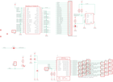

Contents
========

* [PRA2340 > Adafruit](#pra2340--adafruit)
	* [Images](#images)
	* [Tags](#tags)
  
![][im]
# PRA2340 > Adafruit

- ID: PROJ-ADAF-2340-STAN-01
- Hex ID: PRA2340
- Name: Adafruit
- Description: Adafruit

## Images
  
  

|kicadPcb3d|kicadPcb3dFront|kicadPcb3dBack|eagleImage|eagleSchemImage|
| :---: | :---: | :---: | :---: | :---: |
||||||

## Tags

- hexID: PRA2340
- oompType: PROJ
- oompSize: ADAF
- oompColor: 2340
- oompDesc: STAN
- oompIndex: 01
- oompName: Adafruit Capacitive Touch HAT PCB
- sources: All source files from https://github.com/adafruit/Adafruit-Capacitive-Touch-HAT-PCB (source licence details in srcLicense.md)
- linkBuyPage: http://www.adafruit.com/products/2340
- oompID: PROJ-ADAF-2340-STAN-01
- oompParts: #26,UNMATCHED-UNMATCHED-UNMATCHED-UNMATCHED-UNMATCHED
- oompParts: ADDR,UNMATCHED-UNMATCHED-UNMATCHED-UNMATCHED-UNMATCHED
- oompParts: AL1,UNMATCHED-UNMATCHED-UNMATCHED-UNMATCHED-UNMATCHED
- oompParts: AL2,UNMATCHED-UNMATCHED-UNMATCHED-UNMATCHED-UNMATCHED
- oompParts: AL3,UNMATCHED-UNMATCHED-UNMATCHED-UNMATCHED-UNMATCHED
- oompParts: AL4,UNMATCHED-UNMATCHED-UNMATCHED-UNMATCHED-UNMATCHED
- oompParts: AL5,UNMATCHED-UNMATCHED-UNMATCHED-UNMATCHED-UNMATCHED
- oompParts: AL6,UNMATCHED-UNMATCHED-UNMATCHED-UNMATCHED-UNMATCHED
- oompParts: AL7,UNMATCHED-UNMATCHED-UNMATCHED-UNMATCHED-UNMATCHED
- oompParts: AL8,UNMATCHED-UNMATCHED-UNMATCHED-UNMATCHED-UNMATCHED
- oompParts: AL9,UNMATCHED-UNMATCHED-UNMATCHED-UNMATCHED-UNMATCHED
- oompParts: AL10,UNMATCHED-UNMATCHED-UNMATCHED-UNMATCHED-UNMATCHED
- oompParts: AL11,UNMATCHED-UNMATCHED-UNMATCHED-UNMATCHED-UNMATCHED
- oompParts: AL12,UNMATCHED-UNMATCHED-UNMATCHED-UNMATCHED-UNMATCHED
- oompParts: C1,UNMATCHED-UNMATCHED-UNMATCHED-UNMATCHED-UNMATCHED
- oompParts: C3,UNMATCHED-UNMATCHED-UNMATCHED-UNMATCHED-UNMATCHED
- oompParts: C4,UNMATCHED-UNMATCHED-UNMATCHED-UNMATCHED-UNMATCHED
- oompParts: CONN1,UNMATCHED-UNMATCHED-UNMATCHED-UNMATCHED-UNMATCHED
- oompParts: D1,UNMATCHED-UNMATCHED-UNMATCHED-UNMATCHED-UNMATCHED
- oompParts: IRQ,UNMATCHED-UNMATCHED-UNMATCHED-UNMATCHED-UNMATCHED
- oompParts: JP1,UNMATCHED-UNMATCHED-UNMATCHED-UNMATCHED-UNMATCHED
- oompParts: JP2,UNMATCHED-UNMATCHED-UNMATCHED-UNMATCHED-UNMATCHED
- oompParts: JP3,UNMATCHED-UNMATCHED-UNMATCHED-UNMATCHED-UNMATCHED
- oompParts: JP4,UNMATCHED-UNMATCHED-UNMATCHED-UNMATCHED-UNMATCHED
- oompParts: JP5,UNMATCHED-UNMATCHED-UNMATCHED-UNMATCHED-UNMATCHED
- oompParts: JP6,UNMATCHED-UNMATCHED-UNMATCHED-UNMATCHED-UNMATCHED
- oompParts: JP7,UNMATCHED-UNMATCHED-UNMATCHED-UNMATCHED-UNMATCHED
- oompParts: JP8,UNMATCHED-UNMATCHED-UNMATCHED-UNMATCHED-UNMATCHED
- oompParts: JP9,UNMATCHED-UNMATCHED-UNMATCHED-UNMATCHED-UNMATCHED
- oompParts: JP10,UNMATCHED-UNMATCHED-UNMATCHED-UNMATCHED-UNMATCHED
- oompParts: JP11,UNMATCHED-UNMATCHED-UNMATCHED-UNMATCHED-UNMATCHED
- oompParts: JP12,UNMATCHED-UNMATCHED-UNMATCHED-UNMATCHED-UNMATCHED
- oompParts: R1,UNMATCHED-UNMATCHED-UNMATCHED-UNMATCHED-UNMATCHED
- oompParts: R2,UNMATCHED-UNMATCHED-UNMATCHED-UNMATCHED-UNMATCHED
- oompParts: R3,UNMATCHED-UNMATCHED-UNMATCHED-UNMATCHED-UNMATCHED
- oompParts: R5,UNMATCHED-UNMATCHED-UNMATCHED-UNMATCHED-UNMATCHED
- oompParts: R6,UNMATCHED-UNMATCHED-UNMATCHED-UNMATCHED-UNMATCHED
- oompParts: R7,UNMATCHED-UNMATCHED-UNMATCHED-UNMATCHED-UNMATCHED
- oompParts: RPI1,UNMATCHED-UNMATCHED-UNMATCHED-UNMATCHED-UNMATCHED
- oompParts: SJ1,UNMATCHED-UNMATCHED-UNMATCHED-UNMATCHED-UNMATCHED
- oompParts: SJ2,UNMATCHED-UNMATCHED-UNMATCHED-UNMATCHED-UNMATCHED
- oompParts: U1,UNMATCHED-UNMATCHED-UNMATCHED-UNMATCHED-UNMATCHED
- oompParts: U2,UNMATCHED-UNMATCHED-UNMATCHED-UNMATCHED-UNMATCHED
- rawParts: #26,,HEADER-1X1ROUND,1X01_ROUND,PIN HEADER,,
- rawParts: ADDR,,HEADER-1X1ROUND,1X01_ROUND,PIN HEADER,,
- rawParts: AL1,ALLIGATORCLIP_MICRO,ALLIGATORCLIP_MICRO,ALLIGATORCLIP,,,
- rawParts: AL2,ALLIGATORCLIP_MICRO,ALLIGATORCLIP_MICRO,ALLIGATORCLIP,,,
- rawParts: AL3,ALLIGATORCLIP_MICRO,ALLIGATORCLIP_MICRO,ALLIGATORCLIP,,,
- rawParts: AL4,ALLIGATORCLIP_MICRO,ALLIGATORCLIP_MICRO,ALLIGATORCLIP,,,
- rawParts: AL5,ALLIGATORCLIP_MICRO,ALLIGATORCLIP_MICRO,ALLIGATORCLIP,,,
- rawParts: AL6,ALLIGATORCLIP_MICRO,ALLIGATORCLIP_MICRO,ALLIGATORCLIP,,,
- rawParts: AL7,ALLIGATORCLIP_MICRO,ALLIGATORCLIP_MICRO,ALLIGATORCLIP,,,
- rawParts: AL8,ALLIGATORCLIP_MICRO,ALLIGATORCLIP_MICRO,ALLIGATORCLIP,,,
- rawParts: AL9,ALLIGATORCLIP_MICRO,ALLIGATORCLIP_MICRO,ALLIGATORCLIP,,,
- rawParts: AL10,ALLIGATORCLIP_MICRO,ALLIGATORCLIP_MICRO,ALLIGATORCLIP,,,
- rawParts: AL11,ALLIGATORCLIP_MICRO,ALLIGATORCLIP_MICRO,ALLIGATORCLIP,,,
- rawParts: AL12,ALLIGATORCLIP_MICRO,ALLIGATORCLIP_MICRO,ALLIGATORCLIP,,,
- rawParts: C1,10uF,CAP_CERAMIC0805-NOOUTLINE,0805-NO,Ceramic Capacitors,,
- rawParts: C3,0.1uF,CAP_CERAMIC0805-NOOUTLINE,0805-NO,Ceramic Capacitors,,
- rawParts: C4,0.1uF,CAP_CERAMIC0805-NOOUTLINE,0805-NO,Ceramic Capacitors,,
- rawParts: CONN1,HEADER-1X25,HEADER-1X25,1X25_ROUND_70MIL,,,
- rawParts: D1,RED,LED0805_NOOUTLINE,CHIPLED_0805_NOOUTLINE,LED,,
- rawParts: FID1,FIDUCIAL,FIDUCIAL,FIDUCIAL_1MM,Fiducial Alignment Points,EXCLUDE,
- rawParts: FID2,FIDUCIAL,FIDUCIAL,FIDUCIAL_1MM,Fiducial Alignment Points,EXCLUDE,
- rawParts: FID3,FIDUCIAL,FIDUCIAL,FIDUCIAL_1MM,Fiducial Alignment Points,EXCLUDE,
- rawParts: IRQ,,HEADER-1X1ROUND,1X01_ROUND,PIN HEADER,,
- rawParts: JP1,,HEADER-1X1ROUND,1X01_ROUND,PIN HEADER,,
- rawParts: JP2,,HEADER-1X1ROUND,1X01_ROUND,PIN HEADER,,
- rawParts: JP3,,HEADER-1X1ROUND,1X01_ROUND,PIN HEADER,,
- rawParts: JP4,,HEADER-1X1ROUND,1X01_ROUND,PIN HEADER,,
- rawParts: JP5,,HEADER-1X1ROUND,1X01_ROUND,PIN HEADER,,
- rawParts: JP6,,HEADER-1X1ROUND,1X01_ROUND,PIN HEADER,,
- rawParts: JP7,,HEADER-1X1ROUND,1X01_ROUND,PIN HEADER,,
- rawParts: JP8,,HEADER-1X1ROUND,1X01_ROUND,PIN HEADER,,
- rawParts: JP9,,HEADER-1X1ROUND,1X01_ROUND,PIN HEADER,,
- rawParts: JP10,,HEADER-1X1ROUND,1X01_ROUND,PIN HEADER,,
- rawParts: JP11,,HEADER-1X1ROUND,1X01_ROUND,PIN HEADER,,
- rawParts: JP12,,HEADER-1X1ROUND,1X01_ROUND,PIN HEADER,,
- rawParts: R1,3.9K,RESISTOR0805_NOOUTLINE,0805-NO,Resistors,,
- rawParts: R2,3.9K,RESISTOR0805_NOOUTLINE,0805-NO,Resistors,,
- rawParts: R3,3.9K,RESISTOR0805_NOOUTLINE,0805-NO,Resistors,,
- rawParts: R5,75K,RESISTOR0805_NOOUTLINE,0805-NO,Resistors,,
- rawParts: R6,100K,RESISTOR0805_NOOUTLINE,0805-NO,Resistors,,
- rawParts: R7,1K,RESISTOR0805_NOOUTLINE,0805-NO,Resistors,,
- rawParts: RPI1,RASPBERRYPI_BPLUS_HATSLOTS,RASPBERRYPI_BPLUS_HATSLOTS,PI_HAT_SLOTS,,,
- rawParts: SJ1,WP,SOLDERJUMPER_CLOSED,SOLDERJUMPER_CLOSEDWIRE,Solder Jumper - Closed,,
- rawParts: SJ2,,SOLDERJUMPER_CLOSED,SOLDERJUMPER_CLOSEDWIRE,Solder Jumper - Closed,,
- rawParts: U1,CAT24C32,EEPROM_I2C_SOIC8_GENERIC,SOIC8_150MIL,Note: The same pinout is used for many I2C EEPROMs in SOIC8(150mil) from a variety of manufacturers and in various sizes.,,
- rawParts: U2,MPR121,MPR121Q,QFN20_3MM_NOTHERMAL,MPR121Q - 12 Electrode Cap Touch Sensor,,

[im]: kicadPcb3d_450.png
