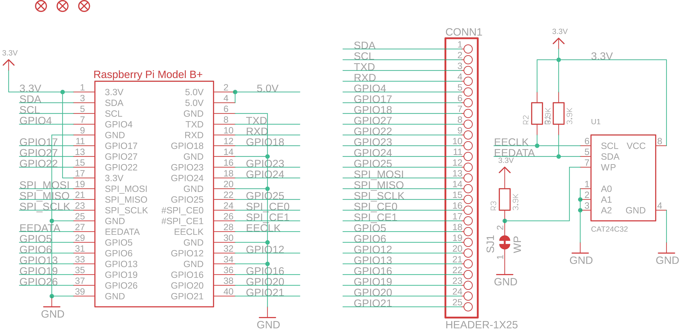
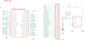

Contents
========

* [PRA2348 > Adafruit DC Stepper Motor HAT PCB](#pra2348--adafruit-dc-stepper-motor-hat-pcb)
	* [Schematic](#schematic)
	* [PCB](#pcb)
	* [Interactive BOM](#interactive-bom)
	* [OOMP Parts](#oomp-parts)
	* [Images](#images)
	* [Tags](#tags)
  
![][im]
# PRA2348 > Adafruit DC Stepper Motor HAT PCB

- ID: PROJ-ADAF-2348-STAN-01
- Hex ID: PRA2348
- Name: Adafruit
- Description: Adafruit
- Long Link: [http://oom.lt/PROJ-ADAF-2348-STAN-01](http://oom.lt/PROJ-ADAF-2348-STAN-01)
- Short Link: [http://oom.lt/PRA2348](http://oom.lt/PRA2348)

## Schematic
  

## PCB
  

## Interactive BOM

- Interactive BOM page: [ibom.html](https://htmlpreview.github.io/?https://github.com/oomlout/oomlout_OOMP_projects/blob/main/PROJ-ADAF-2348-STAN-01/kicad/bom/ibom.html)

## OOMP Parts
  

|OOMP Parts|
| :---: |
|C1 C1,CAPC-0805-X-UF1D-01|
|C3 C3,CAPC-0805-X-UF1D-01|
|C4 C4,CAPX-UNMATCHED-X-UNMATCHED-01|
|C5 C5,CAPX-UNMATCHED-X-UNMATCHED-01|
|[C6 CAPC-0805-X-UF10-V10 SMD (0805) 10 uF Capacitor (Ceramic) 10v](https://github.com/oomlout/oomlout_OOMP_parts/tree/main/CAPC-0805-X-UF10-V10/)|
|[C10 CAPC-0805-X-UF10-V10 SMD (0805) 10 uF Capacitor (Ceramic) 10v](https://github.com/oomlout/oomlout_OOMP_parts/tree/main/CAPC-0805-X-UF10-V10/)|
|CONN1 CONN1,HEAD-I01-X-PI25-01|
|IC1 IC1,UNMATCHED-UNMATCHED-X-UNMATCHED-01|
|IC3 IC3,UNMATCHED-UNMATCHED-X-UNMATCHED-01|
|J1 J1,UNMATCHED-UNMATCHED-X-UNMATCHED-01|
|J3 J3,UNMATCHED-UNMATCHED-X-UNMATCHED-01|
|[JP1 HEAD-I01-X-PI04-01 2.54 mm 4 Pin Header](https://github.com/oomlout/oomlout_OOMP_parts/tree/main/HEAD-I01-X-PI04-01/)|
|[LED1 LEDS-0805-G-STAN-01 SMD (0805) Green LED](https://github.com/oomlout/oomlout_OOMP_parts/tree/main/LEDS-0805-G-STAN-01/)|
|MPOWER MPOWER,UNMATCHED-UNMATCHED-X-UNMATCHED-01|
|Q1 Q1,UNMATCHED-UNMATCHED-X-UNMATCHED-01|
|R1 R1,RESE-0805-X-O392-01|
|R2 R2,RESE-0805-X-O392-01|
|R3 R3,RESE-0805-X-O392-01|
|[R4 RESE-0805-X-O103-01 SMD (0805) 10k Ohm Resistor](https://github.com/oomlout/oomlout_OOMP_parts/tree/main/RESE-0805-X-O103-01/)|
|[R5 RESE-0805-X-O103-01 SMD (0805) 10k Ohm Resistor](https://github.com/oomlout/oomlout_OOMP_parts/tree/main/RESE-0805-X-O103-01/)|
|[R6 RESE-0805-X-O103-01 SMD (0805) 10k Ohm Resistor](https://github.com/oomlout/oomlout_OOMP_parts/tree/main/RESE-0805-X-O103-01/)|
|[R7 RESE-0805-X-O102-01 SMD (0805) 1k Ohm Resistor](https://github.com/oomlout/oomlout_OOMP_parts/tree/main/RESE-0805-X-O102-01/)|
|[R8 RESE-0805-X-O103-01 SMD (0805) 10k Ohm Resistor](https://github.com/oomlout/oomlout_OOMP_parts/tree/main/RESE-0805-X-O103-01/)|
|[R9 RESE-0805-X-O103-01 SMD (0805) 10k Ohm Resistor](https://github.com/oomlout/oomlout_OOMP_parts/tree/main/RESE-0805-X-O103-01/)|
|RPI1 RPI1,UNMATCHED-UNMATCHED-X-UNMATCHED-01|
|TP1 TP1,UNMATCHED-UNMATCHED-X-UNMATCHED-01|
|TP2 TP2,UNMATCHED-UNMATCHED-X-UNMATCHED-01|
|TP3 TP3,UNMATCHED-UNMATCHED-X-UNMATCHED-01|
|TP4 TP4,UNMATCHED-UNMATCHED-X-UNMATCHED-01|
|TP5 TP5,UNMATCHED-UNMATCHED-X-UNMATCHED-01|
|U1 U1,UNMATCHED-UNMATCHED-X-UNMATCHED-01|
|U2 U2,UNMATCHED-UNMATCHED-X-UNMATCHED-01|

## Images
  
  

|kicadPcb3d|kicadPcb3dFront|kicadPcb3dBack|eagleImage|eagleSchemImage|
| :---: | :---: | :---: | :---: | :---: |
||||||

## Tags

- hexID: PRA2348
- oompType: PROJ
- oompSize: ADAF
- oompColor: 2348
- oompDesc: STAN
- oompIndex: 01
- oompName: Adafruit DC Stepper Motor HAT PCB
- sources: All source files from https://github.com/adafruit/Adafruit-DC-Stepper-Motor-HAT-PCB (source licence details in srcLicense.md)
- linkBuyPage: http://www.adafruit.com/products/2348
- oompID: PROJ-ADAF-2348-STAN-01
- oompParts: C1,CAPC-0805-X-UF1D-01
- oompParts: C3,CAPC-0805-X-UF1D-01
- oompParts: C4,CAPX-UNMATCHED-X-UNMATCHED-01
- oompParts: C5,CAPX-UNMATCHED-X-UNMATCHED-01
- oompParts: C6,CAPC-0805-X-UF10-V10
- oompParts: C10,CAPC-0805-X-UF10-V10
- oompParts: CONN1,HEAD-I01-X-PI25-01
- oompParts: IC1,UNMATCHED-UNMATCHED-X-UNMATCHED-01
- oompParts: IC3,UNMATCHED-UNMATCHED-X-UNMATCHED-01
- oompParts: J1,UNMATCHED-UNMATCHED-X-UNMATCHED-01
- oompParts: J3,UNMATCHED-UNMATCHED-X-UNMATCHED-01
- oompParts: JP1,HEAD-I01-X-PI04-01
- oompParts: LED1,LEDS-0805-G-STAN-01
- oompParts: MPOWER,UNMATCHED-UNMATCHED-X-UNMATCHED-01
- oompParts: Q1,UNMATCHED-UNMATCHED-X-UNMATCHED-01
- oompParts: R1,RESE-0805-X-O392-01
- oompParts: R2,RESE-0805-X-O392-01
- oompParts: R3,RESE-0805-X-O392-01
- oompParts: R4,RESE-0805-X-O103-01
- oompParts: R5,RESE-0805-X-O103-01
- oompParts: R6,RESE-0805-X-O103-01
- oompParts: R7,RESE-0805-X-O102-01
- oompParts: R8,RESE-0805-X-O103-01
- oompParts: R9,RESE-0805-X-O103-01
- oompParts: RPI1,UNMATCHED-UNMATCHED-X-UNMATCHED-01
- oompParts: TP1,UNMATCHED-UNMATCHED-X-UNMATCHED-01
- oompParts: TP2,UNMATCHED-UNMATCHED-X-UNMATCHED-01
- oompParts: TP3,UNMATCHED-UNMATCHED-X-UNMATCHED-01
- oompParts: TP4,UNMATCHED-UNMATCHED-X-UNMATCHED-01
- oompParts: TP5,UNMATCHED-UNMATCHED-X-UNMATCHED-01
- oompParts: U1,UNMATCHED-UNMATCHED-X-UNMATCHED-01
- oompParts: U2,UNMATCHED-UNMATCHED-X-UNMATCHED-01
- rawParts: A0,,SOLDERJUMPERREFLOW_NOPASTE,SOLDERJUMPER_REFLOW_NOPASTE,SMD Solder JUMPER,,
- rawParts: A1,,SOLDERJUMPERREFLOW_NOPASTE,SOLDERJUMPER_REFLOW_NOPASTE,SMD Solder JUMPER,,
- rawParts: A2,,SOLDERJUMPERREFLOW_NOPASTE,SOLDERJUMPER_REFLOW_NOPASTE,SMD Solder JUMPER,,
- rawParts: A3,,SOLDERJUMPERREFLOW_NOPASTE,SOLDERJUMPER_REFLOW_NOPASTE,SMD Solder JUMPER,,
- rawParts: A4,,SOLDERJUMPERREFLOW_NOPASTE,SOLDERJUMPER_REFLOW_NOPASTE,SMD Solder JUMPER,,
- rawParts: C1,0.1uF,CAP_CERAMIC0805-NOOUTLINE,0805-NO,Ceramic Capacitors,,
- rawParts: C3,0.1uF,CAP_CERAMIC0805-NOOUTLINE,0805-NO,Ceramic Capacitors,,
- rawParts: C4,47uF/16v,CAP_ELECTROLYTICPANASONIC_C,PANASONIC_C,Electrolytic Capacitors,,
- rawParts: C5,47uF+/16v,CAP_ELECTROLYTICPANASONIC_C,PANASONIC_C,Electrolytic Capacitors,,
- rawParts: C6,10uF,CAP_CERAMIC0805-NOOUTLINE,0805-NO,Ceramic Capacitors,,
- rawParts: C10,10uF,CAP_CERAMIC0805-NOOUTLINE,0805-NO,Ceramic Capacitors,,
- rawParts: CONN1,HEADER-1X25,HEADER-1X25,1X25_ROUND_70MIL,,,
- rawParts: FID1,FIDUCIAL,FIDUCIAL,FIDUCIAL_1MM,Fiducial Alignment Points,EXCLUDE,
- rawParts: FID2,FIDUCIAL,FIDUCIAL,FIDUCIAL_1MM,Fiducial Alignment Points,EXCLUDE,
- rawParts: FID3,FIDUCIAL,FIDUCIAL,FIDUCIAL_1MM,Fiducial Alignment Points,EXCLUDE,
- rawParts: IC1,TB6612FNG,TB6612FNG,SSOP24,TB6612FNG,,
- rawParts: IC3,TB6612FNG,TB6612FNG,SSOP24,TB6612FNG,,
- rawParts: J1,1X5,1X5,1X05-3.5MM,,,
- rawParts: J3,1X5,1X5,1X05-3.5MM,,,
- rawParts: JP1,,HEADER-1X476MIL,1X04_ROUND_76,PIN HEADER,,
- rawParts: LED1,Green,LED0805_NOOUTLINE,CHIPLED_0805_NOOUTLINE,LED,,
- rawParts: MPOWER,1X2-3.5MM,1X2-3.5MM,1X2-3.5MM,3.5mm Terminal block,,
- rawParts: Q1,AOD417,IRFR5305,D-PAK_TO252AA,HEXFET Power MOSFET,,
- rawParts: R1,3.9K,RESISTOR0805_NOOUTLINE,0805-NO,Resistors,,
- rawParts: R2,3.9K,RESISTOR0805_NOOUTLINE,0805-NO,Resistors,,
- rawParts: R3,3.9K,RESISTOR0805_NOOUTLINE,0805-NO,Resistors,,
- rawParts: R4,10k,RESISTOR0805_NOOUTLINE,0805-NO,Resistors,,
- rawParts: R5,10k,RESISTOR0805_NOOUTLINE,0805-NO,Resistors,,
- rawParts: R6,10k,RESISTOR0805_NOOUTLINE,0805-NO,Resistors,,
- rawParts: R7,1K,RESISTOR0805_NOOUTLINE,0805-NO,Resistors,,
- rawParts: R8,10k,RESISTOR0805_NOOUTLINE,0805-NO,Resistors,,
- rawParts: R9,10k,RESISTOR0805_NOOUTLINE,0805-NO,Resistors,,
- rawParts: RPI1,RASPBERRYPI_BPLUS_HATSLOTS,RASPBERRYPI_BPLUS_HATSLOTS,PI_HAT_SLOTS,,,
- rawParts: SJ1,WP,SOLDERJUMPER_CLOSED,SOLDERJUMPER_CLOSEDWIRE,Solder Jumper - Closed,,
- rawParts: TP1,,TESTPOINTROUND2MM,TESTPOINT_ROUND_2MM,Test Point,,
- rawParts: TP2,,TESTPOINTROUND2MM,TESTPOINT_ROUND_2MM,Test Point,,
- rawParts: TP3,,TESTPOINTROUND2MM,TESTPOINT_ROUND_2MM,Test Point,,
- rawParts: TP4,,TESTPOINTROUND2MM,TESTPOINT_ROUND_2MM,Test Point,,
- rawParts: TP5,,TESTPOINTROUND2MM,TESTPOINT_ROUND_2MM,Test Point,,
- rawParts: U1,CAT24C32,EEPROM_I2C_SOIC8_GENERIC,SOIC8_150MIL,Note: The same pinout is used for many I2C EEPROMs in SOIC8(150mil) from a variety of manufacturers and in various sizes.,,
- rawParts: U2,PCA9685,PCA9685,TSSOP28,PCA9685 - 16 Channel 12-Bit I2C PWM Controller,,

[im]: kicadPcb3d_450.png
