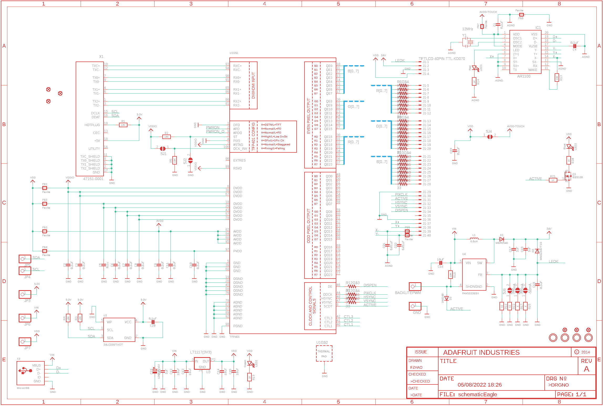
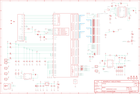

Contents
========

* [PRA2406 > Adafruit](#pra2406--adafruit)
	* [Schematic](#schematic)
	* [Interactive BOM](#interactive-bom)
	* [OOMP Parts](#oomp-parts)
	* [Images](#images)
	* [Tags](#tags)
  
![][im]
# PRA2406 > Adafruit

- ID: PROJ-ADAF-2406-STAN-01
- Hex ID: PRA2406
- Name: Adafruit
- Description: Adafruit
- Long Link: [http://oom.lt/PROJ-ADAF-2406-STAN-01](http://oom.lt/PROJ-ADAF-2406-STAN-01)
- Short Link: [http://oom.lt/PRA2406](http://oom.lt/PRA2406)

## Schematic
  

## Interactive BOM

- Interactive BOM page: [ibom.html](https://htmlpreview.github.io/?https://github.com/oomlout/oomlout_OOMP_projects/blob/main/PROJ-ADAF-2406-STAN-01/kicad/bom/ibom.html)

## OOMP Parts
  

|OOMP Parts|
| :---: |
|BACKLITEPWM,HEAD-UNMATCHED-X-UNMATCHED-01,BACKLITEPWM,,HEADER-1X1-SMD_MASKHELD_2X2MM,1X01_SMD_MASKHELD_2X2MM,PIN HEADER,,|
|C1,CAPC-0805-X-NF100-V50,C1,0.1uF,CAP_CERAMIC0805-NOOUTLINE,0805-NO,Ceramic Capacitors,,|
|C2,CAPC-0805-X-NF100-V50,C2,0.1uF,CAP_CERAMIC0805-NOOUTLINE,0805-NO,Ceramic Capacitors,,|
|C3,CAPC-0805-X-NF100-V50,C3,0.1uF,CAP_CERAMIC0805-NOOUTLINE,0805-NO,Ceramic Capacitors,,|
|C4,CAPC-0805-X-NF100-V50,C4,0.1uF,CAP_CERAMIC_0805MP,_0805MP,Ceramic Capacitors,,|
|C5,CAPC-0805-X-UNMATCHED-01,C5,0.1u,CAP_CERAMIC0805-NOOUTLINE,0805-NO,Ceramic Capacitors,,|
|C6,CAPC-0805-X-NF100-V50,C6,0.1uF,CAP_CERAMIC_0805MP,_0805MP,Ceramic Capacitors,,|
|C7,CAPC-0805-X-NF100-V50,C7,0.1uF,CAP_CERAMIC0805-NOOUTLINE,0805-NO,Ceramic Capacitors,,|
|C8,CAPC-0805-X-NF100-V50,C8,0.1uF,CAP_CERAMIC0805-NOOUTLINE,0805-NO,Ceramic Capacitors,,|
|C9,CAPC-0805-X-NF100-V50,C9,0.1uF,CAP_CERAMIC0805-NOOUTLINE,0805-NO,Ceramic Capacitors,,|
|C10,CAPC-0805-X-NF100-V50,C10,0.1uF,CAP_CERAMIC0805-NOOUTLINE,0805-NO,Ceramic Capacitors,,|
|C11,CAPC-0805-X-NF100-V50,C11,0.1uF,CAP_CERAMIC0805-NOOUTLINE,0805-NO,Ceramic Capacitors,,|
|C12,CAPC-0805-X-UF10-V10,C12,10uF,CAP_CERAMIC0805-NOOUTLINE,0805-NO,Ceramic Capacitors,,|
|C13,CAPC-0805-X-UF10-V10,C13,10uF,CAP_CERAMIC0805-NOOUTLINE,0805-NO,Ceramic Capacitors,,|
|C14,CAPC-0805-X-UF10-V10,C14,10uF,CAP_CERAMIC0805-NOOUTLINE,0805-NO,Ceramic Capacitors,,|
|C15,CAPC-0805-X-UF10-V10,C15,10uF,CAP_CERAMIC0805-NOOUTLINE,0805-NO,Ceramic Capacitors,,|
|C16,CAPC-0805-X-UF10-V10,C16,10uF,CAP_CERAMIC0805-NOOUTLINE,0805-NO,Ceramic Capacitors,,|
|C17,CAPC-0805-X-UF1-01,C17,1uF,CAP_CERAMIC0805-NOOUTLINE,0805-NO,Ceramic Capacitors,,|
|C18,CAPC-0805-X-UF1-01,C18,1uF,CAP_CERAMIC0805-NOOUTLINE,0805-NO,Ceramic Capacitors,,|
|C19,CAPC-0805-X-NF100-V50,C19,0.1uF,CAP_CERAMIC0805-NOOUTLINE,0805-NO,Ceramic Capacitors,,|
|C20,CAPC-0805-X-NF100-V50,C20,0.1uF,CAP_CERAMIC0805-NOOUTLINE,0805-NO,Ceramic Capacitors,,|
|C21,CAPC-0805-X-UNMATCHED-01,C21,0.01uF,CAP_CERAMIC0805-NOOUTLINE,0805-NO,Ceramic Capacitors,,|
|C22,CAPC-0805-X-UNMATCHED-01,C22,0.01uF,CAP_CERAMIC0805-NOOUTLINE,0805-NO,Ceramic Capacitors,,|
|C23,CAPC-0805-X-NF100-V50,C23,0.1uF,CAP_CERAMIC0805-NOOUTLINE,0805-NO,Ceramic Capacitors,,|
|C24,CAPX-UNMATCHED-X-UNMATCHED-01,C24,100uF/6V,CAP_ELECTROLYTICPANASONIC_C,PANASONIC_C,Electrolytic Capacitors,,|
|C25,CAPC-0805-X-UF1-01,C25,1uF,CAP_CERAMIC0805-NOOUTLINE,0805-NO,Ceramic Capacitors,,|
|D1,DIOD-UNMATCHED-X-UNMATCHED-01,D1,MBR0540,DIODESOD-123,SOD-123,Diode,,|
|D2,DIOD-UNMATCHED-X-UNMATCHED-01,D2,MM3Z24VT1G,DIODESMA,SMADIODE,Diode,,|
|D3,DIOD-S323-X-K4148-01,D3,1N4148,DIODESOD-323,SOD-323,Diode,,|
|FB1,UNMATCHED-0805-X-UNMATCHED-01,FB1,Ferrite,FERRITE_0805MP,_0805MP,Ferrite Bead,,|
|FB2,UNMATCHED-0805-X-UNMATCHED-01,FB2,Ferrite,FERRITE_0805MP,_0805MP,Ferrite Bead,,|
|FB3,UNMATCHED-0805-X-UNMATCHED-01,FB3,Ferrite,FERRITE_0805MP,_0805MP,Ferrite Bead,,|
|FB4,UNMATCHED-0805-X-UNMATCHED-01,FB4,Ferrite,FERRITE_0805MP,_0805MP,Ferrite Bead,,|
|FB5,UNMATCHED-0805-X-UNMATCHED-01,FB5,Ferrite,FERRITE_0805MP,_0805MP,Ferrite Bead,,|
|FB6,UNMATCHED-0805-X-UNMATCHED-01,FB6,Ferrite,FERRITE_0805MP,_0805MP,Ferrite Bead,,|
|FB7,UNMATCHED-0805-X-UNMATCHED-01,FB7,Ferrite,FERRITE_0805MP,_0805MP,Ferrite Bead,,|
|FB8,UNMATCHED-0805-X-UNMATCHED-01,FB8,Ferrite,FERRITE_0805MP,_0805MP,Ferrite Bead,,|
|GND,HEAD-UNMATCHED-X-UNMATCHED-01,FID1,FIDUCIAL,FIDUCIAL,FIDUCIAL_1MM,Fiducial Alignment Points,EXCLUDE,|
|IC1,UNMATCHED-UNMATCHED-X-UNMATCHED-01,FID2,FIDUCIAL,FIDUCIAL,FIDUCIAL_1MM,Fiducial Alignment Points,EXCLUDE,|
|J1,UNMATCHED-UNMATCHED-X-UNMATCHED-01,FID3,FIDUCIAL,FIDUCIAL,FIDUCIAL_1MM,Fiducial Alignment Points,EXCLUDE,|
|JP3,HEAD-UNMATCHED-X-UNMATCHED-01,FID4,FIDUCIAL,FIDUCIAL,FIDUCIAL_1MM,Fiducial Alignment Points,EXCLUDE,|
|JP4,HEAD-UNMATCHED-X-UNMATCHED-01,FID5,FIDUCIAL,FIDUCIAL,FIDUCIAL_1MM,Fiducial Alignment Points,EXCLUDE,|
|JP5,HEAD-UNMATCHED-X-UNMATCHED-01,FID6,FIDUCIAL,FIDUCIAL,FIDUCIAL_1MM,Fiducial Alignment Points,EXCLUDE,|
|JP6,HEAD-UNMATCHED-X-UNMATCHED-01,GND,,HEADER-1X1-SMD_MASKHELD_2X2MM,1X01_SMD_MASKHELD_2X2MM,PIN HEADER,,|
|JP7,HEAD-UNMATCHED-X-UNMATCHED-01,IC1,AR1100,AR1100_SSOP,TSSOP20-5.3MMBODY,,,|
|L1,UNMATCHED-UNMATCHED-X-UNMATCHED-01,J1,TFTLCD-40PIN-TTL-KD070,TFTLCD-40PIN-TTL-KD070,TFTLCD-KD070GD21-40NT,OMRON FPC Connector,,|
|LED1,LEDS-0805-G-STAN-01,JP3,,HEADER-1X1-SMD_MASKHELD_2X2MM,1X01_SMD_MASKHELD_2X2MM,PIN HEADER,,|
|LED2,LEDS-0805-G-STAN-01,JP4,,HEADER-1X1-SMD_MASKHELD_2X2MM,1X01_SMD_MASKHELD_2X2MM,PIN HEADER,,|
|LED3,LEDS-0805-G-STAN-01,JP5,,HEADER-1X1-SMD_MASKHELD_2X2MM,1X01_SMD_MASKHELD_2X2MM,PIN HEADER,,|
|Q1,MOSN-SO23-X-KBSS138-01,JP6,,HEADER-1X1-SMD_MASKHELD_2X2MM,1X01_SMD_MASKHELD_2X2MM,PIN HEADER,,|
|R1,RESE-0805-X-O103-01,JP7,,HEADER-1X1-SMD_MASKHELD_2X2MM,1X01_SMD_MASKHELD_2X2MM,PIN HEADER,,|
|R2,RESE-0805-X-O103-01,L1,6.8uH,INDUCTORNR5040,INDUCTOR_5X5MM_NR5040_NOTHERMALS,Inductors,,|
|R3,RESE-0805-X-O103-01,LED1,Red,LED0805_NOOUTLINE,CHIPLED_0805_NOOUTLINE,LED,,|
|R4,RESE-0805-X-O103-01,LED2,Green,LED0805_NOOUTLINE,CHIPLED_0805_NOOUTLINE,LED,,|
|R5,RESE-0805-X-O103-01,LED3,Blue,LED0805_NOOUTLINE,CHIPLED_0805_NOOUTLINE,LED,,|
|R6,RESE-UNMATCHED-X-O31-01,Q1,BSS138,MOSFET-NWIDE,SOT23-WIDE,N-Channel Mosfet,,|
|R7,RESE-UNMATCHED-X-O31-01,R1,10K,RESISTOR0805_NOOUTLINE,0805-NO,Resistors,,|
|R8,RESE-UNMATCHED-X-O31-01,R2,10K,RESISTOR_0805MP,_0805MP,Resistors,,|
|R9,RESE-UNMATCHED-X-O31-01,R3,10K,RESISTOR0805_NOOUTLINE,0805-NO,Resistors,,|
|R10,RESE-UNMATCHED-X-O31-01,R4,10K,RESISTOR0805_NOOUTLINE,0805-NO,Resistors,,|
|R11,RESE-UNMATCHED-X-O31-01,R5,10K,RESISTOR_0805MP,_0805MP,Resistors,,|
|R12,RESE-UNMATCHED-X-O31-01,R6,33,RESISTOR_4PACK_US,RESPACK_4X0603,Resistor Packs (4 resistors),,|
|R13,RESE-0805-X-O103-01,R7,33,RESISTOR_4PACK_US,RESPACK_4X0603,Resistor Packs (4 resistors),,|
|R14,RESE-0805-X-O102-01,R8,33,RESISTOR_4PACK_US,RESPACK_4X0603,Resistor Packs (4 resistors),,|
|R15,RESE-0805-X-O01-01,R9,33,RESISTOR_4PACK_US,RESPACK_4X0603,Resistor Packs (4 resistors),,|
|R16,RESE-0805-X-O11-01,R10,33,RESISTOR_4PACK_US,RESPACK_4X0603,Resistor Packs (4 resistors),,|
|R17,RESE-0805-X-O01-01,R11,33,RESISTOR_4PACK_US,RESPACK_4X0603,Resistor Packs (4 resistors),,|
|R18,RESE-0805-X-O103-01,R12,33,RESISTOR_4PACK_US,RESPACK_4X0603,Resistor Packs (4 resistors),,|
|R19,RESE-0805-X-O102-01,R13,10K,RESISTOR0805_NOOUTLINE,0805-NO,Resistors,,|
|R20,RESE-0805-X-O102-01,R14,1K,RESISTOR0805_NOOUTLINE,0805-NO,Resistors,,|
|R21,RESE-0805-X-O102-01,R15,6,RESISTOR0805_NOOUTLINE,0805-NO,Resistors,,|
|R22,RESE-0805-X-O11-01,R16,12,RESISTOR0805_NOOUTLINE,0805-NO,Resistors,,|
|U1,UNMATCHED-UNMATCHED-X-UNMATCHED-01,R17,6,RESISTOR0805_NOOUTLINE,0805-NO,Resistors,,|
|U2,UNMATCHED-SO235-X-UNMATCHED-01,R18,10K,RESISTOR0805_NOOUTLINE,0805-NO,Resistors,,|
|U3,UNMATCHED-UNMATCHED-X-UNMATCHED-01,R19,1K,RESISTOR0805_NOOUTLINE,0805-NO,Resistors,,|
|U4,UNMATCHED-SO235-X-UNMATCHED-01,R20,1K,RESISTOR0805_NOOUTLINE,0805-NO,Resistors,,|
|X1,UNMATCHED-UNMATCHED-X-UNMATCHED-01,R21,1K,RESISTOR0805_NOOUTLINE,0805-NO,Resistors,,|
|X2,UNMATCHED-UNMATCHED-X-UNMATCHED-01,R22,12,RESISTOR0805_NOOUTLINE,0805-NO,Resistors,,|
|Y1,UNMATCHED-UNMATCHED-X-UNMATCHED-01,SJ1,,SOLDERJUMPER,SOLDERJUMPER_ARROW_NOPASTE,SMD Solder JUMPER,EXCLUDE,|

## Images
  
  

|kicadPcb3d|kicadPcb3dFront|kicadPcb3dBack|eagleImage|eagleSchemImage|
| :---: | :---: | :---: | :---: | :---: |
||||||

## Tags

- hexID: PRA2406
- oompType: PROJ
- oompSize: ADAF
- oompColor: 2406
- oompDesc: STAN
- oompIndex: 01
- oompName: Adafruit 7 HDMI Backpack PCB
- sources: All source files from https://github.com/adafruit/Adafruit-7-HDMI-Backpack-PCB (source licence details in srcLicense.md)
- linkBuyPage: http://www.adafruit.com/products/2406
- oompID: PROJ-ADAF-2406-STAN-01
- oompParts: BACKLITEPWM,HEAD-UNMATCHED-X-UNMATCHED-01
- oompParts: C1,CAPC-0805-X-NF100-V50
- oompParts: C2,CAPC-0805-X-NF100-V50
- oompParts: C3,CAPC-0805-X-NF100-V50
- oompParts: C4,CAPC-0805-X-NF100-V50
- oompParts: C5,CAPC-0805-X-UNMATCHED-01
- oompParts: C6,CAPC-0805-X-NF100-V50
- oompParts: C7,CAPC-0805-X-NF100-V50
- oompParts: C8,CAPC-0805-X-NF100-V50
- oompParts: C9,CAPC-0805-X-NF100-V50
- oompParts: C10,CAPC-0805-X-NF100-V50
- oompParts: C11,CAPC-0805-X-NF100-V50
- oompParts: C12,CAPC-0805-X-UF10-V10
- oompParts: C13,CAPC-0805-X-UF10-V10
- oompParts: C14,CAPC-0805-X-UF10-V10
- oompParts: C15,CAPC-0805-X-UF10-V10
- oompParts: C16,CAPC-0805-X-UF10-V10
- oompParts: C17,CAPC-0805-X-UF1-01
- oompParts: C18,CAPC-0805-X-UF1-01
- oompParts: C19,CAPC-0805-X-NF100-V50
- oompParts: C20,CAPC-0805-X-NF100-V50
- oompParts: C21,CAPC-0805-X-UNMATCHED-01
- oompParts: C22,CAPC-0805-X-UNMATCHED-01
- oompParts: C23,CAPC-0805-X-NF100-V50
- oompParts: C24,CAPX-UNMATCHED-X-UNMATCHED-01
- oompParts: C25,CAPC-0805-X-UF1-01
- oompParts: D1,DIOD-UNMATCHED-X-UNMATCHED-01
- oompParts: D2,DIOD-UNMATCHED-X-UNMATCHED-01
- oompParts: D3,DIOD-S323-X-K4148-01
- oompParts: FB1,UNMATCHED-0805-X-UNMATCHED-01
- oompParts: FB2,UNMATCHED-0805-X-UNMATCHED-01
- oompParts: FB3,UNMATCHED-0805-X-UNMATCHED-01
- oompParts: FB4,UNMATCHED-0805-X-UNMATCHED-01
- oompParts: FB5,UNMATCHED-0805-X-UNMATCHED-01
- oompParts: FB6,UNMATCHED-0805-X-UNMATCHED-01
- oompParts: FB7,UNMATCHED-0805-X-UNMATCHED-01
- oompParts: FB8,UNMATCHED-0805-X-UNMATCHED-01
- oompParts: GND,HEAD-UNMATCHED-X-UNMATCHED-01
- oompParts: IC1,UNMATCHED-UNMATCHED-X-UNMATCHED-01
- oompParts: J1,UNMATCHED-UNMATCHED-X-UNMATCHED-01
- oompParts: JP3,HEAD-UNMATCHED-X-UNMATCHED-01
- oompParts: JP4,HEAD-UNMATCHED-X-UNMATCHED-01
- oompParts: JP5,HEAD-UNMATCHED-X-UNMATCHED-01
- oompParts: JP6,HEAD-UNMATCHED-X-UNMATCHED-01
- oompParts: JP7,HEAD-UNMATCHED-X-UNMATCHED-01
- oompParts: L1,UNMATCHED-UNMATCHED-X-UNMATCHED-01
- oompParts: LED1,LEDS-0805-G-STAN-01
- oompParts: LED2,LEDS-0805-G-STAN-01
- oompParts: LED3,LEDS-0805-G-STAN-01
- oompParts: Q1,MOSN-SO23-X-KBSS138-01
- oompParts: R1,RESE-0805-X-O103-01
- oompParts: R2,RESE-0805-X-O103-01
- oompParts: R3,RESE-0805-X-O103-01
- oompParts: R4,RESE-0805-X-O103-01
- oompParts: R5,RESE-0805-X-O103-01
- oompParts: R6,RESE-UNMATCHED-X-O31-01
- oompParts: R7,RESE-UNMATCHED-X-O31-01
- oompParts: R8,RESE-UNMATCHED-X-O31-01
- oompParts: R9,RESE-UNMATCHED-X-O31-01
- oompParts: R10,RESE-UNMATCHED-X-O31-01
- oompParts: R11,RESE-UNMATCHED-X-O31-01
- oompParts: R12,RESE-UNMATCHED-X-O31-01
- oompParts: R13,RESE-0805-X-O103-01
- oompParts: R14,RESE-0805-X-O102-01
- oompParts: R15,RESE-0805-X-O01-01
- oompParts: R16,RESE-0805-X-O11-01
- oompParts: R17,RESE-0805-X-O01-01
- oompParts: R18,RESE-0805-X-O103-01
- oompParts: R19,RESE-0805-X-O102-01
- oompParts: R20,RESE-0805-X-O102-01
- oompParts: R21,RESE-0805-X-O102-01
- oompParts: R22,RESE-0805-X-O11-01
- oompParts: U1,UNMATCHED-UNMATCHED-X-UNMATCHED-01
- oompParts: U2,UNMATCHED-SO235-X-UNMATCHED-01
- oompParts: U3,UNMATCHED-UNMATCHED-X-UNMATCHED-01
- oompParts: U4,UNMATCHED-SO235-X-UNMATCHED-01
- oompParts: X1,UNMATCHED-UNMATCHED-X-UNMATCHED-01
- oompParts: X2,UNMATCHED-UNMATCHED-X-UNMATCHED-01
- oompParts: Y1,UNMATCHED-UNMATCHED-X-UNMATCHED-01
- rawParts: BACKLITEPWM,,HEADER-1X1-SMD_MASKHELD_2X2MM,1X01_SMD_MASKHELD_2X2MM,PIN HEADER,,
- rawParts: C1,0.1uF,CAP_CERAMIC0805-NOOUTLINE,0805-NO,Ceramic Capacitors,,
- rawParts: C2,0.1uF,CAP_CERAMIC0805-NOOUTLINE,0805-NO,Ceramic Capacitors,,
- rawParts: C3,0.1uF,CAP_CERAMIC0805-NOOUTLINE,0805-NO,Ceramic Capacitors,,
- rawParts: C4,0.1uF,CAP_CERAMIC_0805MP,_0805MP,Ceramic Capacitors,,
- rawParts: C5,0.1u,CAP_CERAMIC0805-NOOUTLINE,0805-NO,Ceramic Capacitors,,
- rawParts: C6,0.1uF,CAP_CERAMIC_0805MP,_0805MP,Ceramic Capacitors,,
- rawParts: C7,0.1uF,CAP_CERAMIC0805-NOOUTLINE,0805-NO,Ceramic Capacitors,,
- rawParts: C8,0.1uF,CAP_CERAMIC0805-NOOUTLINE,0805-NO,Ceramic Capacitors,,
- rawParts: C9,0.1uF,CAP_CERAMIC0805-NOOUTLINE,0805-NO,Ceramic Capacitors,,
- rawParts: C10,0.1uF,CAP_CERAMIC0805-NOOUTLINE,0805-NO,Ceramic Capacitors,,
- rawParts: C11,0.1uF,CAP_CERAMIC0805-NOOUTLINE,0805-NO,Ceramic Capacitors,,
- rawParts: C12,10uF,CAP_CERAMIC0805-NOOUTLINE,0805-NO,Ceramic Capacitors,,
- rawParts: C13,10uF,CAP_CERAMIC0805-NOOUTLINE,0805-NO,Ceramic Capacitors,,
- rawParts: C14,10uF,CAP_CERAMIC0805-NOOUTLINE,0805-NO,Ceramic Capacitors,,
- rawParts: C15,10uF,CAP_CERAMIC0805-NOOUTLINE,0805-NO,Ceramic Capacitors,,
- rawParts: C16,10uF,CAP_CERAMIC0805-NOOUTLINE,0805-NO,Ceramic Capacitors,,
- rawParts: C17,1uF,CAP_CERAMIC0805-NOOUTLINE,0805-NO,Ceramic Capacitors,,
- rawParts: C18,1uF,CAP_CERAMIC0805-NOOUTLINE,0805-NO,Ceramic Capacitors,,
- rawParts: C19,0.1uF,CAP_CERAMIC0805-NOOUTLINE,0805-NO,Ceramic Capacitors,,
- rawParts: C20,0.1uF,CAP_CERAMIC0805-NOOUTLINE,0805-NO,Ceramic Capacitors,,
- rawParts: C21,0.01uF,CAP_CERAMIC0805-NOOUTLINE,0805-NO,Ceramic Capacitors,,
- rawParts: C22,0.01uF,CAP_CERAMIC0805-NOOUTLINE,0805-NO,Ceramic Capacitors,,
- rawParts: C23,0.1uF,CAP_CERAMIC0805-NOOUTLINE,0805-NO,Ceramic Capacitors,,
- rawParts: C24,100uF/6V,CAP_ELECTROLYTICPANASONIC_C,PANASONIC_C,Electrolytic Capacitors,,
- rawParts: C25,1uF,CAP_CERAMIC0805-NOOUTLINE,0805-NO,Ceramic Capacitors,,
- rawParts: D1,MBR0540,DIODESOD-123,SOD-123,Diode,,
- rawParts: D2,MM3Z24VT1G,DIODESMA,SMADIODE,Diode,,
- rawParts: D3,1N4148,DIODESOD-323,SOD-323,Diode,,
- rawParts: FB1,Ferrite,FERRITE_0805MP,_0805MP,Ferrite Bead,,
- rawParts: FB2,Ferrite,FERRITE_0805MP,_0805MP,Ferrite Bead,,
- rawParts: FB3,Ferrite,FERRITE_0805MP,_0805MP,Ferrite Bead,,
- rawParts: FB4,Ferrite,FERRITE_0805MP,_0805MP,Ferrite Bead,,
- rawParts: FB5,Ferrite,FERRITE_0805MP,_0805MP,Ferrite Bead,,
- rawParts: FB6,Ferrite,FERRITE_0805MP,_0805MP,Ferrite Bead,,
- rawParts: FB7,Ferrite,FERRITE_0805MP,_0805MP,Ferrite Bead,,
- rawParts: FB8,Ferrite,FERRITE_0805MP,_0805MP,Ferrite Bead,,
- rawParts: FID1,FIDUCIAL,FIDUCIAL,FIDUCIAL_1MM,Fiducial Alignment Points,EXCLUDE,
- rawParts: FID2,FIDUCIAL,FIDUCIAL,FIDUCIAL_1MM,Fiducial Alignment Points,EXCLUDE,
- rawParts: FID3,FIDUCIAL,FIDUCIAL,FIDUCIAL_1MM,Fiducial Alignment Points,EXCLUDE,
- rawParts: FID4,FIDUCIAL,FIDUCIAL,FIDUCIAL_1MM,Fiducial Alignment Points,EXCLUDE,
- rawParts: FID5,FIDUCIAL,FIDUCIAL,FIDUCIAL_1MM,Fiducial Alignment Points,EXCLUDE,
- rawParts: FID6,FIDUCIAL,FIDUCIAL,FIDUCIAL_1MM,Fiducial Alignment Points,EXCLUDE,
- rawParts: GND,,HEADER-1X1-SMD_MASKHELD_2X2MM,1X01_SMD_MASKHELD_2X2MM,PIN HEADER,,
- rawParts: IC1,AR1100,AR1100_SSOP,TSSOP20-5.3MMBODY,,,
- rawParts: J1,TFTLCD-40PIN-TTL-KD070,TFTLCD-40PIN-TTL-KD070,TFTLCD-KD070GD21-40NT,OMRON FPC Connector,,
- rawParts: JP3,,HEADER-1X1-SMD_MASKHELD_2X2MM,1X01_SMD_MASKHELD_2X2MM,PIN HEADER,,
- rawParts: JP4,,HEADER-1X1-SMD_MASKHELD_2X2MM,1X01_SMD_MASKHELD_2X2MM,PIN HEADER,,
- rawParts: JP5,,HEADER-1X1-SMD_MASKHELD_2X2MM,1X01_SMD_MASKHELD_2X2MM,PIN HEADER,,
- rawParts: JP6,,HEADER-1X1-SMD_MASKHELD_2X2MM,1X01_SMD_MASKHELD_2X2MM,PIN HEADER,,
- rawParts: JP7,,HEADER-1X1-SMD_MASKHELD_2X2MM,1X01_SMD_MASKHELD_2X2MM,PIN HEADER,,
- rawParts: L1,6.8uH,INDUCTORNR5040,INDUCTOR_5X5MM_NR5040_NOTHERMALS,Inductors,,
- rawParts: LED1,Red,LED0805_NOOUTLINE,CHIPLED_0805_NOOUTLINE,LED,,
- rawParts: LED2,Green,LED0805_NOOUTLINE,CHIPLED_0805_NOOUTLINE,LED,,
- rawParts: LED3,Blue,LED0805_NOOUTLINE,CHIPLED_0805_NOOUTLINE,LED,,
- rawParts: Q1,BSS138,MOSFET-NWIDE,SOT23-WIDE,N-Channel Mosfet,,
- rawParts: R1,10K,RESISTOR0805_NOOUTLINE,0805-NO,Resistors,,
- rawParts: R2,10K,RESISTOR_0805MP,_0805MP,Resistors,,
- rawParts: R3,10K,RESISTOR0805_NOOUTLINE,0805-NO,Resistors,,
- rawParts: R4,10K,RESISTOR0805_NOOUTLINE,0805-NO,Resistors,,
- rawParts: R5,10K,RESISTOR_0805MP,_0805MP,Resistors,,
- rawParts: R6,33,RESISTOR_4PACK_US,RESPACK_4X0603,Resistor Packs (4 resistors),,
- rawParts: R7,33,RESISTOR_4PACK_US,RESPACK_4X0603,Resistor Packs (4 resistors),,
- rawParts: R8,33,RESISTOR_4PACK_US,RESPACK_4X0603,Resistor Packs (4 resistors),,
- rawParts: R9,33,RESISTOR_4PACK_US,RESPACK_4X0603,Resistor Packs (4 resistors),,
- rawParts: R10,33,RESISTOR_4PACK_US,RESPACK_4X0603,Resistor Packs (4 resistors),,
- rawParts: R11,33,RESISTOR_4PACK_US,RESPACK_4X0603,Resistor Packs (4 resistors),,
- rawParts: R12,33,RESISTOR_4PACK_US,RESPACK_4X0603,Resistor Packs (4 resistors),,
- rawParts: R13,10K,RESISTOR0805_NOOUTLINE,0805-NO,Resistors,,
- rawParts: R14,1K,RESISTOR0805_NOOUTLINE,0805-NO,Resistors,,
- rawParts: R15,6,RESISTOR0805_NOOUTLINE,0805-NO,Resistors,,
- rawParts: R16,12,RESISTOR0805_NOOUTLINE,0805-NO,Resistors,,
- rawParts: R17,6,RESISTOR0805_NOOUTLINE,0805-NO,Resistors,,
- rawParts: R18,10K,RESISTOR0805_NOOUTLINE,0805-NO,Resistors,,
- rawParts: R19,1K,RESISTOR0805_NOOUTLINE,0805-NO,Resistors,,
- rawParts: R20,1K,RESISTOR0805_NOOUTLINE,0805-NO,Resistors,,
- rawParts: R21,1K,RESISTOR0805_NOOUTLINE,0805-NO,Resistors,,
- rawParts: R22,12,RESISTOR0805_NOOUTLINE,0805-NO,Resistors,,
- rawParts: SJ1,,SOLDERJUMPER,SOLDERJUMPER_ARROW_NOPASTE,SMD Solder JUMPER,EXCLUDE,
- rawParts: SJ2,,SOLDERJUMPER,SOLDERJUMPER_ARROW_NOPASTE,SMD Solder JUMPER,EXCLUDE,
- rawParts: SJ3,-50mA,SOLDERJUMPERCLOSED,SOLDERJUMPER_CLOSEDWIRE,SMD Solder JUMPER,,
- rawParts: SJ4,,SOLDERJUMPERCLOSED,SOLDERJUMPER_CLOSEDWIRE,SMD Solder JUMPER,,
- rawParts: SJ5,-50mA,SOLDERJUMPERCLOSED,SOLDERJUMPER_CLOSEDWIRE,SMD Solder JUMPER,,
- rawParts: SJ6,-25mA,SOLDERJUMPERCLOSED,SOLDERJUMPER_CLOSEDWIRE,SMD Solder JUMPER,,
- rawParts: U$31,MOUNTINGHOLE3.0,MOUNTINGHOLE3.0,MOUNTINGHOLE_3.0_PLATED,Mounting Hole,EXCLUDE,
- rawParts: U$32,MOUNTINGHOLE3.0,MOUNTINGHOLE3.0,MOUNTINGHOLE_3.0_PLATED,Mounting Hole,EXCLUDE,
- rawParts: U$33,MOUNTINGHOLE3.0,MOUNTINGHOLE3.0,MOUNTINGHOLE_3.0_PLATED,Mounting Hole,EXCLUDE,
- rawParts: U$34,MOUNTINGHOLE3.0,MOUNTINGHOLE3.0,MOUNTINGHOLE_3.0_PLATED,Mounting Hole,EXCLUDE,
- rawParts: U1,TFP401,TFP401,S-PQFP-G100,TFP401 PanelBus Digital Receiver,,
- rawParts: U2,24LC02BT-I/OT,EEPROM_I2C_MCP24AA32,SOT23-5,Microchip 32K (4K x 8) 1.8V I2C EEPROM,,
- rawParts: U3,LT1117(3V3),VREG_SOT223,SOT223-R,SOT-223 Fixed Voltage Regulators,,
- rawParts: U4,FAN5333BSX,VREG_FAN5331,SOT23-5,FAN5331 - LED/OLED 20V Boost Converter,,
- rawParts: X1,47151-0001,HDMI_MOLEX_47151DIM,HDMI_MOLEX_47151-0001_DIMLAYER,The default footprint uses layer 46 (Milling) for the tabs, the DIMLAYER footprint uses layer 20 (Dimensions).  Both will probably require special instructions to the board house,,
- rawParts: X2,MicroUSB,USBMICRO_20329,4UCONN_20329,USB Connectors,,
- rawParts: Y1,12MHz,RESONATORSMD,RESONATOR-SMD,Resonator,,

[im]: kicadPcb3d_450.png
