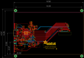
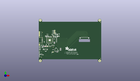
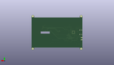
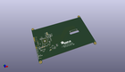

Contents
========

* [PROJ-ADAF-2406-STAN-01>Adafruit 7 HDMI Backpack PCB](#proj-adaf-2406-stan-01adafruit-7-hdmi-backpack-pcb)
	* [Images](#images)
	* [Interactive BOM](#interactive-bom)
	* [Tags](#tags)
  
![][im]
# PROJ-ADAF-2406-STAN-01>Adafruit 7 HDMI Backpack PCB

- ID: PROJ-ADAF-2406-STAN-01
- Hex ID: PRA2406
- Name: Adafruit 7 HDMI Backpack PCB
- Description: 

## Images
  
  

|eagleImage|kicadPcb3dFront|kicadPcb3dBack|kicadPcb3d|
| :---: | :---: | :---: | :---: |
|||||

## Interactive BOM

- Interactive BOM page: [ibom.html](kicad/bom/ibom.html)

## Tags

- hexID: PRA2406
- oompType: PROJ
- oompSize: ADAF
- oompColor: 2406
- oompDesc: STAN
- oompIndex: 01
- oompName: Adafruit 7 HDMI Backpack PCB
- sources: All source files from https://github.com/adafruit/Adafruit-7-HDMI-Backpack-PCB (source licence details in srcLicense.md)
- linkBuyPage: http://www.adafruit.com/products/2406
- oompPart: UNMATCHED-UNMATCHED-X-UNMATCHED-01, BACKLITEPWM, 1.599200002, 81.30099995799999, 0
- oompPart: CAPC-0805-X-NF100-V50, C1, 48.6401999, 28.822000014, 0
- oompPart: CAPC-0805-X-NF100-V50, C2, 26.299199878, 47.000999977999996, 270
- oompPart: CAPC-0805-X-NF100-V50, C3, 27.049199901999994, 68.801000066, 180
- oompPart: CAPC-UNMATCHED-X-NF100-V50, C4, 43.56019989999999, 28.822000014, 0
- oompPart: CAPC-0805-X-UNMATCHED-01, C5, 41.19920005, 53.87399994799999, 0
- oompPart: CAPC-UNMATCHED-X-NF100-V50, C6, 40.799200088, 62.00099995, 90
- oompPart: CAPC-0805-X-NF100-V50, C7, 31.7491999, 68.801000066, 180
- oompPart: CAPC-0805-X-NF100-V50, C8, 20.24920004, 67.251000118, 0
- oompPart: CAPC-0805-X-NF100-V50, C9, 10.508199964, 40.772999988, 270
- oompPart: CAPC-0805-X-NF100-V50, C10, 19.999200031999997, 46.750999969999995, 270
- oompPart: CAPC-0805-X-NF100-V50, C11, 14.499200109999999, 54.250999956, 270
- oompPart: CAPC-0805-X-UF10-V25, C12, 8.608199954, 40.772999988, 270
- oompPart: CAPC-0805-X-UF10-V25, C13, 13.89920004, 34.300999978, 90
- oompPart: CAPC-0805-X-UF10-V25, C14, 22.899200074, 34.300999978, 90
- oompPart: CAPC-0805-X-UF10-V25, C15, 41.19920005, 50.401000036, 180
- oompPart: CAPC-0805-X-UF10-V25, C16, 37.649200038000004, 72.201000124, 270
- oompPart: CAPC-0805-X-UNMATCHED-01, C17, 53.999200103999996, 69.500999936, 90
- oompPart: CAPC-0805-X-UNMATCHED-01, C18, 51.79919993199999, 69.500999936, 90
- oompPart: CAPC-0805-X-NF100-V50, C19, 44.99920006999999, 74.10099987999999, 270
- oompPart: CAPC-0805-X-NF100-V50, C20, 24.299200067999998, 69.900999898, 270
- oompPart: CAPC-0805-X-NF10-01, C21, 57.31420007799999, 35.735999901999996, 180
- oompPart: CAPC-0805-X-NF10-01, C22, 57.31420007799999, 31.925999902, 0
- oompPart: CAPC-0805-X-NF100-V50, C23, 34.982200038, 26.473999883999998, 270
- oompPart: ERROR, C24 100uF/6V PANASONIC_C, 0, 0, 0
- oompPart: CAPC-0805-X-UNMATCHED-01, C25, 11.6831999, 34.416999999999994, 90
- oompPart: UNMATCHED-UNMATCHED-X-UNMATCHED-01, D1, 47.299200041999995, 67.20099996399999, 180
- oompPart: UNMATCHED-UNMATCHED-X-UNMATCHED-01, D2, 48.79920009, 72.10100007, 90
- oompPart: UNMATCHED-UNMATCHED-X-UNMATCHED-01, D3, 53.72019989999999, 75.692, 180
- oompPart: UNMATCHED-UNMATCHED-X-UNMATCHED-01, FB1, 15.881199886, 42.550999987999994, 90
- oompPart: UNMATCHED-UNMATCHED-X-UNMATCHED-01, FB2, 41.19920005, 52.073999992000005, 180
- oompPart: UNMATCHED-UNMATCHED-X-UNMATCHED-01, FB3, 12.535199974, 42.550999987999994, 90
- oompPart: UNMATCHED-UNMATCHED-X-UNMATCHED-01, FB4, 14.20819993, 42.550999987999994, 90
- oompPart: UNMATCHED-UNMATCHED-X-UNMATCHED-01, FB5, 57.31420007799999, 37.640999902, 0
- oompPart: UNMATCHED-UNMATCHED-X-UNMATCHED-01, FB6, 57.31420007799999, 33.830999902, 0
- oompPart: UNMATCHED-UNMATCHED-X-UNMATCHED-01, FB7, 48.6401999, 26.843999905999997, 180
- oompPart: UNMATCHED-UNMATCHED-X-UNMATCHED-01, FB8, 37.97219989999999, 33.494000068, 0
- oompPart: SKIP-UNMATCHED-X-UNMATCHED-01, FID1, 36.299199943999994, 69.201000028, 0
- oompPart: SKIP-UNMATCHED-X-UNMATCHED-01, FID2, 37.979199885999996, 40.451000124, 0
- oompPart: SKIP-UNMATCHED-X-UNMATCHED-01, FID3, 163.029199976, 10.15500001, 0
- oompPart: SKIP-UNMATCHED-X-UNMATCHED-01, FID4, 9.397199899999999, 79.756, 0
- oompPart: SKIP-UNMATCHED-X-UNMATCHED-01, FID5, 7.1111999, 13.544000089999999, 0
- oompPart: SKIP-UNMATCHED-X-UNMATCHED-01, FID6, 163.0172, 106.44199996799999, 0
- oompPart: UNMATCHED-UNMATCHED-X-UNMATCHED-01, GND, 1.599200002, 72.90099999399999, 0
- oompPart: UNMATCHED-UNMATCHED-X-UNMATCHED-01, IC1, 46.1001999, 33.367000068, 90
- oompPart: UNMATCHED-UNMATCHED-X-UNMATCHED-01, J1, 165.09919989999997, 8.001, M0
- oompPart: UNMATCHED-UNMATCHED-X-UNMATCHED-01, JP3, 1.599200002, 70.10100000599999, 0
- oompPart: UNMATCHED-UNMATCHED-X-UNMATCHED-01, JP4, 1.599200002, 75.700999982, 0
- oompPart: UNMATCHED-UNMATCHED-X-UNMATCHED-01, JP5, 1.599200002, 78.50099997, 0
- oompPart: UNMATCHED-UNMATCHED-X-UNMATCHED-01, JP6, 1.6992000559999998, 45.201000022, 0
- oompPart: UNMATCHED-UNMATCHED-X-UNMATCHED-01, JP7, 1.6992000559999998, 48.00100001, 0
- oompPart: UNMATCHED-UNMATCHED-X-UNMATCHED-01, L1, 41.499199958, 68.40100010399999, 0
- oompPart: UNMATCHED-UNMATCHED-X-UNMATCHED-01, LED1, 1.253199932, 14.546000117999998, 0
- oompPart: UNMATCHED-UNMATCHED-X-UNMATCHED-01, LED2, 1.353199986, 29.500999926, 180
- oompPart: UNMATCHED-UNMATCHED-X-UNMATCHED-01, LED3, 1.253199932, 22.023500022, 180
- oompPart: UNMATCHED-UNMATCHED-X-UNMATCHED-01, Q1, 7.521200096, 20.899000112, 90
- oompPart: RESE-0805-X-O103-01, R1, 17.69920006, 69.900999898, 270
- oompPart: RESE-UNMATCHED-X-O103-01, R2, 19.914199948, 42.412000012, 270
- oompPart: RESE-0805-X-O103-01, R3, 19.899199978, 69.900999898, 270
- oompPart: RESE-0805-X-O103-01, R4, 22.099199896, 69.900999898, 270
- oompPart: RESE-UNMATCHED-X-O103-01, R5, 21.618200096, 42.423999988, 90
- oompPart: RESE-UNMATCHED-X-UNMATCHED-01, R6, 46.949199979999996, 55.101000034, 270
- oompPart: RESE-UNMATCHED-X-UNMATCHED-01, R7, 46.949199979999996, 59.200999962, 270
- oompPart: RESE-UNMATCHED-X-UNMATCHED-01, R8, 35.399199966, 45.051000068, 180
- oompPart: RESE-UNMATCHED-X-UNMATCHED-01, R9, 39.499199894, 45.051000068, 180
- oompPart: RESE-UNMATCHED-X-UNMATCHED-01, R10, 27.19920011, 42.30099998, 180
- oompPart: RESE-UNMATCHED-X-UNMATCHED-01, R11, 31.299200038000002, 42.30099998, 180
- oompPart: RESE-UNMATCHED-X-UNMATCHED-01, R12, 46.949199979999996, 63.30099989, 270
- oompPart: RESE-0805-X-O103-01, R13, 45.44019994999999, 37.812000067999996, 180
- oompPart: RESE-0805-X-O102-01, R14, 1.349199994, 18.28300001, 90
- oompPart: RESE-0805-X-UNMATCHED-01, R15, 38.2261999, 77.597, 180
- oompPart: RESE-0805-X-UNMATCHED-01, R16, 44.953199907999995, 77.72899998999999, 90
- oompPart: RESE-0805-X-UNMATCHED-01, R17, 38.199199954, 81.101000104, 180
- oompPart: RESE-0805-X-O103-01, R18, 35.299199912, 74.10099987999999, 90
- oompPart: RESE-0805-X-O102-01, R19, 1.353199986, 25.700999906, 270
- oompPart: RESE-0805-X-O102-01, R20, 3.9307000379999995, 20.899000112, 0
- oompPart: RESE-0805-X-O102-01, R21, 11.210200083999998, 19.971999934, 180
- oompPart: RESE-0805-X-UNMATCHED-01, R22, 38.199199954, 84.600999962, 180
- oompPart: UNMATCHED-UNMATCHED-X-UNMATCHED-01, SJ1, 17.837200038, 42.465999904, 90
- oompPart: UNMATCHED-UNMATCHED-X-UNMATCHED-01, SJ2, 23.500199887999997, 42.497000095999994, 90
- oompPart: UNMATCHED-UNMATCHED-X-UNMATCHED-01, SJ3, 41.9091999, 77.597, 0
- oompPart: UNMATCHED-UNMATCHED-X-UNMATCHED-01, SJ4, 37.8451999, 27.304999999999996, 0
- oompPart: UNMATCHED-UNMATCHED-X-UNMATCHED-01, SJ5, 41.899199919999994, 81.101000104, 0
- oompPart: UNMATCHED-UNMATCHED-X-UNMATCHED-01, SJ6, 41.99919997399999, 84.600999962, 0
- oompPart: SKIP-UNMATCHED-X-UNMATCHED-01, U$31, 3.9992000279999993, 112.20099988, 0
- oompPart: SKIP-UNMATCHED-X-UNMATCHED-01, U$32, 161.099200026, 112.20099988, 0
- oompPart: SKIP-UNMATCHED-X-UNMATCHED-01, U$33, 161.099200026, 4.001000125999999, 0
- oompPart: SKIP-UNMATCHED-X-UNMATCHED-01, U$34, 3.9992000279999993, 4.001000125999999, 0
- oompPart: UNMATCHED-UNMATCHED-X-UNMATCHED-01, U1, 28.999200066, 59.001000108, 0
- oompPart: UNMATCHED-UNMATCHED-X-UNMATCHED-01, U2, 23.49919989, 74.501000096, 270
- oompPart: UNMATCHED-UNMATCHED-X-UNMATCHED-01, U3, 18.39919993, 32.201000113999996, 180
- oompPart: UNMATCHED-UNMATCHED-X-UNMATCHED-01, U4, 41.399199904, 74.501000096, 90
- oompPart: UNMATCHED-UNMATCHED-X-UNMATCHED-01, X1, 9.249199941999999, 59.001000108, 270
- oompPart: UNMATCHED-UNMATCHED-X-UNMATCHED-01, X2, 3.7492000199999995, 37.600999982, 270
- oompPart: UNMATCHED-UNMATCHED-X-UNMATCHED-01, Y1, 52.185199921999995, 30.408999887999997, 90
- rawPart: 

[im]: kicadPcb3d_450.png
