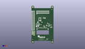
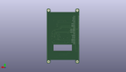
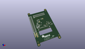

Contents
========

* [PROJ-ADAF-2441-STAN-01>Adafruit PiTFT 3.5 Plus PCB](#proj-adaf-2441-stan-01adafruit-pitft-35-plus-pcb)
	* [Images](#images)
	* [Interactive BOM](#interactive-bom)
	* [Tags](#tags)
  
![][im]
# PROJ-ADAF-2441-STAN-01>Adafruit PiTFT 3.5 Plus PCB

- ID: PROJ-ADAF-2441-STAN-01
- Hex ID: PRA2441
- Name: Adafruit PiTFT 3.5 Plus PCB
- Description: 

## Images
  
  

|eagleImage|kicadPcb3dFront|kicadPcb3dBack|kicadPcb3d|
| :---: | :---: | :---: | :---: |
|||||

## Interactive BOM

- Interactive BOM page: [ibom.html](kicad/bom/ibom.html)

## Tags

- hexID: PRA2441
- oompType: PROJ
- oompSize: ADAF
- oompColor: 2441
- oompDesc: STAN
- oompIndex: 01
- oompName: Adafruit PiTFT 3.5 Plus PCB
- sources: All source files from https://github.com/adafruit/Adafruit-PiTFT-3.5-Plus-PCB (source licence details in srcLicense.md)
- linkBuyPage: http://www.adafruit.com/products/2441
- oompPart: CAPC-0805-X-UF10-V25, C1, 50.165, 41.148, 0
- oompPart: CAPC-0805-X-NF100-V50, C4, 41.65599999999999, 45.339, 90
- oompPart: CAPC-0805-X-UF10-V25, C16, 16.383, 49.657, 180
- oompPart: CAPC-0805-X-NF100-V50, C18, 15.875, 41.021, 180
- oompPart: CAPC-UNMATCHED-X-UNMATCHED-01, C20, 13.716, 35.687, 0
- oompPart: UNMATCHED-UNMATCHED-X-UNMATCHED-01, D1, 14.985999999999999, 38.099999999999994, 0
- oompPart: UNMATCHED-UNMATCHED-X-UNMATCHED-01, D2, 12.191999999999998, 43.18, 90
- oompPart: UNMATCHED-UNMATCHED-X-UNMATCHED-01, GPIO5, 6.35, 14.477999999999998, 90
- oompPart: UNMATCHED-UNMATCHED-X-UNMATCHED-01, GPIO6, 6.35, 17.018, 90
- oompPart: UNMATCHED-UNMATCHED-X-UNMATCHED-01, GPIO12, 2.032, 17.018, 90
- oompPart: UNMATCHED-UNMATCHED-X-UNMATCHED-01, GPIO13, 6.35, 19.558, 90
- oompPart: UNMATCHED-UNMATCHED-X-UNMATCHED-01, GPIO16, 2.032, 19.558, 90
- oompPart: UNMATCHED-UNMATCHED-X-UNMATCHED-01, GPIO19, 6.35, 22.098, 90
- oompPart: UNMATCHED-UNMATCHED-X-UNMATCHED-01, GPIO20, 2.032, 22.098, 90
- oompPart: UNMATCHED-UNMATCHED-X-UNMATCHED-01, GPIO21, 2.032, 24.637999999999998, 90
- oompPart: UNMATCHED-UNMATCHED-X-UNMATCHED-01, GPIO26, 6.35, 24.637999999999998, 90
- oompPart: UNMATCHED-UNMATCHED-X-UNMATCHED-01, IC5, 49.403, 35.559999999999995, 0
- oompPart: UNMATCHED-UNMATCHED-X-UNMATCHED-01, JP1, 28.955999999999996, 74.54899999999999, 0
- oompPart: ERROR, L1 10uH 1007, 0, 0, 0
- oompPart: RESE-0805-X-UNMATCHED-01, R1, 19.685, 41.021, 180
- oompPart: RESE-0805-X-O103-01, R2, 19.939, 43.942, 90
- oompPart: RESE-UNMATCHED-X-UNMATCHED-01, R3, 30.733999999999998, 38.099999999999994, 270
- oompPart: RESE-0805-X-UNMATCHED-01, R4, 33.400999999999996, 37.337999999999994, 270
- oompPart: RESE-0805-X-O103-01, R5, 26.924, 48.26, 270
- oompPart: RESE-0805-X-O103-01, R6, 52.324, 35.559999999999995, 90
- oompPart: RESE-0805-X-O103-01, R7, 44.958, 43.307, 0
- oompPart: RESE-0805-X-UNMATCHED-01, R8, 44.323, 38.227, 180
- oompPart: RESE-UNMATCHED-X-O102-01, R9, 24.511, 42.037, 0
- oompPart: RESE-0805-X-O102-01, R10, 30.861, 59.055, 0
- oompPart: RESE-0805-X-O103-01, R11, 45.846999999999994, 40.132, 180
- oompPart: RESE-0805-X-UNMATCHED-01, R12, 19.812, 59.69, 0
- oompPart: RESE-0805-X-UNMATCHED-01, R13, 23.368, 59.69, 0
- oompPart: RESE-0805-X-UNMATCHED-01, R14, 19.812, 52.324, 180
- oompPart: UNMATCHED-UNMATCHED-X-UNMATCHED-01, RPI1, 56.76899999999999, 0.127, M0
- oompPart: UNMATCHED-UNMATCHED-X-UNMATCHED-01, SJ1, 23.368, 52.324, 180
- oompPart: UNMATCHED-UNMATCHED-X-UNMATCHED-01, SJ2, 34.544000000000004, 59.055, 180
- oompPart: SKIP-UNMATCHED-X-UNMATCHED-01, U$10, 53.974999999999994, 2.2859999999999996, 90
- oompPart: SKIP-UNMATCHED-X-UNMATCHED-01, U$11, 3.429, 3.0479999999999996, 180
- oompPart: SKIP-UNMATCHED-X-UNMATCHED-01, U$15, 3.429, -3.175, M90
- oompPart: SKIP-UNMATCHED-X-UNMATCHED-01, U$16, 53.339999999999996, 88.011, M90
- oompPart: SKIP-UNMATCHED-X-UNMATCHED-01, U$17, 53.339999999999996, -3.175, M0
- oompPart: SKIP-UNMATCHED-X-UNMATCHED-01, U$18, 52.577999999999996, 81.91499999999999, 0
- oompPart: SKIP-UNMATCHED-X-UNMATCHED-01, U$20, 3.429, 88.011, M0
- oompPart: UNMATCHED-UNMATCHED-X-UNMATCHED-01, U1, 21.336, 56.13399999999999, 90
- oompPart: UNMATCHED-UNMATCHED-X-UNMATCHED-01, U2, 38.989, 39.878, 180
- oompPart: UNMATCHED-UNMATCHED-X-UNMATCHED-01, U3, 16.256, 43.815, 270
- oompPart: UNMATCHED-UNMATCHED-X-UNMATCHED-01, X1, 28.448, 37.083999999999996, M0
- rawPart: 

[im]: kicadPcb3d_450.png
