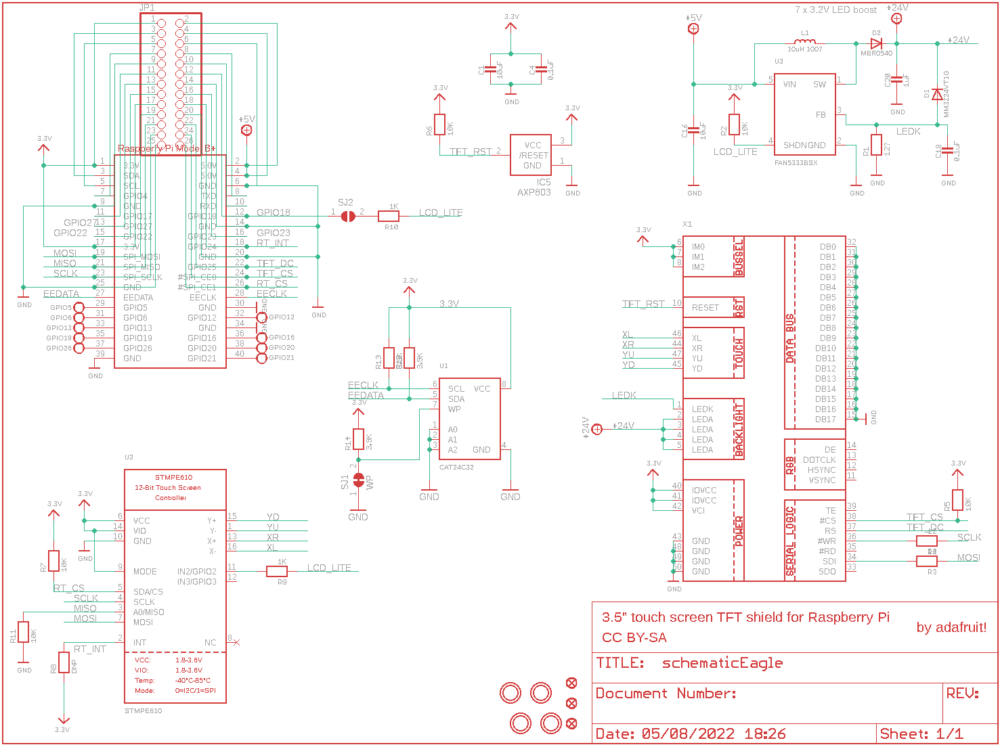
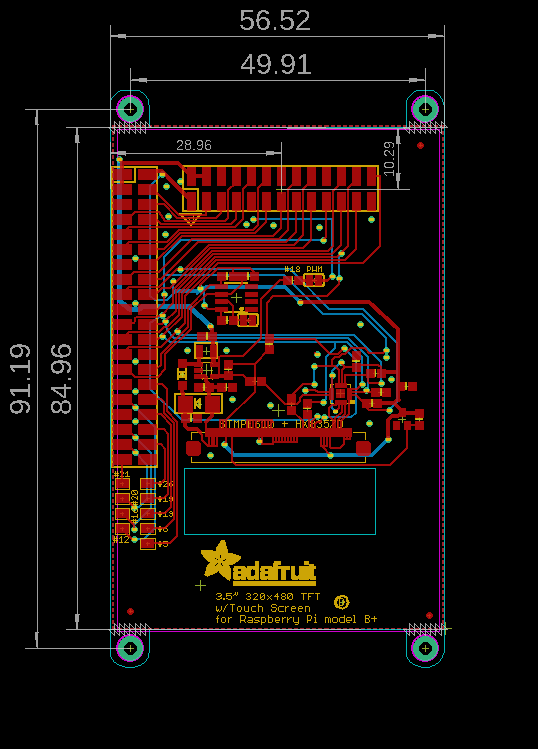
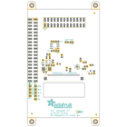
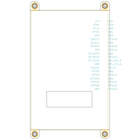
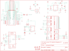
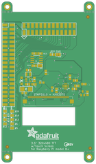
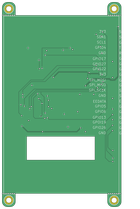

Contents
========

* [PRA2441 > Adafruit PiTFT 3.5 Plus PCB](#pra2441--adafruit-pitft-35-plus-pcb)
	* [Schematic](#schematic)
	* [PCB](#pcb)
	* [Interactive BOM](#interactive-bom)
	* [OOMP Parts](#oomp-parts)
	* [Images](#images)
	* [Tags](#tags)
  
![][im]
# PRA2441 > Adafruit PiTFT 3.5 Plus PCB

- ID: PROJ-ADAF-2441-STAN-01
- Hex ID: PRA2441
- Name: Adafruit
- Description: Adafruit
- Long Link: [http://oom.lt/PROJ-ADAF-2441-STAN-01](http://oom.lt/PROJ-ADAF-2441-STAN-01)
- Short Link: [http://oom.lt/PRA2441](http://oom.lt/PRA2441)

## Schematic
  

## PCB
  

## Interactive BOM

- Interactive BOM page: [ibom.html](https://htmlpreview.github.io/?https://github.com/oomlout/oomlout_OOMP_projects/blob/main/PROJ-ADAF-2441-STAN-01/kicad/bom/ibom.html)

## OOMP Parts
  

|OOMP Parts|
| :---: |
|[CAPC-0805-X-UF10-V10  SMD (0805) 10 uF Capacitor (Ceramic) 10v  C1, C16](https://github.com/oomlout/oomlout_OOMP_parts/tree/main/CAPC-0805-X-UF10-V10/)|
|[CAPC-0805-X-NF100-V50  SMD (0805) 100 nF Capacitor (Ceramic) 50v  C4, C18](https://github.com/oomlout/oomlout_OOMP_parts/tree/main/CAPC-0805-X-NF100-V50/)|
|[CAPC-0805-X-UF1-V25  SMD (0805) 1 uF Capacitor (Ceramic) 25v  C20](https://github.com/oomlout/oomlout_OOMP_parts/tree/main/CAPC-0805-X-UF1-V25/)|
|DIOD-UNMATCHED-X-UNMATCHED-01 D1|
|DIOD-S123-X-UNMATCHED-01 D2|
|UNMATCHED-SO23-X-UNMATCHED-01 IC5|
|HEAD-I01-X-PI2X13-01 JP1|
|UNMATCHED-UNMATCHED-X-UNMATCHED-01 L1, RPI1, U1, U2, X1|
|RESE-0805-X-UNMATCHED-01 R1, R8|
|[RESE-0805-X-O103-01  SMD (0805) 10k Ohm Resistor  R2, R5, R6, R7, R11](https://github.com/oomlout/oomlout_OOMP_parts/tree/main/RESE-0805-X-O103-01/)|
|RESE-0805-X-O120-01 R3, R4|
|[RESE-0805-X-O102-01  SMD (0805) 1k Ohm Resistor  R9, R10](https://github.com/oomlout/oomlout_OOMP_parts/tree/main/RESE-0805-X-O102-01/)|
|RESE-0805-X-O392-01 R12, R13, R14|
|UNMATCHED-SO235-X-UNMATCHED-01 U3|

## Images
  
  

|bominteractivefront|bominteractiveback|kicadPcb3d|kicadPcb3dFront|kicadPcb3dBack|eagleImage|eagleSchemImage|pcbdraw|pcbdrawback|
| :---: | :---: | :---: | :---: | :---: | :---: | :---: | :---: | :---: |
||||||||||

## Tags

- hexID: PRA2441
- oompType: PROJ
- oompSize: ADAF
- oompColor: 2441
- oompDesc: STAN
- oompIndex: 01
- oompName: Adafruit PiTFT 3.5 Plus PCB
- sources: All source files from https://github.com/adafruit/Adafruit-PiTFT-3.5-Plus-PCB (source licence details in srcLicense.md)
- linkBuyPage: http://www.adafruit.com/products/2441
- oompID: PROJ-ADAF-2441-STAN-01
- oompParts: C1,CAPC-0805-X-UF10-V10
- oompParts: C4,CAPC-0805-X-NF100-V50
- oompParts: C16,CAPC-0805-X-UF10-V10
- oompParts: C18,CAPC-0805-X-NF100-V50
- oompParts: C20,CAPC-0805-X-UF1-V25
- oompParts: D1,DIOD-UNMATCHED-X-UNMATCHED-01
- oompParts: D2,DIOD-S123-X-UNMATCHED-01
- oompParts: IC5,UNMATCHED-SO23-X-UNMATCHED-01
- oompParts: JP1,HEAD-I01-X-PI2X13-01
- oompParts: L1,UNMATCHED-UNMATCHED-X-UNMATCHED-01
- oompParts: R1,RESE-0805-X-UNMATCHED-01
- oompParts: R2,RESE-0805-X-O103-01
- oompParts: R3,RESE-0805-X-O120-01
- oompParts: R4,RESE-0805-X-O120-01
- oompParts: R5,RESE-0805-X-O103-01
- oompParts: R6,RESE-0805-X-O103-01
- oompParts: R7,RESE-0805-X-O103-01
- oompParts: R8,RESE-0805-X-UNMATCHED-01
- oompParts: R9,RESE-0805-X-O102-01
- oompParts: R10,RESE-0805-X-O102-01
- oompParts: R11,RESE-0805-X-O103-01
- oompParts: R12,RESE-0805-X-O392-01
- oompParts: R13,RESE-0805-X-O392-01
- oompParts: R14,RESE-0805-X-O392-01
- oompParts: RPI1,UNMATCHED-UNMATCHED-X-UNMATCHED-01
- oompParts: U1,UNMATCHED-UNMATCHED-X-UNMATCHED-01
- oompParts: U2,UNMATCHED-UNMATCHED-X-UNMATCHED-01
- oompParts: U3,UNMATCHED-SO235-X-UNMATCHED-01
- oompParts: X1,UNMATCHED-UNMATCHED-X-UNMATCHED-01
- rawParts: C1,10uF,CAP_CERAMIC0805-NOOUTLINE,0805-NO,Ceramic Capacitors,,
- rawParts: C4,0.1uF,CAP_CERAMIC0805-NOOUTLINE,0805-NO,Ceramic Capacitors,,
- rawParts: C16,10uF,CAP_CERAMIC0805-NOOUTLINE,0805-NO,Ceramic Capacitors,,
- rawParts: C18,0.1uF,CAP_CERAMIC0805-NOOUTLINE,0805-NO,Ceramic Capacitors,,
- rawParts: C20,1uF,CAP_CERAMIC_0805MP,_0805MP,Ceramic Capacitors,,
- rawParts: D1,MM3Z24VT1G,DIODESMA,SMADIODE,Diode,,
- rawParts: D2,MBR0540,DIODESOD-123,SOD-123,Diode,,
- rawParts: GPIO5,,TESTPOINT1.5X2.0MM_NOCREAM,PAD-1.5X2.0,Test Point,,
- rawParts: GPIO6,,TESTPOINT1.5X2.0MM_NOCREAM,PAD-1.5X2.0,Test Point,,
- rawParts: GPIO12,,TESTPOINT1.5X2.0MM_NOCREAM,PAD-1.5X2.0,Test Point,,
- rawParts: GPIO13,,TESTPOINT1.5X2.0MM_NOCREAM,PAD-1.5X2.0,Test Point,,
- rawParts: GPIO16,,TESTPOINT1.5X2.0MM_NOCREAM,PAD-1.5X2.0,Test Point,,
- rawParts: GPIO19,,TESTPOINT1.5X2.0MM_NOCREAM,PAD-1.5X2.0,Test Point,,
- rawParts: GPIO20,,TESTPOINT1.5X2.0MM_NOCREAM,PAD-1.5X2.0,Test Point,,
- rawParts: GPIO21,,TESTPOINT1.5X2.0MM_NOCREAM,PAD-1.5X2.0,Test Point,,
- rawParts: GPIO26,,TESTPOINT1.5X2.0MM_NOCREAM,PAD-1.5X2.0,Test Point,,
- rawParts: IC5,AXP803,AXP083-SAG,SOT23,,,
- rawParts: JP1,,HEADER-2X13-SMT,2X13_SMT_MALE,,,
- rawParts: L1,10uH 1007,INDUCTOR,INDUCTOR_1007,Inductors,,
- rawParts: R1,12Ω,RESISTOR0805_NOOUTLINE,0805-NO,Resistors,,
- rawParts: R2,10K,RESISTOR0805_NOOUTLINE,0805-NO,Resistors,,
- rawParts: R3,12,RESISTOR_0805MP,_0805MP,Resistors,,
- rawParts: R4,12,RESISTOR0805_NOOUTLINE,0805-NO,Resistors,,
- rawParts: R5,10K,RESISTOR0805_NOOUTLINE,0805-NO,Resistors,,
- rawParts: R6,10K,RESISTOR0805_NOOUTLINE,0805-NO,Resistors,,
- rawParts: R7,10K,RESISTOR0805_NOOUTLINE,0805-NO,Resistors,,
- rawParts: R8,DNP,RESISTOR0805_NOOUTLINE,0805-NO,Resistors,,
- rawParts: R9,1K,RESISTOR_0805MP,_0805MP,Resistors,,
- rawParts: R10,1K,RESISTOR0805_NOOUTLINE,0805-NO,Resistors,,
- rawParts: R11,10K,RESISTOR0805_NOOUTLINE,0805-NO,Resistors,,
- rawParts: R12,3.9K,RESISTOR0805_NOOUTLINE,0805-NO,Resistors,,
- rawParts: R13,3.9K,RESISTOR0805_NOOUTLINE,0805-NO,Resistors,,
- rawParts: R14,3.9K,RESISTOR0805_NOOUTLINE,0805-NO,Resistors,,
- rawParts: RPI1,RASPBERRYPI_BPLUS_SMT,RASPBERRYPI_BPLUS_SMT,RASPBERRYPI_BPLUS_SHIELD_SMT,,,
- rawParts: SJ1,WP,SOLDERJUMPER_CLOSED,SOLDERJUMPER_CLOSEDWIRE,Solder Jumper - Closed,,
- rawParts: SJ2,,SOLDERJUMPERCLOSED,SOLDERJUMPER_CLOSEDWIRE,SMD Solder JUMPER,,
- rawParts: U$10,FIDUCIAL,FIDUCIAL,FIDUCIAL_1MM,Fiducial Alignment Points,EXCLUDE,
- rawParts: U$11,FIDUCIAL,FIDUCIAL,FIDUCIAL_1MM,Fiducial Alignment Points,EXCLUDE,
- rawParts: U$15,MOUNTINGHOLE2.5_THICK,MOUNTINGHOLE2.5_THICK,MOUNTINGHOLE_2.5_PLATED_THICK,Mounting Hole,EXCLUDE,
- rawParts: U$16,MOUNTINGHOLE2.5_THICK,MOUNTINGHOLE2.5_THICK,MOUNTINGHOLE_2.5_PLATED_THICK,Mounting Hole,EXCLUDE,
- rawParts: U$17,MOUNTINGHOLE2.5_THICK,MOUNTINGHOLE2.5_THICK,MOUNTINGHOLE_2.5_PLATED_THICK,Mounting Hole,EXCLUDE,
- rawParts: U$18,FIDUCIAL,FIDUCIAL,FIDUCIAL_1MM,Fiducial Alignment Points,EXCLUDE,
- rawParts: U$20,MOUNTINGHOLE2.5_THICK,MOUNTINGHOLE2.5_THICK,MOUNTINGHOLE_2.5_PLATED_THICK,Mounting Hole,EXCLUDE,
- rawParts: U1,CAT24C32,EEPROM_I2C_SOIC8_GENERIC,SOIC8_150MIL,Note: The same pinout is used for many I2C EEPROMs in SOIC8(150mil) from a variety of manufacturers and in various sizes.,,
- rawParts: U2,STMPE610,STMPE610,QFN16_3MM,STMPE610 - 12-Bit Touch Screen Controller,,
- rawParts: U3,FAN5333BSX,FAN5331,SOT23-5@1,FAN5331 - LED/OLED 20V Boost Converter,,
- rawParts: X1,,DISP_LCD_3.5IN_320X480_50PIN,TFT_3.5IN_320X480_50PIN,DT350HV15-T - 3.5 320x480 TFT Display, 50 Pin Connector,,

[im]: kicadPcb3d_450.png
