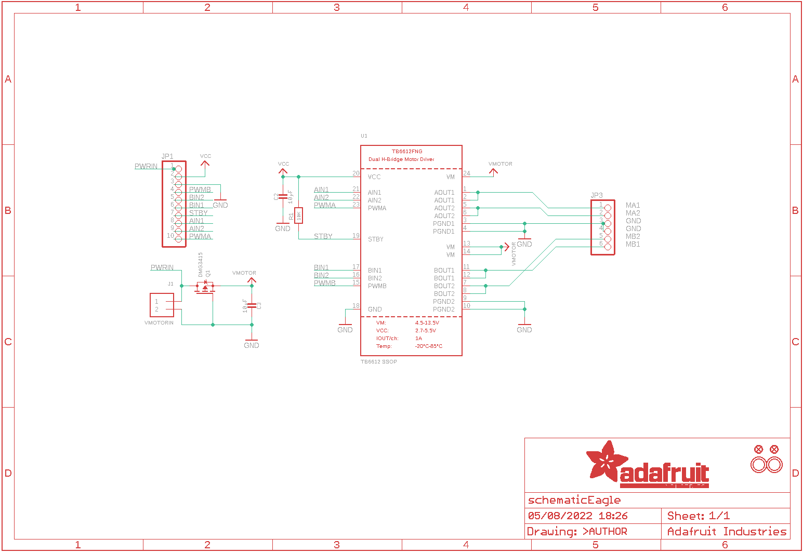
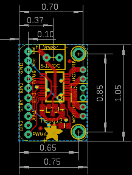
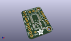
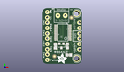
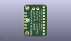
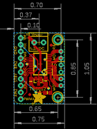
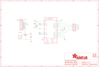

Contents
========

* [PRA2448 > Adafruit TB6612 Motor Driver Breakout PCB](#pra2448--adafruit-tb6612-motor-driver-breakout-pcb)
	* [Schematic](#schematic)
	* [PCB](#pcb)
	* [Interactive BOM](#interactive-bom)
	* [OOMP Parts](#oomp-parts)
	* [Images](#images)
	* [Tags](#tags)
  
![][im]
# PRA2448 > Adafruit TB6612 Motor Driver Breakout PCB

- ID: PROJ-ADAF-2448-STAN-01
- Hex ID: PRA2448
- Name: Adafruit
- Description: Adafruit
- Long Link: [http://oom.lt/PROJ-ADAF-2448-STAN-01](http://oom.lt/PROJ-ADAF-2448-STAN-01)
- Short Link: [http://oom.lt/PRA2448](http://oom.lt/PRA2448)

## Schematic
  

## PCB
  

## Interactive BOM

- Interactive BOM page: [ibom.html](https://htmlpreview.github.io/?https://github.com/oomlout/oomlout_OOMP_projects/blob/main/PROJ-ADAF-2448-STAN-01/kicad/bom/ibom.html)

## OOMP Parts
  

|OOMP Parts|
| :---: |
|[C2 CAPC-0805-X-UF10-V10 SMD (0805) 10 uF Capacitor (Ceramic) 10v](https://github.com/oomlout/oomlout_OOMP_parts/tree/main/CAPC-0805-X-UF10-V10/)|
|[C3 CAPC-0805-X-UF10-V10 SMD (0805) 10 uF Capacitor (Ceramic) 10v](https://github.com/oomlout/oomlout_OOMP_parts/tree/main/CAPC-0805-X-UF10-V10/)|
|J1 J1,UNMATCHED-UNMATCHED-X-UNMATCHED-01|
|[JP1 HEAD-I01-X-PI10-01 2.54 mm 10 Pin Header](https://github.com/oomlout/oomlout_OOMP_parts/tree/main/HEAD-I01-X-PI10-01/)|
|[JP3 HEAD-I01-X-PI06-01 2.54 mm 6 Pin Header](https://github.com/oomlout/oomlout_OOMP_parts/tree/main/HEAD-I01-X-PI06-01/)|
|Q1 Q1,MOSP-SO23-X-UNMATCHED-01|
|[R1 RESE-0805-X-O103-01 SMD (0805) 10k Ohm Resistor](https://github.com/oomlout/oomlout_OOMP_parts/tree/main/RESE-0805-X-O103-01/)|
|U1 U1,UNMATCHED-UNMATCHED-X-UNMATCHED-01|

## Images
  
  

|kicadPcb3d|kicadPcb3dFront|kicadPcb3dBack|eagleImage|eagleSchemImage|
| :---: | :---: | :---: | :---: | :---: |
||||||

## Tags

- hexID: PRA2448
- oompType: PROJ
- oompSize: ADAF
- oompColor: 2448
- oompDesc: STAN
- oompIndex: 01
- oompName: Adafruit TB6612 Motor Driver Breakout PCB
- sources: All source files from https://github.com/adafruit/Adafruit-TB6612-Motor-Driver-Breakout-PCB (source licence details in srcLicense.md)
- linkBuyPage: http://www.adafruit.com/products/2448
- oompID: PROJ-ADAF-2448-STAN-01
- oompParts: C2,CAPC-0805-X-UF10-V10
- oompParts: C3,CAPC-0805-X-UF10-V10
- oompParts: J1,UNMATCHED-UNMATCHED-X-UNMATCHED-01
- oompParts: JP1,HEAD-I01-X-PI10-01
- oompParts: JP3,HEAD-I01-X-PI06-01
- oompParts: Q1,MOSP-SO23-X-UNMATCHED-01
- oompParts: R1,RESE-0805-X-O103-01
- oompParts: U1,UNMATCHED-UNMATCHED-X-UNMATCHED-01
- rawParts: C2,10µF,CAP_CERAMIC0805-NOOUTLINE,0805-NO,Ceramic Capacitors,,
- rawParts: C3,10µF,CAP_CERAMIC0805-NOOUTLINE,0805-NO,Ceramic Capacitors,,
- rawParts: FID1,FIDUCIAL,FIDUCIAL,FIDUCIAL_1MM,Fiducial Alignment Points,EXCLUDE,
- rawParts: FID2,FIDUCIAL,FIDUCIAL,FIDUCIAL_1MM,Fiducial Alignment Points,EXCLUDE,
- rawParts: J1,VMOTORIN,TERMBLOCK_1X2,TERMBLOCK_1X2-3.5MM,3.5mm Terminal block,,
- rawParts: JP1,,HEADER-1X10THICKER,1X10_ROUND_76,PIN HEADER,,
- rawParts: JP3,,PINHD-1X6CB,1X06-CLEANBIG,PIN HEADER,,
- rawParts: Q1,DMG3415,MOSFET-PWIDE,SOT23-WIDE,P-Channel Mosfet,,
- rawParts: R1,10K,RESISTOR0805_NOOUTLINE,0805-NO,Resistors,,
- rawParts: U$13,MOUNTINGHOLE2.5,MOUNTINGHOLE2.5,MOUNTINGHOLE_2.5_PLATED,Mounting Hole,EXCLUDE,
- rawParts: U$14,MOUNTINGHOLE2.5,MOUNTINGHOLE2.5,MOUNTINGHOLE_2.5_PLATED,Mounting Hole,EXCLUDE,
- rawParts: U1,TB6612 SSOP,TB6612FNGSSOP,SSOP24,TB6612FNG Dual H-Bridge Motor Driver,,

[im]: kicadPcb3d_450.png
