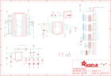

Contents
========

* [PRA2453 > Adafruit](#pra2453--adafruit)
	* [Images](#images)
	* [Tags](#tags)
  
![][im]
# PRA2453 > Adafruit

- ID: PROJ-ADAF-2453-STAN-01
- Hex ID: PRA2453
- Name: Adafruit
- Description: Adafruit

## Images
  
  

|kicadPcb3d|kicadPcb3dFront|kicadPcb3dBack|eagleImage|eagleSchemImage|
| :---: | :---: | :---: | :---: | :---: |
||||||

## Tags

- hexID: PRA2453
- oompType: PROJ
- oompSize: ADAF
- oompColor: 2453
- oompDesc: STAN
- oompIndex: 01
- oompName: Adafruit DPI Kippah PCB
- sources: All source files from https://github.com/adafruit/Adafruit-DPI-Kippah-PCB (source licence details in srcLicense.md)
- linkBuyPage: http://www.adafruit.com/products/2453
- oompID: PROJ-ADAF-2453-STAN-01
- oompParts: C1,UNMATCHED-UNMATCHED-UNMATCHED-UNMATCHED-UNMATCHED
- oompParts: C2,UNMATCHED-UNMATCHED-UNMATCHED-UNMATCHED-UNMATCHED
- oompParts: C3,UNMATCHED-UNMATCHED-UNMATCHED-UNMATCHED-UNMATCHED
- oompParts: C4,UNMATCHED-UNMATCHED-UNMATCHED-UNMATCHED-UNMATCHED
- oompParts: C5,UNMATCHED-UNMATCHED-UNMATCHED-UNMATCHED-UNMATCHED
- oompParts: C7,UNMATCHED-UNMATCHED-UNMATCHED-UNMATCHED-UNMATCHED
- oompParts: C8,UNMATCHED-UNMATCHED-UNMATCHED-UNMATCHED-UNMATCHED
- oompParts: D1,UNMATCHED-UNMATCHED-UNMATCHED-UNMATCHED-UNMATCHED
- oompParts: D2,UNMATCHED-UNMATCHED-UNMATCHED-UNMATCHED-UNMATCHED
- oompParts: D3,UNMATCHED-UNMATCHED-UNMATCHED-UNMATCHED-UNMATCHED
- oompParts: FB1,UNMATCHED-UNMATCHED-UNMATCHED-UNMATCHED-UNMATCHED
- oompParts: FB2,UNMATCHED-UNMATCHED-UNMATCHED-UNMATCHED-UNMATCHED
- oompParts: FB3,UNMATCHED-UNMATCHED-UNMATCHED-UNMATCHED-UNMATCHED
- oompParts: FB4,UNMATCHED-UNMATCHED-UNMATCHED-UNMATCHED-UNMATCHED
- oompParts: IC1,UNMATCHED-UNMATCHED-UNMATCHED-UNMATCHED-UNMATCHED
- oompParts: J1,UNMATCHED-UNMATCHED-UNMATCHED-UNMATCHED-UNMATCHED
- oompParts: L1,UNMATCHED-UNMATCHED-UNMATCHED-UNMATCHED-UNMATCHED
- oompParts: LED1,UNMATCHED-UNMATCHED-UNMATCHED-UNMATCHED-UNMATCHED
- oompParts: R1,UNMATCHED-UNMATCHED-UNMATCHED-UNMATCHED-UNMATCHED
- oompParts: R2,UNMATCHED-UNMATCHED-UNMATCHED-UNMATCHED-UNMATCHED
- oompParts: R3,UNMATCHED-UNMATCHED-UNMATCHED-UNMATCHED-UNMATCHED
- oompParts: R4,UNMATCHED-UNMATCHED-UNMATCHED-UNMATCHED-UNMATCHED
- oompParts: R5,UNMATCHED-UNMATCHED-UNMATCHED-UNMATCHED-UNMATCHED
- oompParts: R6,UNMATCHED-UNMATCHED-UNMATCHED-UNMATCHED-UNMATCHED
- oompParts: R7,UNMATCHED-UNMATCHED-UNMATCHED-UNMATCHED-UNMATCHED
- oompParts: R8,UNMATCHED-UNMATCHED-UNMATCHED-UNMATCHED-UNMATCHED
- oompParts: R9,UNMATCHED-UNMATCHED-UNMATCHED-UNMATCHED-UNMATCHED
- oompParts: R10,UNMATCHED-UNMATCHED-UNMATCHED-UNMATCHED-UNMATCHED
- oompParts: R11,UNMATCHED-UNMATCHED-UNMATCHED-UNMATCHED-UNMATCHED
- oompParts: R12,UNMATCHED-UNMATCHED-UNMATCHED-UNMATCHED-UNMATCHED
- oompParts: R13,UNMATCHED-UNMATCHED-UNMATCHED-UNMATCHED-UNMATCHED
- oompParts: R14,UNMATCHED-UNMATCHED-UNMATCHED-UNMATCHED-UNMATCHED
- oompParts: RPI1,UNMATCHED-UNMATCHED-UNMATCHED-UNMATCHED-UNMATCHED
- oompParts: TP1,UNMATCHED-UNMATCHED-UNMATCHED-UNMATCHED-UNMATCHED
- oompParts: TP2,UNMATCHED-UNMATCHED-UNMATCHED-UNMATCHED-UNMATCHED
- oompParts: TP3,UNMATCHED-UNMATCHED-UNMATCHED-UNMATCHED-UNMATCHED
- oompParts: TP4,UNMATCHED-UNMATCHED-UNMATCHED-UNMATCHED-UNMATCHED
- oompParts: TP5,UNMATCHED-UNMATCHED-UNMATCHED-UNMATCHED-UNMATCHED
- oompParts: TP6,UNMATCHED-UNMATCHED-UNMATCHED-UNMATCHED-UNMATCHED
- oompParts: TP7,UNMATCHED-UNMATCHED-UNMATCHED-UNMATCHED-UNMATCHED
- oompParts: TP8,UNMATCHED-UNMATCHED-UNMATCHED-UNMATCHED-UNMATCHED
- oompParts: TP9,UNMATCHED-UNMATCHED-UNMATCHED-UNMATCHED-UNMATCHED
- oompParts: TP10,UNMATCHED-UNMATCHED-UNMATCHED-UNMATCHED-UNMATCHED
- oompParts: TP11,UNMATCHED-UNMATCHED-UNMATCHED-UNMATCHED-UNMATCHED
- oompParts: TP12,UNMATCHED-UNMATCHED-UNMATCHED-UNMATCHED-UNMATCHED
- oompParts: TP13,UNMATCHED-UNMATCHED-UNMATCHED-UNMATCHED-UNMATCHED
- oompParts: U3,UNMATCHED-UNMATCHED-UNMATCHED-UNMATCHED-UNMATCHED
- oompParts: X1,UNMATCHED-UNMATCHED-UNMATCHED-UNMATCHED-UNMATCHED
- oompParts: Y1,UNMATCHED-UNMATCHED-UNMATCHED-UNMATCHED-UNMATCHED
- rawParts: C1,0.1uF,CAP_CERAMIC0805-NOOUTLINE,0805-NO,Ceramic Capacitors,,,
- rawParts: C2,1uF,CAP_CERAMIC_0805MP,_0805MP,Ceramic Capacitors,,,
- rawParts: C3,0.1uF,CAP_CERAMIC0805-NOOUTLINE,0805-NO,Ceramic Capacitors,,,
- rawParts: C4,10uF,CAP_CERAMIC0805-NOOUTLINE,0805-NO,Ceramic Capacitors,,,
- rawParts: C5,10uF,CAP_CERAMIC0805-NOOUTLINE,0805-NO,Ceramic Capacitors,,,
- rawParts: C7,10uF,CAP_CERAMIC0805-NOOUTLINE,0805-NO,Ceramic Capacitors,,,
- rawParts: C8,1uF,CAP_CERAMIC0805-NOOUTLINE,0805-NO,Ceramic Capacitors,,,
- rawParts: D1,MM3Z24VT1G,DIODESMA,SMADIODE,Diode,,,
- rawParts: D2,MBR0540,DIODESOD-123,SOD-123,Diode,,,
- rawParts: D3,1N4148,DIODESOD-323,SOD-323,Diode,,,
- rawParts: FB1,FERRITE,FERRITE_0805MP,_0805MP,Ferrite Bead,,,
- rawParts: FB2,FERRITE,FERRITE_0805MP,_0805MP,Ferrite Bead,,,
- rawParts: FB3,Ferrite,FERRITE_0805MP,_0805MP,Ferrite Bead,,,
- rawParts: FB4,FERITE,FERRITE_0805MP,_0805MP,Ferrite Bead,,,
- rawParts: FID1,FIDUCIAL,FIDUCIAL,FIDUCIAL_1MM,Fiducial Alignment Points,EXCLUDE,,
- rawParts: FID2,FIDUCIAL,FIDUCIAL,FIDUCIAL_1MM,Fiducial Alignment Points,EXCLUDE,,
- rawParts: FID3,FIDUCIAL,FIDUCIAL,FIDUCIAL_1MM,Fiducial Alignment Points,EXCLUDE,,
- rawParts: IC1,AR1100_SSOP,AR1100_SSOP,TSSOP20-5.3MMBODY,,,,
- rawParts: J1,40PINFPCM4-1734839-0,40PINFPCM4-1734839-0,4-1734839-0,OMRON FPC Connector,,,
- rawParts: L1,6.8uH power L CID 2276,INDUCTORNR5040,INDUCTOR_5X5MM_NR5040_NOTHERMALS,Inductors,,,
- rawParts: LED1,RED,LED0805_NOOUTLINE,CHIPLED_0805_NOOUTLINE,LED,,,
- rawParts: R1,20K,RESISTOR0805_NOOUTLINE,0805-NO,Resistors,,,
- rawParts: R2,6Ω,RESISTOR0805_NOOUTLINE,0805-NO,Resistors,,,
- rawParts: R3,12Ω,RESISTOR0805_NOOUTLINE,0805-NO,Resistors,,,
- rawParts: R4,12Ω,RESISTOR0805_NOOUTLINE,0805-NO,Resistors,,,
- rawParts: R5,20K,RESISTOR_0805MP,_0805MP,Resistors,,,
- rawParts: R6,33,RESISTOR_4PACK,RESPACK_4X0603,Resistor Packs (4 resistors),,,
- rawParts: R7,12Ω,RESISTOR0805_NOOUTLINE,0805-NO,Resistors,,,
- rawParts: R8,33,RESISTOR_4PACK,RESPACK_4X0603,Resistor Packs (4 resistors),,,
- rawParts: R9,33,RESISTOR_4PACK,RESPACK_4X0603,Resistor Packs (4 resistors),,,
- rawParts: R10,33,RESISTOR_4PACK,RESPACK_4X0603,Resistor Packs (4 resistors),,,
- rawParts: R11,33,RESISTOR_4PACK,RESPACK_4X0603,Resistor Packs (4 resistors),,,
- rawParts: R12,33,RESISTOR_4PACK,RESPACK_4X0603,Resistor Packs (4 resistors),,,
- rawParts: R13,470,RESISTOR0805_NOOUTLINE,0805-NO,Resistors,,,
- rawParts: R14,20K,RESISTOR0805_NOOUTLINE,0805-NO,Resistors,,,
- rawParts: RPI1,RASPBERRYPI_BPLUS-SMT+SLOTS,RASPBERRYPI_BPLUS-SMT+SLOTS,PI_HAT_SMT_SLOTS,,,,
- rawParts: SJ1,+50mA,SOLDERJUMPER,SOLDERJUMPER_ARROW_NOPASTE,SMD Solder JUMPER,EXCLUDE,,
- rawParts: SJ2,+25mA,SOLDERJUMPER,SOLDERJUMPER_ARROW_NOPASTE,SMD Solder JUMPER,EXCLUDE,,
- rawParts: SJ3,+100mA,SOLDERJUMPER,SOLDERJUMPER_ARROW_NOPASTE,SMD Solder JUMPER,EXCLUDE,,
- rawParts: TP1,TPTP15SQ,TPTP15SQ,TP15SQ,Test pad,,,
- rawParts: TP2,TPTP15SQ,TPTP15SQ,TP15SQ,Test pad,,,
- rawParts: TP3,TPTP15SQ,TPTP15SQ,TP15SQ,Test pad,,,
- rawParts: TP4,TPTP15SQ,TPTP15SQ,TP15SQ,Test pad,,,
- rawParts: TP5,TPTP15SQ,TPTP15SQ,TP15SQ,Test pad,,,
- rawParts: TP6,TPTP15SQ,TPTP15SQ,TP15SQ,Test pad,,,
- rawParts: TP7,TPTP15SQ,TPTP15SQ,TP15SQ,Test pad,,,
- rawParts: TP8,TPTP15SQ,TPTP15SQ,TP15SQ,Test pad,,,
- rawParts: TP9,TPTP15SQ,TPTP15SQ,TP15SQ,Test pad,,,
- rawParts: TP10,TPTP15SQ,TPTP15SQ,TP15SQ,Test pad,,,
- rawParts: TP11,TPTP15SQ,TPTP15SQ,TP15SQ,Test pad,,,
- rawParts: TP12,TPTP15SQ,TPTP15SQ,TP15SQ,Test pad,,,
- rawParts: TP13,TPTP15SQ,TPTP15SQ,TP15SQ,Test pad,,,
- rawParts: U3,FAN5333BSX,FAN5331,SOT23-5@1,FAN5331 - LED/OLED 20V Boost Converter,,,
- rawParts: X1,MicroUSB,USBMICRO_20329,4UCONN_20329,USB Connectors,,,
- rawParts: Y1,12MHz,RESONATORSMD,RESONATOR-SMD,Resonator,,,

[im]: kicadPcb3d_450.png
