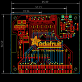
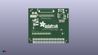
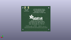
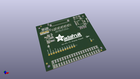

Contents
========

* [PROJ-ADAF-2453-STAN-01>Adafruit DPI Kippah PCB](#proj-adaf-2453-stan-01adafruit-dpi-kippah-pcb)
	* [Images](#images)
	* [Interactive BOM](#interactive-bom)
	* [OOMP Parts](#oomp-parts)
	* [Tags](#tags)
  
![][im]
# PROJ-ADAF-2453-STAN-01>Adafruit DPI Kippah PCB

- ID: PROJ-ADAF-2453-STAN-01
- Hex ID: PRA2453
- Name: Adafruit DPI Kippah PCB
- Description: 

## Images
  
  

|eagleImage|kicadPcb3dFront|kicadPcb3dBack|kicadPcb3d|
| :---: | :---: | :---: | :---: |
|||||

## Interactive BOM

- Interactive BOM page: [ibom.html](kicad/bom/ibom.html)

## OOMP Parts
  

|OOMP Parts|
| :---: |
|<table><tr><td></td><td> C1</td><td>[CAPC-0805-X-NF100-V50 SMD (0805) 100 nF Capacitor (Ceramic) 50v](https://github.com/oomlout/oomlout_OOMP_parts/tree/main/CAPC-0805-X-NF100-V50/)</td><td>[C85N100](https://github.com/oomlout/oomlout_OOMP_parts/tree/main/CAPC-0805-X-NF100-V50/)</td></tr></table>|
|CAPC-UNMATCHED-X-UNMATCHED-01, C2, 14.985999999999999, 45.592999999999996, 270,C2, 1uF, _0805MP, microbuilder, (0.59, 1.795), R270|
|<table><tr><td></td><td> C3</td><td>[CAPC-0805-X-NF100-V50 SMD (0805) 100 nF Capacitor (Ceramic) 50v](https://github.com/oomlout/oomlout_OOMP_parts/tree/main/CAPC-0805-X-NF100-V50/)</td><td>[C85N100](https://github.com/oomlout/oomlout_OOMP_parts/tree/main/CAPC-0805-X-NF100-V50/)</td></tr></table>|
|<table><tr><td></td><td> C4</td><td>[CAPC-0805-X-UF10-V25 SMD (0805) 10 uF Capacitor (Ceramic) 25v](https://github.com/oomlout/oomlout_OOMP_parts/tree/main/CAPC-0805-X-UF10-V25/)</td><td>[C85U010](https://github.com/oomlout/oomlout_OOMP_parts/tree/main/CAPC-0805-X-UF10-V25/)</td></tr></table>|
|<table><tr><td></td><td> C5</td><td>[CAPC-0805-X-UF10-V25 SMD (0805) 10 uF Capacitor (Ceramic) 25v](https://github.com/oomlout/oomlout_OOMP_parts/tree/main/CAPC-0805-X-UF10-V25/)</td><td>[C85U010](https://github.com/oomlout/oomlout_OOMP_parts/tree/main/CAPC-0805-X-UF10-V25/)</td></tr></table>|
|<table><tr><td></td><td> C7</td><td>[CAPC-0805-X-UF10-V25 SMD (0805) 10 uF Capacitor (Ceramic) 25v](https://github.com/oomlout/oomlout_OOMP_parts/tree/main/CAPC-0805-X-UF10-V25/)</td><td>[C85U010](https://github.com/oomlout/oomlout_OOMP_parts/tree/main/CAPC-0805-X-UF10-V25/)</td></tr></table>|
|CAPC-0805-X-UNMATCHED-01, C8, 11.557, 36.957, 180,C8, 1uF, 0805-NO, microbuilder, (0.455, 1.455), R180|
|UNMATCHED-UNMATCHED-X-UNMATCHED-01, D1, 9.906, 49.022, 180,D1, MM3Z24VT1G, SMADIODE, microbuilder, (0.39, 1.93), R180|
|UNMATCHED-UNMATCHED-X-UNMATCHED-01, D2, 15.112999999999998, 37.846, 270,D2, MBR0540, SOD-123, microbuilder, (0.595, 1.49), R270|
|UNMATCHED-UNMATCHED-X-UNMATCHED-01, D3, 8.509, 24.892, 90,D3, 1N4148, SOD-323, microbuilder, (0.335, 0.98), R90|
|UNMATCHED-UNMATCHED-X-UNMATCHED-01, FB1, 57.022999999999996, 35.687, 270,FB1, FERRITE, _0805MP, microbuilder, (2.245, 1.405), R270|
|UNMATCHED-UNMATCHED-X-UNMATCHED-01, FB2, 54.736999999999995, 35.687, 270,FB2, FERRITE, _0805MP, microbuilder, (2.155, 1.405), R270|
|UNMATCHED-UNMATCHED-X-UNMATCHED-01, FB3, 50.165, 35.687, 270,FB3, Ferrite, _0805MP, microbuilder, (1.975, 1.405), R270|
|UNMATCHED-UNMATCHED-X-UNMATCHED-01, FB4, 52.324, 35.687, 270,FB4, FERITE, _0805MP, microbuilder, (2.06, 1.405), R270|
|UNMATCHED-UNMATCHED-X-UNMATCHED-01, IC1, 53.848, 44.323, 270,IC1, AR1100_SSOP, TSSOP20-5.3MMBODY, microbuilder, (2.12, 1.745), R270|
|UNMATCHED-UNMATCHED-X-UNMATCHED-01, J1, 28.955999999999996, 52.705, 0,J1, 40PINFPCM4-1734839-0, 4-1734839-0, adafruit, (1.14, 2.075), R0|
|ERROR, L1 6.8uH power, 0, 0, 0,L1, 6.8uH, power, L, CID, 2276, INDUCTOR_5X5MM_NR5040_NOTHERMALS, microbuilder, (0.55, 1.265), R90|
|UNMATCHED-UNMATCHED-X-UNMATCHED-01, LED1, 63.246, 46.482, 180,LED1, RED, CHIPLED_0805_NOOUTLINE, microbuilder, (2.49, 1.83), R180|
|RESE-0805-X-UNMATCHED-01, R1, 9.398, 30.987999999999996, 0,R1, 20K, 0805-NO, microbuilder, (0.37, 1.22), R0|
|RESE-0805-X-UNMATCHED-01, R2, 11.684, 42.545, 0,R2, 6?, 0805-NO, microbuilder, (0.46, 1.675), R0|
|RESE-0805-X-UNMATCHED-01, R3, 4.571999999999999, 42.545, 0,R3, 12?, 0805-NO, microbuilder, (0.18, 1.675), R0|
|RESE-0805-X-UNMATCHED-01, R4, 8.128, 42.545, 0,R4, 12?, 0805-NO, microbuilder, (0.32, 1.675), R0|
|RESE-UNMATCHED-X-UNMATCHED-01, R5, 14.858999999999998, 54.22899999999999, 270,R5, 20K, _0805MP, microbuilder, (0.585, 2.135), R270|
|RESE-UNMATCHED-X-UNMATCHED-01, R6, 19.049999999999997, 44.577, 180,R6, 33, RESPACK_4X0603, microbuilder, (0.75, 1.755), R180|
|RESE-0805-X-UNMATCHED-01, R7, 11.557, 38.73499999999999, 0,R7, 12?, 0805-NO, microbuilder, (0.455, 1.525), R0|
|RESE-UNMATCHED-X-UNMATCHED-01, R8, 23.114, 44.577, 0,R8, 33, RESPACK_4X0603, microbuilder, (0.91, 1.755), R0|
|RESE-UNMATCHED-X-UNMATCHED-01, R9, 27.178, 44.577, 0,R9, 33, RESPACK_4X0603, microbuilder, (1.07, 1.755), R0|
|RESE-UNMATCHED-X-UNMATCHED-01, R10, 31.241999999999997, 44.577, 0,R10, 33, RESPACK_4X0603, microbuilder, (1.23, 1.755), R0|
|RESE-UNMATCHED-X-UNMATCHED-01, R11, 35.306, 44.577, 0,R11, 33, RESPACK_4X0603, microbuilder, (1.39, 1.755), R0|
|RESE-UNMATCHED-X-UNMATCHED-01, R12, 39.37, 44.577, 0,R12, 33, RESPACK_4X0603, microbuilder, (1.55, 1.755), R0|
|RESE-0805-X-UNMATCHED-01, R13, 63.246, 42.545, 90,R13, 470, 0805-NO, microbuilder, (2.49, 1.675), R90|
|RESE-0805-X-UNMATCHED-01, R14, 58.039, 39.878, 0,R14, 20K, 0805-NO, microbuilder, (2.285, 1.57), R0|
|UNMATCHED-UNMATCHED-X-UNMATCHED-01, RPI1, 0.0, 56.515, M180,RPI1, RASPBERRYPI_BPLUS-SMT+SLOTS, PI_HAT_SMT_SLOTS, microbuilder, (0, 2.225), MR180|
|UNMATCHED-UNMATCHED-X-UNMATCHED-01, SJ1, 11.684, 44.577, 180,SJ1, +50mA, SOLDERJUMPER_ARROW_NOPASTE, microbuilder, (0.46, 1.755), R180|
|UNMATCHED-UNMATCHED-X-UNMATCHED-01, SJ2, 4.571999999999999, 44.577, 180,SJ2, +25mA, SOLDERJUMPER_ARROW_NOPASTE, microbuilder, (0.18, 1.755), R180|
|UNMATCHED-UNMATCHED-X-UNMATCHED-01, SJ3, 8.128, 44.577, 180,SJ3, +100mA, SOLDERJUMPER_ARROW_NOPASTE, microbuilder, (0.32, 1.755), R180|
|UNMATCHED-UNMATCHED-X-UNMATCHED-01, TP1, 24.383999999999997, 15.112999999999998, 0,TP1, TPTP15SQ, TP15SQ, testpad, (0.96, 0.595), R0|
|UNMATCHED-UNMATCHED-X-UNMATCHED-01, TP2, 26.924, 15.112999999999998, 0,TP2, TPTP15SQ, TP15SQ, testpad, (1.06, 0.595), R0|
|UNMATCHED-UNMATCHED-X-UNMATCHED-01, TP3, 29.463999999999995, 15.112999999999998, 0,TP3, TPTP15SQ, TP15SQ, testpad, (1.16, 0.595), R0|
|UNMATCHED-UNMATCHED-X-UNMATCHED-01, TP4, 32.004, 15.112999999999998, 0,TP4, TPTP15SQ, TP15SQ, testpad, (1.26, 0.595), R0|
|UNMATCHED-UNMATCHED-X-UNMATCHED-01, TP5, 6.604, 15.112999999999998, 0,TP5, TPTP15SQ, TP15SQ, testpad, (0.26, 0.595), R0|
|UNMATCHED-UNMATCHED-X-UNMATCHED-01, TP6, 9.143999999999998, 15.112999999999998, 0,TP6, TPTP15SQ, TP15SQ, testpad, (0.36, 0.595), R0|
|UNMATCHED-UNMATCHED-X-UNMATCHED-01, TP7, 11.684, 15.112999999999998, 0,TP7, TPTP15SQ, TP15SQ, testpad, (0.46, 0.595), R0|
|UNMATCHED-UNMATCHED-X-UNMATCHED-01, TP8, 14.224, 15.112999999999998, 0,TP8, TPTP15SQ, TP15SQ, testpad, (0.56, 0.595), R0|
|UNMATCHED-UNMATCHED-X-UNMATCHED-01, TP9, 16.764, 15.112999999999998, 0,TP9, TPTP15SQ, TP15SQ, testpad, (0.66, 0.595), R0|
|UNMATCHED-UNMATCHED-X-UNMATCHED-01, TP10, 21.843999999999998, 15.112999999999998, 0,TP10, TPTP15SQ, TP15SQ, testpad, (0.86, 0.595), R0|
|UNMATCHED-UNMATCHED-X-UNMATCHED-01, TP11, 19.304, 15.112999999999998, 0,TP11, TPTP15SQ, TP15SQ, testpad, (0.76, 0.595), R0|
|UNMATCHED-UNMATCHED-X-UNMATCHED-01, TP12, 34.544000000000004, 15.112999999999998, 0,TP12, TPTP15SQ, TP15SQ, testpad, (1.36, 0.595), R0|
|UNMATCHED-UNMATCHED-X-UNMATCHED-01, TP13, 54.864, 15.112999999999998, 0,TP13, TPTP15SQ, TP15SQ, testpad, (2.16, 0.595), R0|
|UNMATCHED-UNMATCHED-X-UNMATCHED-01, U3, 9.398, 33.909, 180,U3, FAN5333BSX, SOT23-5@1, microbuilder, (0.37, 1.335), R180|
|UNMATCHED-UNMATCHED-X-UNMATCHED-01, X1, 52.705, 52.197, 180,X1, MicroUSB, 4UCONN_20329, microbuilder, (2.075, 2.055), R180|
|UNMATCHED-UNMATCHED-X-UNMATCHED-01, Y1, 47.751999999999995, 47.117, 270,Y1, 12MHz, RESONATOR-SMD, SparkFun, (1.88, 1.855), R270|

## Tags

- hexID: PRA2453
- oompType: PROJ
- oompSize: ADAF
- oompColor: 2453
- oompDesc: STAN
- oompIndex: 01
- oompName: Adafruit DPI Kippah PCB
- sources: All source files from https://github.com/adafruit/Adafruit-DPI-Kippah-PCB (source licence details in srcLicense.md)
- linkBuyPage: http://www.adafruit.com/products/2453
- oompPart: CAPC-0805-X-NF100-V50, C1, 8.001, 36.957, 0
- oompPart: CAPC-UNMATCHED-X-UNMATCHED-01, C2, 14.985999999999999, 45.592999999999996, 270
- oompPart: CAPC-0805-X-NF100-V50, C3, 47.879, 43.18, 270
- oompPart: CAPC-0805-X-UF10-V25, C4, 56.76899999999999, 49.529999999999994, 0
- oompPart: CAPC-0805-X-UF10-V25, C5, 59.563, 43.815, 270
- oompPart: CAPC-0805-X-UF10-V25, C7, 9.398, 29.209999999999997, 180
- oompPart: CAPC-0805-X-UNMATCHED-01, C8, 11.557, 36.957, 180
- oompPart: UNMATCHED-UNMATCHED-X-UNMATCHED-01, D1, 9.906, 49.022, 180
- oompPart: UNMATCHED-UNMATCHED-X-UNMATCHED-01, D2, 15.112999999999998, 37.846, 270
- oompPart: UNMATCHED-UNMATCHED-X-UNMATCHED-01, D3, 8.509, 24.892, 90
- oompPart: UNMATCHED-UNMATCHED-X-UNMATCHED-01, FB1, 57.022999999999996, 35.687, 270
- oompPart: UNMATCHED-UNMATCHED-X-UNMATCHED-01, FB2, 54.736999999999995, 35.687, 270
- oompPart: UNMATCHED-UNMATCHED-X-UNMATCHED-01, FB3, 50.165, 35.687, 270
- oompPart: UNMATCHED-UNMATCHED-X-UNMATCHED-01, FB4, 52.324, 35.687, 270
- oompPart: SKIP-UNMATCHED-X-UNMATCHED-01, FID1, 59.69, 1.397, 0
- oompPart: SKIP-UNMATCHED-X-UNMATCHED-01, FID2, 2.2859999999999996, 6.985, 0
- oompPart: SKIP-UNMATCHED-X-UNMATCHED-01, FID3, 6.095999999999999, 54.736999999999995, 0
- oompPart: UNMATCHED-UNMATCHED-X-UNMATCHED-01, IC1, 53.848, 44.323, 270
- oompPart: UNMATCHED-UNMATCHED-X-UNMATCHED-01, J1, 28.955999999999996, 52.705, 0
- oompPart: ERROR, L1 6.8uH power, 0, 0, 0
- oompPart: UNMATCHED-UNMATCHED-X-UNMATCHED-01, LED1, 63.246, 46.482, 180
- oompPart: RESE-0805-X-UNMATCHED-01, R1, 9.398, 30.987999999999996, 0
- oompPart: RESE-0805-X-UNMATCHED-01, R2, 11.684, 42.545, 0
- oompPart: RESE-0805-X-UNMATCHED-01, R3, 4.571999999999999, 42.545, 0
- oompPart: RESE-0805-X-UNMATCHED-01, R4, 8.128, 42.545, 0
- oompPart: RESE-UNMATCHED-X-UNMATCHED-01, R5, 14.858999999999998, 54.22899999999999, 270
- oompPart: RESE-UNMATCHED-X-UNMATCHED-01, R6, 19.049999999999997, 44.577, 180
- oompPart: RESE-0805-X-UNMATCHED-01, R7, 11.557, 38.73499999999999, 0
- oompPart: RESE-UNMATCHED-X-UNMATCHED-01, R8, 23.114, 44.577, 0
- oompPart: RESE-UNMATCHED-X-UNMATCHED-01, R9, 27.178, 44.577, 0
- oompPart: RESE-UNMATCHED-X-UNMATCHED-01, R10, 31.241999999999997, 44.577, 0
- oompPart: RESE-UNMATCHED-X-UNMATCHED-01, R11, 35.306, 44.577, 0
- oompPart: RESE-UNMATCHED-X-UNMATCHED-01, R12, 39.37, 44.577, 0
- oompPart: RESE-0805-X-UNMATCHED-01, R13, 63.246, 42.545, 90
- oompPart: RESE-0805-X-UNMATCHED-01, R14, 58.039, 39.878, 0
- oompPart: UNMATCHED-UNMATCHED-X-UNMATCHED-01, RPI1, 0.0, 56.515, M180
- oompPart: UNMATCHED-UNMATCHED-X-UNMATCHED-01, SJ1, 11.684, 44.577, 180
- oompPart: UNMATCHED-UNMATCHED-X-UNMATCHED-01, SJ2, 4.571999999999999, 44.577, 180
- oompPart: UNMATCHED-UNMATCHED-X-UNMATCHED-01, SJ3, 8.128, 44.577, 180
- oompPart: UNMATCHED-UNMATCHED-X-UNMATCHED-01, TP1, 24.383999999999997, 15.112999999999998, 0
- oompPart: UNMATCHED-UNMATCHED-X-UNMATCHED-01, TP2, 26.924, 15.112999999999998, 0
- oompPart: UNMATCHED-UNMATCHED-X-UNMATCHED-01, TP3, 29.463999999999995, 15.112999999999998, 0
- oompPart: UNMATCHED-UNMATCHED-X-UNMATCHED-01, TP4, 32.004, 15.112999999999998, 0
- oompPart: UNMATCHED-UNMATCHED-X-UNMATCHED-01, TP5, 6.604, 15.112999999999998, 0
- oompPart: UNMATCHED-UNMATCHED-X-UNMATCHED-01, TP6, 9.143999999999998, 15.112999999999998, 0
- oompPart: UNMATCHED-UNMATCHED-X-UNMATCHED-01, TP7, 11.684, 15.112999999999998, 0
- oompPart: UNMATCHED-UNMATCHED-X-UNMATCHED-01, TP8, 14.224, 15.112999999999998, 0
- oompPart: UNMATCHED-UNMATCHED-X-UNMATCHED-01, TP9, 16.764, 15.112999999999998, 0
- oompPart: UNMATCHED-UNMATCHED-X-UNMATCHED-01, TP10, 21.843999999999998, 15.112999999999998, 0
- oompPart: UNMATCHED-UNMATCHED-X-UNMATCHED-01, TP11, 19.304, 15.112999999999998, 0
- oompPart: UNMATCHED-UNMATCHED-X-UNMATCHED-01, TP12, 34.544000000000004, 15.112999999999998, 0
- oompPart: UNMATCHED-UNMATCHED-X-UNMATCHED-01, TP13, 54.864, 15.112999999999998, 0
- oompPart: UNMATCHED-UNMATCHED-X-UNMATCHED-01, U3, 9.398, 33.909, 180
- oompPart: UNMATCHED-UNMATCHED-X-UNMATCHED-01, X1, 52.705, 52.197, 180
- oompPart: UNMATCHED-UNMATCHED-X-UNMATCHED-01, Y1, 47.751999999999995, 47.117, 270
- rawPart: C1, 0.1uF, 0805-NO, microbuilder, (0.315, 1.455), R0
- rawPart: C2, 1uF, _0805MP, microbuilder, (0.59, 1.795), R270
- rawPart: C3, 0.1uF, 0805-NO, microbuilder, (1.885, 1.7), R270
- rawPart: C4, 10uF, 0805-NO, microbuilder, (2.235, 1.95), R0
- rawPart: C5, 10uF, 0805-NO, microbuilder, (2.345, 1.725), R270
- rawPart: C7, 10uF, 0805-NO, microbuilder, (0.37, 1.15), R180
- rawPart: C8, 1uF, 0805-NO, microbuilder, (0.455, 1.455), R180
- rawPart: D1, MM3Z24VT1G, SMADIODE, microbuilder, (0.39, 1.93), R180
- rawPart: D2, MBR0540, SOD-123, microbuilder, (0.595, 1.49), R270
- rawPart: D3, 1N4148, SOD-323, microbuilder, (0.335, 0.98), R90
- rawPart: FB1, FERRITE, _0805MP, microbuilder, (2.245, 1.405), R270
- rawPart: FB2, FERRITE, _0805MP, microbuilder, (2.155, 1.405), R270
- rawPart: FB3, Ferrite, _0805MP, microbuilder, (1.975, 1.405), R270
- rawPart: FB4, FERITE, _0805MP, microbuilder, (2.06, 1.405), R270
- rawPart: FID1, FIDUCIAL, FIDUCIAL_1MM, microbuilder, (2.35, 0.055), R0
- rawPart: FID2, FIDUCIAL, FIDUCIAL_1MM, microbuilder, (0.09, 0.275), R0
- rawPart: FID3, FIDUCIAL, FIDUCIAL_1MM, microbuilder, (0.24, 2.155), R0
- rawPart: IC1, AR1100_SSOP, TSSOP20-5.3MMBODY, microbuilder, (2.12, 1.745), R270
- rawPart: J1, 40PINFPCM4-1734839-0, 4-1734839-0, adafruit, (1.14, 2.075), R0
- rawPart: L1, 6.8uH, power, L, CID, 2276, INDUCTOR_5X5MM_NR5040_NOTHERMALS, microbuilder, (0.55, 1.265), R90
- rawPart: LED1, RED, CHIPLED_0805_NOOUTLINE, microbuilder, (2.49, 1.83), R180
- rawPart: R1, 20K, 0805-NO, microbuilder, (0.37, 1.22), R0
- rawPart: R2, 6?, 0805-NO, microbuilder, (0.46, 1.675), R0
- rawPart: R3, 12?, 0805-NO, microbuilder, (0.18, 1.675), R0
- rawPart: R4, 12?, 0805-NO, microbuilder, (0.32, 1.675), R0
- rawPart: R5, 20K, _0805MP, microbuilder, (0.585, 2.135), R270
- rawPart: R6, 33, RESPACK_4X0603, microbuilder, (0.75, 1.755), R180
- rawPart: R7, 12?, 0805-NO, microbuilder, (0.455, 1.525), R0
- rawPart: R8, 33, RESPACK_4X0603, microbuilder, (0.91, 1.755), R0
- rawPart: R9, 33, RESPACK_4X0603, microbuilder, (1.07, 1.755), R0
- rawPart: R10, 33, RESPACK_4X0603, microbuilder, (1.23, 1.755), R0
- rawPart: R11, 33, RESPACK_4X0603, microbuilder, (1.39, 1.755), R0
- rawPart: R12, 33, RESPACK_4X0603, microbuilder, (1.55, 1.755), R0
- rawPart: R13, 470, 0805-NO, microbuilder, (2.49, 1.675), R90
- rawPart: R14, 20K, 0805-NO, microbuilder, (2.285, 1.57), R0
- rawPart: RPI1, RASPBERRYPI_BPLUS-SMT+SLOTS, PI_HAT_SMT_SLOTS, microbuilder, (0, 2.225), MR180
- rawPart: SJ1, +50mA, SOLDERJUMPER_ARROW_NOPASTE, microbuilder, (0.46, 1.755), R180
- rawPart: SJ2, +25mA, SOLDERJUMPER_ARROW_NOPASTE, microbuilder, (0.18, 1.755), R180
- rawPart: SJ3, +100mA, SOLDERJUMPER_ARROW_NOPASTE, microbuilder, (0.32, 1.755), R180
- rawPart: TP1, TPTP15SQ, TP15SQ, testpad, (0.96, 0.595), R0
- rawPart: TP2, TPTP15SQ, TP15SQ, testpad, (1.06, 0.595), R0
- rawPart: TP3, TPTP15SQ, TP15SQ, testpad, (1.16, 0.595), R0
- rawPart: TP4, TPTP15SQ, TP15SQ, testpad, (1.26, 0.595), R0
- rawPart: TP5, TPTP15SQ, TP15SQ, testpad, (0.26, 0.595), R0
- rawPart: TP6, TPTP15SQ, TP15SQ, testpad, (0.36, 0.595), R0
- rawPart: TP7, TPTP15SQ, TP15SQ, testpad, (0.46, 0.595), R0
- rawPart: TP8, TPTP15SQ, TP15SQ, testpad, (0.56, 0.595), R0
- rawPart: TP9, TPTP15SQ, TP15SQ, testpad, (0.66, 0.595), R0
- rawPart: TP10, TPTP15SQ, TP15SQ, testpad, (0.86, 0.595), R0
- rawPart: TP11, TPTP15SQ, TP15SQ, testpad, (0.76, 0.595), R0
- rawPart: TP12, TPTP15SQ, TP15SQ, testpad, (1.36, 0.595), R0
- rawPart: TP13, TPTP15SQ, TP15SQ, testpad, (2.16, 0.595), R0
- rawPart: U3, FAN5333BSX, SOT23-5@1, microbuilder, (0.37, 1.335), R180
- rawPart: X1, MicroUSB, 4UCONN_20329, microbuilder, (2.075, 2.055), R180
- rawPart: Y1, 12MHz, RESONATOR-SMD, SparkFun, (1.88, 1.855), R270

[im]: kicadPcb3d_450.png
