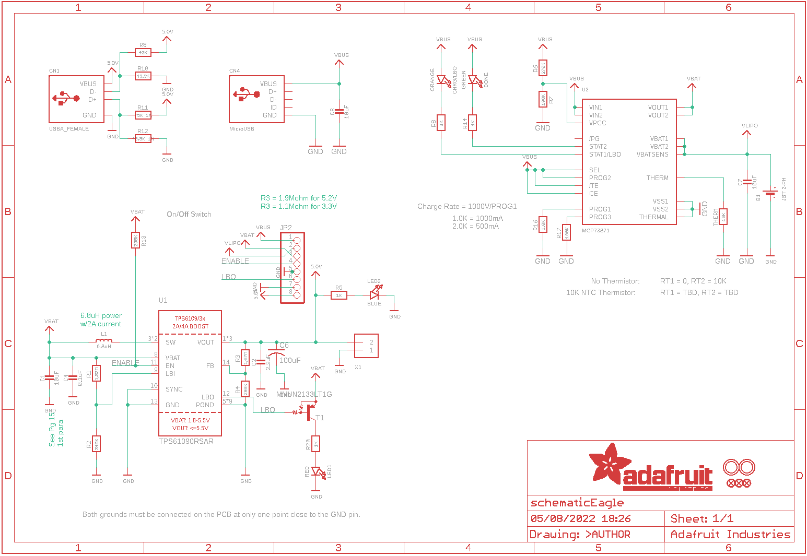

Contents
========

* [PRA2465 > Adafruit PowerBoost 1000C](#pra2465--adafruit-powerboost-1000c)
	* [Schematic](#schematic)
	* [PCB](#pcb)
	* [Interactive BOM](#interactive-bom)
	* [OOMP Parts](#oomp-parts)
	* [Images](#images)
	* [Tags](#tags)
  
![][im]
# PRA2465 > Adafruit PowerBoost 1000C

- ID: PROJ-ADAF-2465-STAN-01
- Hex ID: PRA2465
- Name: Adafruit
- Description: Adafruit
- Long Link: [http://oom.lt/PROJ-ADAF-2465-STAN-01](http://oom.lt/PROJ-ADAF-2465-STAN-01)
- Short Link: [http://oom.lt/PRA2465](http://oom.lt/PRA2465)

## Schematic
  

## PCB
  

## Interactive BOM

- Interactive BOM page: [ibom.html](https://htmlpreview.github.io/?https://github.com/oomlout/oomlout_OOMP_projects/blob/main/PROJ-ADAF-2465-STAN-01/kicad/bom/ibom.html)

## OOMP Parts
  

|OOMP Parts|
| :---: |
|B1 B1,UNMATCHED-UNMATCHED-X-UNMATCHED-01|
|[C1 CAPC-0805-X-UF10-V10 SMD (0805) 10 uF Capacitor (Ceramic) 10v](https://github.com/oomlout/oomlout_OOMP_parts/tree/main/CAPC-0805-X-UF10-V10/)|
|C2 C2,CAPC-0805-X-UF22D-01|
|C4 C4,CAPC-UNMATCHED-X-UF1D-01|
|C6 C6,CAPX-UNMATCHED-X-UF100-01|
|[C7 CAPC-0805-X-UF10-V10 SMD (0805) 10 uF Capacitor (Ceramic) 10v](https://github.com/oomlout/oomlout_OOMP_parts/tree/main/CAPC-0805-X-UF10-V10/)|
|[C8 CAPC-0805-X-UF10-V10 SMD (0805) 10 uF Capacitor (Ceramic) 10v](https://github.com/oomlout/oomlout_OOMP_parts/tree/main/CAPC-0805-X-UF10-V10/)|
|[CHRG/LBO LEDS-0805-G-STAN-01 SMD (0805) Green LED](https://github.com/oomlout/oomlout_OOMP_parts/tree/main/LEDS-0805-G-STAN-01/)|
|CN1 CN1,UNMATCHED-UNMATCHED-X-UNMATCHED-01|
|CN4 CN4,UNMATCHED-UNMATCHED-X-UNMATCHED-01|
|[DONE LEDS-0805-G-STAN-01 SMD (0805) Green LED](https://github.com/oomlout/oomlout_OOMP_parts/tree/main/LEDS-0805-G-STAN-01/)|
|[JP2 HEAD-I01-X-PI08-01 2.54 mm 8 Pin Header](https://github.com/oomlout/oomlout_OOMP_parts/tree/main/HEAD-I01-X-PI08-01/)|
|L1 L1,UNMATCHED-UNMATCHED-X-UNMATCHED-01|
|[LED1 LEDS-0805-G-STAN-01 SMD (0805) Green LED](https://github.com/oomlout/oomlout_OOMP_parts/tree/main/LEDS-0805-G-STAN-01/)|
|[LED2 LEDS-0805-G-STAN-01 SMD (0805) Green LED](https://github.com/oomlout/oomlout_OOMP_parts/tree/main/LEDS-0805-G-STAN-01/)|
|R1 R1,RESE-0805-X-UNMATCHED-01|
|R2 R2,RESE-0805-X-O3403-01|
|R3 R3,RESE-0805-X-UNMATCHED-01|
|R4 R4,RESE-0805-X-O2003-01|
|[R5 RESE-0805-X-O102-01 SMD (0805) 1k Ohm Resistor](https://github.com/oomlout/oomlout_OOMP_parts/tree/main/RESE-0805-X-O102-01/)|
|R6 R6,RESE-0805-X-O2703-01|
|R7 R7,RESE-0805-X-O1003-01|
|[R8 RESE-0805-X-O102-01 SMD (0805) 1k Ohm Resistor](https://github.com/oomlout/oomlout_OOMP_parts/tree/main/RESE-0805-X-O102-01/)|
|R9 R9,RESE-0805-X-O433-01|
|R10 R10,RESE-0805-X-UNMATCHED-01|
|R11 R11,RESE-0805-X-UNMATCHED-01|
|R12 R12,RESE-0805-X-UNMATCHED-01|
|R13 R13,RESE-0805-X-O2003-01|
|[R14 RESE-0805-X-O102-01 SMD (0805) 1k Ohm Resistor](https://github.com/oomlout/oomlout_OOMP_parts/tree/main/RESE-0805-X-O102-01/)|
|[R16 RESE-0805-X-O102-01 SMD (0805) 1k Ohm Resistor](https://github.com/oomlout/oomlout_OOMP_parts/tree/main/RESE-0805-X-O102-01/)|
|R17 R17,RESE-0805-X-O1003-01|
|[R20 RESE-0805-X-O102-01 SMD (0805) 1k Ohm Resistor](https://github.com/oomlout/oomlout_OOMP_parts/tree/main/RESE-0805-X-O102-01/)|
|T1 T1,UNMATCHED-UNMATCHED-X-UNMATCHED-01|
|THERM THERM,UNMATCHED-0805-X-UNMATCHED-01|
|U1 U1,UNMATCHED-UNMATCHED-X-UNMATCHED-01|
|U2 U2,UNMATCHED-UNMATCHED-X-UNMATCHED-01|
|X1 X1,UNMATCHED-UNMATCHED-X-UNMATCHED-01|

## Images
  
  

|kicadPcb3d|kicadPcb3dFront|kicadPcb3dBack|eagleImage|eagleSchemImage|
| :---: | :---: | :---: | :---: | :---: |
||||||

## Tags

- hexID: PRA2465
- oompType: PROJ
- oompSize: ADAF
- oompColor: 2465
- oompDesc: STAN
- oompIndex: 01
- oompName: Adafruit PowerBoost 1000C
- sources: All source files from https://github.com/adafruit/Adafruit-PowerBoost-1000C (source licence details in srcLicense.md)
- linkBuyPage: http://www.adafruit.com/products/2465
- oompID: PROJ-ADAF-2465-STAN-01
- oompParts: B1,UNMATCHED-UNMATCHED-X-UNMATCHED-01
- oompParts: C1,CAPC-0805-X-UF10-V10
- oompParts: C2,CAPC-0805-X-UF22D-01
- oompParts: C4,CAPC-UNMATCHED-X-UF1D-01
- oompParts: C6,CAPX-UNMATCHED-X-UF100-01
- oompParts: C7,CAPC-0805-X-UF10-V10
- oompParts: C8,CAPC-0805-X-UF10-V10
- oompParts: CHRG/LBO,LEDS-0805-G-STAN-01
- oompParts: CN1,UNMATCHED-UNMATCHED-X-UNMATCHED-01
- oompParts: CN4,UNMATCHED-UNMATCHED-X-UNMATCHED-01
- oompParts: DONE,LEDS-0805-G-STAN-01
- oompParts: JP2,HEAD-I01-X-PI08-01
- oompParts: L1,UNMATCHED-UNMATCHED-X-UNMATCHED-01
- oompParts: LED1,LEDS-0805-G-STAN-01
- oompParts: LED2,LEDS-0805-G-STAN-01
- oompParts: R1,RESE-0805-X-UNMATCHED-01
- oompParts: R2,RESE-0805-X-O3403-01
- oompParts: R3,RESE-0805-X-UNMATCHED-01
- oompParts: R4,RESE-0805-X-O2003-01
- oompParts: R5,RESE-0805-X-O102-01
- oompParts: R6,RESE-0805-X-O2703-01
- oompParts: R7,RESE-0805-X-O1003-01
- oompParts: R8,RESE-0805-X-O102-01
- oompParts: R9,RESE-0805-X-O433-01
- oompParts: R10,RESE-0805-X-UNMATCHED-01
- oompParts: R11,RESE-0805-X-UNMATCHED-01
- oompParts: R12,RESE-0805-X-UNMATCHED-01
- oompParts: R13,RESE-0805-X-O2003-01
- oompParts: R14,RESE-0805-X-O102-01
- oompParts: R16,RESE-0805-X-O102-01
- oompParts: R17,RESE-0805-X-O1003-01
- oompParts: R20,RESE-0805-X-O102-01
- oompParts: T1,UNMATCHED-UNMATCHED-X-UNMATCHED-01
- oompParts: THERM,UNMATCHED-0805-X-UNMATCHED-01
- oompParts: U1,UNMATCHED-UNMATCHED-X-UNMATCHED-01
- oompParts: U2,UNMATCHED-UNMATCHED-X-UNMATCHED-01
- oompParts: X1,UNMATCHED-UNMATCHED-X-UNMATCHED-01
- rawParts: B1,JST 2-PH,BATTERY,JSTPH2,CR1220 SMT - Digikey: 3001K-ND,,
- rawParts: C1,10uF,CAP_CERAMIC0805-NOOUTLINE,0805-NO,Ceramic Capacitors,,
- rawParts: C2,2.2uF,CAP_CERAMIC0805-NOOUTLINE,0805-NO,Ceramic Capacitors,,
- rawParts: C4,0.1uF,CAP_CERAMIC0805_10MGAP,0805_10MGAP,Ceramic Capacitors,,
- rawParts: C6,100uF,C-USC1210,C1210,CAPACITOR, American symbol,,
- rawParts: C7,10uF,CAP_CERAMIC0805-NOOUTLINE,0805-NO,Ceramic Capacitors,,
- rawParts: C8,10uF,CAP_CERAMIC0805-NOOUTLINE,0805-NO,Ceramic Capacitors,,
- rawParts: CHRG/LBO,ORANGE,LED0805_NOOUTLINE,CHIPLED_0805_NOOUTLINE,LED,,
- rawParts: CN1,USBA_FEMALE,USB_TYPEAPTHFML,USB_HOST-PTH,USB - Type A Connectors,,
- rawParts: CN4,MicroUSB,USBMICRO_20329,4UCONN_20329,USB Connectors,,
- rawParts: DONE,GREEN,LED0805_NOOUTLINE,CHIPLED_0805_NOOUTLINE,LED,,
- rawParts: FID1,FIDUCIAL,FIDUCIAL,FIDUCIAL_1MM,Fiducial Alignment Points,EXCLUDE,
- rawParts: FID2,FIDUCIAL,FIDUCIAL,FIDUCIAL_1MM,Fiducial Alignment Points,EXCLUDE,
- rawParts: FID3,FIDUCIAL,FIDUCIAL,FIDUCIAL_1MM,Fiducial Alignment Points,EXCLUDE,
- rawParts: JP2,,HEADER-1X8ROUND,1X08_ROUND,PIN HEADER,,
- rawParts: L1,6.8uH,INDUCTORTDK_VLC5045,INDUCTOR_5X5MM_TDK_VLC5045,Inductors,,
- rawParts: LED1,RED,LED0805_NOOUTLINE,CHIPLED_0805_NOOUTLINE,LED,,
- rawParts: LED2,BLUE,LED0805_NOOUTLINE,CHIPLED_0805_NOOUTLINE,LED,,
- rawParts: R1,1.87M,RESISTOR_0805MP,_0805MP,Resistors,,
- rawParts: R2,340K,RESISTOR_0805MP,_0805MP,Resistors,,
- rawParts: R3,1.87M,RESISTOR0805_NOOUTLINE,0805-NO,Resistors,,
- rawParts: R4,200K,RESISTOR0805_NOOUTLINE,0805-NO,Resistors,,
- rawParts: R5,1K,RESISTOR0805_NOOUTLINE,0805-NO,Resistors,,
- rawParts: R6,270K,RESISTOR0805_NOOUTLINE,0805-NO,Resistors,,
- rawParts: R7,100K,RESISTOR0805_NOOUTLINE,0805-NO,Resistors,,
- rawParts: R8,1K,RESISTOR0805_NOOUTLINE,0805-NO,Resistors,,
- rawParts: R9,43K,RESISTOR0805_NOOUTLINE,0805-NO,Resistors,,
- rawParts: R10,49.9K,RESISTOR0805_NOOUTLINE,0805-NO,Resistors,,
- rawParts: R11,75K 1%,RESISTOR0805_NOOUTLINE,0805-NO,Resistors,,
- rawParts: R12,49.9K 1%,RESISTOR0805_NOOUTLINE,0805-NO,Resistors,,
- rawParts: R13,200K,RESISTOR0805_NOOUTLINE,0805-NO,Resistors,,
- rawParts: R14,1K,RESISTOR0805_NOOUTLINE,0805-NO,Resistors,,
- rawParts: R16,1.0K,RESISTOR0805_NOOUTLINE,0805-NO,Resistors,,
- rawParts: R17,100K,RESISTOR0805_NOOUTLINE,0805-NO,Resistors,,
- rawParts: R20,1K,RESISTOR0805_NOOUTLINE,0805-NO,Resistors,,
- rawParts: T1,MMUN2133LT1G,MUN2114T1-PNP_DRIVER-SC59-BEC,SC59-BEC,PNP Bias Resistor Transistor,,
- rawParts: THERM,15K,RESISTOR0805_NOOUTLINE,0805-NO,Resistors,,
- rawParts: U$10,MOUNTINGHOLE2.5,MOUNTINGHOLE2.5,MOUNTINGHOLE_2.5_PLATED,Mounting Hole,EXCLUDE,
- rawParts: U$11,MOUNTINGHOLE2.5,MOUNTINGHOLE2.5,MOUNTINGHOLE_2.5_PLATED,Mounting Hole,EXCLUDE,
- rawParts: U1,TPS61090RSAR,VREG_TPS6103X,PVQFN-16,TPS6103x 4A Boost - 1.8-5.5V Input, Adjustable Output to 5.5V,,
- rawParts: U2,MCP73871,MCP73871,QFN20_4MM,MCP73871 Lithium Polymer Battery Charger,,
- rawParts: X1,,TERMBLOCK_1X2,TERMBLOCK_1X2-3.5MM,3.5mm Terminal block,,

[im]: kicadPcb3d_450.png
