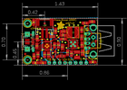
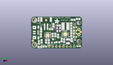
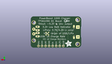
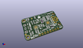

Contents
========

* [PROJ-ADAF-2465-STAN-01>Adafruit PowerBoost 1000C](#proj-adaf-2465-stan-01adafruit-powerboost-1000c)
	* [Images](#images)
	* [Interactive BOM](#interactive-bom)
	* [Tags](#tags)
  
![][im]
# PROJ-ADAF-2465-STAN-01>Adafruit PowerBoost 1000C

- ID: PROJ-ADAF-2465-STAN-01
- Hex ID: PRA2465
- Name: Adafruit PowerBoost 1000C
- Description: 

## Images
  
  

|eagleImage|kicadPcb3dFront|kicadPcb3dBack|kicadPcb3d|
| :---: | :---: | :---: | :---: |
|||||

## Interactive BOM

- Interactive BOM page: [ibom.html](kicad/bom/ibom.html)

## Tags

- hexID: PRA2465
- oompType: PROJ
- oompSize: ADAF
- oompColor: 2465
- oompDesc: STAN
- oompIndex: 01
- oompName: Adafruit PowerBoost 1000C
- sources: All source files from https://github.com/adafruit/Adafruit-PowerBoost-1000C (source licence details in srcLicense.md)
- linkBuyPage: http://www.adafruit.com/products/2465
- oompPart: ERROR, B1 JST 2-PH, 0, 0, 0
- oompPart: CAPC-0805-X-UF10-V25, C1, 19.558, 16.509999999999998, 180
- oompPart: CAPC-0805-X-UNMATCHED-01, C2, 28.448, 17.145, 270
- oompPart: CAPC-UNMATCHED-X-NF100-V50, C4, 19.049999999999997, 4.444999999999999, 0
- oompPart: CAPE-UNMATCHED-X-UNMATCHED-01, C6, 26.162, 5.08, 270
- oompPart: CAPC-0805-X-UF10-V25, C7, 14.224, 13.843, 0
- oompPart: CAPC-0805-X-UF10-V25, C8, 7.112, 12.953999999999999, 90
- oompPart: UNMATCHED-UNMATCHED-X-UNMATCHED-01, CHRG/LBO, 9.779, 1.1429999999999998, 270
- oompPart: UNMATCHED-UNMATCHED-X-UNMATCHED-01, CN1, 37.719, 11.7475, 90
- oompPart: UNMATCHED-UNMATCHED-X-UNMATCHED-01, CN4, 4.3180000000000005, 11.43, 270
- oompPart: UNMATCHED-UNMATCHED-X-UNMATCHED-01, DONE, 6.223, 1.1429999999999998, 90
- oompPart: SKIP-UNMATCHED-X-UNMATCHED-01, FID1, 35.178999999999995, 11.811, 0
- oompPart: SKIP-UNMATCHED-X-UNMATCHED-01, FID2, 10.691999952, 20.342999954, 90
- oompPart: SKIP-UNMATCHED-X-UNMATCHED-01, FID3, 1.27, 5.460999999999999, 0
- oompPart: UNMATCHED-UNMATCHED-X-UNMATCHED-01, JP2, 21.717, 1.27, 0
- oompPart: UNMATCHED-UNMATCHED-X-UNMATCHED-01, L1, 24.401999963999998, 15.903999941999999, 0
- oompPart: UNMATCHED-UNMATCHED-X-UNMATCHED-01, LED1, 5.429000064, 20.860999934, 0
- oompPart: UNMATCHED-UNMATCHED-X-UNMATCHED-01, LED2, 33.723000118, 1.555999936, 270
- oompPart: RESE-UNMATCHED-X-UNMATCHED-01, R1, 19.558, 14.604999999999999, 180
- oompPart: RESE-UNMATCHED-X-UNMATCHED-01, R2, 19.558, 12.7, 0
- oompPart: RESE-0805-X-UNMATCHED-01, R3, 23.495, 5.588, 270
- oompPart: RESE-0805-X-UNMATCHED-01, R4, 21.717, 6.095999999999999, 90
- oompPart: RESE-0805-X-O102-01, R5, 28.701999999999995, 6.095999999999999, 270
- oompPart: RESE-0805-X-UNMATCHED-01, R6, 15.366999999999999, 9.652, 270
- oompPart: RESE-0805-X-O104-01, R7, 17.272000000000002, 9.652, 270
- oompPart: RESE-0805-X-O102-01, R8, 7.492999999999999, 5.08, 270
- oompPart: RESE-0805-X-UNMATCHED-01, R9, 28.497999899999996, 9.906999998, 270
- oompPart: RESE-0805-X-UNMATCHED-01, R10, 28.479999936, 13.522999877999998, 90
- oompPart: ERROR, R11 75K 1%, 0, 0, 0
- oompPart: ERROR, R12 49.9K 1%, 0, 0, 0
- oompPart: RESE-0805-X-UNMATCHED-01, R13, 19.144000066, 8.889000002, 90
- oompPart: RESE-0805-X-O102-01, R14, 5.588, 4.3180000000000005, 270
- oompPart: RESE-0805-X-UNMATCHED-01, R16, 12.572999999999999, 5.08, 90
- oompPart: RESE-0805-X-O104-01, R17, 10.668, 5.08, 90
- oompPart: RESE-0805-X-O102-01, R20, 15.843000063999998, 16.623000028, 270
- oompPart: UNMATCHED-UNMATCHED-X-UNMATCHED-01, T1, 15.697199999999999, 5.334, 0
- oompPart: UNMATCHED-0805-X-UNMATCHED-01, THERM, 6.985, 9.398, 90
- oompPart: SKIP-UNMATCHED-X-UNMATCHED-01, U$10, 2.54, 20.32, 0
- oompPart: SKIP-UNMATCHED-X-UNMATCHED-01, U$11, 2.54, 2.54, 0
- oompPart: UNMATCHED-UNMATCHED-X-UNMATCHED-01, U1, 24.270999972, 10.205999908, 180
- oompPart: UNMATCHED-UNMATCHED-X-UNMATCHED-01, U2, 11.811, 9.398, 270
- oompPart: UNMATCHED-UNMATCHED-X-UNMATCHED-01, X1, 33.909, 11.7475, 90
- rawPart: 

[im]: kicadPcb3d_450.png
