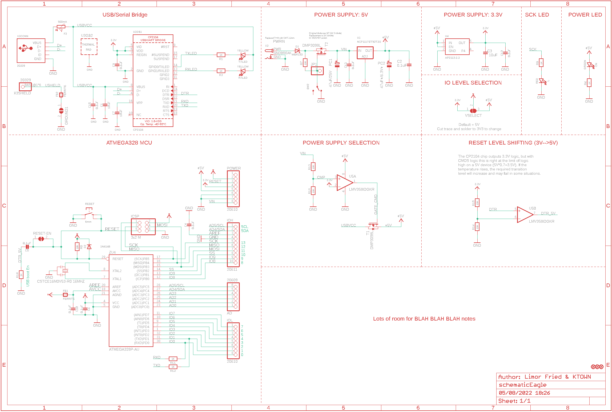
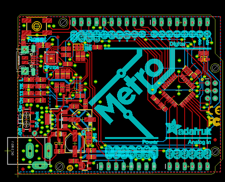
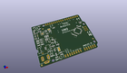
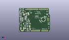
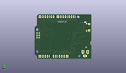
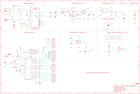

Contents
========

* [PRA2466 > Adafruit METRO 328 PCB](#pra2466--adafruit-metro-328-pcb)
	* [Schematic](#schematic)
	* [PCB](#pcb)
	* [Interactive BOM](#interactive-bom)
	* [OOMP Parts](#oomp-parts)
	* [Images](#images)
	* [Tags](#tags)
  
![][im]
# PRA2466 > Adafruit METRO 328 PCB

- ID: PROJ-ADAF-2466-STAN-01
- Hex ID: PRA2466
- Name: Adafruit
- Description: Adafruit
- Long Link: [http://oom.lt/PROJ-ADAF-2466-STAN-01](http://oom.lt/PROJ-ADAF-2466-STAN-01)
- Short Link: [http://oom.lt/PRA2466](http://oom.lt/PRA2466)

## Schematic
  

## PCB
  

## Interactive BOM

- Interactive BOM page: [ibom.html](https://htmlpreview.github.io/?https://github.com/oomlout/oomlout_OOMP_projects/blob/main/PROJ-ADAF-2466-STAN-01/kicad/bom/ibom.html)

## OOMP Parts
  

|OOMP Parts|
| :---: |
|[HEAD-I01-X-PI06-01  2.54 mm 6 Pin Header  AD](https://github.com/oomlout/oomlout_OOMP_parts/tree/main/HEAD-I01-X-PI06-01/)|
|[CAPC-0805-X-UF10-V10  SMD (0805) 10 uF Capacitor (Ceramic) 10v  C1, C3, C7](https://github.com/oomlout/oomlout_OOMP_parts/tree/main/CAPC-0805-X-UF10-V10/)|
|CAPC-0805-X-UF1D-01 C2, C4, C5, C6, C9, C12, C13, C15|
|CAPC-UNMATCHED-X-UF1D-01 C10|
|[DIOD-S123-X-KMBR120-01  SMD (SOD-123) MBR120 Diode  D1](https://github.com/oomlout/oomlout_OOMP_parts/tree/main/DIOD-S123-X-KMBR120-01/)|
|[DIOD-S323-X-K4148-01  SMD (SOD-323) Diode  D2](https://github.com/oomlout/oomlout_OOMP_parts/tree/main/DIOD-S323-X-K4148-01/)|
|UNMATCHED-1206-X-UNMATCHED-01 F2|
|FERB-0805-X-UNMATCHED-01 FB1, FB2|
|UNMATCHED-UNMATCHED-X-UNMATCHED-01 GROUND1, SW2, T1, T2, U1, U3, U5, X2, X3, Y2, ZU4|
|[HEAD-I01-X-PI2X03-01  2.54 mm 6 Pin (2x3) Header  ICSP](https://github.com/oomlout/oomlout_OOMP_parts/tree/main/HEAD-I01-X-PI2X03-01/)|
|[HEAD-I01-X-PI10-01  2.54 mm 10 Pin Header  IOH](https://github.com/oomlout/oomlout_OOMP_parts/tree/main/HEAD-I01-X-PI10-01/)|
|[HEAD-I01-X-PI08-01  2.54 mm 8 Pin Header  IOL, POWER](https://github.com/oomlout/oomlout_OOMP_parts/tree/main/HEAD-I01-X-PI08-01/)|
|HEAD-I01-X-PI01-01 JP1|
|[LEDS-0805-R-STAN-01  SMD (0805) Red LED  L](https://github.com/oomlout/oomlout_OOMP_parts/tree/main/LEDS-0805-R-STAN-01/)|
|[LEDS-0805-G-STAN-01  SMD (0805) Green LED  ON](https://github.com/oomlout/oomlout_OOMP_parts/tree/main/LEDS-0805-G-STAN-01/)|
|[CAPE-PAND-X-UF47-V25  SMD (6.3 mm) (Panasonic D) 47 uF Capacitor (Electrolytic) 25v  PC1](https://github.com/oomlout/oomlout_OOMP_parts/tree/main/CAPE-PAND-X-UF47-V25/)|
|CAPE-PAND-X-UF47-V63D PC2|
|[RESE-0805-X-O102-01  SMD (0805) 1k Ohm Resistor  R1, R3, R6, R9, R10, R11, R12](https://github.com/oomlout/oomlout_OOMP_parts/tree/main/RESE-0805-X-O102-01/)|
|[RESE-0805-X-O103-01  SMD (0805) 10k Ohm Resistor  R7, R8, R13, R14, R15, R16](https://github.com/oomlout/oomlout_OOMP_parts/tree/main/RESE-0805-X-O103-01/)|
|[BUTA-6060-X-STAN-01  SMD (6060) Pushbutton (Tactile)  RESET](https://github.com/oomlout/oomlout_OOMP_parts/tree/main/BUTA-6060-X-STAN-01/)|
|[LEDS-0805-Y-STAN-01  SMD (0805) Yellow LED  RXLED, TXLED](https://github.com/oomlout/oomlout_OOMP_parts/tree/main/LEDS-0805-Y-STAN-01/)|
|UNMATCHED-SO235-X-UNMATCHED-01 U4|

## Images
  
  

|kicadPcb3d|kicadPcb3dFront|kicadPcb3dBack|eagleImage|eagleSchemImage|
| :---: | :---: | :---: | :---: | :---: |
||||||

## Tags

- hexID: PRA2466
- oompType: PROJ
- oompSize: ADAF
- oompColor: 2466
- oompDesc: STAN
- oompIndex: 01
- oompName: Adafruit METRO 328 PCB
- sources: All source files from https://github.com/adafruit/Adafruit-METRO-328-PCB (source licence details in srcLicense.md)
- linkBuyPage: http://www.adafruit.com/products/2466
- oompID: PROJ-ADAF-2466-STAN-01
- oompParts: AD,HEAD-I01-X-PI06-01
- oompParts: C1,CAPC-0805-X-UF10-V10
- oompParts: C2,CAPC-0805-X-UF1D-01
- oompParts: C3,CAPC-0805-X-UF10-V10
- oompParts: C4,CAPC-0805-X-UF1D-01
- oompParts: C5,CAPC-0805-X-UF1D-01
- oompParts: C6,CAPC-0805-X-UF1D-01
- oompParts: C7,CAPC-0805-X-UF10-V10
- oompParts: C9,CAPC-0805-X-UF1D-01
- oompParts: C10,CAPC-UNMATCHED-X-UF1D-01
- oompParts: C12,CAPC-0805-X-UF1D-01
- oompParts: C13,CAPC-0805-X-UF1D-01
- oompParts: C15,CAPC-0805-X-UF1D-01
- oompParts: D1,DIOD-S123-X-KMBR120-01
- oompParts: D2,DIOD-S323-X-K4148-01
- oompParts: F2,UNMATCHED-1206-X-UNMATCHED-01
- oompParts: FB1,FERB-0805-X-UNMATCHED-01
- oompParts: FB2,FERB-0805-X-UNMATCHED-01
- oompParts: GROUND1,UNMATCHED-UNMATCHED-X-UNMATCHED-01
- oompParts: ICSP,HEAD-I01-X-PI2X03-01
- oompParts: IOH,HEAD-I01-X-PI10-01
- oompParts: IOL,HEAD-I01-X-PI08-01
- oompParts: JP1,HEAD-I01-X-PI01-01
- oompParts: L,LEDS-0805-R-STAN-01
- oompParts: ON,LEDS-0805-G-STAN-01
- oompParts: PC1,CAPE-PAND-X-UF47-V25
- oompParts: PC2,CAPE-PAND-X-UF47-V63D
- oompParts: POWER,HEAD-I01-X-PI08-01
- oompParts: R1,RESE-0805-X-O102-01
- oompParts: R3,RESE-0805-X-O102-01
- oompParts: R6,RESE-0805-X-O102-01
- oompParts: R7,RESE-0805-X-O103-01
- oompParts: R8,RESE-0805-X-O103-01
- oompParts: R9,RESE-0805-X-O102-01
- oompParts: R10,RESE-0805-X-O102-01
- oompParts: R11,RESE-0805-X-O102-01
- oompParts: R12,RESE-0805-X-O102-01
- oompParts: R13,RESE-0805-X-O103-01
- oompParts: R14,RESE-0805-X-O103-01
- oompParts: R15,RESE-0805-X-O103-01
- oompParts: R16,RESE-0805-X-O103-01
- oompParts: RESET,BUTA-6060-X-STAN-01
- oompParts: RXLED,LEDS-0805-Y-STAN-01
- oompParts: SW2,UNMATCHED-UNMATCHED-X-UNMATCHED-01
- oompParts: T1,UNMATCHED-UNMATCHED-X-UNMATCHED-01
- oompParts: T2,UNMATCHED-UNMATCHED-X-UNMATCHED-01
- oompParts: TXLED,LEDS-0805-Y-STAN-01
- oompParts: U1,UNMATCHED-UNMATCHED-X-UNMATCHED-01
- oompParts: U3,UNMATCHED-UNMATCHED-X-UNMATCHED-01
- oompParts: U4,UNMATCHED-SO235-X-UNMATCHED-01
- oompParts: U5,UNMATCHED-UNMATCHED-X-UNMATCHED-01
- oompParts: X2,UNMATCHED-UNMATCHED-X-UNMATCHED-01
- oompParts: X3,UNMATCHED-UNMATCHED-X-UNMATCHED-01
- oompParts: Y2,UNMATCHED-UNMATCHED-X-UNMATCHED-01
- oompParts: ZU4,UNMATCHED-UNMATCHED-X-UNMATCHED-01
- rawParts: AD,20609,HEADER-1X6,1X06_OVAL,PIN HEADER,,,,,,
- rawParts: C1,10uF,CAP_CERAMIC0805-NOOUTLINE,0805-NO,Ceramic Capacitors,,,,,,
- rawParts: C2,0.1uF,CAP_CERAMIC0805-NOOUTLINE,0805-NO,Ceramic Capacitors,,,,,,
- rawParts: C3,10uF,CAP_CERAMIC0805-NOOUTLINE,0805-NO,Ceramic Capacitors,,,,,,
- rawParts: C4,0.1uF,CAP_CERAMIC0805-NOOUTLINE,0805-NO,Ceramic Capacitors,,,,,,
- rawParts: C5,0.1uF,CAP_CERAMIC0805-NOOUTLINE,0805-NO,Ceramic Capacitors,,,,,,
- rawParts: C6,0.1uF,CAP_CERAMIC0805-NOOUTLINE,0805-NO,Ceramic Capacitors,,,,,,
- rawParts: C7,10uF,CAP_CERAMIC0805-NOOUTLINE,0805-NO,Ceramic Capacitors,,,,,,
- rawParts: C9,0.1uF,CAP_CERAMIC0805-NOOUTLINE,0805-NO,Ceramic Capacitors,,,,,,
- rawParts: C10,0.1uF,CAP_CERAMIC0805_10MGAP,0805_10MGAP,Ceramic Capacitors,,,,,,
- rawParts: C12,0.1uF,CAP_CERAMIC0805-NOOUTLINE,0805-NO,Ceramic Capacitors,,,,,,
- rawParts: C13,0.1uF,CAP_CERAMIC0805-NOOUTLINE,0805-NO,Ceramic Capacitors,,,,,,
- rawParts: C15,0.1uF,CAP_CERAMIC0805-NOOUTLINE,0805-NO,Ceramic Capacitors,,,,,,
- rawParts: D1,MBR120,DIODE-SCHOTTKYSOD-123,SOD-123,,,,,,,
- rawParts: D2,1N4148,DIODESOD-323,SOD-323,Diode,,,,,,
- rawParts: F2,500mA,PTC_1206NO,1206-NO,PTC (Resettable Fuse),,,,,,
- rawParts: FB1,FERRITE,FERRITE-0805NO,0805-NO,Ferrite Bead,,,,,,
- rawParts: FB2,FERRITE,FERRITE-0805NO,0805-NO,Ferrite Bead,,,,,,
- rawParts: FD1,FIDUCIAL_1MM,FIDUCIAL_1MM,FIDUCIAL_1MM,Fiducial Alignment Points,EXCLUDE,,,,,
- rawParts: FD2,FIDUCIAL_1MM,FIDUCIAL_1MM,FIDUCIAL_1MM,Fiducial Alignment Points,EXCLUDE,,,,,
- rawParts: FD3,FIDUCIAL_1MM,FIDUCIAL_1MM,FIDUCIAL_1MM,Fiducial Alignment Points,EXCLUDE,,,,,
- rawParts: GROUND1,,SJ,SJ,SMD solder JUMPER,,,,,,
- rawParts: ICSP,3x2 M,HEADER-2X3,2X03_ROUND_70MIL,PIN HEADER,,,,,,
- rawParts: IOH,20611,HEADER-1X10,1X10_OVAL,PIN HEADER,,,,,,
- rawParts: IOL,20610,HEADER-1X8,1X08_OVAL,PIN HEADER,,,,,,
- rawParts: JP1,,HEADER-1X1ROUND,1X01_ROUND,PIN HEADER,,,,,,
- rawParts: L,RED,LED0805_NOOUTLINE,CHIPLED_0805_NOOUTLINE,LED,,,,,,
- rawParts: ON,GREEN,LED0805_NOOUTLINE,CHIPLED_0805_NOOUTLINE,LED,,,,,,
- rawParts: PC1,47uF/25V,CAP_ELECTROLYTICPANASONIC_D,PANASONIC_D,Electrolytic Capacitors,,,,,,
- rawParts: PC2,47uF+/6.3V+,CAP_ELECTROLYTICPANASONIC_D,PANASONIC_D,Electrolytic Capacitors,,,,,,
- rawParts: POWER,20610,HEADER-1X8,1X08_OVAL,PIN HEADER,,,,,,
- rawParts: R1,1K,RESISTOR0805_NOOUTLINE,0805-NO,Resistors,,,,,,
- rawParts: R3,1K,RESISTOR0805_NOOUTLINE,0805-NO,Resistors,,,,,,
- rawParts: R6,1K,RESISTOR0805_NOOUTLINE,0805-NO,Resistors,,,,,,
- rawParts: R7,10K,RESISTOR0805_NOOUTLINE,0805-NO,Resistors,,,,,,
- rawParts: R8,10K,RESISTOR_0805MP,_0805MP,Resistors,,,,,,
- rawParts: R9,1K,RESISTOR0805_NOOUTLINE,0805-NO,Resistors,,,,,,
- rawParts: R10,1K,RESISTOR0805_NOOUTLINE,0805-NO,Resistors,,,,,,
- rawParts: R11,1K,RESISTOR0805_NOOUTLINE,0805-NO,Resistors,,,,,,
- rawParts: R12,1K,RESISTOR0805_NOOUTLINE,0805-NO,Resistors,,,,,,
- rawParts: R13,10K,RESISTOR0805_NOOUTLINE,0805-NO,Resistors,,,,,,
- rawParts: R14,10K,RESISTOR0805_NOOUTLINE,0805-NO,Resistors,,,,,,
- rawParts: R15,10K,RESISTOR0805_NOOUTLINE,0805-NO,Resistors,,,,,,
- rawParts: R16,10K,RESISTOR0805_NOOUTLINE,0805-NO,Resistors,,,,,,
- rawParts: RESET,6mm,SWITCH_TACT_SMT,EVQ-Q2,SMT Tact Switches,,,,,,
- rawParts: RESET-EN,,SOLDERJUMPER_CLOSED,SOLDERJUMPER_CLOSEDWIRE,Solder Jumper - Closed,,,,,,
- rawParts: RXLED,YELLOW,LED0805_NOOUTLINE,CHIPLED_0805_NOOUTLINE,LED,,,,,,
- rawParts: SW2,,SWITCH_SPDT,SPDT_SMT_SSSS811101,Switch - SPDT,,,,,,
- rawParts: T1,DMP3098L,PMOSSOT23,SOT-23,MOS FET,,,,unknown,unknown,
- rawParts: T2,DMP3098L,PMOSSOT23,SOT-23,MOS FET,,,,unknown,unknown,
- rawParts: TXLED,YELLOW,LED0805_NOOUTLINE,CHIPLED_0805_NOOUTLINE,LED,,,,,,
- rawParts: U1,NCP1117ST50T3G,LM1117SOT223-REFLOW,SOT223-R,LM1117 Voltage Regulator,,,,,,
- rawParts: U3,CP2104,CP2104,QFN24_4MM_SMSC,CP2104 - USB to UART Bridge,,,,,,
- rawParts: U4,AP2112-3.3,VREG_SOT23-5,SOT23-5,SOT23-5 Fixed Voltage Regulators,,,,,,
- rawParts: U5,LMV358IDGKR,LMV358MMX,MSOP08,Dual General Purpose, Low Voltage, Rail-to-Rail Output Operational Amplifiers,,,,,,
- rawParts: VSELECT,,SOLDERJUMPER_2WAY,SOLDERJUMPER_2WAY_OPEN_NOPASTE,2-Way Solder Jumper,,,,,,
- rawParts: X2,,DCBARRELPTH,DCJACK_2MM_PTH,DC Barrel Jack,,,,,,
- rawParts: X3,20329,USB_W_SHIELD_V2,4UCONN_20329_V2,,,,,,,
- rawParts: Y2,CSTCE16M0V53-R0 16MHZ,RESONATORMU,RESONATOR,,,,,,,
- rawParts: ZU4,ATMEGA328P-AU,ATMEGA328P-AU,TQFP32-08,MICROCONTROLLER,,,,,,

[im]: kicadPcb3d_450.png
