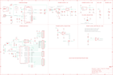

Contents
========

* [PRA2466 > Adafruit](#pra2466--adafruit)
	* [Schematic](#schematic)
	* [Interactive BOM](#interactive-bom)
	* [OOMP Parts](#oomp-parts)
	* [Images](#images)
	* [Tags](#tags)
  
![][im]
# PRA2466 > Adafruit

- ID: PROJ-ADAF-2466-STAN-01
- Hex ID: PRA2466
- Name: Adafruit
- Description: Adafruit
- Long Link: [http://oom.lt/PROJ-ADAF-2466-STAN-01](http://oom.lt/PROJ-ADAF-2466-STAN-01)
- Long Link: [http://oom.lt/PRA2466](http://oom.lt/PRA2466)

## Schematic
  
![][schem]
## Interactive BOM

- Interactive BOM page: [ibom.html](https://htmlpreview.github.io/?https://github.com/oomlout/oomlout_OOMP_projects/blob/main/PROJ-ADAF-2466-STAN-01/kicad/bom/ibom.html)

## OOMP Parts
  

|OOMP Parts|
| :---: |
|AD,UNMATCHED-UNMATCHED-UNMATCHED-UNMATCHED-UNMATCHED,AD,20609,HEADER-1X6,1X06_OVAL,PIN HEADER,,,,,,|
|C1,UNMATCHED-UNMATCHED-UNMATCHED-UNMATCHED-UNMATCHED,C1,10uF,CAP_CERAMIC0805-NOOUTLINE,0805-NO,Ceramic Capacitors,,,,,,|
|C2,UNMATCHED-UNMATCHED-UNMATCHED-UNMATCHED-UNMATCHED,C2,0.1uF,CAP_CERAMIC0805-NOOUTLINE,0805-NO,Ceramic Capacitors,,,,,,|
|C3,UNMATCHED-UNMATCHED-UNMATCHED-UNMATCHED-UNMATCHED,C3,10uF,CAP_CERAMIC0805-NOOUTLINE,0805-NO,Ceramic Capacitors,,,,,,|
|C4,UNMATCHED-UNMATCHED-UNMATCHED-UNMATCHED-UNMATCHED,C4,0.1uF,CAP_CERAMIC0805-NOOUTLINE,0805-NO,Ceramic Capacitors,,,,,,|
|C5,UNMATCHED-UNMATCHED-UNMATCHED-UNMATCHED-UNMATCHED,C5,0.1uF,CAP_CERAMIC0805-NOOUTLINE,0805-NO,Ceramic Capacitors,,,,,,|
|C6,UNMATCHED-UNMATCHED-UNMATCHED-UNMATCHED-UNMATCHED,C6,0.1uF,CAP_CERAMIC0805-NOOUTLINE,0805-NO,Ceramic Capacitors,,,,,,|
|C7,UNMATCHED-UNMATCHED-UNMATCHED-UNMATCHED-UNMATCHED,C7,10uF,CAP_CERAMIC0805-NOOUTLINE,0805-NO,Ceramic Capacitors,,,,,,|
|C9,UNMATCHED-UNMATCHED-UNMATCHED-UNMATCHED-UNMATCHED,C9,0.1uF,CAP_CERAMIC0805-NOOUTLINE,0805-NO,Ceramic Capacitors,,,,,,|
|C10,UNMATCHED-UNMATCHED-UNMATCHED-UNMATCHED-UNMATCHED,C10,0.1uF,CAP_CERAMIC0805_10MGAP,0805_10MGAP,Ceramic Capacitors,,,,,,|
|C12,UNMATCHED-UNMATCHED-UNMATCHED-UNMATCHED-UNMATCHED,C12,0.1uF,CAP_CERAMIC0805-NOOUTLINE,0805-NO,Ceramic Capacitors,,,,,,|
|C13,UNMATCHED-UNMATCHED-UNMATCHED-UNMATCHED-UNMATCHED,C13,0.1uF,CAP_CERAMIC0805-NOOUTLINE,0805-NO,Ceramic Capacitors,,,,,,|
|C15,UNMATCHED-UNMATCHED-UNMATCHED-UNMATCHED-UNMATCHED,C15,0.1uF,CAP_CERAMIC0805-NOOUTLINE,0805-NO,Ceramic Capacitors,,,,,,|
|D1,UNMATCHED-UNMATCHED-UNMATCHED-UNMATCHED-UNMATCHED,D1,MBR120,DIODE-SCHOTTKYSOD-123,SOD-123,,,,,,,|
|D2,UNMATCHED-UNMATCHED-UNMATCHED-UNMATCHED-UNMATCHED,D2,1N4148,DIODESOD-323,SOD-323,Diode,,,,,,|
|F2,UNMATCHED-UNMATCHED-UNMATCHED-UNMATCHED-UNMATCHED,F2,500mA,PTC_1206NO,1206-NO,PTC (Resettable Fuse),,,,,,|
|FB1,UNMATCHED-UNMATCHED-UNMATCHED-UNMATCHED-UNMATCHED,FB1,FERRITE,FERRITE-0805NO,0805-NO,Ferrite Bead,,,,,,|
|FB2,UNMATCHED-UNMATCHED-UNMATCHED-UNMATCHED-UNMATCHED,FB2,FERRITE,FERRITE-0805NO,0805-NO,Ferrite Bead,,,,,,|
|GROUND1,UNMATCHED-UNMATCHED-UNMATCHED-UNMATCHED-UNMATCHED,FD1,FIDUCIAL_1MM,FIDUCIAL_1MM,FIDUCIAL_1MM,Fiducial Alignment Points,EXCLUDE,,,,,|
|ICSP,UNMATCHED-UNMATCHED-UNMATCHED-UNMATCHED-UNMATCHED,FD2,FIDUCIAL_1MM,FIDUCIAL_1MM,FIDUCIAL_1MM,Fiducial Alignment Points,EXCLUDE,,,,,|
|IOH,UNMATCHED-UNMATCHED-UNMATCHED-UNMATCHED-UNMATCHED,FD3,FIDUCIAL_1MM,FIDUCIAL_1MM,FIDUCIAL_1MM,Fiducial Alignment Points,EXCLUDE,,,,,|
|IOL,UNMATCHED-UNMATCHED-UNMATCHED-UNMATCHED-UNMATCHED,GROUND1,,SJ,SJ,SMD solder JUMPER,,,,,,|
|JP1,UNMATCHED-UNMATCHED-UNMATCHED-UNMATCHED-UNMATCHED,ICSP,3x2 M,HEADER-2X3,2X03_ROUND_70MIL,PIN HEADER,,,,,,|
|L,UNMATCHED-UNMATCHED-UNMATCHED-UNMATCHED-UNMATCHED,IOH,20611,HEADER-1X10,1X10_OVAL,PIN HEADER,,,,,,|
|ON,UNMATCHED-UNMATCHED-UNMATCHED-UNMATCHED-UNMATCHED,IOL,20610,HEADER-1X8,1X08_OVAL,PIN HEADER,,,,,,|
|PC1,UNMATCHED-UNMATCHED-UNMATCHED-UNMATCHED-UNMATCHED,JP1,,HEADER-1X1ROUND,1X01_ROUND,PIN HEADER,,,,,,|
|PC2,UNMATCHED-UNMATCHED-UNMATCHED-UNMATCHED-UNMATCHED,L,RED,LED0805_NOOUTLINE,CHIPLED_0805_NOOUTLINE,LED,,,,,,|
|POWER,UNMATCHED-UNMATCHED-UNMATCHED-UNMATCHED-UNMATCHED,ON,GREEN,LED0805_NOOUTLINE,CHIPLED_0805_NOOUTLINE,LED,,,,,,|
|R1,UNMATCHED-UNMATCHED-UNMATCHED-UNMATCHED-UNMATCHED,PC1,47uF/25V,CAP_ELECTROLYTICPANASONIC_D,PANASONIC_D,Electrolytic Capacitors,,,,,,|
|R3,UNMATCHED-UNMATCHED-UNMATCHED-UNMATCHED-UNMATCHED,PC2,47uF+/6.3V+,CAP_ELECTROLYTICPANASONIC_D,PANASONIC_D,Electrolytic Capacitors,,,,,,|
|R6,UNMATCHED-UNMATCHED-UNMATCHED-UNMATCHED-UNMATCHED,POWER,20610,HEADER-1X8,1X08_OVAL,PIN HEADER,,,,,,|
|R7,UNMATCHED-UNMATCHED-UNMATCHED-UNMATCHED-UNMATCHED,R1,1K,RESISTOR0805_NOOUTLINE,0805-NO,Resistors,,,,,,|
|R8,UNMATCHED-UNMATCHED-UNMATCHED-UNMATCHED-UNMATCHED,R3,1K,RESISTOR0805_NOOUTLINE,0805-NO,Resistors,,,,,,|
|R9,UNMATCHED-UNMATCHED-UNMATCHED-UNMATCHED-UNMATCHED,R6,1K,RESISTOR0805_NOOUTLINE,0805-NO,Resistors,,,,,,|
|R10,UNMATCHED-UNMATCHED-UNMATCHED-UNMATCHED-UNMATCHED,R7,10K,RESISTOR0805_NOOUTLINE,0805-NO,Resistors,,,,,,|
|R11,UNMATCHED-UNMATCHED-UNMATCHED-UNMATCHED-UNMATCHED,R8,10K,RESISTOR_0805MP,_0805MP,Resistors,,,,,,|
|R12,UNMATCHED-UNMATCHED-UNMATCHED-UNMATCHED-UNMATCHED,R9,1K,RESISTOR0805_NOOUTLINE,0805-NO,Resistors,,,,,,|
|R13,UNMATCHED-UNMATCHED-UNMATCHED-UNMATCHED-UNMATCHED,R10,1K,RESISTOR0805_NOOUTLINE,0805-NO,Resistors,,,,,,|
|R14,UNMATCHED-UNMATCHED-UNMATCHED-UNMATCHED-UNMATCHED,R11,1K,RESISTOR0805_NOOUTLINE,0805-NO,Resistors,,,,,,|
|R15,UNMATCHED-UNMATCHED-UNMATCHED-UNMATCHED-UNMATCHED,R12,1K,RESISTOR0805_NOOUTLINE,0805-NO,Resistors,,,,,,|
|R16,UNMATCHED-UNMATCHED-UNMATCHED-UNMATCHED-UNMATCHED,R13,10K,RESISTOR0805_NOOUTLINE,0805-NO,Resistors,,,,,,|
|RESET,UNMATCHED-UNMATCHED-UNMATCHED-UNMATCHED-UNMATCHED,R14,10K,RESISTOR0805_NOOUTLINE,0805-NO,Resistors,,,,,,|
|RESET-EN,UNMATCHED-UNMATCHED-UNMATCHED-UNMATCHED-UNMATCHED,R15,10K,RESISTOR0805_NOOUTLINE,0805-NO,Resistors,,,,,,|
|RXLED,UNMATCHED-UNMATCHED-UNMATCHED-UNMATCHED-UNMATCHED,R16,10K,RESISTOR0805_NOOUTLINE,0805-NO,Resistors,,,,,,|
|SW2,UNMATCHED-UNMATCHED-UNMATCHED-UNMATCHED-UNMATCHED,RESET,6mm,SWITCH_TACT_SMT,EVQ-Q2,SMT Tact Switches,,,,,,|
|T1,UNMATCHED-UNMATCHED-UNMATCHED-UNMATCHED-UNMATCHED,RESET-EN,,SOLDERJUMPER_CLOSED,SOLDERJUMPER_CLOSEDWIRE,Solder Jumper - Closed,,,,,,|
|T2,UNMATCHED-UNMATCHED-UNMATCHED-UNMATCHED-UNMATCHED,RXLED,YELLOW,LED0805_NOOUTLINE,CHIPLED_0805_NOOUTLINE,LED,,,,,,|
|TXLED,UNMATCHED-UNMATCHED-UNMATCHED-UNMATCHED-UNMATCHED,SW2,,SWITCH_SPDT,SPDT_SMT_SSSS811101,Switch - SPDT,,,,,,|
|U1,UNMATCHED-UNMATCHED-UNMATCHED-UNMATCHED-UNMATCHED,T1,DMP3098L,PMOSSOT23,SOT-23,MOS FET,,,,unknown,unknown,|
|U3,UNMATCHED-UNMATCHED-UNMATCHED-UNMATCHED-UNMATCHED,T2,DMP3098L,PMOSSOT23,SOT-23,MOS FET,,,,unknown,unknown,|
|U4,UNMATCHED-UNMATCHED-UNMATCHED-UNMATCHED-UNMATCHED,TXLED,YELLOW,LED0805_NOOUTLINE,CHIPLED_0805_NOOUTLINE,LED,,,,,,|
|U5,UNMATCHED-UNMATCHED-UNMATCHED-UNMATCHED-UNMATCHED,U1,NCP1117ST50T3G,LM1117SOT223-REFLOW,SOT223-R,LM1117 Voltage Regulator,,,,,,|
|VSELECT,UNMATCHED-UNMATCHED-UNMATCHED-UNMATCHED-UNMATCHED,U3,CP2104,CP2104,QFN24_4MM_SMSC,CP2104 - USB to UART Bridge,,,,,,|
|X2,UNMATCHED-UNMATCHED-UNMATCHED-UNMATCHED-UNMATCHED,U4,AP2112-3.3,VREG_SOT23-5,SOT23-5,SOT23-5 Fixed Voltage Regulators,,,,,,|
|X3,UNMATCHED-UNMATCHED-UNMATCHED-UNMATCHED-UNMATCHED,U5,LMV358IDGKR,LMV358MMX,MSOP08,Dual General Purpose, Low Voltage, Rail-to-Rail Output Operational Amplifiers,,,,,,|
|Y2,UNMATCHED-UNMATCHED-UNMATCHED-UNMATCHED-UNMATCHED,VSELECT,,SOLDERJUMPER_2WAY,SOLDERJUMPER_2WAY_OPEN_NOPASTE,2-Way Solder Jumper,,,,,,|
|ZU4,UNMATCHED-UNMATCHED-UNMATCHED-UNMATCHED-UNMATCHED,X2,,DCBARRELPTH,DCJACK_2MM_PTH,DC Barrel Jack,,,,,,|

## Images
  
  

|kicadPcb3d|kicadPcb3dFront|kicadPcb3dBack|eagleImage|eagleSchemImage|
| :---: | :---: | :---: | :---: | :---: |
||||||

## Tags

- hexID: PRA2466
- oompType: PROJ
- oompSize: ADAF
- oompColor: 2466
- oompDesc: STAN
- oompIndex: 01
- oompName: Adafruit METRO 328 PCB
- sources: All source files from https://github.com/adafruit/Adafruit-METRO-328-PCB (source licence details in srcLicense.md)
- linkBuyPage: http://www.adafruit.com/products/2466
- oompID: PROJ-ADAF-2466-STAN-01
- oompParts: AD,UNMATCHED-UNMATCHED-UNMATCHED-UNMATCHED-UNMATCHED
- oompParts: C1,UNMATCHED-UNMATCHED-UNMATCHED-UNMATCHED-UNMATCHED
- oompParts: C2,UNMATCHED-UNMATCHED-UNMATCHED-UNMATCHED-UNMATCHED
- oompParts: C3,UNMATCHED-UNMATCHED-UNMATCHED-UNMATCHED-UNMATCHED
- oompParts: C4,UNMATCHED-UNMATCHED-UNMATCHED-UNMATCHED-UNMATCHED
- oompParts: C5,UNMATCHED-UNMATCHED-UNMATCHED-UNMATCHED-UNMATCHED
- oompParts: C6,UNMATCHED-UNMATCHED-UNMATCHED-UNMATCHED-UNMATCHED
- oompParts: C7,UNMATCHED-UNMATCHED-UNMATCHED-UNMATCHED-UNMATCHED
- oompParts: C9,UNMATCHED-UNMATCHED-UNMATCHED-UNMATCHED-UNMATCHED
- oompParts: C10,UNMATCHED-UNMATCHED-UNMATCHED-UNMATCHED-UNMATCHED
- oompParts: C12,UNMATCHED-UNMATCHED-UNMATCHED-UNMATCHED-UNMATCHED
- oompParts: C13,UNMATCHED-UNMATCHED-UNMATCHED-UNMATCHED-UNMATCHED
- oompParts: C15,UNMATCHED-UNMATCHED-UNMATCHED-UNMATCHED-UNMATCHED
- oompParts: D1,UNMATCHED-UNMATCHED-UNMATCHED-UNMATCHED-UNMATCHED
- oompParts: D2,UNMATCHED-UNMATCHED-UNMATCHED-UNMATCHED-UNMATCHED
- oompParts: F2,UNMATCHED-UNMATCHED-UNMATCHED-UNMATCHED-UNMATCHED
- oompParts: FB1,UNMATCHED-UNMATCHED-UNMATCHED-UNMATCHED-UNMATCHED
- oompParts: FB2,UNMATCHED-UNMATCHED-UNMATCHED-UNMATCHED-UNMATCHED
- oompParts: GROUND1,UNMATCHED-UNMATCHED-UNMATCHED-UNMATCHED-UNMATCHED
- oompParts: ICSP,UNMATCHED-UNMATCHED-UNMATCHED-UNMATCHED-UNMATCHED
- oompParts: IOH,UNMATCHED-UNMATCHED-UNMATCHED-UNMATCHED-UNMATCHED
- oompParts: IOL,UNMATCHED-UNMATCHED-UNMATCHED-UNMATCHED-UNMATCHED
- oompParts: JP1,UNMATCHED-UNMATCHED-UNMATCHED-UNMATCHED-UNMATCHED
- oompParts: L,UNMATCHED-UNMATCHED-UNMATCHED-UNMATCHED-UNMATCHED
- oompParts: ON,UNMATCHED-UNMATCHED-UNMATCHED-UNMATCHED-UNMATCHED
- oompParts: PC1,UNMATCHED-UNMATCHED-UNMATCHED-UNMATCHED-UNMATCHED
- oompParts: PC2,UNMATCHED-UNMATCHED-UNMATCHED-UNMATCHED-UNMATCHED
- oompParts: POWER,UNMATCHED-UNMATCHED-UNMATCHED-UNMATCHED-UNMATCHED
- oompParts: R1,UNMATCHED-UNMATCHED-UNMATCHED-UNMATCHED-UNMATCHED
- oompParts: R3,UNMATCHED-UNMATCHED-UNMATCHED-UNMATCHED-UNMATCHED
- oompParts: R6,UNMATCHED-UNMATCHED-UNMATCHED-UNMATCHED-UNMATCHED
- oompParts: R7,UNMATCHED-UNMATCHED-UNMATCHED-UNMATCHED-UNMATCHED
- oompParts: R8,UNMATCHED-UNMATCHED-UNMATCHED-UNMATCHED-UNMATCHED
- oompParts: R9,UNMATCHED-UNMATCHED-UNMATCHED-UNMATCHED-UNMATCHED
- oompParts: R10,UNMATCHED-UNMATCHED-UNMATCHED-UNMATCHED-UNMATCHED
- oompParts: R11,UNMATCHED-UNMATCHED-UNMATCHED-UNMATCHED-UNMATCHED
- oompParts: R12,UNMATCHED-UNMATCHED-UNMATCHED-UNMATCHED-UNMATCHED
- oompParts: R13,UNMATCHED-UNMATCHED-UNMATCHED-UNMATCHED-UNMATCHED
- oompParts: R14,UNMATCHED-UNMATCHED-UNMATCHED-UNMATCHED-UNMATCHED
- oompParts: R15,UNMATCHED-UNMATCHED-UNMATCHED-UNMATCHED-UNMATCHED
- oompParts: R16,UNMATCHED-UNMATCHED-UNMATCHED-UNMATCHED-UNMATCHED
- oompParts: RESET,UNMATCHED-UNMATCHED-UNMATCHED-UNMATCHED-UNMATCHED
- oompParts: RESET-EN,UNMATCHED-UNMATCHED-UNMATCHED-UNMATCHED-UNMATCHED
- oompParts: RXLED,UNMATCHED-UNMATCHED-UNMATCHED-UNMATCHED-UNMATCHED
- oompParts: SW2,UNMATCHED-UNMATCHED-UNMATCHED-UNMATCHED-UNMATCHED
- oompParts: T1,UNMATCHED-UNMATCHED-UNMATCHED-UNMATCHED-UNMATCHED
- oompParts: T2,UNMATCHED-UNMATCHED-UNMATCHED-UNMATCHED-UNMATCHED
- oompParts: TXLED,UNMATCHED-UNMATCHED-UNMATCHED-UNMATCHED-UNMATCHED
- oompParts: U1,UNMATCHED-UNMATCHED-UNMATCHED-UNMATCHED-UNMATCHED
- oompParts: U3,UNMATCHED-UNMATCHED-UNMATCHED-UNMATCHED-UNMATCHED
- oompParts: U4,UNMATCHED-UNMATCHED-UNMATCHED-UNMATCHED-UNMATCHED
- oompParts: U5,UNMATCHED-UNMATCHED-UNMATCHED-UNMATCHED-UNMATCHED
- oompParts: VSELECT,UNMATCHED-UNMATCHED-UNMATCHED-UNMATCHED-UNMATCHED
- oompParts: X2,UNMATCHED-UNMATCHED-UNMATCHED-UNMATCHED-UNMATCHED
- oompParts: X3,UNMATCHED-UNMATCHED-UNMATCHED-UNMATCHED-UNMATCHED
- oompParts: Y2,UNMATCHED-UNMATCHED-UNMATCHED-UNMATCHED-UNMATCHED
- oompParts: ZU4,UNMATCHED-UNMATCHED-UNMATCHED-UNMATCHED-UNMATCHED
- rawParts: AD,20609,HEADER-1X6,1X06_OVAL,PIN HEADER,,,,,,
- rawParts: C1,10uF,CAP_CERAMIC0805-NOOUTLINE,0805-NO,Ceramic Capacitors,,,,,,
- rawParts: C2,0.1uF,CAP_CERAMIC0805-NOOUTLINE,0805-NO,Ceramic Capacitors,,,,,,
- rawParts: C3,10uF,CAP_CERAMIC0805-NOOUTLINE,0805-NO,Ceramic Capacitors,,,,,,
- rawParts: C4,0.1uF,CAP_CERAMIC0805-NOOUTLINE,0805-NO,Ceramic Capacitors,,,,,,
- rawParts: C5,0.1uF,CAP_CERAMIC0805-NOOUTLINE,0805-NO,Ceramic Capacitors,,,,,,
- rawParts: C6,0.1uF,CAP_CERAMIC0805-NOOUTLINE,0805-NO,Ceramic Capacitors,,,,,,
- rawParts: C7,10uF,CAP_CERAMIC0805-NOOUTLINE,0805-NO,Ceramic Capacitors,,,,,,
- rawParts: C9,0.1uF,CAP_CERAMIC0805-NOOUTLINE,0805-NO,Ceramic Capacitors,,,,,,
- rawParts: C10,0.1uF,CAP_CERAMIC0805_10MGAP,0805_10MGAP,Ceramic Capacitors,,,,,,
- rawParts: C12,0.1uF,CAP_CERAMIC0805-NOOUTLINE,0805-NO,Ceramic Capacitors,,,,,,
- rawParts: C13,0.1uF,CAP_CERAMIC0805-NOOUTLINE,0805-NO,Ceramic Capacitors,,,,,,
- rawParts: C15,0.1uF,CAP_CERAMIC0805-NOOUTLINE,0805-NO,Ceramic Capacitors,,,,,,
- rawParts: D1,MBR120,DIODE-SCHOTTKYSOD-123,SOD-123,,,,,,,
- rawParts: D2,1N4148,DIODESOD-323,SOD-323,Diode,,,,,,
- rawParts: F2,500mA,PTC_1206NO,1206-NO,PTC (Resettable Fuse),,,,,,
- rawParts: FB1,FERRITE,FERRITE-0805NO,0805-NO,Ferrite Bead,,,,,,
- rawParts: FB2,FERRITE,FERRITE-0805NO,0805-NO,Ferrite Bead,,,,,,
- rawParts: FD1,FIDUCIAL_1MM,FIDUCIAL_1MM,FIDUCIAL_1MM,Fiducial Alignment Points,EXCLUDE,,,,,
- rawParts: FD2,FIDUCIAL_1MM,FIDUCIAL_1MM,FIDUCIAL_1MM,Fiducial Alignment Points,EXCLUDE,,,,,
- rawParts: FD3,FIDUCIAL_1MM,FIDUCIAL_1MM,FIDUCIAL_1MM,Fiducial Alignment Points,EXCLUDE,,,,,
- rawParts: GROUND1,,SJ,SJ,SMD solder JUMPER,,,,,,
- rawParts: ICSP,3x2 M,HEADER-2X3,2X03_ROUND_70MIL,PIN HEADER,,,,,,
- rawParts: IOH,20611,HEADER-1X10,1X10_OVAL,PIN HEADER,,,,,,
- rawParts: IOL,20610,HEADER-1X8,1X08_OVAL,PIN HEADER,,,,,,
- rawParts: JP1,,HEADER-1X1ROUND,1X01_ROUND,PIN HEADER,,,,,,
- rawParts: L,RED,LED0805_NOOUTLINE,CHIPLED_0805_NOOUTLINE,LED,,,,,,
- rawParts: ON,GREEN,LED0805_NOOUTLINE,CHIPLED_0805_NOOUTLINE,LED,,,,,,
- rawParts: PC1,47uF/25V,CAP_ELECTROLYTICPANASONIC_D,PANASONIC_D,Electrolytic Capacitors,,,,,,
- rawParts: PC2,47uF+/6.3V+,CAP_ELECTROLYTICPANASONIC_D,PANASONIC_D,Electrolytic Capacitors,,,,,,
- rawParts: POWER,20610,HEADER-1X8,1X08_OVAL,PIN HEADER,,,,,,
- rawParts: R1,1K,RESISTOR0805_NOOUTLINE,0805-NO,Resistors,,,,,,
- rawParts: R3,1K,RESISTOR0805_NOOUTLINE,0805-NO,Resistors,,,,,,
- rawParts: R6,1K,RESISTOR0805_NOOUTLINE,0805-NO,Resistors,,,,,,
- rawParts: R7,10K,RESISTOR0805_NOOUTLINE,0805-NO,Resistors,,,,,,
- rawParts: R8,10K,RESISTOR_0805MP,_0805MP,Resistors,,,,,,
- rawParts: R9,1K,RESISTOR0805_NOOUTLINE,0805-NO,Resistors,,,,,,
- rawParts: R10,1K,RESISTOR0805_NOOUTLINE,0805-NO,Resistors,,,,,,
- rawParts: R11,1K,RESISTOR0805_NOOUTLINE,0805-NO,Resistors,,,,,,
- rawParts: R12,1K,RESISTOR0805_NOOUTLINE,0805-NO,Resistors,,,,,,
- rawParts: R13,10K,RESISTOR0805_NOOUTLINE,0805-NO,Resistors,,,,,,
- rawParts: R14,10K,RESISTOR0805_NOOUTLINE,0805-NO,Resistors,,,,,,
- rawParts: R15,10K,RESISTOR0805_NOOUTLINE,0805-NO,Resistors,,,,,,
- rawParts: R16,10K,RESISTOR0805_NOOUTLINE,0805-NO,Resistors,,,,,,
- rawParts: RESET,6mm,SWITCH_TACT_SMT,EVQ-Q2,SMT Tact Switches,,,,,,
- rawParts: RESET-EN,,SOLDERJUMPER_CLOSED,SOLDERJUMPER_CLOSEDWIRE,Solder Jumper - Closed,,,,,,
- rawParts: RXLED,YELLOW,LED0805_NOOUTLINE,CHIPLED_0805_NOOUTLINE,LED,,,,,,
- rawParts: SW2,,SWITCH_SPDT,SPDT_SMT_SSSS811101,Switch - SPDT,,,,,,
- rawParts: T1,DMP3098L,PMOSSOT23,SOT-23,MOS FET,,,,unknown,unknown,
- rawParts: T2,DMP3098L,PMOSSOT23,SOT-23,MOS FET,,,,unknown,unknown,
- rawParts: TXLED,YELLOW,LED0805_NOOUTLINE,CHIPLED_0805_NOOUTLINE,LED,,,,,,
- rawParts: U1,NCP1117ST50T3G,LM1117SOT223-REFLOW,SOT223-R,LM1117 Voltage Regulator,,,,,,
- rawParts: U3,CP2104,CP2104,QFN24_4MM_SMSC,CP2104 - USB to UART Bridge,,,,,,
- rawParts: U4,AP2112-3.3,VREG_SOT23-5,SOT23-5,SOT23-5 Fixed Voltage Regulators,,,,,,
- rawParts: U5,LMV358IDGKR,LMV358MMX,MSOP08,Dual General Purpose, Low Voltage, Rail-to-Rail Output Operational Amplifiers,,,,,,
- rawParts: VSELECT,,SOLDERJUMPER_2WAY,SOLDERJUMPER_2WAY_OPEN_NOPASTE,2-Way Solder Jumper,,,,,,
- rawParts: X2,,DCBARRELPTH,DCJACK_2MM_PTH,DC Barrel Jack,,,,,,
- rawParts: X3,20329,USB_W_SHIELD_V2,4UCONN_20329_V2,,,,,,,
- rawParts: Y2,CSTCE16M0V53-R0 16MHZ,RESONATORMU,RESONATOR,,,,,,,
- rawParts: ZU4,ATMEGA328P-AU,ATMEGA328P-AU,TQFP32-08,MICROCONTROLLER,,,,,,

[im]: kicadPcb3d_450.png
[schem]: eagleSchemImage.png
