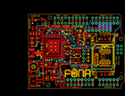
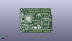
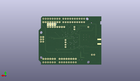
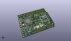

Contents
========

* [PROJ-ADAF-2468-STAN-01>Adafruit FONA 800 Shield PCB](#proj-adaf-2468-stan-01adafruit-fona-800-shield-pcb)
	* [Images](#images)
	* [Interactive BOM](#interactive-bom)
	* [OOMP Parts](#oomp-parts)
	* [Tags](#tags)
  
![][im]
# PROJ-ADAF-2468-STAN-01>Adafruit FONA 800 Shield PCB

- ID: PROJ-ADAF-2468-STAN-01
- Hex ID: PRA2468
- Name: Adafruit FONA 800 Shield PCB
- Description: 

## Images
  
  

|eagleImage|kicadPcb3dFront|kicadPcb3dBack|kicadPcb3d|
| :---: | :---: | :---: | :---: |
|||||

## Interactive BOM

- Interactive BOM page: [ibom.html](kicad/bom/ibom.html)

## OOMP Parts
  

|OOMP Parts|
| :---: |
|CAPE-0805-X-UNMATCHED-01, C1, 22.605999999999998, 16.509999999999998, 90,C1, 10uF, 0805-NO, microbuilder, (0.89, 0.65), R90|
|CAPE-0805-X-UNMATCHED-01, C2, 3.556, 39.37, 270,C2, 33pF, 0805-NO, microbuilder, (0.14, 1.55), R270|
|CAPE-0805-X-UNMATCHED-01, C3, 1.5239999999999998, 39.37, 270,C3, 10pF, 0805-NO, microbuilder, (0.06, 1.55), R270|
|CAPE-0805-X-UNMATCHED-01, C4, 5.588, 39.37, 90,C4, 33pF, 0805-NO, microbuilder, (0.22, 1.55), R90|
|CAPE-0805-X-UNMATCHED-01, C5, 9.398, 18.034, 180,C5, 10pF, 0805-NO, microbuilder, (0.37, 0.71), R180|
|CAPE-0805-X-UNMATCHED-01, C6, 9.398, 16.002, 180,C6, 33pF, 0805-NO, microbuilder, (0.37, 0.63), R180|
|CAPE-1210-X-UNMATCHED-01, C7, 15.239999999999998, 16.764, 90,C7, 100uF, C1210, rcl, (0.6, 0.66), R90|
|CAPE-0805-X-UNMATCHED-01, C9, 28.701999999999995, 32.766, 0,C9, 10uF, 0805-NO, microbuilder, (1.13, 1.29), R0|
|CAPE-0805-X-UNMATCHED-01, C10, 7.619999999999999, 39.37, 90,C10, 10pF, 0805-NO, microbuilder, (0.3, 1.55), R90|
|CAPE-0805-X-UNMATCHED-01, C11, 27.94, 26.669999999999998, 180,C11, 10uF, 0805-NO, microbuilder, (1.1, 1.05), R180|
|CAPE-UNMATCHED-X-UNMATCHED-01, C14, 35.400000066, 20.346999946, 90,C14, 33pF, RESPACK_4X0603, microbuilder, (1.39370079, 0.80106299), R90|
|CAPE-UNMATCHED-X-UNMATCHED-01, C15, 31.844000065999996, 20.346999946, 270,C15, 10pF, RESPACK_4X0603, microbuilder, (1.25370079, 0.80106299), R270|
|CAPE-UNMATCHED-X-UNMATCHED-01, C16, 32.44399988199999, 26.542999999999996, 90,C16, 33pF, RESPACK_4X0603, microbuilder, (1.27732283, 1.045), R90|
|CAPE-UNMATCHED-X-UNMATCHED-01, C17, 35.999999882, 26.542999999999996, 90,C17, 10pF, RESPACK_4X0603, microbuilder, (1.41732283, 1.045), R90|
|UNMATCHED-UNMATCHED-X-UNMATCHED-01, CHRG, 16.002, 7.365999999999999, 0,CHRG, ORANGE, CHIPLED_0805_NOOUTLINE, microbuilder, (0.63, 0.29), R0|
|UNMATCHED-UNMATCHED-X-UNMATCHED-01, CN2, 3.8099999999999996, 5.334, 90,CN2, JSTPH, JSTPH2, microbuilder, (0.15, 0.21), R90|
|UNMATCHED-UNMATCHED-X-UNMATCHED-01, D1, 12.446, 17.018, 90,D1, MMSZ5231BT1G, SOD-123, microbuilder, (0.49, 0.67), R90|
|UNMATCHED-UNMATCHED-X-UNMATCHED-01, D2, 27.94, 29.971999999999998, 180,D2, SMF05C, SOT363, microbuilder, (1.1, 1.18), R180|
|UNMATCHED-UNMATCHED-X-UNMATCHED-01, D3, 24.383999999999997, 41.148, 180,D3, 1N4148, SOD-323, microbuilder, (0.96, 1.62), R180|
|UNMATCHED-UNMATCHED-X-UNMATCHED-01, D4, 36.195, 38.354, 180,D4, 1N4148, SOD-323, microbuilder, (1.425, 1.51), R180|
|UNMATCHED-UNMATCHED-X-UNMATCHED-01, D5, 43.307, 37.846, 270,D5, 1N4148, SOD-323, microbuilder, (1.705, 1.49), R270|
|UNMATCHED-UNMATCHED-X-UNMATCHED-01, D6, 63.11899999999999, 38.227, 270,D6, 1N4148, SOD-323, microbuilder, (2.485, 1.505), R270|
|UNMATCHED-UNMATCHED-X-UNMATCHED-01, D7, 18.287999999999997, 11.937999999999999, 90,D7, MBRA120, SOD-123, microbuilder, (0.72, 0.47), R90|
|UNMATCHED-UNMATCHED-X-UNMATCHED-01, D8, 37.083999999999996, 41.275, 270,D8, 1N4148, SOD-323, microbuilder, (1.46, 1.625), R270|
|UNMATCHED-UNMATCHED-X-UNMATCHED-01, DONE, 12.7, 7.365999999999999, 180,DONE, GREEN, CHIPLED_0805_NOOUTLINE, microbuilder, (0.5, 0.29), R180|
|UNMATCHED-UNMATCHED-X-UNMATCHED-01, IC1, 37.8968, 34.1884, 90,IC1, 74VHCT125PW, TSSOP14, 74xx-us, (1.492, 1.346), R90|
|UNMATCHED-UNMATCHED-X-UNMATCHED-01, JP1, 39.210000066, 25.907999999999998, 270,JP1, 1X02_ROUND, microbuilder, (1.54370079, 1.02), R270|
|UNMATCHED-UNMATCHED-X-UNMATCHED-01, JP2, 39.210000066, 20.727999946, 90,JP2, MIC, 1X02_ROUND, microbuilder, (1.54370079, 0.81606299), R90|
|UNMATCHED-UNMATCHED-X-UNMATCHED-01, JP3, 29.463999999999995, 40.386, 270,JP3, BUZZ, 1X02_ROUND, microbuilder, (1.16, 1.59), R270|
|UNMATCHED-UNMATCHED-X-UNMATCHED-01, JP4, 30.225999999999996, 46.99, 0,JP4, 1X10_ROUND70, microbuilder, (1.19, 1.85), R0|
|UNMATCHED-UNMATCHED-X-UNMATCHED-01, JP5, 54.60999999999999, 46.99, 0,JP5, 1X08_ROUND_76, microbuilder, (2.15, 1.85), R0|
|UNMATCHED-UNMATCHED-X-UNMATCHED-01, JP6, 36.83, 6.35, 180,JP6, 1X08_ROUND_76, microbuilder, (1.45, 0.25), R180|
|UNMATCHED-UNMATCHED-X-UNMATCHED-01, JP7, 57.15, 6.35, 180,JP7, 1X06_ROUND_76, microbuilder, (2.25, 0.25), R180|
|UNMATCHED-UNMATCHED-X-UNMATCHED-01, JP9, 9.017, 10.921999999999999, 0,JP9, 1X02_ROUND, microbuilder, (0.355, 0.43), R0|
|UNMATCHED-UNMATCHED-X-UNMATCHED-01, JP10, 49.529999999999994, 41.65599999999999, 180,JP10, 1X08_ROUND_76, microbuilder, (1.95, 1.64), R180|
|UNMATCHED-UNMATCHED-X-UNMATCHED-01, M1, 0.0, 0.0, 0,M1, ARDUINO_R3_ICSP_NODIM, ARDUINOR3_ICSP_NODIM, adafruit, (0, 0), R0|
|UNMATCHED-UNMATCHED-X-UNMATCHED-01, NETSTAT, 2.54, 36.321999999999996, 90,NETSTAT, BLUE, CHIPLED_0805_NOOUTLINE, microbuilder, (0.1, 1.43), R90|
|UNMATCHED-UNMATCHED-X-UNMATCHED-01, PWM, 14.224, 41.65599999999999, 90,PWM, 1X01-CLEANBIG, adafruit, (0.56, 1.64), R90|
|UNMATCHED-UNMATCHED-X-UNMATCHED-01, PWRSTAT, 2.54, 33.274, 90,PWRSTAT, GREEN, CHIPLED_0805_NOOUTLINE, microbuilder, (0.1, 1.31), R90|
|UNMATCHED-UNMATCHED-X-UNMATCHED-01, Q1, 20.066, 41.148, 270,Q1, DTC143ZUAT106, SC59-BEC, transistor, (0.79, 1.62), R270|
|RESE-0805-X-UNMATCHED-01, R1, 16.002, 11.684, 90,R1, 470, 0805-NO, microbuilder, (0.63, 0.46), R90|
|RESE-0805-X-UNMATCHED-01, R2, 12.7, 11.684, 90,R2, 1K, 0805-NO, microbuilder, (0.5, 0.46), R90|
|RESE-0805-X-UNMATCHED-01, R3, 26.669999999999998, 17.525999999999996, 0,R3, 4.7K, 0805-NO, microbuilder, (1.05, 0.69), R0|
|RESE-0805-X-UNMATCHED-01, R4, 2.667, 30.353, 0,R4, 1K, 0805-NO, microbuilder, (0.105, 1.195), R0|
|RESE-0805-X-UNMATCHED-01, R5, 6.604, 36.068, 0,R5, 1K, 0805-NO, microbuilder, (0.26, 1.42), R0|
|RESE-0805-X-UNMATCHED-01, R6, 6.604, 33.400999999999996, 180,R6, 4.7K, 0805-NO, microbuilder, (0.26, 1.315), R180|
|UNMATCHED-UNMATCHED-X-UNMATCHED-01, SJ1, 39.751, 15.620999999999999, 180,SJ1, SOLDERJUMPER_2WAY_OPEN_NOPASTE, microbuilder, (1.565, 0.615), R180|
|UNMATCHED-UNMATCHED-X-UNMATCHED-01, SJ2, 58.419999999999995, 44.323, M270,SJ2, SOLDERJUMPER_CLOSEDWIRE, microbuilder, (2.3, 1.745), MR270|
|UNMATCHED-UNMATCHED-X-UNMATCHED-01, SJ3, 55.88, 44.323, M270,SJ3, SOLDERJUMPER_CLOSEDWIRE, microbuilder, (2.2, 1.745), MR270|
|UNMATCHED-UNMATCHED-X-UNMATCHED-01, SJ4, 53.339999999999996, 44.323, M270,SJ4, SOLDERJUMPER_CLOSEDWIRE, microbuilder, (2.1, 1.745), MR270|
|UNMATCHED-UNMATCHED-X-UNMATCHED-01, SJ5, 50.8, 44.323, M270,SJ5, SOLDERJUMPER_CLOSEDWIRE, microbuilder, (2, 1.745), MR270|
|UNMATCHED-UNMATCHED-X-UNMATCHED-01, SJ6, 40.64, 38.862, 270,SJ6, SOLDERJUMPER_CLOSEDWIRE, microbuilder, (1.6, 1.53), R270|
|UNMATCHED-UNMATCHED-X-UNMATCHED-01, SW1, 3.556, 15.493999999999998, 90,SW1, KMR2, EVQ-Q2, microbuilder, (0.14, 0.61), R90|
|UNMATCHED-UNMATCHED-X-UNMATCHED-01, SW2, 22.605999999999998, 5.08, 0,SW2, EG1390, EG1390, microbuilder, (0.89, 0.2), R0|
|UNMATCHED-UNMATCHED-X-UNMATCHED-01, TP1, 27.813, 35.687, 90,TP1, TPTP11R, TP11R, testpad, (1.095, 1.405), R90|
|UNMATCHED-UNMATCHED-X-UNMATCHED-01, U1, 17.779999999999998, 30.225999999999996, 90,U1, SIM800H/L, SIM800L, microbuilder, (0.7, 1.19), R90|
|UNMATCHED-UNMATCHED-X-UNMATCHED-01, U2, 19.558, 16.509999999999998, 270,U2, MCP73831T-2ACI/OT, SOT23-5, microbuilder, (0.77, 0.65), R270|
|UNMATCHED-UNMATCHED-X-UNMATCHED-01, X1, 0.254, 25.4, 0,X1, uFL, SMA_EDGELAUNCH_UFL, microbuilder, (0.01, 1), R0|
|UNMATCHED-UNMATCHED-X-UNMATCHED-01, X4, 0.127, 46.355, 0,X4, 4UCONN_18510, 4UCONN_18510, microbuilder, (0.005, 1.825), R0|
|UNMATCHED-UNMATCHED-X-UNMATCHED-01, X6, 53.213, 22.733, 90,X6, SIM_LOCKAMPHENOL, C707_10M006_512_2, microbuilder, (2.095, 0.895), R90|

## Tags

- hexID: PRA2468
- oompType: PROJ
- oompSize: ADAF
- oompColor: 2468
- oompDesc: STAN
- oompIndex: 01
- oompName: Adafruit FONA 800 Shield PCB
- sources: All source files from https://github.com/adafruit/Adafruit-FONA-800-Shield-PCB (source licence details in srcLicense.md)
- linkBuyPage: http://www.adafruit.com/products/2468
- oompPart: CAPE-0805-X-UNMATCHED-01, C1, 22.605999999999998, 16.509999999999998, 90
- oompPart: CAPE-0805-X-UNMATCHED-01, C2, 3.556, 39.37, 270
- oompPart: CAPE-0805-X-UNMATCHED-01, C3, 1.5239999999999998, 39.37, 270
- oompPart: CAPE-0805-X-UNMATCHED-01, C4, 5.588, 39.37, 90
- oompPart: CAPE-0805-X-UNMATCHED-01, C5, 9.398, 18.034, 180
- oompPart: CAPE-0805-X-UNMATCHED-01, C6, 9.398, 16.002, 180
- oompPart: CAPE-1210-X-UNMATCHED-01, C7, 15.239999999999998, 16.764, 90
- oompPart: CAPE-0805-X-UNMATCHED-01, C9, 28.701999999999995, 32.766, 0
- oompPart: CAPE-0805-X-UNMATCHED-01, C10, 7.619999999999999, 39.37, 90
- oompPart: CAPE-0805-X-UNMATCHED-01, C11, 27.94, 26.669999999999998, 180
- oompPart: CAPE-UNMATCHED-X-UNMATCHED-01, C14, 35.400000066, 20.346999946, 90
- oompPart: CAPE-UNMATCHED-X-UNMATCHED-01, C15, 31.844000065999996, 20.346999946, 270
- oompPart: CAPE-UNMATCHED-X-UNMATCHED-01, C16, 32.44399988199999, 26.542999999999996, 90
- oompPart: CAPE-UNMATCHED-X-UNMATCHED-01, C17, 35.999999882, 26.542999999999996, 90
- oompPart: UNMATCHED-UNMATCHED-X-UNMATCHED-01, CHRG, 16.002, 7.365999999999999, 0
- oompPart: UNMATCHED-UNMATCHED-X-UNMATCHED-01, CN2, 3.8099999999999996, 5.334, 90
- oompPart: UNMATCHED-UNMATCHED-X-UNMATCHED-01, D1, 12.446, 17.018, 90
- oompPart: UNMATCHED-UNMATCHED-X-UNMATCHED-01, D2, 27.94, 29.971999999999998, 180
- oompPart: UNMATCHED-UNMATCHED-X-UNMATCHED-01, D3, 24.383999999999997, 41.148, 180
- oompPart: UNMATCHED-UNMATCHED-X-UNMATCHED-01, D4, 36.195, 38.354, 180
- oompPart: UNMATCHED-UNMATCHED-X-UNMATCHED-01, D5, 43.307, 37.846, 270
- oompPart: UNMATCHED-UNMATCHED-X-UNMATCHED-01, D6, 63.11899999999999, 38.227, 270
- oompPart: UNMATCHED-UNMATCHED-X-UNMATCHED-01, D7, 18.287999999999997, 11.937999999999999, 90
- oompPart: UNMATCHED-UNMATCHED-X-UNMATCHED-01, D8, 37.083999999999996, 41.275, 270
- oompPart: UNMATCHED-UNMATCHED-X-UNMATCHED-01, DONE, 12.7, 7.365999999999999, 180
- oompPart: SKIP-UNMATCHED-X-UNMATCHED-01, FID1, 61.849, 42.418, 90
- oompPart: SKIP-UNMATCHED-X-UNMATCHED-01, FID2, 2.921, 5.206999999999999, 90
- oompPart: SKIP-UNMATCHED-X-UNMATCHED-01, FID3, 25.34500011, 14.839000039999998, 90
- oompPart: SKIP-UNMATCHED-X-UNMATCHED-01, FID4, 6.223, 46.482, 90
- oompPart: SKIP-UNMATCHED-X-UNMATCHED-01, FID5, 66.167, 11.176, 90
- oompPart: UNMATCHED-UNMATCHED-X-UNMATCHED-01, IC1, 37.8968, 34.1884, 90
- oompPart: UNMATCHED-UNMATCHED-X-UNMATCHED-01, JP1, 39.210000066, 25.907999999999998, 270
- oompPart: UNMATCHED-UNMATCHED-X-UNMATCHED-01, JP2, 39.210000066, 20.727999946, 90
- oompPart: UNMATCHED-UNMATCHED-X-UNMATCHED-01, JP3, 29.463999999999995, 40.386, 270
- oompPart: UNMATCHED-UNMATCHED-X-UNMATCHED-01, JP4, 30.225999999999996, 46.99, 0
- oompPart: UNMATCHED-UNMATCHED-X-UNMATCHED-01, JP5, 54.60999999999999, 46.99, 0
- oompPart: UNMATCHED-UNMATCHED-X-UNMATCHED-01, JP6, 36.83, 6.35, 180
- oompPart: UNMATCHED-UNMATCHED-X-UNMATCHED-01, JP7, 57.15, 6.35, 180
- oompPart: UNMATCHED-UNMATCHED-X-UNMATCHED-01, JP9, 9.017, 10.921999999999999, 0
- oompPart: UNMATCHED-UNMATCHED-X-UNMATCHED-01, JP10, 49.529999999999994, 41.65599999999999, 180
- oompPart: UNMATCHED-UNMATCHED-X-UNMATCHED-01, M1, 0.0, 0.0, 0
- oompPart: UNMATCHED-UNMATCHED-X-UNMATCHED-01, NETSTAT, 2.54, 36.321999999999996, 90
- oompPart: UNMATCHED-UNMATCHED-X-UNMATCHED-01, PWM, 14.224, 41.65599999999999, 90
- oompPart: UNMATCHED-UNMATCHED-X-UNMATCHED-01, PWRSTAT, 2.54, 33.274, 90
- oompPart: UNMATCHED-UNMATCHED-X-UNMATCHED-01, Q1, 20.066, 41.148, 270
- oompPart: RESE-0805-X-UNMATCHED-01, R1, 16.002, 11.684, 90
- oompPart: RESE-0805-X-UNMATCHED-01, R2, 12.7, 11.684, 90
- oompPart: RESE-0805-X-UNMATCHED-01, R3, 26.669999999999998, 17.525999999999996, 0
- oompPart: RESE-0805-X-UNMATCHED-01, R4, 2.667, 30.353, 0
- oompPart: RESE-0805-X-UNMATCHED-01, R5, 6.604, 36.068, 0
- oompPart: RESE-0805-X-UNMATCHED-01, R6, 6.604, 33.400999999999996, 180
- oompPart: UNMATCHED-UNMATCHED-X-UNMATCHED-01, SJ1, 39.751, 15.620999999999999, 180
- oompPart: UNMATCHED-UNMATCHED-X-UNMATCHED-01, SJ2, 58.419999999999995, 44.323, M270
- oompPart: UNMATCHED-UNMATCHED-X-UNMATCHED-01, SJ3, 55.88, 44.323, M270
- oompPart: UNMATCHED-UNMATCHED-X-UNMATCHED-01, SJ4, 53.339999999999996, 44.323, M270
- oompPart: UNMATCHED-UNMATCHED-X-UNMATCHED-01, SJ5, 50.8, 44.323, M270
- oompPart: UNMATCHED-UNMATCHED-X-UNMATCHED-01, SJ6, 40.64, 38.862, 270
- oompPart: UNMATCHED-UNMATCHED-X-UNMATCHED-01, SW1, 3.556, 15.493999999999998, 90
- oompPart: UNMATCHED-UNMATCHED-X-UNMATCHED-01, SW2, 22.605999999999998, 5.08, 0
- oompPart: UNMATCHED-UNMATCHED-X-UNMATCHED-01, TP1, 27.813, 35.687, 90
- oompPart: UNMATCHED-UNMATCHED-X-UNMATCHED-01, U1, 17.779999999999998, 30.225999999999996, 90
- oompPart: UNMATCHED-UNMATCHED-X-UNMATCHED-01, U2, 19.558, 16.509999999999998, 270
- oompPart: UNMATCHED-UNMATCHED-X-UNMATCHED-01, X1, 0.254, 25.4, 0
- oompPart: UNMATCHED-UNMATCHED-X-UNMATCHED-01, X4, 0.127, 46.355, 0
- oompPart: UNMATCHED-UNMATCHED-X-UNMATCHED-01, X6, 53.213, 22.733, 90
- rawPart: C1, 10uF, 0805-NO, microbuilder, (0.89, 0.65), R90
- rawPart: C2, 33pF, 0805-NO, microbuilder, (0.14, 1.55), R270
- rawPart: C3, 10pF, 0805-NO, microbuilder, (0.06, 1.55), R270
- rawPart: C4, 33pF, 0805-NO, microbuilder, (0.22, 1.55), R90
- rawPart: C5, 10pF, 0805-NO, microbuilder, (0.37, 0.71), R180
- rawPart: C6, 33pF, 0805-NO, microbuilder, (0.37, 0.63), R180
- rawPart: C7, 100uF, C1210, rcl, (0.6, 0.66), R90
- rawPart: C9, 10uF, 0805-NO, microbuilder, (1.13, 1.29), R0
- rawPart: C10, 10pF, 0805-NO, microbuilder, (0.3, 1.55), R90
- rawPart: C11, 10uF, 0805-NO, microbuilder, (1.1, 1.05), R180
- rawPart: C14, 33pF, RESPACK_4X0603, microbuilder, (1.39370079, 0.80106299), R90
- rawPart: C15, 10pF, RESPACK_4X0603, microbuilder, (1.25370079, 0.80106299), R270
- rawPart: C16, 33pF, RESPACK_4X0603, microbuilder, (1.27732283, 1.045), R90
- rawPart: C17, 10pF, RESPACK_4X0603, microbuilder, (1.41732283, 1.045), R90
- rawPart: CHRG, ORANGE, CHIPLED_0805_NOOUTLINE, microbuilder, (0.63, 0.29), R0
- rawPart: CN2, JSTPH, JSTPH2, microbuilder, (0.15, 0.21), R90
- rawPart: D1, MMSZ5231BT1G, SOD-123, microbuilder, (0.49, 0.67), R90
- rawPart: D2, SMF05C, SOT363, microbuilder, (1.1, 1.18), R180
- rawPart: D3, 1N4148, SOD-323, microbuilder, (0.96, 1.62), R180
- rawPart: D4, 1N4148, SOD-323, microbuilder, (1.425, 1.51), R180
- rawPart: D5, 1N4148, SOD-323, microbuilder, (1.705, 1.49), R270
- rawPart: D6, 1N4148, SOD-323, microbuilder, (2.485, 1.505), R270
- rawPart: D7, MBRA120, SOD-123, microbuilder, (0.72, 0.47), R90
- rawPart: D8, 1N4148, SOD-323, microbuilder, (1.46, 1.625), R270
- rawPart: DONE, GREEN, CHIPLED_0805_NOOUTLINE, microbuilder, (0.5, 0.29), R180
- rawPart: FID1, FIDUCIAL, FIDUCIAL_1MM, microbuilder, (2.435, 1.67), R90
- rawPart: FID2, FIDUCIAL, FIDUCIAL_1MM, microbuilder, (0.115, 0.205), R90
- rawPart: FID3, FIDUCIAL, FIDUCIAL_1MM, microbuilder, (0.99783465, 0.5842126), R90
- rawPart: FID4, FIDUCIAL, FIDUCIAL_1MM, microbuilder, (0.245, 1.83), R90
- rawPart: FID5, FIDUCIAL, FIDUCIAL_1MM, microbuilder, (2.605, 0.44), R90
- rawPart: IC1, 74VHCT125PW, TSSOP14, 74xx-us, (1.492, 1.346), R90
- rawPart: JP1, 1X02_ROUND, microbuilder, (1.54370079, 1.02), R270
- rawPart: JP2, MIC, 1X02_ROUND, microbuilder, (1.54370079, 0.81606299), R90
- rawPart: JP3, BUZZ, 1X02_ROUND, microbuilder, (1.16, 1.59), R270
- rawPart: JP4, 1X10_ROUND70, microbuilder, (1.19, 1.85), R0
- rawPart: JP5, 1X08_ROUND_76, microbuilder, (2.15, 1.85), R0
- rawPart: JP6, 1X08_ROUND_76, microbuilder, (1.45, 0.25), R180
- rawPart: JP7, 1X06_ROUND_76, microbuilder, (2.25, 0.25), R180
- rawPart: JP9, 1X02_ROUND, microbuilder, (0.355, 0.43), R0
- rawPart: JP10, 1X08_ROUND_76, microbuilder, (1.95, 1.64), R180
- rawPart: M1, ARDUINO_R3_ICSP_NODIM, ARDUINOR3_ICSP_NODIM, adafruit, (0, 0), R0
- rawPart: NETSTAT, BLUE, CHIPLED_0805_NOOUTLINE, microbuilder, (0.1, 1.43), R90
- rawPart: PWM, 1X01-CLEANBIG, adafruit, (0.56, 1.64), R90
- rawPart: PWRSTAT, GREEN, CHIPLED_0805_NOOUTLINE, microbuilder, (0.1, 1.31), R90
- rawPart: Q1, DTC143ZUAT106, SC59-BEC, transistor, (0.79, 1.62), R270
- rawPart: R1, 470, 0805-NO, microbuilder, (0.63, 0.46), R90
- rawPart: R2, 1K, 0805-NO, microbuilder, (0.5, 0.46), R90
- rawPart: R3, 4.7K, 0805-NO, microbuilder, (1.05, 0.69), R0
- rawPart: R4, 1K, 0805-NO, microbuilder, (0.105, 1.195), R0
- rawPart: R5, 1K, 0805-NO, microbuilder, (0.26, 1.42), R0
- rawPart: R6, 4.7K, 0805-NO, microbuilder, (0.26, 1.315), R180
- rawPart: SJ1, SOLDERJUMPER_2WAY_OPEN_NOPASTE, microbuilder, (1.565, 0.615), R180
- rawPart: SJ2, SOLDERJUMPER_CLOSEDWIRE, microbuilder, (2.3, 1.745), MR270
- rawPart: SJ3, SOLDERJUMPER_CLOSEDWIRE, microbuilder, (2.2, 1.745), MR270
- rawPart: SJ4, SOLDERJUMPER_CLOSEDWIRE, microbuilder, (2.1, 1.745), MR270
- rawPart: SJ5, SOLDERJUMPER_CLOSEDWIRE, microbuilder, (2, 1.745), MR270
- rawPart: SJ6, SOLDERJUMPER_CLOSEDWIRE, microbuilder, (1.6, 1.53), R270
- rawPart: SW1, KMR2, EVQ-Q2, microbuilder, (0.14, 0.61), R90
- rawPart: SW2, EG1390, EG1390, microbuilder, (0.89, 0.2), R0
- rawPart: TP1, TPTP11R, TP11R, testpad, (1.095, 1.405), R90
- rawPart: U1, SIM800H/L, SIM800L, microbuilder, (0.7, 1.19), R90
- rawPart: U2, MCP73831T-2ACI/OT, SOT23-5, microbuilder, (0.77, 0.65), R270
- rawPart: X1, uFL, SMA_EDGELAUNCH_UFL, microbuilder, (0.01, 1), R0
- rawPart: X4, 4UCONN_18510, 4UCONN_18510, microbuilder, (0.005, 1.825), R0
- rawPart: X6, SIM_LOCKAMPHENOL, C707_10M006_512_2, microbuilder, (2.095, 0.895), R90

[im]: kicadPcb3d_450.png
