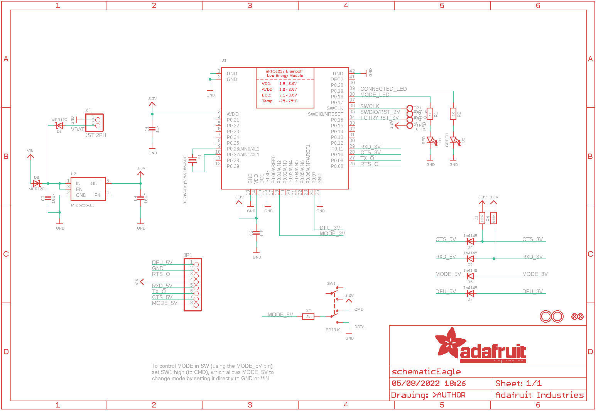
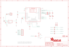

Contents
========

* [PRA2479 > Adafruit](#pra2479--adafruit)
	* [Schematic](#schematic)
	* [Interactive BOM](#interactive-bom)
	* [OOMP Parts](#oomp-parts)
	* [Images](#images)
	* [Tags](#tags)
  
![][im]
# PRA2479 > Adafruit

- ID: PROJ-ADAF-2479-STAN-01
- Hex ID: PRA2479
- Name: Adafruit
- Description: Adafruit
- Long Link: [http://oom.lt/PROJ-ADAF-2479-STAN-01](http://oom.lt/PROJ-ADAF-2479-STAN-01)
- Short Link: [http://oom.lt/PRA2479](http://oom.lt/PRA2479)

## Schematic
  

## Interactive BOM

- Interactive BOM page: [ibom.html](https://htmlpreview.github.io/?https://github.com/oomlout/oomlout_OOMP_projects/blob/main/PROJ-ADAF-2479-STAN-01/kicad/bom/ibom.html)

## OOMP Parts
  

|OOMP Parts|
| :---: |
|C1,CAPC-0805-X-UF1-01,C1,1uF,CAP_CERAMIC0805-NOOUTLINE,0805-NO,Ceramic Capacitors,,|
|C2,CAPC-0805-X-UF1-01,C2,1uF,CAP_CERAMIC0805-NOOUTLINE,0805-NO,Ceramic Capacitors,,|
|C3,CAPC-0805-X-UF10-V10,C3,10uF,CAP_CERAMIC0805-NOOUTLINE,0805-NO,Ceramic Capacitors,,|
|C4,CAPC-0805-X-UF10-V10,C4,10uF,CAP_CERAMIC0805-NOOUTLINE,0805-NO,Ceramic Capacitors,,|
|D1,LEDS-0805-G-STAN-01,D1,RED,LED0805_NOOUTLINE,CHIPLED_0805_NOOUTLINE,LED,,|
|D2,LEDS-0805-G-STAN-01,D2,GREEN,LED0805_NOOUTLINE,CHIPLED_0805_NOOUTLINE,LED,,|
|D3,DIOD-UNMATCHED-X-UNMATCHED-01,D3,MBR120,DIODE-SCHOTTKYSOD-123,SOD-123,,,|
|D4,DIOD-S323-X-UNMATCHED-01,D4,1n4148,DIODESOD-323,SOD-323,Diode,,|
|D5,DIOD-S323-X-UNMATCHED-01,D5,1n4148,DIODESOD-323,SOD-323,Diode,,|
|D6,DIOD-S323-X-UNMATCHED-01,D6,1n4148,DIODESOD-323,SOD-323,Diode,,|
|D7,DIOD-S323-X-UNMATCHED-01,D7,1n4148,DIODESOD-323,SOD-323,Diode,,|
|D8,DIOD-UNMATCHED-X-UNMATCHED-01,D8,MBR120,DIODE-SCHOTTKYSOD-123,SOD-123,,,|
|JP1,HEAD-I01-X-PI08-01,FID1,FIDUCIAL,FIDUCIAL,FIDUCIAL_1MM,Fiducial Alignment Points,EXCLUDE,|
|R1,RESE-0805-X-O102-01,FID2,FIDUCIAL,FIDUCIAL,FIDUCIAL_1MM,Fiducial Alignment Points,EXCLUDE,|
|R2,RESE-0805-X-O102-01,JP1,,HEADER-1X876MIL,1X08_ROUND_76,PIN HEADER,,|
|R3,RESE-0805-X-O1003-01,R1,1K,RESISTOR0805_NOOUTLINE,0805-NO,Resistors,,|
|R4,RESE-0805-X-O1003-01,R2,1K,RESISTOR0805_NOOUTLINE,0805-NO,Resistors,,|
|R7,RESE-0805-X-O202-01,R3,100K,RESISTOR0805_NOOUTLINE,0805-NO,Resistors,,|
|SW1,UNMATCHED-UNMATCHED-X-UNMATCHED-01,R4,100K,RESISTOR0805_NOOUTLINE,0805-NO,Resistors,,|
|TP1,UNMATCHED-UNMATCHED-X-UNMATCHED-01,R7,2K,RESISTOR0805_NOOUTLINE,0805-NO,Resistors,,|
|TP2,UNMATCHED-UNMATCHED-X-UNMATCHED-01,SW1,EG1319,SWITCH_DPDTEG1390,EG1390,Switch - DPDT,,|
|TP3,UNMATCHED-UNMATCHED-X-UNMATCHED-01,TP1,SWCLK,TESTPOINT1.5X2.0MM_NOCREAM,PAD-1.5X2.0,Test Point,,|
|U1,UNMATCHED-UNMATCHED-X-UNMATCHED-01,TP2,SWDIO,TESTPOINT1.5X2.0MM_NOCREAM,PAD-1.5X2.0,Test Point,,|
|U2,VREG-SO235-X-KMIC5225-V33D,TP3,FCTRST,TESTPOINT1.5X2.0MM_NOCREAM,PAD-1.5X2.0,Test Point,,|
|VTREF,UNMATCHED-UNMATCHED-X-UNMATCHED-01,U$28,MOUNTINGHOLE2.5,MOUNTINGHOLE2.5,MOUNTINGHOLE_2.5_PLATED,Mounting Hole,EXCLUDE,|
|X1,UNMATCHED-UNMATCHED-X-UNMATCHED-01,U$29,MOUNTINGHOLE2.5,MOUNTINGHOLE2.5,MOUNTINGHOLE_2.5_PLATED,Mounting Hole,EXCLUDE,|
|Y1,UNMATCHED-UNMATCHED-X-UNMATCHED-01,U1,,NRF51822_MODULE_MDBT40,BLE_MODULE_RAYTAC_MDBT40,nRF51822 Bluetooth Low Energy Module,,|

## Images
  
  

|kicadPcb3d|kicadPcb3dFront|kicadPcb3dBack|eagleImage|eagleSchemImage|
| :---: | :---: | :---: | :---: | :---: |
||||||

## Tags

- hexID: PRA2479
- oompType: PROJ
- oompSize: ADAF
- oompColor: 2479
- oompDesc: STAN
- oompIndex: 01
- oompName: Adafruit Bluefruit LE UART Friend PCB
- sources: All source files from https://github.com/adafruit/Adafruit-Bluefruit-LE-UART-Friend-PCB (source licence details in srcLicense.md)
- linkBuyPage: http://www.adafruit.com/products/2479
- oompID: PROJ-ADAF-2479-STAN-01
- oompParts: C1,CAPC-0805-X-UF1-01
- oompParts: C2,CAPC-0805-X-UF1-01
- oompParts: C3,CAPC-0805-X-UF10-V10
- oompParts: C4,CAPC-0805-X-UF10-V10
- oompParts: D1,LEDS-0805-G-STAN-01
- oompParts: D2,LEDS-0805-G-STAN-01
- oompParts: D3,DIOD-UNMATCHED-X-UNMATCHED-01
- oompParts: D4,DIOD-S323-X-UNMATCHED-01
- oompParts: D5,DIOD-S323-X-UNMATCHED-01
- oompParts: D6,DIOD-S323-X-UNMATCHED-01
- oompParts: D7,DIOD-S323-X-UNMATCHED-01
- oompParts: D8,DIOD-UNMATCHED-X-UNMATCHED-01
- oompParts: JP1,HEAD-I01-X-PI08-01
- oompParts: R1,RESE-0805-X-O102-01
- oompParts: R2,RESE-0805-X-O102-01
- oompParts: R3,RESE-0805-X-O1003-01
- oompParts: R4,RESE-0805-X-O1003-01
- oompParts: R7,RESE-0805-X-O202-01
- oompParts: SW1,UNMATCHED-UNMATCHED-X-UNMATCHED-01
- oompParts: TP1,UNMATCHED-UNMATCHED-X-UNMATCHED-01
- oompParts: TP2,UNMATCHED-UNMATCHED-X-UNMATCHED-01
- oompParts: TP3,UNMATCHED-UNMATCHED-X-UNMATCHED-01
- oompParts: U1,UNMATCHED-UNMATCHED-X-UNMATCHED-01
- oompParts: U2,VREG-SO235-X-KMIC5225-V33D
- oompParts: VTREF,UNMATCHED-UNMATCHED-X-UNMATCHED-01
- oompParts: X1,UNMATCHED-UNMATCHED-X-UNMATCHED-01
- oompParts: Y1,UNMATCHED-UNMATCHED-X-UNMATCHED-01
- rawParts: C1,1uF,CAP_CERAMIC0805-NOOUTLINE,0805-NO,Ceramic Capacitors,,
- rawParts: C2,1uF,CAP_CERAMIC0805-NOOUTLINE,0805-NO,Ceramic Capacitors,,
- rawParts: C3,10uF,CAP_CERAMIC0805-NOOUTLINE,0805-NO,Ceramic Capacitors,,
- rawParts: C4,10uF,CAP_CERAMIC0805-NOOUTLINE,0805-NO,Ceramic Capacitors,,
- rawParts: D1,RED,LED0805_NOOUTLINE,CHIPLED_0805_NOOUTLINE,LED,,
- rawParts: D2,GREEN,LED0805_NOOUTLINE,CHIPLED_0805_NOOUTLINE,LED,,
- rawParts: D3,MBR120,DIODE-SCHOTTKYSOD-123,SOD-123,,,
- rawParts: D4,1n4148,DIODESOD-323,SOD-323,Diode,,
- rawParts: D5,1n4148,DIODESOD-323,SOD-323,Diode,,
- rawParts: D6,1n4148,DIODESOD-323,SOD-323,Diode,,
- rawParts: D7,1n4148,DIODESOD-323,SOD-323,Diode,,
- rawParts: D8,MBR120,DIODE-SCHOTTKYSOD-123,SOD-123,,,
- rawParts: FID1,FIDUCIAL,FIDUCIAL,FIDUCIAL_1MM,Fiducial Alignment Points,EXCLUDE,
- rawParts: FID2,FIDUCIAL,FIDUCIAL,FIDUCIAL_1MM,Fiducial Alignment Points,EXCLUDE,
- rawParts: JP1,,HEADER-1X876MIL,1X08_ROUND_76,PIN HEADER,,
- rawParts: R1,1K,RESISTOR0805_NOOUTLINE,0805-NO,Resistors,,
- rawParts: R2,1K,RESISTOR0805_NOOUTLINE,0805-NO,Resistors,,
- rawParts: R3,100K,RESISTOR0805_NOOUTLINE,0805-NO,Resistors,,
- rawParts: R4,100K,RESISTOR0805_NOOUTLINE,0805-NO,Resistors,,
- rawParts: R7,2K,RESISTOR0805_NOOUTLINE,0805-NO,Resistors,,
- rawParts: SW1,EG1319,SWITCH_DPDTEG1390,EG1390,Switch - DPDT,,
- rawParts: TP1,SWCLK,TESTPOINT1.5X2.0MM_NOCREAM,PAD-1.5X2.0,Test Point,,
- rawParts: TP2,SWDIO,TESTPOINT1.5X2.0MM_NOCREAM,PAD-1.5X2.0,Test Point,,
- rawParts: TP3,FCTRST,TESTPOINT1.5X2.0MM_NOCREAM,PAD-1.5X2.0,Test Point,,
- rawParts: U$28,MOUNTINGHOLE2.5,MOUNTINGHOLE2.5,MOUNTINGHOLE_2.5_PLATED,Mounting Hole,EXCLUDE,
- rawParts: U$29,MOUNTINGHOLE2.5,MOUNTINGHOLE2.5,MOUNTINGHOLE_2.5_PLATED,Mounting Hole,EXCLUDE,
- rawParts: U1,,NRF51822_MODULE_MDBT40,BLE_MODULE_RAYTAC_MDBT40,nRF51822 Bluetooth Low Energy Module,,
- rawParts: U2,MIC5225-3.3,VREG_SOT23-5,SOT23-5,SOT23-5 Fixed Voltage Regulators,,
- rawParts: VTREF,FCTRST,TESTPOINT1.5X2.0MM_NOCREAM,PAD-1.5X2.0,Test Point,,
- rawParts: X1,JST 2PH,CON_JST_PH_2PIN,JSTPH2,JST 2-Pin Right-Angle Connector,,
- rawParts: Y1,32.768kHz (535-9166-2-ND),CRYSTAL2.0X6.0_32.768,CRYSTAL_CYL_2X6MM_SMT,Crystals,,

[im]: kicadPcb3d_450.png
