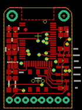
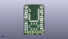
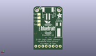
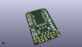

Contents
========

* [PROJ-ADAF-2479-STAN-01>Adafruit Bluefruit LE UART Friend PCB](#proj-adaf-2479-stan-01adafruit-bluefruit-le-uart-friend-pcb)
	* [Images](#images)
	* [Interactive BOM](#interactive-bom)
	* [OOMP Parts](#oomp-parts)
	* [Tags](#tags)
  
![][im]
# PROJ-ADAF-2479-STAN-01>Adafruit Bluefruit LE UART Friend PCB

- ID: PROJ-ADAF-2479-STAN-01
- Hex ID: PRA2479
- Name: Adafruit Bluefruit LE UART Friend PCB
- Description: 

## Images
  
  

|eagleImage|kicadPcb3dFront|kicadPcb3dBack|kicadPcb3d|
| :---: | :---: | :---: | :---: |
|||||

## Interactive BOM

- Interactive BOM page: [ibom.html](kicad/bom/ibom.html)

## OOMP Parts
  

|OOMP Parts|
| :---: |
|CAPC-0805-X-UNMATCHED-01, C1, 2.54, 21.336, 180,C1, 1uF, 0805-NO, microbuilder, (0.1, 0.84), R180|
|CAPC-0805-X-UNMATCHED-01, C2, 3.302, 18.541999999999998, 90,C2, 1uF, 0805-NO, microbuilder, (0.13, 0.73), R90|
|CAPC-0805-X-UNMATCHED-01, C3, 2.54, 11.43, 0,C3, 10uF, 0805-NO, microbuilder, (0.1, 0.45), R0|
|CAPC-0805-X-UNMATCHED-01, C4, 1.5239999999999998, 18.541999999999998, 90,C4, 10uF, 0805-NO, microbuilder, (0.06, 0.73), R90|
|UNMATCHED-UNMATCHED-X-UNMATCHED-01, D1, 1.5239999999999998, 24.13, 180,D1, RED, CHIPLED_0805_NOOUTLINE, microbuilder, (0.06, 0.95), R180|
|UNMATCHED-UNMATCHED-X-UNMATCHED-01, D2, 19.558, 24.13, 0,D2, GREEN, CHIPLED_0805_NOOUTLINE, microbuilder, (0.77, 0.95), R0|
|UNMATCHED-UNMATCHED-X-UNMATCHED-01, D3, 3.556, 7.619999999999999, 270,D3, MBR120, SOD-123, microbuilder, (0.14, 0.3), R270|
|UNMATCHED-UNMATCHED-X-UNMATCHED-01, D4, 18.846799999999998, 16.764, 180,D4, 1n4148, SOD-323, microbuilder, (0.742, 0.66), R180|
|UNMATCHED-UNMATCHED-X-UNMATCHED-01, D5, 18.440399999999997, 12.953999999999999, 180,D5, 1n4148, SOD-323, microbuilder, (0.726, 0.51), R180|
|UNMATCHED-UNMATCHED-X-UNMATCHED-01, D6, 18.3388, 8.636000000000001, 180,D6, 1n4148, SOD-323, microbuilder, (0.722, 0.34), R180|
|UNMATCHED-UNMATCHED-X-UNMATCHED-01, D7, 18.313399999999998, 10.668, 180,D7, 1n4148, SOD-323, microbuilder, (0.721, 0.42), R180|
|UNMATCHED-UNMATCHED-X-UNMATCHED-01, D8, 1.5239999999999998, 7.619999999999999, 270,D8, MBR120, SOD-123, microbuilder, (0.06, 0.3), R270|
|<table><tr><td></td><td> JP1</td><td>[HEAD-I01-X-PI08-01 2.54 mm 8 Pin Header](https://github.com/oomlout/oomlout_OOMP_parts/tree/main/HEAD-I01-X-PI08-01/)</td><td>[H08](https://github.com/oomlout/oomlout_OOMP_parts/tree/main/HEAD-I01-X-PI08-01/)</td></tr></table>|
|RESE-0805-X-UNMATCHED-01, R1, 3.556, 24.13, 90,R1, 1K, 0805-NO, microbuilder, (0.14, 0.95), R90|
|RESE-0805-X-UNMATCHED-01, R2, 17.779999999999998, 24.13, 270,R2, 1K, 0805-NO, microbuilder, (0.7, 0.95), R270|
|RESE-0805-X-O104-01, R3, 18.541999999999998, 18.796, 0,R3, 100K, 0805-NO, microbuilder, (0.73, 0.74), R0|
|RESE-0805-X-O104-01, R4, 18.541999999999998, 14.985999999999999, 0,R4, 100K, 0805-NO, microbuilder, (0.73, 0.59), R0|
|RESE-0805-X-UNMATCHED-01, R7, 18.541999999999998, 6.35, 180,R7, 2K, 0805-NO, microbuilder, (0.73, 0.25), R180|
|UNMATCHED-UNMATCHED-X-UNMATCHED-01, SW1, 10.668, 8.636000000000001, 180,SW1, EG1319, EG1390, microbuilder, (0.42, 0.34), R180|
|UNMATCHED-UNMATCHED-X-UNMATCHED-01, U1, 10.668, 22.86, 0,U1, BLE_MODULE_RAYTAC_MDBT40, microbuilder, (0.42, 0.9), R0|
|UNMATCHED-UNMATCHED-X-UNMATCHED-01, U2, 2.54, 14.477999999999998, 0,U2, MIC5225-3.3, SOT23-5, microbuilder, (0.1, 0.57), R0|
|UNMATCHED-UNMATCHED-X-UNMATCHED-01, VTREF, 17.272000000000002, 18.287999999999997, M270,VTREF, FCTRST, PAD-1.5X2.0, microbuilder, (0.68, 0.72), MR270|
|ERROR, X1 JST 2PH, 0, 0, 0,X1, JST, 2PH, JSTPH2, microbuilder, (0.42, 1.1), MR0|
|ERROR, Y1 32.768kHz (535-9166-2-ND), 0, 0, 0,Y1, 32.768kHz, (535-9166-2-ND), CRYSTAL_CYL_2X6MM_SMT, microbuilder, (0.11, 0.65), MR90|

## Tags

- hexID: PRA2479
- oompType: PROJ
- oompSize: ADAF
- oompColor: 2479
- oompDesc: STAN
- oompIndex: 01
- oompName: Adafruit Bluefruit LE UART Friend PCB
- sources: All source files from https://github.com/adafruit/Adafruit-Bluefruit-LE-UART-Friend-PCB (source licence details in srcLicense.md)
- linkBuyPage: http://www.adafruit.com/products/2479
- oompID: PROJ-ADAF-2479-STAN-01
- oompPart: CAPC-0805-X-UNMATCHED-01, C1, 2.54, 21.336, 180
- oompPart: CAPC-0805-X-UNMATCHED-01, C2, 3.302, 18.541999999999998, 90
- oompPart: CAPC-0805-X-UNMATCHED-01, C3, 2.54, 11.43, 0
- oompPart: CAPC-0805-X-UNMATCHED-01, C4, 1.5239999999999998, 18.541999999999998, 90
- oompPart: UNMATCHED-UNMATCHED-X-UNMATCHED-01, D1, 1.5239999999999998, 24.13, 180
- oompPart: UNMATCHED-UNMATCHED-X-UNMATCHED-01, D2, 19.558, 24.13, 0
- oompPart: UNMATCHED-UNMATCHED-X-UNMATCHED-01, D3, 3.556, 7.619999999999999, 270
- oompPart: UNMATCHED-UNMATCHED-X-UNMATCHED-01, D4, 18.846799999999998, 16.764, 180
- oompPart: UNMATCHED-UNMATCHED-X-UNMATCHED-01, D5, 18.440399999999997, 12.953999999999999, 180
- oompPart: UNMATCHED-UNMATCHED-X-UNMATCHED-01, D6, 18.3388, 8.636000000000001, 180
- oompPart: UNMATCHED-UNMATCHED-X-UNMATCHED-01, D7, 18.313399999999998, 10.668, 180
- oompPart: UNMATCHED-UNMATCHED-X-UNMATCHED-01, D8, 1.5239999999999998, 7.619999999999999, 270
- oompPart: SKIP-UNMATCHED-X-UNMATCHED-01, FID1, 20.32, 4.444999999999999, 0
- oompPart: SKIP-UNMATCHED-X-UNMATCHED-01, FID2, 6.731, 24.764999999999997, 0
- oompPart: HEAD-I01-X-PI08-01, JP1, 10.668, 2.54, 180
- oompPart: RESE-0805-X-UNMATCHED-01, R1, 3.556, 24.13, 90
- oompPart: RESE-0805-X-UNMATCHED-01, R2, 17.779999999999998, 24.13, 270
- oompPart: RESE-0805-X-O104-01, R3, 18.541999999999998, 18.796, 0
- oompPart: RESE-0805-X-O104-01, R4, 18.541999999999998, 14.985999999999999, 0
- oompPart: RESE-0805-X-UNMATCHED-01, R7, 18.541999999999998, 6.35, 180
- oompPart: UNMATCHED-UNMATCHED-X-UNMATCHED-01, SW1, 10.668, 8.636000000000001, 180
- oompPart: SKIP-UNMATCHED-X-UNMATCHED-01, TP1, 17.272000000000002, 25.907999999999998, M270
- oompPart: SKIP-UNMATCHED-X-UNMATCHED-01, TP2, 17.272000000000002, 23.368, M90
- oompPart: SKIP-UNMATCHED-X-UNMATCHED-01, TP3, 17.272000000000002, 20.827999999999996, M270
- oompPart: SKIP-UNMATCHED-X-UNMATCHED-01, U$28, 18.796, 29.209999999999997, 0
- oompPart: SKIP-UNMATCHED-X-UNMATCHED-01, U$29, 2.54, 29.209999999999997, 0
- oompPart: UNMATCHED-UNMATCHED-X-UNMATCHED-01, U1, 10.668, 22.86, 0
- oompPart: UNMATCHED-UNMATCHED-X-UNMATCHED-01, U2, 2.54, 14.477999999999998, 0
- oompPart: UNMATCHED-UNMATCHED-X-UNMATCHED-01, VTREF, 17.272000000000002, 18.287999999999997, M270
- oompPart: ERROR, X1 JST 2PH, 0, 0, 0
- oompPart: ERROR, Y1 32.768kHz (535-9166-2-ND), 0, 0, 0
- rawPart: C1, 1uF, 0805-NO, microbuilder, (0.1, 0.84), R180
- rawPart: C2, 1uF, 0805-NO, microbuilder, (0.13, 0.73), R90
- rawPart: C3, 10uF, 0805-NO, microbuilder, (0.1, 0.45), R0
- rawPart: C4, 10uF, 0805-NO, microbuilder, (0.06, 0.73), R90
- rawPart: D1, RED, CHIPLED_0805_NOOUTLINE, microbuilder, (0.06, 0.95), R180
- rawPart: D2, GREEN, CHIPLED_0805_NOOUTLINE, microbuilder, (0.77, 0.95), R0
- rawPart: D3, MBR120, SOD-123, microbuilder, (0.14, 0.3), R270
- rawPart: D4, 1n4148, SOD-323, microbuilder, (0.742, 0.66), R180
- rawPart: D5, 1n4148, SOD-323, microbuilder, (0.726, 0.51), R180
- rawPart: D6, 1n4148, SOD-323, microbuilder, (0.722, 0.34), R180
- rawPart: D7, 1n4148, SOD-323, microbuilder, (0.721, 0.42), R180
- rawPart: D8, MBR120, SOD-123, microbuilder, (0.06, 0.3), R270
- rawPart: FID1, FIDUCIAL, FIDUCIAL_1MM, microbuilder, (0.8, 0.175), R0
- rawPart: FID2, FIDUCIAL, FIDUCIAL_1MM, microbuilder, (0.265, 0.975), R0
- rawPart: JP1, 1X08_ROUND_76, microbuilder, (0.42, 0.1), R180
- rawPart: R1, 1K, 0805-NO, microbuilder, (0.14, 0.95), R90
- rawPart: R2, 1K, 0805-NO, microbuilder, (0.7, 0.95), R270
- rawPart: R3, 100K, 0805-NO, microbuilder, (0.73, 0.74), R0
- rawPart: R4, 100K, 0805-NO, microbuilder, (0.73, 0.59), R0
- rawPart: R7, 2K, 0805-NO, microbuilder, (0.73, 0.25), R180
- rawPart: SW1, EG1319, EG1390, microbuilder, (0.42, 0.34), R180
- rawPart: TP1, SWCLK, PAD-1.5X2.0, microbuilder, (0.68, 1.02), MR270
- rawPart: TP2, SWDIO, PAD-1.5X2.0, microbuilder, (0.68, 0.92), MR90
- rawPart: TP3, FCTRST, PAD-1.5X2.0, microbuilder, (0.68, 0.82), MR270
- rawPart: U$28, MOUNTINGHOLE2.5, MOUNTINGHOLE_2.5_PLATED, microbuilder, (0.74, 1.15), R0
- rawPart: U$29, MOUNTINGHOLE2.5, MOUNTINGHOLE_2.5_PLATED, microbuilder, (0.1, 1.15), R0
- rawPart: U1, BLE_MODULE_RAYTAC_MDBT40, microbuilder, (0.42, 0.9), R0
- rawPart: U2, MIC5225-3.3, SOT23-5, microbuilder, (0.1, 0.57), R0
- rawPart: VTREF, FCTRST, PAD-1.5X2.0, microbuilder, (0.68, 0.72), MR270
- rawPart: X1, JST, 2PH, JSTPH2, microbuilder, (0.42, 1.1), MR0
- rawPart: Y1, 32.768kHz, (535-9166-2-ND), CRYSTAL_CYL_2X6MM_SMT, microbuilder, (0.11, 0.65), MR90

[im]: kicadPcb3d_450.png
