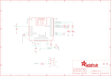

Contents
========

* [PRA2487 > Adafruit Flora Bluefruit LE PCB](#pra2487--adafruit-flora-bluefruit-le-pcb)
	* [Schematic](#schematic)
	* [PCB](#pcb)
	* [Interactive BOM](#interactive-bom)
	* [OOMP Parts](#oomp-parts)
	* [Images](#images)
	* [Tags](#tags)
  
![][im]
# PRA2487 > Adafruit Flora Bluefruit LE PCB

- ID: PROJ-ADAF-2487-STAN-01
- Hex ID: PRA2487
- Name: Adafruit
- Description: Adafruit
- Long Link: [http://oom.lt/PROJ-ADAF-2487-STAN-01](http://oom.lt/PROJ-ADAF-2487-STAN-01)
- Short Link: [http://oom.lt/PRA2487](http://oom.lt/PRA2487)

## Schematic
  

## PCB
  

## Interactive BOM

- Interactive BOM page: [ibom.html](https://htmlpreview.github.io/?https://github.com/oomlout/oomlout_OOMP_projects/blob/main/PROJ-ADAF-2487-STAN-01/kicad/bom/ibom.html)

## OOMP Parts
  

|OOMP Parts|
| :---: |
|[CAPC-0805-X-UF1-V25  SMD (0805) 1 uF Capacitor (Ceramic) 25v  C1, C2](https://github.com/oomlout/oomlout_OOMP_parts/tree/main/CAPC-0805-X-UF1-V25/)|
|[LEDS-0805-R-STAN-01  SMD (0805) Red LED  D1](https://github.com/oomlout/oomlout_OOMP_parts/tree/main/LEDS-0805-R-STAN-01/)|
|[LEDS-0805-L-STAN-01  SMD (0805) Blue LED  D2](https://github.com/oomlout/oomlout_OOMP_parts/tree/main/LEDS-0805-L-STAN-01/)|
|[BUTA-4628-X-STAN-01  SMD (4628) Pushbutton (Tactile)  DFU](https://github.com/oomlout/oomlout_OOMP_parts/tree/main/BUTA-4628-X-STAN-01/)|
|[RESE-0805-X-O202-01  SMD (0805) 2k Ohm Resistor  R1, R2, R4](https://github.com/oomlout/oomlout_OOMP_parts/tree/main/RESE-0805-X-O202-01/)|
|[RESE-0805-X-O103-01  SMD (0805) 10k Ohm Resistor  R3](https://github.com/oomlout/oomlout_OOMP_parts/tree/main/RESE-0805-X-O103-01/)|
|UNMATCHED-UNMATCHED-X-UNMATCHED-01 SW1, U1, Y1|

## Images
  
  

|kicadPcb3d|kicadPcb3dFront|kicadPcb3dBack|eagleImage|eagleSchemImage|
| :---: | :---: | :---: | :---: | :---: |
||||||

## Tags

- hexID: PRA2487
- oompType: PROJ
- oompSize: ADAF
- oompColor: 2487
- oompDesc: STAN
- oompIndex: 01
- oompName: Adafruit Flora Bluefruit LE PCB
- sources: All source files from https://github.com/adafruit/Adafruit-Flora-Bluefruit-LE-PCB (source licence details in srcLicense.md)
- linkBuyPage: http://www.adafruit.com/products/2487
- oompID: PROJ-ADAF-2487-STAN-01
- oompParts: C1,CAPC-0805-X-UF1-V25
- oompParts: C2,CAPC-0805-X-UF1-V25
- oompParts: D1,LEDS-0805-R-STAN-01
- oompParts: D2,LEDS-0805-L-STAN-01
- oompParts: DFU,BUTA-4628-X-STAN-01
- oompParts: R1,RESE-0805-X-O202-01
- oompParts: R2,RESE-0805-X-O202-01
- oompParts: R3,RESE-0805-X-O103-01
- oompParts: R4,RESE-0805-X-O202-01
- oompParts: SW1,UNMATCHED-UNMATCHED-X-UNMATCHED-01
- oompParts: U1,UNMATCHED-UNMATCHED-X-UNMATCHED-01
- oompParts: Y1,UNMATCHED-UNMATCHED-X-UNMATCHED-01
- rawParts: 3V3IN,SEWTAP-2.0IN,SEWTAP-2.0IN,SEWINGTAP_2.0,,,
- rawParts: C1,1uF,CAP_CERAMIC0805-NOOUTLINE,0805-NO,Ceramic Capacitors,,
- rawParts: C2,1uF,CAP_CERAMIC0805-NOOUTLINE,0805-NO,Ceramic Capacitors,,
- rawParts: D1,RED,LED0805_NOOUTLINE,CHIPLED_0805_NOOUTLINE,LED,,
- rawParts: D2,BLUE,LED0805_NOOUTLINE,CHIPLED_0805_NOOUTLINE,LED,,
- rawParts: DFU,KMR2,SWITCH_TACT_SMT4.6X2.8,BTN_KMR2_4.6X2.8,SMT Tact Switches,,
- rawParts: FID1,FIDUCIAL,FIDUCIAL,FIDUCIAL_1MM,Fiducial Alignment Points,EXCLUDE,
- rawParts: FID2,FIDUCIAL,FIDUCIAL,FIDUCIAL_1MM,Fiducial Alignment Points,EXCLUDE,
- rawParts: GND,SEWTAP-2.0IN,SEWTAP-2.0IN,SEWINGTAP_2.0,,,
- rawParts: R1,2K,RESISTOR0805_NOOUTLINE,0805-NO,Resistors,,
- rawParts: R2,2K,RESISTOR0805_NOOUTLINE,0805-NO,Resistors,,
- rawParts: R3,10K,RESISTOR0805_NOOUTLINE,0805-NO,Resistors,,
- rawParts: R4,2K,RESISTOR0805_NOOUTLINE,0805-NO,Resistors,,
- rawParts: RX,SEWTAP-2.0IN,SEWTAP-2.0IN,SEWINGTAP_2.0,,,
- rawParts: SW1,EG1319,SWITCH_DPDTEG1390,EG1390,Switch - DPDT,,
- rawParts: TP1,SEWTAP-2.0IN,SEWTAP-2.0IN,SEWINGTAP_2.0,,,
- rawParts: TP2,SWCLK,TESTPOINT1.5X2.0MM_NOCREAM,PAD-1.5X2.0,Test Point,,
- rawParts: TP3,SWDIO,TESTPOINT1.5X2.0MM_NOCREAM,PAD-1.5X2.0,Test Point,,
- rawParts: TP5,FCTRST,TESTPOINT1.5X2.0MM_NOCREAM,PAD-1.5X2.0,Test Point,,
- rawParts: TX,SEWTAP-2.0IN,SEWTAP-2.0IN,SEWINGTAP_2.0,,,
- rawParts: U1,MBT40,NRF51822_MODULE_MDBT40,BLE_MODULE_RAYTAC_MDBT40,nRF51822 Bluetooth Low Energy Module,,
- rawParts: Y1,32.768kHz (535-9166-2-ND),CRYSTAL2.0X6.0_32.768,CRYSTAL_CYL_2X6MM_SMT,Crystals,,

[im]: kicadPcb3d_450.png
