Contents
========

* [PRA254 > MicroSD breakout board](#pra254--microsd-breakout-board)
	* [Schematic](#schematic)
	* [PCB](#pcb)
	* [Interactive BOM](#interactive-bom)
	* [OOMP Parts](#oomp-parts)
	* [Images](#images)
	* [Tags](#tags)
  
![][im]
# PRA254 > MicroSD breakout board

- ID: PROJ-ADAF-254-STAN-01
- Hex ID: PRA254
- Name: Adafruit 254
- Description: Adafruit 254
- Long Link: [http://oom.lt/PROJ-ADAF-254-STAN-01](http://oom.lt/PROJ-ADAF-254-STAN-01)
- Short Link: [http://oom.lt/PRA254](http://oom.lt/PRA254)

## Schematic
  
[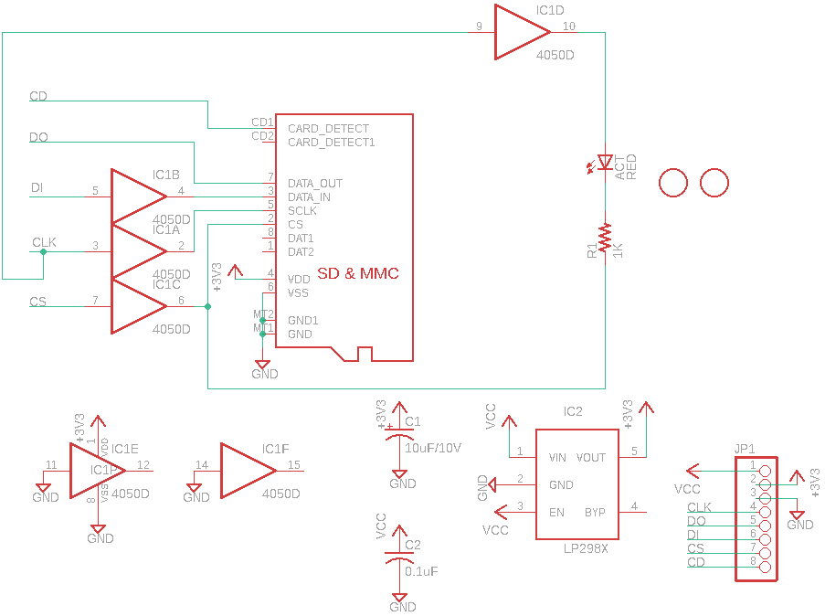](eagleSchemImage.png)
## PCB
  
[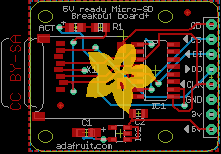](eagleImage.png)
## Interactive BOM

- Interactive BOM page: [ibom.html](https://htmlpreview.github.io/?https://github.com/oomlout/oomlout_OOMP_projects/blob/main/PROJ-ADAF-254-STAN-01/kicad/bom/ibom.html)

## OOMP Parts
  

|OOMP ID|Name|Identifier|
| :---: | :---: | :---: |
|[LEDS-0805-R-STAN-01](https://github.com/oomlout/oomlout_OOMP_parts/tree/main/LEDS-0805-R-STAN-01/)|[SMD (0805) Red LED](https://github.com/oomlout/oomlout_OOMP_parts/tree/main/LEDS-0805-R-STAN-01/)|[ACT](https://github.com/oomlout/oomlout_OOMP_parts/tree/main/LEDS-0805-R-STAN-01/)|
|CAPX-UNMATCHED-X-UNMATCHED-01||C1|
|[CAPC-0805-X-NF100-V50](https://github.com/oomlout/oomlout_OOMP_parts/tree/main/CAPC-0805-X-NF100-V50/)|[SMD (0805) 100 nF Capacitor (Ceramic) 50v](https://github.com/oomlout/oomlout_OOMP_parts/tree/main/CAPC-0805-X-NF100-V50/)|[C2](https://github.com/oomlout/oomlout_OOMP_parts/tree/main/CAPC-0805-X-NF100-V50/)|
|UNMATCHED-UNMATCHED-X-UNMATCHED-01||IC1, X1|
|VREG-SO235-X-KLP298XS-V33D||IC2|
|[HEAD-I01-X-PI08-01](https://github.com/oomlout/oomlout_OOMP_parts/tree/main/HEAD-I01-X-PI08-01/)|[2.54 mm 8 Pin Header](https://github.com/oomlout/oomlout_OOMP_parts/tree/main/HEAD-I01-X-PI08-01/)|[JP1](https://github.com/oomlout/oomlout_OOMP_parts/tree/main/HEAD-I01-X-PI08-01/)|
|[RESE-0805-X-O102-01](https://github.com/oomlout/oomlout_OOMP_parts/tree/main/RESE-0805-X-O102-01/)|[SMD (0805) 1k Ohm Resistor](https://github.com/oomlout/oomlout_OOMP_parts/tree/main/RESE-0805-X-O102-01/)|[R1](https://github.com/oomlout/oomlout_OOMP_parts/tree/main/RESE-0805-X-O102-01/)|

## Images
  
  

|bominteractivefront|bominteractiveback|kicadPcb3d|kicadPcb3dFront|kicadPcb3dBack|kicadSchem|eagleImage|eagleSchemImage|pcbdraw|pcbdrawback|
| :---: | :---: | :---: | :---: | :---: | :---: | :---: | :---: | :---: | :---: |
|[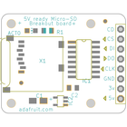](bomFront.png)|[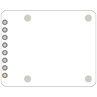](bomBack.png)|[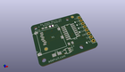](kicadPcb3d.png)|[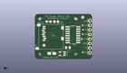](kicadPcb3dFront.png)|[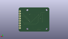](kicadPcb3dBack.png)|[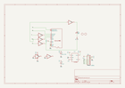](kicadSchem.png)||[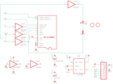](eagleSchemImage.png)|[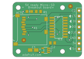](pcbdraw.png)|[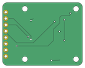](pcbdrawBack.png)|

## Tags

- hexID: PRA254
- oompType: PROJ
- oompSize: ADAF
- oompColor: 254
- oompDesc: STAN
- oompIndex: 01
- oompName: MicroSD breakout board
- sources: All source files from https://github.com/adafruit/MicroSD-breakout-board (source licence details in srcLicense.md)
- linkBuyPage: http://www.adafruit.com/products/254
- oompID: PROJ-ADAF-254-STAN-01
- oompParts: ACT,LEDS-0805-R-STAN-01
- oompParts: C1,CAPX-UNMATCHED-X-UNMATCHED-01
- oompParts: C2,CAPC-0805-X-NF100-V50
- oompParts: IC1,UNMATCHED-UNMATCHED-X-UNMATCHED-01
- oompParts: IC2,VREG-SO235-X-KLP298XS-V33D
- oompParts: JP1,HEAD-I01-X-PI08-01
- oompParts: R1,RESE-0805-X-O102-01
- oompParts: X1,UNMATCHED-UNMATCHED-X-UNMATCHED-01
- rawParts: ACT,RED,LEDCHIP-LED0805,CHIP-LED0805,LED,,
- rawParts: C1,10uF/10V,CPOL-USA/3216-18R,A/3216-18R,POLARIZED CAPACITOR, American symbol,,
- rawParts: C2,0.1uF,C-USC0805K,C0805K,CAPACITOR, American symbol,,
- rawParts: IC1,4050D,4050D,SO16,Hex non-inverting BUFFER,,
- rawParts: IC2,LP298XS,LP298XS,SOT23-5L,,,
- rawParts: JP1,,PINHD-1X8BIG,1X08-BIG,PIN HEADER,,
- rawParts: R1,1K,R-US_R0805,R0805,RESISTOR, American symbol,,
- rawParts: U$1,FIDUCIAL,FIDUCIAL,FIDUCIAL_1MM,For use by pick and place machines to calibrate the vision/machine, 1mm,,
- rawParts: U$2,FIDUCIAL,FIDUCIAL,FIDUCIAL_1MM,For use by pick and place machines to calibrate the vision/machine, 1mm,,
- rawParts: X1,MICROSD,MICROSD,MICROSD,Micro-SD / Transflash card holder with SPI pinout,,

[im]: kicadPcb3d_450.png
