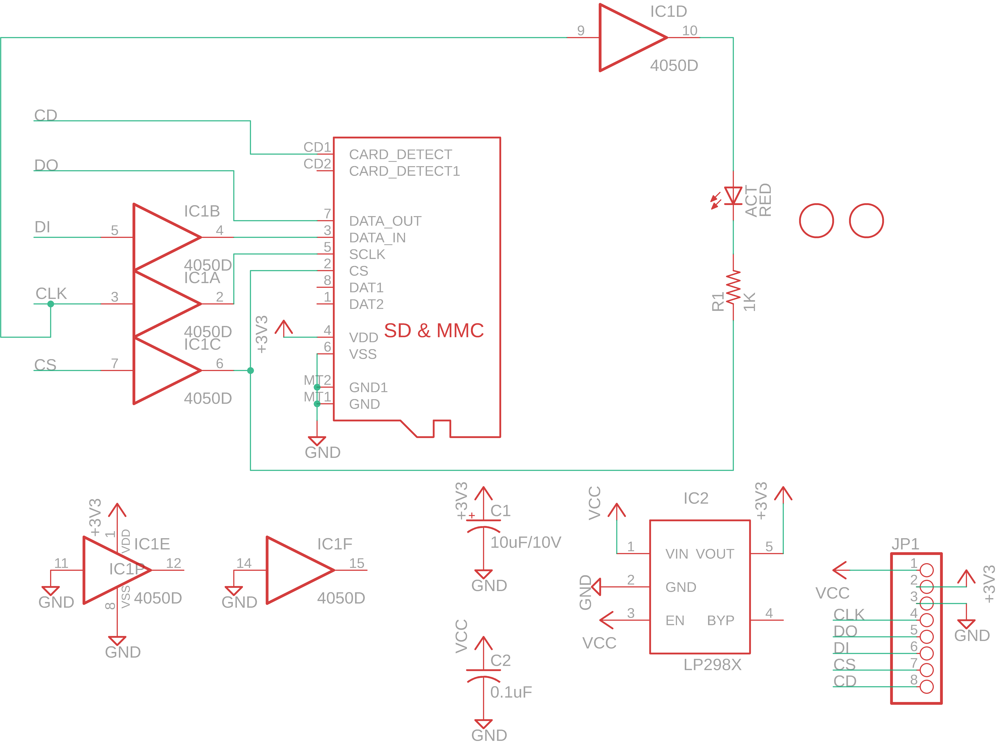
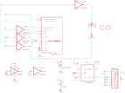

Contents
========

* [PRA254 > Adafruit](#pra254--adafruit)
	* [Schematic](#schematic)
	* [Interactive BOM](#interactive-bom)
	* [OOMP Parts](#oomp-parts)
	* [Images](#images)
	* [Tags](#tags)
  
![][im]
# PRA254 > Adafruit

- ID: PROJ-ADAF-254-STAN-01
- Hex ID: PRA254
- Name: Adafruit
- Description: Adafruit
- Long Link: [http://oom.lt/PROJ-ADAF-254-STAN-01](http://oom.lt/PROJ-ADAF-254-STAN-01)
- Short Link: [http://oom.lt/PRA254](http://oom.lt/PRA254)

## Schematic
  

## Interactive BOM

- Interactive BOM page: [ibom.html](https://htmlpreview.github.io/?https://github.com/oomlout/oomlout_OOMP_projects/blob/main/PROJ-ADAF-254-STAN-01/kicad/bom/ibom.html)

## OOMP Parts
  

|OOMP Parts|
| :---: |
|ACT,LEDS-0805-G-STAN-01,ACT,RED,LEDCHIP-LED0805,CHIP-LED0805,LED,,|
|C1,CAPX-UNMATCHED-X-UNMATCHED-01,C1,10uF/10V,CPOL-USA/3216-18R,A/3216-18R,POLARIZED CAPACITOR, American symbol,,|
|C2,CAPC-0805-X-NF100-V50,C2,0.1uF,C-USC0805K,C0805K,CAPACITOR, American symbol,,|
|IC1,UNMATCHED-UNMATCHED-X-UNMATCHED-01,IC1,4050D,4050D,SO16,Hex non-inverting BUFFER,,|
|IC2,VREG-SO235-X-KLP298XS-V33D,IC2,LP298XS,LP298XS,SOT23-5L,,,|
|JP1,HEAD-I01-X-PI08-01,JP1,,PINHD-1X8BIG,1X08-BIG,PIN HEADER,,|
|R1,RESE-0805-X-O102-01,R1,1K,R-US_R0805,R0805,RESISTOR, American symbol,,|
|X1,UNMATCHED-UNMATCHED-X-UNMATCHED-01,U$1,FIDUCIAL,FIDUCIAL,FIDUCIAL_1MM,For use by pick and place machines to calibrate the vision/machine, 1mm,,|

## Images
  
  

|kicadPcb3d|kicadPcb3dFront|kicadPcb3dBack|eagleImage|eagleSchemImage|
| :---: | :---: | :---: | :---: | :---: |
||||||

## Tags

- hexID: PRA254
- oompType: PROJ
- oompSize: ADAF
- oompColor: 254
- oompDesc: STAN
- oompIndex: 01
- oompName: MicroSD breakout board
- sources: All source files from https://github.com/adafruit/MicroSD-breakout-board (source licence details in srcLicense.md)
- linkBuyPage: http://www.adafruit.com/products/254
- oompID: PROJ-ADAF-254-STAN-01
- oompParts: ACT,LEDS-0805-G-STAN-01
- oompParts: C1,CAPX-UNMATCHED-X-UNMATCHED-01
- oompParts: C2,CAPC-0805-X-NF100-V50
- oompParts: IC1,UNMATCHED-UNMATCHED-X-UNMATCHED-01
- oompParts: IC2,VREG-SO235-X-KLP298XS-V33D
- oompParts: JP1,HEAD-I01-X-PI08-01
- oompParts: R1,RESE-0805-X-O102-01
- oompParts: X1,UNMATCHED-UNMATCHED-X-UNMATCHED-01
- rawParts: ACT,RED,LEDCHIP-LED0805,CHIP-LED0805,LED,,
- rawParts: C1,10uF/10V,CPOL-USA/3216-18R,A/3216-18R,POLARIZED CAPACITOR, American symbol,,
- rawParts: C2,0.1uF,C-USC0805K,C0805K,CAPACITOR, American symbol,,
- rawParts: IC1,4050D,4050D,SO16,Hex non-inverting BUFFER,,
- rawParts: IC2,LP298XS,LP298XS,SOT23-5L,,,
- rawParts: JP1,,PINHD-1X8BIG,1X08-BIG,PIN HEADER,,
- rawParts: R1,1K,R-US_R0805,R0805,RESISTOR, American symbol,,
- rawParts: U$1,FIDUCIAL,FIDUCIAL,FIDUCIAL_1MM,For use by pick and place machines to calibrate the vision/machine, 1mm,,
- rawParts: U$2,FIDUCIAL,FIDUCIAL,FIDUCIAL_1MM,For use by pick and place machines to calibrate the vision/machine, 1mm,,
- rawParts: X1,MICROSD,MICROSD,MICROSD,Micro-SD / Transflash card holder with SPI pinout,,

[im]: kicadPcb3d_450.png
