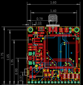
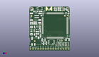
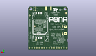
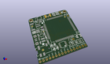

Contents
========

* [PROJ-ADAF-2542-STAN-01>Adafruit FONA 808 Breakout PCB](#proj-adaf-2542-stan-01adafruit-fona-808-breakout-pcb)
	* [Images](#images)
	* [Interactive BOM](#interactive-bom)
	* [OOMP Parts](#oomp-parts)
	* [Tags](#tags)
  
![][im]
# PROJ-ADAF-2542-STAN-01>Adafruit FONA 808 Breakout PCB

- ID: PROJ-ADAF-2542-STAN-01
- Hex ID: PRA2542
- Name: Adafruit FONA 808 Breakout PCB
- Description: 

## Images
  
  

|eagleImage|kicadPcb3dFront|kicadPcb3dBack|kicadPcb3d|
| :---: | :---: | :---: | :---: |
|||||

## Interactive BOM

- Interactive BOM page: [ibom.html](kicad/bom/ibom.html)

## OOMP Parts
  

|OOMP Parts|
| :---: |
|UNMATCHED-UNMATCHED-X-UNMATCHED-01, ADC1, 32.512, 9.906, 0,ADC1, 1X01-CLEANBIG, adafruit, (1.28, 0.39), R0|
|CAPC-0805-X-UNMATCHED-01, C1, 8.128, 19.049999999999997, 0,C1, 10uF, 0805-NO, microbuilder, (0.32, 0.75), R0|
|CAPC-0805-X-UNMATCHED-01, C5, 11.541000032, 39.51199997, 0,C5, 10pF, 0805-NO, microbuilder, (0.45437008, 1.55559055), R0|
|CAPE-0805-X-UNMATCHED-01, C6, 10.875000093999999, 37.417000095999995, 0,C6, 33pF, 0805-NO, microbuilder, (0.42814961, 1.47311024), R0|
|CAPE-1210-X-UNMATCHED-01, C7, 10.540999999999999, 29.463999999999995, 270,C7, 100uF, C1210, rcl, (0.415, 1.16), R270|
|CAPC-0805-X-UNMATCHED-01, C9, 8.128, 16.764, 180,C9, 10uF, 0805-NO, microbuilder, (0.32, 0.66), R180|
|CAPC-0805-X-UNMATCHED-01, C11, 11.43, 14.731999999999998, 90,C11, 10uF, 0805-NO, microbuilder, (0.45, 0.58), R90|
|CAPE-UNMATCHED-X-UNMATCHED-01, C14, 31.876999999999995, 6.35, 270,C14, 33pF, RESPACK_4X0603, microbuilder, (1.255, 0.25), R270|
|CAPC-UNMATCHED-X-UNMATCHED-01, C15, 28.701999999999995, 6.35, 270,C15, 10pF, RESPACK_4X0603, microbuilder, (1.13, 0.25), R270|
|CAPE-UNMATCHED-X-UNMATCHED-01, C16, 35.306, 6.35, 90,C16, 33pF, RESPACK_4X0603, microbuilder, (1.39, 0.25), R90|
|CAPC-UNMATCHED-X-UNMATCHED-01, C17, 38.480999999999995, 6.35, 90,C17, 10pF, RESPACK_4X0603, microbuilder, (1.515, 0.25), R90|
|UNMATCHED-UNMATCHED-X-UNMATCHED-01, CHRG, 2.413999998, 26.807999978, 270,CHRG, ORANGE, CHIPLED_0805_NOOUTLINE, microbuilder, (0.09503937, 1.05543307), R270|
|UNMATCHED-UNMATCHED-X-UNMATCHED-01, D1, 6.731, 39.624, 180,D1, MMSZ5231BT1G, SOD-123, microbuilder, (0.265, 1.56), R180|
|UNMATCHED-UNMATCHED-X-UNMATCHED-01, D2, 29.209999999999997, 10.033, 270,D2, SMF05C, SOT363, microbuilder, (1.15, 0.395), R270|
|UNMATCHED-UNMATCHED-X-UNMATCHED-01, D3, 34.925, 41.783, 270,D3, 1N4148, SOD-323, microbuilder, (1.375, 1.645), R270|
|UNMATCHED-UNMATCHED-X-UNMATCHED-01, D4, 14.477999999999998, 7.238999999999999, 90,D4, 1N4148, SOD-323, microbuilder, (0.57, 0.285), R90|
|UNMATCHED-UNMATCHED-X-UNMATCHED-01, D5, 17.145, 7.365999999999999, 90,D5, 1N4148, SOD-323, microbuilder, (0.675, 0.29), R90|
|UNMATCHED-UNMATCHED-X-UNMATCHED-01, D6, 13.334999999999999, 10.668, 90,D6, 1N4148, SOD-323, microbuilder, (0.525, 0.42), R90|
|UNMATCHED-UNMATCHED-X-UNMATCHED-01, D7, 15.875, 10.668, 90,D7, 1N4148, SOD-323, microbuilder, (0.625, 0.42), R90|
|UNMATCHED-UNMATCHED-X-UNMATCHED-01, DONE, 2.418999988, 28.656000092, 90,DONE, GREEN, CHIPLED_0805_NOOUTLINE, microbuilder, (0.09523622, 1.12818898), R90|
|UNMATCHED-UNMATCHED-X-UNMATCHED-01, IC1, 22.224999999999998, 8.382, 90,IC1, 74VHCT125PW, TSSOP14, 74xx-us, (0.875, 0.33), R90|
|<table><tr><td></td><td> JP3</td><td>[HEAD-I01-X-PI02-01 2.54 mm 2 Pin Header](https://github.com/oomlout/oomlout_OOMP_parts/tree/main/HEAD-I01-X-PI02-01/)</td><td>[H02](https://github.com/oomlout/oomlout_OOMP_parts/tree/main/HEAD-I01-X-PI02-01/)</td></tr></table>|
|<table><tr><td></td><td> JP10</td><td>[HEAD-I01-X-PI16-01 2.54 mm 16 Pin Header](https://github.com/oomlout/oomlout_OOMP_parts/tree/main/HEAD-I01-X-PI16-01/)</td><td>[H16](https://github.com/oomlout/oomlout_OOMP_parts/tree/main/HEAD-I01-X-PI16-01/)</td></tr></table>|
|UNMATCHED-UNMATCHED-X-UNMATCHED-01, NETSTAT, 26.034999999999997, 42.545, 270,NETSTAT, RED, CHIPLED_0805_NOOUTLINE, microbuilder, (1.025, 1.675), R270|
|UNMATCHED-UNMATCHED-X-UNMATCHED-01, PWM, 39.116, 35.433, 0,PWM, 1X01-CLEANBIG, adafruit, (1.54, 1.395), R0|
|UNMATCHED-UNMATCHED-X-UNMATCHED-01, PWRSTAT, 30.099, 42.545, 270,PWRSTAT, BLUE, CHIPLED_0805_NOOUTLINE, microbuilder, (1.185, 1.675), R270|
|UNMATCHED-UNMATCHED-X-UNMATCHED-01, Q1, 38.099999999999994, 38.227, 90,Q1, DTC143ZUAT106, SC59-BEC, transistor, (1.5, 1.505), R90|
|RESE-0805-X-UNMATCHED-01, R1, 5.968999999999999, 26.924, 0,R1, 470, 0805-NO, microbuilder, (0.235, 1.06), R0|
|RESE-0805-X-UNMATCHED-01, R2, 5.9849999679999994, 28.701999999999995, 0,R2, 1K, 0805-NO, microbuilder, (0.23562992, 1.13), R0|
|RESE-0805-X-UNMATCHED-01, R3, 11.049, 19.812, 270,R3, 2K, 0805-NO, microbuilder, (0.435, 0.78), R270|
|RESE-0805-X-UNMATCHED-01, R4, 30.099, 40.894, 0,R4, 1K, 0805-NO, microbuilder, (1.185, 1.61), R0|
|RESE-0805-X-UNMATCHED-01, R5, 26.162, 40.894, 0,R5, 1K, 0805-NO, microbuilder, (1.03, 1.61), R0|
|<table><tr><td></td><td> R6</td><td>[RESE-0805-X-O103-01 SMD (0805) 10k Ohm Resistor](https://github.com/oomlout/oomlout_OOMP_parts/tree/main/RESE-0805-X-O103-01/)</td><td>[R85103](https://github.com/oomlout/oomlout_OOMP_parts/tree/main/RESE-0805-X-O103-01/)</td></tr></table>|
|UNMATCHED-UNMATCHED-X-UNMATCHED-01, SW1, 10.795, 42.545, 0,SW1, KMR2, BTN_KMR2_4.6X2.8, microbuilder, (0.425, 1.675), R0|
|UNMATCHED-UNMATCHED-X-UNMATCHED-01, U2, 8.128, 22.605999999999998, 180,U2, MCP73831T-2ACI/OT, SOT23-5, microbuilder, (0.32, 0.89), R180|
|UNMATCHED-UNMATCHED-X-UNMATCHED-01, U3, 25.780999999999995, 25.273, 0,U3, SIM808, SIM900_SMT, microbuilder, (1.015, 0.995), R0|
|UNMATCHED-UNMATCHED-X-UNMATCHED-01, X1, 19.812, 44.323, 270,X1, uFL, SMA_EDGELAUNCH_UFL, microbuilder, (0.78, 1.745), R270|
|UNMATCHED-UNMATCHED-X-UNMATCHED-01, X2, 4.3180000000000005, 20.066, 270,X2, MicroB, 4UCONN_20329, microbuilder, (0.17, 0.79), R270|
|UNMATCHED-UNMATCHED-X-UNMATCHED-01, X3, 38.354, 10.921999999999999, 90,X3, uFL, U.FL, microbuilder, (1.51, 0.43), R90|
|UNMATCHED-UNMATCHED-X-UNMATCHED-01, X4, 0.127, 9.398, 0,X4, 4UCONN_18510, 4UCONN_18510, microbuilder, (0.005, 0.37), R0|
|UNMATCHED-UNMATCHED-X-UNMATCHED-01, X6, 28.448, 24.764999999999997, M270,X6, SIM_LOCKAMPHENOL, C707_10M006_512_2, microbuilder, (1.12, 0.975), MR270|

## Tags

- hexID: PRA2542
- oompType: PROJ
- oompSize: ADAF
- oompColor: 2542
- oompDesc: STAN
- oompIndex: 01
- oompName: Adafruit FONA 808 Breakout PCB
- sources: All source files from https://github.com/adafruit/Adafruit-FONA-808-Breakout-PCB (source licence details in srcLicense.md)
- linkBuyPage: http://www.adafruit.com/products/2542
- oompPart: UNMATCHED-UNMATCHED-X-UNMATCHED-01, ADC1, 32.512, 9.906, 0
- oompPart: CAPC-0805-X-UNMATCHED-01, C1, 8.128, 19.049999999999997, 0
- oompPart: CAPC-0805-X-UNMATCHED-01, C5, 11.541000032, 39.51199997, 0
- oompPart: CAPE-0805-X-UNMATCHED-01, C6, 10.875000093999999, 37.417000095999995, 0
- oompPart: CAPE-1210-X-UNMATCHED-01, C7, 10.540999999999999, 29.463999999999995, 270
- oompPart: CAPC-0805-X-UNMATCHED-01, C9, 8.128, 16.764, 180
- oompPart: CAPC-0805-X-UNMATCHED-01, C11, 11.43, 14.731999999999998, 90
- oompPart: CAPE-UNMATCHED-X-UNMATCHED-01, C14, 31.876999999999995, 6.35, 270
- oompPart: CAPC-UNMATCHED-X-UNMATCHED-01, C15, 28.701999999999995, 6.35, 270
- oompPart: CAPE-UNMATCHED-X-UNMATCHED-01, C16, 35.306, 6.35, 90
- oompPart: CAPC-UNMATCHED-X-UNMATCHED-01, C17, 38.480999999999995, 6.35, 90
- oompPart: UNMATCHED-UNMATCHED-X-UNMATCHED-01, CHRG, 2.413999998, 26.807999978, 270
- oompPart: SKIP-UNMATCHED-X-UNMATCHED-01, CN2, 3.8099999999999996, 34.163, 90
- oompPart: UNMATCHED-UNMATCHED-X-UNMATCHED-01, D1, 6.731, 39.624, 180
- oompPart: UNMATCHED-UNMATCHED-X-UNMATCHED-01, D2, 29.209999999999997, 10.033, 270
- oompPart: UNMATCHED-UNMATCHED-X-UNMATCHED-01, D3, 34.925, 41.783, 270
- oompPart: UNMATCHED-UNMATCHED-X-UNMATCHED-01, D4, 14.477999999999998, 7.238999999999999, 90
- oompPart: UNMATCHED-UNMATCHED-X-UNMATCHED-01, D5, 17.145, 7.365999999999999, 90
- oompPart: UNMATCHED-UNMATCHED-X-UNMATCHED-01, D6, 13.334999999999999, 10.668, 90
- oompPart: UNMATCHED-UNMATCHED-X-UNMATCHED-01, D7, 15.875, 10.668, 90
- oompPart: UNMATCHED-UNMATCHED-X-UNMATCHED-01, DONE, 2.418999988, 28.656000092, 90
- oompPart: SKIP-UNMATCHED-X-UNMATCHED-01, FID1, 35.687, 35.178999999999995, 0
- oompPart: SKIP-UNMATCHED-X-UNMATCHED-01, FID2, 2.2859999999999996, 34.925, 0
- oompPart: SKIP-UNMATCHED-X-UNMATCHED-01, FID3, 5.588, 9.524999999999999, 0
- oompPart: SKIP-UNMATCHED-X-UNMATCHED-01, FID4, 1.778, 37.592, M0
- oompPart: SKIP-UNMATCHED-X-UNMATCHED-01, FID5, 34.036, 24.13, M0
- oompPart: UNMATCHED-UNMATCHED-X-UNMATCHED-01, IC1, 22.224999999999998, 8.382, 90
- oompPart: HEAD-I01-X-PI02-01, JP3, 33.147, 41.91, 90
- oompPart: HEAD-I01-X-PI16-01, JP10, 20.32, 1.651, 0
- oompPart: UNMATCHED-UNMATCHED-X-UNMATCHED-01, NETSTAT, 26.034999999999997, 42.545, 270
- oompPart: UNMATCHED-UNMATCHED-X-UNMATCHED-01, PWM, 39.116, 35.433, 0
- oompPart: UNMATCHED-UNMATCHED-X-UNMATCHED-01, PWRSTAT, 30.099, 42.545, 270
- oompPart: UNMATCHED-UNMATCHED-X-UNMATCHED-01, Q1, 38.099999999999994, 38.227, 90
- oompPart: RESE-0805-X-UNMATCHED-01, R1, 5.968999999999999, 26.924, 0
- oompPart: RESE-0805-X-UNMATCHED-01, R2, 5.9849999679999994, 28.701999999999995, 0
- oompPart: RESE-0805-X-UNMATCHED-01, R3, 11.049, 19.812, 270
- oompPart: RESE-0805-X-UNMATCHED-01, R4, 30.099, 40.894, 0
- oompPart: RESE-0805-X-UNMATCHED-01, R5, 26.162, 40.894, 0
- oompPart: RESE-0805-X-O103-01, R6, 10.795, 23.368, 90
- oompPart: UNMATCHED-UNMATCHED-X-UNMATCHED-01, SW1, 10.795, 42.545, 0
- oompPart: SKIP-UNMATCHED-X-UNMATCHED-01, TP1, 10.795, 25.780999999999995, 0
- oompPart: SKIP-UNMATCHED-X-UNMATCHED-01, U$33, 38.099999999999994, 41.91, 90
- oompPart: SKIP-UNMATCHED-X-UNMATCHED-01, U$34, 2.54, 41.91, 90
- oompPart: UNMATCHED-UNMATCHED-X-UNMATCHED-01, U2, 8.128, 22.605999999999998, 180
- oompPart: UNMATCHED-UNMATCHED-X-UNMATCHED-01, U3, 25.780999999999995, 25.273, 0
- oompPart: UNMATCHED-UNMATCHED-X-UNMATCHED-01, X1, 19.812, 44.323, 270
- oompPart: UNMATCHED-UNMATCHED-X-UNMATCHED-01, X2, 4.3180000000000005, 20.066, 270
- oompPart: UNMATCHED-UNMATCHED-X-UNMATCHED-01, X3, 38.354, 10.921999999999999, 90
- oompPart: UNMATCHED-UNMATCHED-X-UNMATCHED-01, X4, 0.127, 9.398, 0
- oompPart: UNMATCHED-UNMATCHED-X-UNMATCHED-01, X6, 28.448, 24.764999999999997, M270
- rawPart: ADC1, 1X01-CLEANBIG, adafruit, (1.28, 0.39), R0
- rawPart: C1, 10uF, 0805-NO, microbuilder, (0.32, 0.75), R0
- rawPart: C5, 10pF, 0805-NO, microbuilder, (0.45437008, 1.55559055), R0
- rawPart: C6, 33pF, 0805-NO, microbuilder, (0.42814961, 1.47311024), R0
- rawPart: C7, 100uF, C1210, rcl, (0.415, 1.16), R270
- rawPart: C9, 10uF, 0805-NO, microbuilder, (0.32, 0.66), R180
- rawPart: C11, 10uF, 0805-NO, microbuilder, (0.45, 0.58), R90
- rawPart: C14, 33pF, RESPACK_4X0603, microbuilder, (1.255, 0.25), R270
- rawPart: C15, 10pF, RESPACK_4X0603, microbuilder, (1.13, 0.25), R270
- rawPart: C16, 33pF, RESPACK_4X0603, microbuilder, (1.39, 0.25), R90
- rawPart: C17, 10pF, RESPACK_4X0603, microbuilder, (1.515, 0.25), R90
- rawPart: CHRG, ORANGE, CHIPLED_0805_NOOUTLINE, microbuilder, (0.09503937, 1.05543307), R270
- rawPart: CN2, JSTPH, JSTPH2, microbuilder, (0.15, 1.345), R90
- rawPart: D1, MMSZ5231BT1G, SOD-123, microbuilder, (0.265, 1.56), R180
- rawPart: D2, SMF05C, SOT363, microbuilder, (1.15, 0.395), R270
- rawPart: D3, 1N4148, SOD-323, microbuilder, (1.375, 1.645), R270
- rawPart: D4, 1N4148, SOD-323, microbuilder, (0.57, 0.285), R90
- rawPart: D5, 1N4148, SOD-323, microbuilder, (0.675, 0.29), R90
- rawPart: D6, 1N4148, SOD-323, microbuilder, (0.525, 0.42), R90
- rawPart: D7, 1N4148, SOD-323, microbuilder, (0.625, 0.42), R90
- rawPart: DONE, GREEN, CHIPLED_0805_NOOUTLINE, microbuilder, (0.09523622, 1.12818898), R90
- rawPart: FID1, FIDUCIAL, FIDUCIAL_1MM, microbuilder, (1.405, 1.385), R0
- rawPart: FID2, FIDUCIAL, FIDUCIAL_1MM, microbuilder, (0.09, 1.375), R0
- rawPart: FID3, FIDUCIAL, FIDUCIAL_1MM, microbuilder, (0.22, 0.375), R0
- rawPart: FID4, FIDUCIAL, FIDUCIAL_1MM, microbuilder, (0.07, 1.48), MR0
- rawPart: FID5, FIDUCIAL, FIDUCIAL_1MM, microbuilder, (1.34, 0.95), MR0
- rawPart: IC1, 74VHCT125PW, TSSOP14, 74xx-us, (0.875, 0.33), R90
- rawPart: JP3, BUZZ, 1X02_ROUND, microbuilder, (1.305, 1.65), R90
- rawPart: JP10, 1X16_ROUND, microbuilder, (0.8, 0.065), R0
- rawPart: NETSTAT, RED, CHIPLED_0805_NOOUTLINE, microbuilder, (1.025, 1.675), R270
- rawPart: PWM, 1X01-CLEANBIG, adafruit, (1.54, 1.395), R0
- rawPart: PWRSTAT, BLUE, CHIPLED_0805_NOOUTLINE, microbuilder, (1.185, 1.675), R270
- rawPart: Q1, DTC143ZUAT106, SC59-BEC, transistor, (1.5, 1.505), R90
- rawPart: R1, 470, 0805-NO, microbuilder, (0.235, 1.06), R0
- rawPart: R2, 1K, 0805-NO, microbuilder, (0.23562992, 1.13), R0
- rawPart: R3, 2K, 0805-NO, microbuilder, (0.435, 0.78), R270
- rawPart: R4, 1K, 0805-NO, microbuilder, (1.185, 1.61), R0
- rawPart: R5, 1K, 0805-NO, microbuilder, (1.03, 1.61), R0
- rawPart: R6, 10K, 0805-NO, microbuilder, (0.425, 0.92), R90
- rawPart: SW1, KMR2, BTN_KMR2_4.6X2.8, microbuilder, (0.425, 1.675), R0
- rawPart: TP1, TPTP11R, TP11R, testpad, (0.425, 1.015), R0
- rawPart: U$33, MOUNTINGHOLE2.5, MOUNTINGHOLE_2.5_PLATED, microbuilder, (1.5, 1.65), R90
- rawPart: U$34, MOUNTINGHOLE2.5, MOUNTINGHOLE_2.5_PLATED, microbuilder, (0.1, 1.65), R90
- rawPart: U2, MCP73831T-2ACI/OT, SOT23-5, microbuilder, (0.32, 0.89), R180
- rawPart: U3, SIM808, SIM900_SMT, microbuilder, (1.015, 0.995), R0
- rawPart: X1, uFL, SMA_EDGELAUNCH_UFL, microbuilder, (0.78, 1.745), R270
- rawPart: X2, MicroB, 4UCONN_20329, microbuilder, (0.17, 0.79), R270
- rawPart: X3, uFL, U.FL, microbuilder, (1.51, 0.43), R90
- rawPart: X4, 4UCONN_18510, 4UCONN_18510, microbuilder, (0.005, 0.37), R0
- rawPart: X6, SIM_LOCKAMPHENOL, C707_10M006_512_2, microbuilder, (1.12, 0.975), MR270
- oompID: PROJ-ADAF-2542-STAN-01

[im]: kicadPcb3d_450.png
