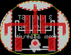

Contents
========

* [PROJ-ADAF-2566-STAN-01>Adafruit Flora Sewable 3 Pin JST Wiring Adapter PCB](#proj-adaf-2566-stan-01adafruit-flora-sewable-3-pin-jst-wiring-adapter-pcb)
	* [Images](#images)
	* [OOMP Parts](#oomp-parts)
	* [Tags](#tags)
  
![][im]
# PROJ-ADAF-2566-STAN-01>Adafruit Flora Sewable 3 Pin JST Wiring Adapter PCB

- ID: PROJ-ADAF-2566-STAN-01
- Hex ID: PRA2566
- Name: Adafruit Flora Sewable 3 Pin JST Wiring Adapter PCB
- Description: 

## Images
  
  

|eagleImage|kicadPcb3dFront|kicadPcb3dBack|kicadPcb3d|
| :---: | :---: | :---: | :---: |
|||||

## OOMP Parts
  

|OOMP Parts|
| :---: |

## Tags

- hexID: PRA2566
- oompType: PROJ
- oompSize: ADAF
- oompColor: 2566
- oompDesc: STAN
- oompIndex: 01
- oompName: Adafruit Flora Sewable 3 Pin JST Wiring Adapter PCB
- sources: All source files from https://github.com/adafruit/Adafruit-Flora-Sewable-3-Pin-JST-Wiring-Adapter-PCB (source licence details in srcLicense.md)
- linkBuyPage: http://www.adafruit.com/products/2566
- oompPart: SKIP-UNMATCHED-X-UNMATCHED-01, CN2, 0.0, 0.0, 180
- oompPart: SKIP-UNMATCHED-X-UNMATCHED-01, U$2, 0.0, -2.2859999999999996, 0
- rawPart: CN2, JSTPH3, adafruit, (0, 0), R180
- rawPart: U$2, FIDUCIAL, FIDUCIAL_1MM, adafruit, (0, -0.09), R0
- oompID: PROJ-ADAF-2566-STAN-01

[im]: kicadPcb3d_450.png
