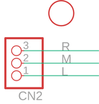

Contents
========

* [PRA2566 > Adafruit](#pra2566--adafruit)
	* [Images](#images)
	* [Tags](#tags)
  
![][im]
# PRA2566 > Adafruit

- ID: PROJ-ADAF-2566-STAN-01
- Hex ID: PRA2566
- Name: Adafruit
- Description: Adafruit

## Images
  
  

|kicadPcb3d|kicadPcb3dFront|kicadPcb3dBack|eagleImage|eagleSchemImage|
| :---: | :---: | :---: | :---: | :---: |
||||||

## Tags

- hexID: PRA2566
- oompType: PROJ
- oompSize: ADAF
- oompColor: 2566
- oompDesc: STAN
- oompIndex: 01
- oompName: Adafruit Flora Sewable 3 Pin JST Wiring Adapter PCB
- sources: All source files from https://github.com/adafruit/Adafruit-Flora-Sewable-3-Pin-JST-Wiring-Adapter-PCB (source licence details in srcLicense.md)
- linkBuyPage: http://www.adafruit.com/products/2566
- oompID: PROJ-ADAF-2566-STAN-01
- oompParts: CN2,UNMATCHED-UNMATCHED-UNMATCHED-UNMATCHED-UNMATCHED
- rawParts: CN2,,JST_3PIN,JSTPH3,,,
- rawParts: U$2,FIDUCIAL,FIDUCIAL,FIDUCIAL_1MM,For use by pick and place machines to calibrate the vision/machine, 1mm,,

[im]: kicadPcb3d_450.png
