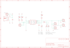

Contents
========

* [PRA259 > Adafruit_MCP73833_PCB](#pra259--adafruit_mcp73833_pcb)
	* [Schematic](#schematic)
	* [PCB](#pcb)
	* [OOMP Parts](#oomp-parts)
	* [Images](#images)
	* [Tags](#tags)
  
![][im]
# PRA259 > Adafruit_MCP73833_PCB

- ID: PROJ-ADAF-259-STAN-01
- Hex ID: PRA259
- Name: Adafruit
- Description: Adafruit
- Long Link: [http://oom.lt/PROJ-ADAF-259-STAN-01](http://oom.lt/PROJ-ADAF-259-STAN-01)
- Short Link: [http://oom.lt/PRA259](http://oom.lt/PRA259)

## Schematic
  

## PCB
  

## OOMP Parts
  

|OOMP Parts|
| :---: |
|[C1 CAPC-0805-X-UF10-V10 SMD (0805) 10 uF Capacitor (Ceramic) 10v](https://github.com/oomlout/oomlout_OOMP_parts/tree/main/CAPC-0805-X-UF10-V10/)|
|[C2 CAPC-0805-X-UF10-V10 SMD (0805) 10 uF Capacitor (Ceramic) 10v](https://github.com/oomlout/oomlout_OOMP_parts/tree/main/CAPC-0805-X-UF10-V10/)|
|CN1 CN1,UNMATCHED-UNMATCHED-X-UNMATCHED-01|
|CN2 CN2,UNMATCHED-UNMATCHED-X-UNMATCHED-01|
|CN3 CN3,UNMATCHED-UNMATCHED-X-UNMATCHED-01|
|[JP1 HEAD-I01-X-PI02-01 2.54 mm 2 Pin Header](https://github.com/oomlout/oomlout_OOMP_parts/tree/main/HEAD-I01-X-PI02-01/)|
|[JP3 HEAD-I01-X-PI02-01 2.54 mm 2 Pin Header](https://github.com/oomlout/oomlout_OOMP_parts/tree/main/HEAD-I01-X-PI02-01/)|
|[JP5 HEAD-I01-X-PI02-01 2.54 mm 2 Pin Header](https://github.com/oomlout/oomlout_OOMP_parts/tree/main/HEAD-I01-X-PI02-01/)|
|[JP6 HEAD-I01-X-PI02-01 2.54 mm 2 Pin Header](https://github.com/oomlout/oomlout_OOMP_parts/tree/main/HEAD-I01-X-PI02-01/)|
|[LED1 LEDS-0805-G-STAN-01 SMD (0805) Green LED](https://github.com/oomlout/oomlout_OOMP_parts/tree/main/LEDS-0805-G-STAN-01/)|
|[LED2 LEDS-0805-G-STAN-01 SMD (0805) Green LED](https://github.com/oomlout/oomlout_OOMP_parts/tree/main/LEDS-0805-G-STAN-01/)|
|[LED3 LEDS-0805-G-STAN-01 SMD (0805) Green LED](https://github.com/oomlout/oomlout_OOMP_parts/tree/main/LEDS-0805-G-STAN-01/)|
|[R1 RESE-0805-X-O151-01 SMD (0805) 150 Ohm Resistor](https://github.com/oomlout/oomlout_OOMP_parts/tree/main/RESE-0805-X-O151-01/)|
|[R2 RESE-0805-X-O151-01 SMD (0805) 150 Ohm Resistor](https://github.com/oomlout/oomlout_OOMP_parts/tree/main/RESE-0805-X-O151-01/)|
|[R3 RESE-0805-X-O151-01 SMD (0805) 150 Ohm Resistor](https://github.com/oomlout/oomlout_OOMP_parts/tree/main/RESE-0805-X-O151-01/)|
|R4 R4,RESE-0805-X-UNMATCHED-01|
|R7 R7,RESE-0805-X-UNMATCHED-01|
|RT1 RT1,UNMATCHED-0805-X-UNMATCHED-01|
|RT2 RT2,UNMATCHED-0805-X-UNMATCHED-01|
|U1 U1,UNMATCHED-UNMATCHED-X-UNMATCHED-01|

## Images
  
  

|kicadPcb3d|kicadPcb3dFront|kicadPcb3dBack|eagleImage|eagleSchemImage|
| :---: | :---: | :---: | :---: | :---: |
||||||

## Tags

- hexID: PRA259
- oompType: PROJ
- oompSize: ADAF
- oompColor: 259
- oompDesc: STAN
- oompIndex: 01
- oompName: Adafruit_MCP73833_PCB
- sources: All source files from https://github.com/adafruit/Adafruit_MCP73833_PCB (source licence details in srcLicense.md)
- linkBuyPage: http://www.adafruit.com/products/259
- oompID: PROJ-ADAF-259-STAN-01
- oompParts: C1,CAPC-0805-X-UF10-V10
- oompParts: C2,CAPC-0805-X-UF10-V10
- oompParts: CN1,UNMATCHED-UNMATCHED-X-UNMATCHED-01
- oompParts: CN2,UNMATCHED-UNMATCHED-X-UNMATCHED-01
- oompParts: CN3,UNMATCHED-UNMATCHED-X-UNMATCHED-01
- oompParts: JP1,HEAD-I01-X-PI02-01
- oompParts: JP3,HEAD-I01-X-PI02-01
- oompParts: JP5,HEAD-I01-X-PI02-01
- oompParts: JP6,HEAD-I01-X-PI02-01
- oompParts: LED1,LEDS-0805-G-STAN-01
- oompParts: LED2,LEDS-0805-G-STAN-01
- oompParts: LED3,LEDS-0805-G-STAN-01
- oompParts: R1,RESE-0805-X-O151-01
- oompParts: R2,RESE-0805-X-O151-01
- oompParts: R3,RESE-0805-X-O151-01
- oompParts: R4,RESE-0805-X-UNMATCHED-01
- oompParts: R7,RESE-0805-X-UNMATCHED-01
- oompParts: RT1,UNMATCHED-0805-X-UNMATCHED-01
- oompParts: RT2,UNMATCHED-0805-X-UNMATCHED-01
- oompParts: U1,UNMATCHED-UNMATCHED-X-UNMATCHED-01
- rawParts: C1,10uF,CAP_CERAMIC0805,0805,Ceramic Capacitors,,
- rawParts: C2,10uF,CAP_CERAMIC0805,0805,Ceramic Capacitors,,
- rawParts: CN1,USB,USBMINIBLARGE,USB-MINIB_LARGER,USB Connectors,,
- rawParts: CN2,BATT_IN_JST,JST_2PIN,JSTPH2,JST 2-Pin Right-Angle Connector,,
- rawParts: CN3,LOAD_JST,JST_2PIN,JSTPH2,JST 2-Pin Right-Angle Connector,,
- rawParts: JP1,PWR_IN_0.1,HEADER-1X2,1X02_OVAL,PIN HEADER,,
- rawParts: JP2,FIDUCIAL1.5X3,FIDUCIAL1X2.5,FIDUCIAL-1X2.5,Fiducial Alignment Points,,
- rawParts: JP3,LOAD_0.1,HEADER-1X2,1X02_OVAL,PIN HEADER,,
- rawParts: JP4,FIDUCIAL1.5X3,FIDUCIAL1X2.5,FIDUCIAL-1X2.5,Fiducial Alignment Points,,
- rawParts: JP5,BATT_IN_0.1,HEADER-1X2,1X02_OVAL,PIN HEADER,,
- rawParts: JP6,STAT,HEADER-1X2,1X02_OVAL,PIN HEADER,,
- rawParts: LED1,STAT1-ORANGE,LED0805,CHIPLED_0805,LED,,
- rawParts: LED2,STAT2-GREEN,LED0805,CHIPLED_0805,LED,,
- rawParts: LED3,Power-RED,LED0805,CHIPLED_0805,LED,,
- rawParts: R1,150,RESISTOR0805,0805,Resistors,,
- rawParts: R2,150,RESISTOR0805,0805,Resistors,,
- rawParts: R3,150,RESISTOR0805,0805,Resistors,,
- rawParts: R4,PROG,RESISTOR_DUAL,0805-THM,Flip Flop resistor,,
- rawParts: R7,10K/THERM,R-US_FLIPFLOP,0805-THM,RESISTOR, American symbol,,
- rawParts: RT1,1K,R-US_R0805,R0805,RESISTOR, American symbol,,
- rawParts: RT2,150K,R-US_R0805,R0805,RESISTOR, American symbol,,
- rawParts: U$11,MOUNTINGHOLE2.0,MOUNTINGHOLE2.0,MOUNTINGHOLE_2.0_PLATED,Mounting Hole,,
- rawParts: U$16,MOUNTINGHOLE2.0,MOUNTINGHOLE2.0,MOUNTINGHOLE_2.0_PLATED,Mounting Hole,,
- rawParts: U$18,MOUNTINGHOLE2.0,MOUNTINGHOLE2.0,MOUNTINGHOLE_2.0_PLATED,Mounting Hole,,
- rawParts: U$19,MOUNTINGHOLE2.0,MOUNTINGHOLE2.0,MOUNTINGHOLE_2.0_PLATED,Mounting Hole,,
- rawParts: U1,MCP73833T-AMI/MF,MCP73833DFN,DFN10_3X3MM,Lithium-Polymer/Lithium-Ion Battery Charger [Part No.],,

[im]: kicadPcb3d_450.png
